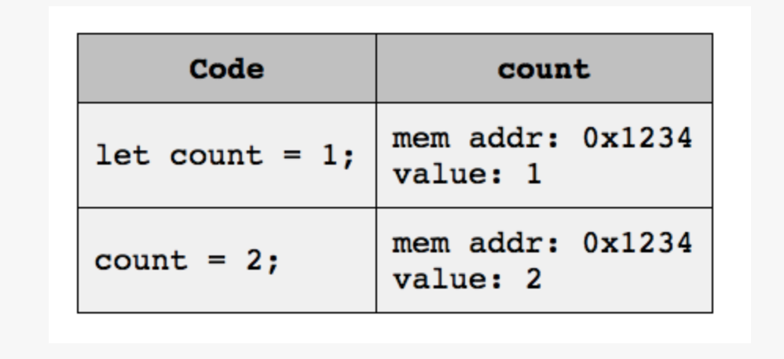

# INTRODUCTION TO PROGRAMMING: More Stuff

## Variables as Pointers

In this section, we'll examine the concepts behind variables and **pointers**. Specifically, we'll see how some variables act as pointers to a place (or address space) in memory, while others contain values.

As we've learned, JavaScript values fall into one of two broad categories: primitive values and objects. Primitive values are easier to understand, so we'll start there.

### Working with Primitive Values

Let's take a quick look at how primitive values and the variables assigned to them relate. Consider the following code:

```js
let count = 1;
count = 2;
```
This code is simple and not too difficult to understand, even if it isn't very useful. On line 1, we declare a variable named `count`, and initialize it to a value of `1`, which is a primitive value. Line 2 reassigns `count` to a new primitive value, `2`.

What does that look like in the computer, however? For starters, every time a JavaScript program creates a new variable, JavaScript allocates a spot somewhere in its memory to hold its value. With (most) primitive values, the actual value of the variable gets stored in this allocated memory.

Thus, for example, the `count` variable may end up at address 0x1234 in the computer's memory, and the memory at that address gets set to `1` and then `2`. The process looks like this:



Every time the code on line 1 runs, JavaScript creates a brand new variable. If that code is in a function that gets called many times, you may end up with many different `count` variables, all stored in different locations in memory. JavaScript discards these variables and their values when it no longer needs them.

Let's see what happens when we have two variables, one of which has been set to the value of the other. Try running this code in `node`:

```js
> let a = 5
> let b = a
> a = 8
> a
= 8

> b
= 5
```

Nothing is surprising in that code. We initialize `a` to the value `5`, then assign `b` to the value of `a`: both variables contain `5` after line 2 runs.

Next, we reassign variable `a` to a value of `8` on line 3, and on lines 4 and 5 we see that a does indeed now have the value `8`. On lines 7 and 8 we see that `b`'s value did not change: it is still `5`.

That's straightforward and easy enough to understand: each variable has a value, and reassigning values does not affect any other variables that happen to have the same value. Thus, `a` and `b` are independent: changing one doesn't affect the other.

What's crucial to understand at this point is that variables that have primitive values store those values at the memory location associated with the variable. In our example, `a` and `b` point to different memory locations. When we assign a value to either variable, the value gets stored in the appropriate memory location. If you later change one of those memory locations, it does not affect the other memory location, even if they started off with the same value. Therefore, the variables are _independent_ when they contain primitive values.

In reality, string values aren't stored in variables in the same way as most primitive values, but they **act** like they are. Don't worry about how they are stored -- just remember how they act.

