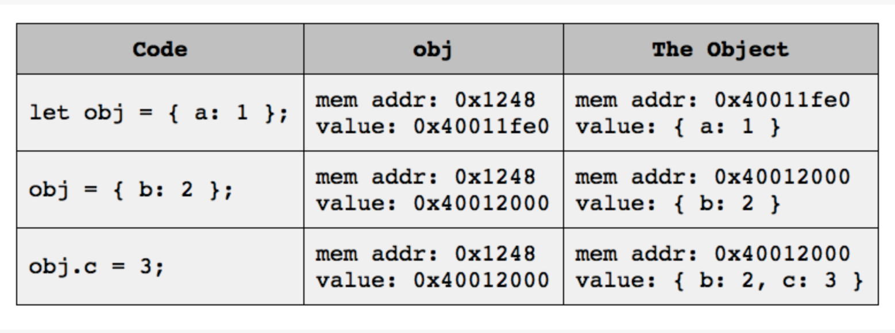

# INTRODUCTION TO PROGRAMMING: More Stuff

## Variables as Pointers

In this section, we'll examine the concepts behind variables and **pointers**. Specifically, we'll see how some variables act as pointers to a place (or address space) in memory, while others contain values.

As we've learned, JavaScript values fall into one of two broad categories: primitive values and objects. Primitive values are easier to understand, so we'll start there.

### Working with Primitive Values

Let's take a quick look at how primitive values and the variables assigned to them relate. Consider the following code:

```js
let count = 1;
count = 2;
```
This code is simple and not too difficult to understand, even if it isn't very useful. On line 1, we declare a variable named `count`, and initialize it to a value of `1`, which is a primitive value. Line 2 reassigns `count` to a new primitive value, `2`.

What does that look like in the computer, however? For starters, every time a JavaScript program creates a new variable, JavaScript allocates a spot somewhere in its memory to hold its value. With (most) primitive values, the actual value of the variable gets stored in this allocated memory.

Thus, for example, the `count` variable may end up at address 0x1234 in the computer's memory, and the memory at that address gets set to `1` and then `2`. The process looks like this:


Every time the code on line 1 runs, JavaScript creates a brand new variable. If that code is in a function that gets called many times, you may end up with many different `count` variables, all stored in different locations in memory. JavaScript discards these variables and their values when it no longer needs them.

Let's see what happens when we have two variables, one of which has been set to the value of the other. Try running this code in `node`:

```js
> let a = 5
> let b = a
> a = 8
> a
= 8

> b
= 5
```

Nothing is surprising in that code. We initialize `a` to the value `5`, then assign `b` to the value of `a`: both variables contain `5` after line 2 runs.

Next, we reassign variable `a` to a value of `8` on line 3, and on lines 4 and 5 we see that a does indeed now have the value `8`. On lines 7 and 8 we see that `b`'s value did not change: it is still `5`.

That's straightforward and easy enough to understand: each variable has a value, and reassigning values does not affect any other variables that happen to have the same value. Thus, `a` and `b` are independent: changing one doesn't affect the other.

What's crucial to understand at this point is that variables that have primitive values store those values at the memory location associated with the variable. In our example, `a` and `b` point to different memory locations. When we assign a value to either variable, the value gets stored in the appropriate memory location. If you later change one of those memory locations, it does not affect the other memory location, even if they started off with the same value. Therefore, the variables are _independent_ when they contain primitive values.

In reality, string values aren't stored in variables in the same way as most primitive values, but they **act** like they are. Don't worry about how they are stored -- just remember how they act.

### Working with Objects and Non-Mutating Operations

Now that we know how variables and primitive values relate, let's see how variables and objects relate. Consider the following code:

```js
let obj = { a: 1 };
obj = { b: 2 };
obj.c = 3;
```

As with the first example with primitive values, this code is simple and not too difficult to understand. On line 1, we declare a variable named `obj`, and initialize it to `{ a: 1 }`, which is an object value. Line 2 reassigns `obj` to a new object, `{ b: 2 }`. Finally, on line 3, we mutate the object currently referenced by `obj` by adding a new property to the object.

What does that look like in the computer? As we learned earlier, creating new variables causes JavaScript to allocate a spot somewhere in its memory for the value. However, with objects, JavaScript doesn't store the value of the object in the same place. Instead, it allocates additional memory for the object, and places a pointer to the object in the space allocated for the variable. Thus, we need to follow two pointers to get the value of our object from its variable name. The process looks like this:



In this example, `obj` is always at address 0x1248. The value at that address is a pointer to the actual object. While the pointer to the object can change, `obj` itself always has the same address. In the above table, we can see that `obj`'s address doesn't change, but its value changes to the address of the object currently assigned to the variable.

Let's look at another example. This time, we'll use arrays. Remember that arrays in JavaScript are objects, and almost everything we say about arrays holds for objects as well.

```js
> let c = [1, 2]
> let d = c
> c = [3, 4]
> c
= [ 3, 4 ]

> d
= [ 1, 2 ]
```

Again, this example holds no surprises. For the moment, though, let's ignore what happens on line 2. We can assume that variables `c` and `d` end up with the same value after line 2 runs. Reassigning `c` on line 3 creates a new array, but the code doesn't affect the value of `d`. The two variables reference different arrays.

This code works as expected since reassignment changes the pointer value of `c` to reference the new [3, 4] object. Though d originally had the same pointer value as c, it was stored in a different memory location (the location of `d`). Thus, when we reassign c, we're not changing d -- it still points to the original array.

As with primitive values, this is straightforward: each variable has a value, and reassigning values does not affect any other variables that happen to have the same value. Thus, `c` and `d` are independent variables.

Let's see what happens with a mutating operation like the `push` method:

```js
> let e = [1, 2]
> let f = e
> e.push(3, 4)
> e
= [ 1, 2, 3, 4 ]

> f
= [ 1, 2, 3, 4 ]
```

We mutated the array referenced by `e`, but it also changed the array referenced by `f`! 

As we saw a little earlier, objects (and arrays) aren't stored in the memory location used by the variable. Instead, that memory location points to yet another memory location. That's where the object is ultimately stored.

The use of pointers has a curious effect when you assign a variable that references an object to another variable. Instead of copying the object, JavaScript only copies the pointer. Thus, when we initialize `f` with `e`, we're making both `e` and `f` point to the same array: `[1, 2]`. It's not just the same value, but the same array in the same location in memory. The two variables are independent, but since they point to the same array, that array is dependent on what you do to both `e` and`f`.

With `e` and `f` pointing to the same array, line 3 uses the pointer in the `e` variable to access and mutate the array by appending `3` and `4` to its original value. Since `f` also points to that same array, both `e` and `f` reflect the updated contents of the array. Some developers call this aliasing: `e` and `f` are aliases for the same value.

Okay, that's good. What happens if we mutate a primitive value? Oops! You can't do that: all primitive values are immutable. Two variables can have the same primitive value. However, since primitive values are stored in the memory address allocated for the variable, they can never be aliases. If you give one variable a new primitive value, it doesn't affect the other.

### Gotcha

If you've followed along so far, you may think that reassignment never mutates anything. As the following code demonstrates, however, that isn't always true:

```js
> let g = ['a', 'b', 'c']
> let h = g
> g[1] = 'x'
> g
= [ 'a', 'x', 'c' ]

> h
= [ 'a', 'x', 'c' ]
```

Don't let this confuse you. The key thing to observe here is that we're reassigning a _specific element_ in the array, not the array itself. This code doesn't mutate the element, but it does mutate the array. Reassignment applies to the item you're replacing, not the object or array that contains that item.

### Takeaway

The takeaway of this section is that JavaScript stores primitive values in variables, but it uses _pointers_ for non-primitive values like arrays and other objects. Pointers can lead to surprising and unexpected behavior when two or more variables reference the same object in the heap. Primitive values don't have this problem.

When using pointers, it's also important to keep in mind that some operations mutate objects, while others don't. For instance, `push` mutates an array, but `map` does not. In particular, you must understand how something like `x = [1, 2, 3]` and `x[2] = 4` differ: both are reassignments, but the second mutates x while the first does not.

The idea that JavaScript stores primitive values directly in variables is an _oversimplification_ of how it works in the real world, but it mirrors reality well enough to serve as a mental model for almost all situations.

## for/in and for/of

Two useful variants for the `for` loop are the `for/in` and `for/of` loops. These loops use a variant syntax to loop easily over object properties.

The `for/in` statement iterates over all enumerable properties of an object including any properties inherited from another object. For now, you don't need to know anything about inheritance or enumerable properties -- `for/in` will usually do what you want.

```js
let obj = { foo: 1, bar: 2, qux: 'c' };
for (let key in obj) {
  console.log(key);
}
// Output:  foo
//          bar
//          qux
```

As we learned earlier, arrays are also objects, so we can use `for/in` to iterate over arrays. However, the results may not be exactly what you expect:

```js
let arr = [ 10, 20, 30 ]
for (let value in arr) {
  console.log(value);
}
// Output:  0
//          1
//          2
```

As you can see, it iterates over the _index values_ -- those are the keys from the array (as strings!). 

Fortunately, you can use the index values to access the values:

```js
let arr = [ 10, 20, 30 ]
for (let index in arr) {
  console.log(arr[index]);
}
// Output:  10
//          20
//          30
```

A more direct way to iterate over the values in an array is to use `for/of`:

```js
let arr = [ 10, 20, 30 ]
for (let value of arr) {
  console.log(value);
}
// Output:  10
//          20
//          30
```

`for/of` is similar to `for/in`, but it iterates over the values of any "iterable" collection. For our purposes, the only iterable collections are arrays and strings. Let's see what happens when we pass a string to `for/of`:

```js
let str = "abc";
for (let char of str) {
  console.log(char);
}
// Output: a
//         b
//         c
```

The `for/in` statement has been in JavaScript since its earliest days, so is available in all but a handful of ancient JS implementations. The `for/of` statement was added in ES6, so is only available in relatively modern implementations.

## Method Chaining

You can call a method on the return value of another method. It's not much different from function composition, but it uses a simpler syntax.

```js
let str = 'Pete Hanson';
let names = str.toUpperCase().split(' ').reverse().join(', ');
console.log(names); // => HANSON, PETE
```

On line 2, we have a long **chain** of method calls. First, we call `toUpperCase()` on the string `str`, which returns `'PETE HANSON'`. Then we call `split(' ')` on the returned string, which in turn returns the array [`'PETE', 'HANSON']`. We then use the array to invoke `reverse()`, which returns a new array, `['HANSON', 'PETE']`. In the last step, we join the elements of the array together with a comma and space between elements, which returns the string `'HANSON, PETE'`.

You'll also see several syntactic variations on this code.
All of these (and more) are acceptable. The main advantage to these alternatives is improved readability:

```js
// variation 1
let str = 'Pete Hanson';
let names = str.toUpperCase()
               .split(' ')
               .reverse()
               .join(', ');
console.log(names);

// variation 2
let str = 'Pete Hanson';
let names = str.toUpperCase()
  .split(' ')
  .reverse()
  .join(', ');
console.log(names);

// variation 3 - period at the end
let str = 'Pete Hanson';
let names = str.toUpperCase().
                split(' ').
                reverse().
                join(', ');
console.log(names);
```

### Regex

A **regular expression**—a **regex**—is a sequence of characters that you can use to test whether a string matches a given pattern. They have a multitude of uses:

* Check whether the string "Mississippi" contains the substring ss.
* Print the 3rd word of each sentence from a list of sentences.
* Replace all instances of Mrs in some text with Ms.
* Does a string begin with the substring St?
* Does a string end with the substring art?
* Does a string contain any non-alphanumeric characters?
* Does a string contain any whitespace characters?
* Replace all non-alphanumeric characters in a string with a hyphen (-).

That's a tiny sample of the kinds of operations you can perform with regex.

Since regexes is a bit of a mouthful, Launch School uses the term **regex** as both a plural and singular noun.

This book doesn't try to teach you how to read and write regex; instead, it focuses on the most common use case: _determining whether a string matches a given pattern_.

A regex looks like a string written between a pair of forward-slash characters instead of quotes, e.g., `/bob/`. You can place any string you want to match between the slashes, but certain characters have special meanings. We won't discuss those special meanings, but we'll see some simple examples.

JavaScript uses RegExp objects to store regex: note the spelling and case. Like other objects, RegExp objects can _invoke methods_. The method `test`, for instance, returns a boolean value based on whether a string argument matches the regex. Here's how we can use `test` to determine whether the string `"bobcat"` contains the letter o or l:

```js
> /o/.test('bobcat')
= true

> /l/.test('bobcat')
= false
```

As you might expect, the first `test` returned `true` since `o` is present in the string, but the second returns `false` since `"bobcat"` doesn't contain the letter `l`. You can use these boolean values to perform some operation depending on whether a match occurs:

```js
if (/b/.test('bobcat')) {
  // this branch executes since 'b' is in 'bobcat'
  console.log("Yes, it contains the letter 'b'");
} else {
  // this branch does not execute since 'bobcat' contains 'b'
  console.log("No, it doesn't contain the letter 'b'");
}
```

Boolean values sometimes don't provide enough information about a match. That's when the `match` method for strings comes in handy. This method takes a regex as the argument and returns an array that describes the match.

```js
> "bobcat".match(/x/)         // No match
= null

> "bobcat".match(/[bct]/g)    // Global match
= [ 'b', 'b', 'c', 't' ]

> "bobcat".match(/b((o)b)/)   // Singular match with groups
= [ 'bob', 'ob', 'o', index: 0, input: 'bobcat', groups: undefined ]
```

Don't worry if you don't understand those last two regex. Focus on the meaning of the return values, not the regex.

If no match occurs, `match` returns the value `null`, which conveniently lets us use `match` in conditionals in the same way as `test`. We'll see that in action a little further down.

When a match occurs with a regex that contains the `/g` flag—a global match—the `match` method returns an array that contains each matching substring. The `/g` example above returns an array consisting of the matched `b` (twice, since it appears twice in the string), `c`, and `t` letters.

When `/g` isn't present, the return value for a successful match is also an array, but it includes some additional properties:

* index: the index within the string where the match _begins_
* input: a _copy_ of the original string
* groups: used for "named groups" (we don't discuss named groups in this book)

The array elements are also a bit different when `/g` isn't present. In particular, the first element (`bob` in the above example) represents the entire matched part of the string. Additional elements (`ob` and `o` in the example) _represent capture group matches_. Parentheses inside a regex define capture groups.

We discuss `/g` and capture groups in our core curriculum. You don't have to understand them right now, but it's important to remember how they influence the return value of `match`.

As mentioned above, `match` returns `null` when a match doesn't occur. You can harness this in conditionals:

```js
function has_a_or_e(string) {
  let results = string.match(/[ae]/g);
  if (results) {
    // a non-null return value from match is truthy
    console.log(`We have a match! ${results}`);
  } else {
    // a null return value from match is falsy
    console.log('No match here.');
  }
}

has_a_or_e("basketball"); // => We have a match! a,e,a
has_a_or_e("football");   // => We have a match! a
has_a_or_e("hockey");     // => We have a match! e
has_a_or_e("golf");       // => No match here.
```

We've used a snake_case name (`has_a_or_e`) instead of a camelCase name for clarity; it's hard to write a camelCased function name that describes what this function does. Case variations like this aren't common, and you should continue to use camelCase in almost all of your code.

Since `match` must generate information above and beyond a simple boolean value, it can have performance and memory costs. `test` is more efficient, so try to use it when you don't need to know anything other than whether the regex matched the string.

Using `/g` in conjunction with `test` can have confusing results. Consider the following code:

```js
let regex = /b/g;
let str = "ababa";

console.log(regex.test(str)); // => true
console.log(regex.test(str)); // => true
console.log(regex.test(str)); // => false
```

Many students look at this code and are surprised that it logs `true` the first 2 times it invokes test, but `false` the 3rd time. Take a moment to think about this. Why do you think that happens? Don't worry if you don't get it right.

The issue here is the `/g` flag passed to the regex; JavaScript is going to look for every match in the string. However, `test` only consumes one of the matches at a time. Since there are two occurrences of `b` in the string, the first two invocations of `test` return `true`. The 3rd invocation, however, returns `false` since there are no more matches after the first two.

Interestingly, the next three invocations of `test` repeat this cycle:

```js
console.log(regex.test(str)); // => true
console.log(regex.test(str)); // => true
console.log(regex.test(str)); // => false
```

The moral of this story is that mixing `/g` and `test` may lead to surprising results. You may be better off using `match` instead, or don't use `/g` in the regex (many students use `/g` when they don't need to). Keep in mind whether you need all matches or just a single match - if you just need a single match, `/g` is inappropriate.

A regex can, in a single-line, solve problems that may require dozens of lines using other techniques. If you encounter a string matching problem that needs more than a simple substring search using the `indexOf` or `includes` method, remember to look into using regex. However, don't get carried away: don't use regex because you can; use them when they yield simpler and more understandable solutions.

## The Math Object

 The JavaScript `Math` object provides a collection of methods and values that you can use without a complete understanding of how they work.

 ```js
 // Math.sqrt()
> Math.sqrt(36)
= 6

> Math.sqrt(2)
= 1.4142135623730951

// Math.PI
> Math.PI
= 3.141592653589793
 ```

## Dates

`Date` constructor creates objects that represent a time and date. The objects provide methods that let you work with those values. In particular, it's not hard to determine the day of the week that corresponds to a date:

```js
> let date = new Date('December 25, 2012')
> date.getDay()
= 2
```

`getDay` returns a number for the day of the week: 0 represents Sunday, 1 represents Monday, and so on. In this case, we see that December 25, 2012, occurred on a Tuesday.

```js
// Getting a day name:
function getDayOfWeek(date) {
  let daysOfWeek = [
    'Sunday',
    'Monday',
    'Tuesday',
    'Wednesday',
    'Thursday',
    'Friday',
    'Saturday',
  ];

  return daysOfWeek[date.getDay()];
}

let date = new Date('December 25, 2012');
console.log(getDayOfWeek(date)); // => Tuesday
```

The `getDay` method is one of a host of convenient date methods, far more than you'll probably ever use. They can be a bit tricky to use at times, but you'll be happy to learn about them when you need them: working with dates and times is hard enough without compounding the problem by having to write your own code.

After seeing that we had to implement `getDayOfWeek()`, you might think that JavaScript's developers somehow forgot to include such a useful method. They did, at least in the earliest versions of JavaScript. These days, you can use the `toLocaleDateString` method of the `Date` type. It's a bit awkward to use, but it has multi-language support and a host of other features. However, full support may be lacking in some browsers.

## Exceptions

Applications that interact with the real world encounter a significant degree of unpredictability. If a user enters incorrect information or a file gets corrupted, your program must know how to respond. If it doesn't, it may crash or, worse yet, produce incorrect results.

JavaScript is a forgiving language. It doesn't issue error messages in scenarios that most other languages do. Instead, it "fails silently" by returning a value like `NaN`, `undefined`, `null`, or even `-1`.

Silent failures are both useful and dangerous. A programmer can take advantage of silent errors to simplify some code; often, you don't have to deal with the silent error right away, but can postpone handling it or even ignore it entirely. Ultimately, though, you need to deal with errors somehow, even silent errors.

Not all errors in JavaScript are silent. There are some situations where JavaScript is less forgiving; that's where **exceptions** come into play. In such cases, JavaScript **raises an error**, or **throws an exception**, then halts the program if the program does not **catch** the exception.

**Exception handling** is a process that deals with errors in a manageable and predictable manner. For now, you should be familiar with how exception handling works and what it looks like in a program. The reserved words `try` and `catch` (and sometimes `finally`) often occur in real-world JavaScript programs, so you should learn enough to understand what they do.

JavaScript's `try/catch` statement provides the means to handle exceptions. The basic structure looks like this:

```js
try {
  // perform an operation that may produce an error
} catch (exception) {
  // an error occurred. do something about it.
  // for example, log the error
} finally {
  // Optional 'finally' block; not used often
  // Executes regardless of whether an exception occurs.
}
```

We don't discuss or use the finally clause in this book. You can read about it at [MDN](https://developer.mozilla.org/en-US/docs/Web/JavaScript/Reference/Statements/try...catch).

Let's look at a typical situation. One common JavaScript error occurs when we call a method on the values `undefined` or `null`. Look at the following code and test it in Node or your browser's console:

```js
let names = ['bob', 'joe', 'steve', undefined, 'frank'];
names.forEach(name => {
  console.log(`${name}'s name has ${name.length} letters in it.`);
}); // => bob's name has 3 letters in it.
    //    joe's name has 3 letters in it.
    //    steve's name has 5 letters in it.
    //    TypeError: Cannot read property 'length' of undefined
    //        at names.forEach (repl:2:42)
    //        at Array.forEach (<anonymous>)
```

This program raises an error when it tries to access the `length` property on the `undefined` value at `names[3]`. It then prints a stack trace and halts program execution; it ignores the last entry in the array.

Let's add some exception handling to this program:

```js
let names = ['bob', 'joe', 'steve', undefined, 'frank'];

names.forEach(name => {
  try {
    console.log(`${name}'s name has ${name.length} letters in it.`);
  } catch (exception) {
    console.log('Something went wrong');
  }
}); // => bob's name has 3 letters in it.
    //    joe's name has 3 letters in it.
    //    steve's name has 5 letters in it.
    //    Something went wrong
    //    frank's name has 5 letters in it.
```

To handle the possibility of an exception within the callback to `forEach`, we place the `try` block inside the callback. We can put any amount of code in the `try` block, but most often you want to focus on one or two statements.

When we try to use the `length` property on `undefined`, JavaScript raises an error like it did before. This time, though, it catches the exception and executes the `catch` block. When the `catch` block ends, the program resumes running with the code that follows the entire `try/catch` statement.

Note that JavaScript runs the `catch` block when an exception occurs, but not when an exception doesn't occur. Either way, execution ultimately resumes with the code after the `try/catch` statement.

Don't try to catch every possible exception. If you can't do anything useful with the exception, let it go. Mishandling an exception is usually far more catastrophic than just letting the program fail.

It's also possible to raise your own exceptions. For instance:

```js
function foo(number) {
  if (typeof number !== "number") {
    throw new TypeError("expected a number");
  }

  // we're guaranteed to have a number here
}
```

The `throw` keyword raises an exception of the type specified as an argument, which is usually given as `new` followed by one of the [Error types described on this page(https://developer.mozilla.org/en-US/docs/Web/JavaScript/Reference/Global_Objects/Error). In this case, we use a `TypeError` to indicate that we were expecting a different type for the `number` argument.

Don't raise exceptions for preventable conditions. Exceptions are for **exceptional circumstances**: situations that your program can't control very easily, such as not being able to connect to a remote site in a web application. The example shown above that tests the argument type is probably not something that you want to do in a real application. Instead, your code should never call `foo` with a non-numeric argument, or you should return some sort of error indicator like `null` or `undefined`.

For now, all you need to understand is that you **can** anticipate and handle errors that may occur in your program; a single unexpected input or other issue doesn't have to crash your entire application or introduce subtle bugs.


### SyntaxError

A special kind of exception occurs if the code can't be handled as valid JavaScript. Such errors cause JavaScript to raise a `SyntaxError`. A `SyntaxError` is special in that it occurs immediately after loading a JavaScript program, but before it begins to run. Unlike a `TypeError` exception that is dependent upon runtime conditions, JavaScript detects syntax errors based solely on the text of your program. Since they are detected before execution begins, you can't use a `try/catch` statement to catch one.

Here's some code that will cause a syntax error:

```js
console.log("hello");

function foobar()
  // some code here
}

foobar();
```

```js
// output
}
^

SyntaxError: Unexpected token '}'
```

Since the `SyntaxError` gets raised before the program starts running, the `console.log` on line 1 never gets executed. In addition, the `foobar` function never gets invoked. As soon as JavaScript spots the error, it raises the `SyntaxError` exception.

There are three major takeaways from the above example:

1. A `SyntaxError` usually has nothing to do with the values of any of your variables. You can almost always spot the error visually.

2. A `SyntaxError` can occur long after the point where the error was. In the above example, the error is on line 3 (a missing `{`), but the problem is reported on line 5. There can be many hundreds of lines between the point where the error is and the point where JavaScript detects it. Unfortunately, that's more common than you might think, so be prepared for it.

3. The code before and after the error does not run. That's because `SyntaxError`s are detected before a program begins running. This also shows that there are at least two phases in the life of a program -- a preliminary phase that checks for syntax errors, and an execution phase.

There are some situations where JavaScript can throw a `SyntaxError` after a program begins running. For instance, this code raises a `SyntaxError` at runtime:

```js
JSON.parse('not really JSON');  // SyntaxError: Unexpected token i in JSON at position 0
```

## Stack Traces

In the previous section, we saw that JavaScript exceptions issue error messages that look something like this:

```js
TypeError: Cannot read property 'length' of undefined
    at names.forEach (repl:2:42)
    at Array.forEach (<anonymous>)
```

This error message is a stack trace: it reports the type of error that occurred, where it occurred, and how it got there. Such error messages rely on JavaScript's call stack, which we discussed in the Functions chapter.

Let's look at a simpler example. Create a file named error.js with the following content:

```js
function foo() {
  console.log(bar);
}

foo();
```

```js
// error message
$ node error.js
/Users/wolfy/tmp/x.js:2
  console.log(bar);

ReferenceError: bar is not defined
    at foo (error.js:2:15)
    at Object.<anonymous> (error.js:5:1)
    ...
```

In this example, JavaScript raises a `ReferenceError` exception since the variable `bar` doesn't exist when you try to write it to the log. From the stack trace, we can see that JavaScript detected the error at character 15 on line 2 -- that's where we mention the `bar` variable -- in the `foo` function. The rest of the trace tells us that we called `foo` on line 5 from an anonymous function: one with no name. The trace treats code at the global level as belonging to an anonymous function, so don't worry about the fact that your code doesn't actually have an anonymous function.

If your program uses libraries like Handlebars and jQuery, the stack trace may contain hundreds of lines. Even using `node` to run this simple program adds around 10 additional lines to the trace. In most cases, you can limit your attention to the lines that mention your JavaScript code file(s) by name: `error.js` in this case. Each filename in the trace includes a location specified as a line number and column number. The file name, line number, and column number together pinpoint the specific location where the failure occurred and how the program reached that point. Take note of the locations that pertain to your code.

We call this type of output a stack trace since the JavaScript (and most other languages) handle the mechanics of calling functions with a data structure known as the call stack. Each time the program calls a function, JavaScript places some information about the current program location on the top of the call stack. When the program finishes running the function, it removes the corresponding item from the top of the stack and uses it to return to the calling location. The stack trace is a readable version of the call stack's content at the point an exception occurred.

We'll return to the call stack shortly. For now, the takeaway is that JavaScript uses it to display the stack trace when an exception occurs. Knowing how to use this information is invaluable when you have to debug a program.

A word of advice: use your stack traces. Make sure you understand what they are saying, and look at the code that it identifies as the failure point. If you don't use the trace, you may introduce more problems in the code, or worse yet, "fix" code that already works. _The stack trace lets you focus on the right part of the program._

## ES6 and beyond

End
