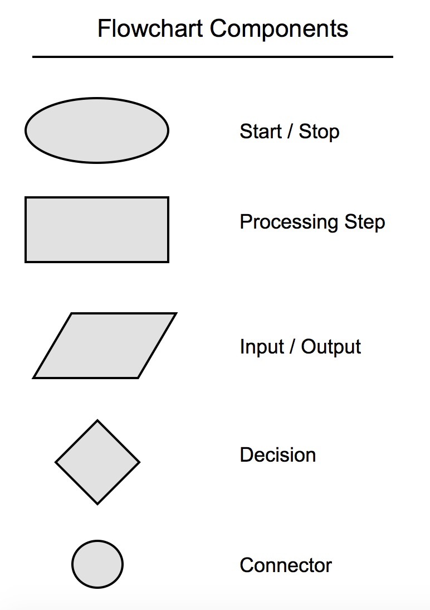
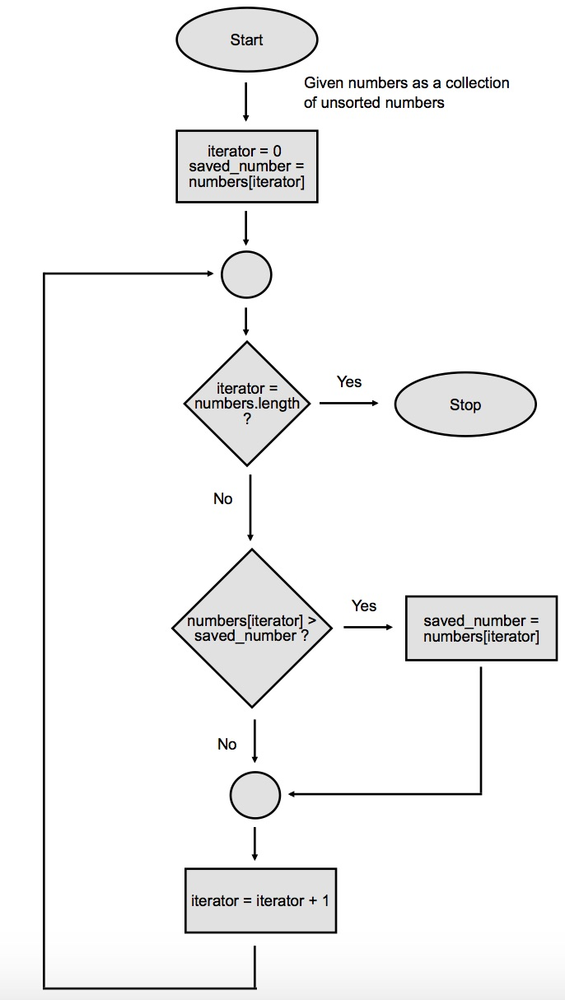
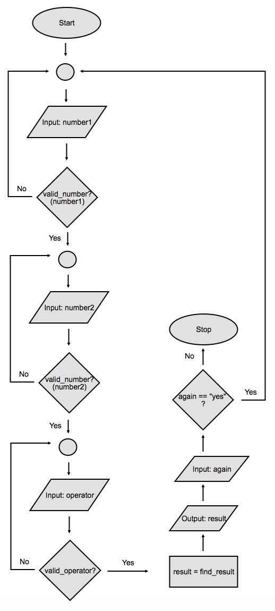
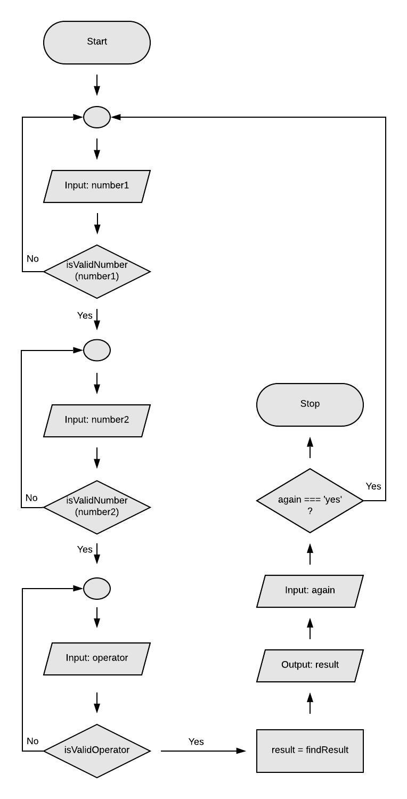

# Lesson 2: Small Programs

## 1. Introduction

Work through several JavaScript programs of increasing difficulty. Think about the logic of a program and how to debug and get familiar with writing lots of code.

### Pre-requisites

- Node.js installed
- execute JavaScript programs
- know how to use the node console
- be familiar with JavaScript syntax and data structures (Arrays and Objects)
- know how to use git and push code to GitHub
- completed the Prep courses and all assignments

### Afterwards

- gained confidence in writing your first JavaScript programs
- this is the first step to learning to program

## 2. Style Guide

Adhering to a particular style convention helps your teammates and future maintainers understand your code.

The conventions we'll discuss in this section are specific to the JavaScript community. Other programming languages—and even some JavaScript sub-communities—may have different preferences about each guideline.

Here's a short list of **guidelines** that we recommend. They will help you write readable code, and smooth the process of asking for code reviews at Launch School.

- Set your text editor to use **space characters**—not tabs—for indentation. The editor should also insert spaces if you press the `Tab` key on your keyboard.

- Set your text editor to use 2 spaces for indentation and when converting tab characters to spaces.

- Try to limit lines to 80 characters. This limit isn't a universal preference, but it helps readability. Not all developers have massive screens or good eyesight.

- JavaScript uses the character sequence `//` to mark the beginning of a comment. The comment runs through the end of the line. You can also use `/*` and `*/` for multiline comments and comments that appear in the middle of a line. Programmers use comments to leave notes for other programmers or themselves at a later point in time; however, don't overdo your comments. Let your code do the talking instead.

- Use **camelCase** formatting for variable and function names. Such names begin with a lowercase letter. If the name contains multiple words, each subsequent word should begin with an uppercase letter:

```js
// declaring and initializing a variable
let answerToUltimateQuestion = 42;

// defining a function
function fourScoreAndSevenYearsAgo() {
  // do something
}
```

- Some special functions called **constructor** functions use PascalCase names (also called CamelCase -- note the capitalization). For instance:

```js
// defining a function
function DomesticCat(name) {
  // do something
}

let cat = new DomesticCat('Fluffy');
```

We discuss constructors briefly a little later, and in more detail in a later course.

- Use uppercase names with underscores to represent **const** values: values that don't change.

```js
const INTEREST_RATE = 0.0525;
const FOUR = 'four';
```

This naming style is called **SCREAMING_SNAKE_CASE**.

- All names—variables and constants as well as functions—should use **alphabetic** (a-z, A-Z without umlauts, accents, and so on) and **numeric** characters only. The first character must be alphabetic. Constants may use underscores within the name, but should not use consecutive underscores, nor may they begin or end with an underscore.

JavaScript also allows a `$` in names, but this should only be used when working with a library that uses `$` names, such as jQuery, which we discuss towards the end of the Core Curriculum. For our purposes, though, you should treat names with `$` as *non-idiomatic*; they're legal, but not used except in certain cases.

- When writing code with curly braces, such as functions and `if` statements, write the opening brace on the same line as the function name or conditional expression. Use a single space before the opening brace:

```js
// bad
function test(){
 // do something
}

// bad
function test()
{
  // do something
}

// bad
if (foo === bar){
  // do something
}

// bad
while (foo !== bar)
{
  // do something
}

// good
function test() {
  // do something
}

// good
if (foo === bar) {
  // do something
}

// good
while (foo !== bar) {
  // do something
}
```

- Use spaces between *operators* and *operands* to make your code less cluttered and easier to read:

```js
// bad
let sum=x+5;

// good
let sum = x + 5;
```

- Use *semicolons* to terminate each logical line of code unless the line ends with `{`,`}`, or `:`. See the discussion in our [Introduction to Programming With JavaScript](https://launchschool.com/books/javascript/read/preparations#stylishjavascript) book for details.

That covers the essential style conventions you need to get started. If you want more information about JavaScript styling, we recommend [Airbnb's JavaScript style guide](https://github.com/airbnb/javascript). Check it out, but don't try to memorize all of the rules; ESLint, which we'll discuss soon, will help you remember the most important rules.

## 3. Set up a new directory for this lesson

Now, you should be working in a new local git repository. Recall that you can turn any directory locally into a git repo with the `git init` command. Just make sure to not nest git repositories within each other. If you've forgotten how to create a git repository locally, review [this chapter](https://launchschool.com/books/git/read/creating_repositories).

Within your new git repo, create a new directory for this lesson. Call it `lesson_2` or something that makes sense to you. Create your assignments for this lesson in this directory. Later, we'll set up some configurations for this directory that will affect all files within it.

## 4. Truthiness

The ability to express **true** or **false** is vital in any programming language. It helps us build c*onditional logic* and to understand the state of an object or expression. Typically, we capture the notion of whether a value is true or false in a **boolean** data type. A boolean is an **object** whose only purpose is to *convey whether it is true or false*.

JavaScript uses the `true` and `false` *primitive values* as booleans. You can print them, assign them to variables, pass them around, and test them:

```js
// 1
console.log(true);    // true
console.log(false);   // false

// 2
function makeLonger(string, longer) {
  if (longer) {
    return string + string;
  } else {
    return string;
  }
}

makeLonger("abc", true);  // 'abcabc'
makeLonger("xyz", false); // 'xyz'

// 3
function isDigit(char) {
  if (char >= "0" && char <= "9") {
    return true;
  } else {
    return false;
  }
}

isDigit("5");  // true
isDigit("a");  // false

// 4
if (value === true) {
  console.log("It's true!");
} else if (value === false) {
  console.log("It's false!");
} else {
  console.log("It's not true or false!");
}
```

### Expressions and Conditionals

In real code, you wouldn't usually use the `true` or `false` values directly in a conditional expression like `value === true`. Instead, you would merely evaluate an expression that should evaluate as either `true` or `false`. For instance:

```js
let num = 5;

if (num < 10) { // same as `if ((num < 10) === true)`
  console.log("small number");
} else {
  console.log("large number");
}
```

The above code outputs `small number` since `num < 10` *evaluates* as true. We can verify that in the `node` REPL:

```js
> let num = 5
> num < 10
= true

> num = 12
> num < 10
= false
```

In much the same way, a function doesn't usually return `true` or `false` explicitly. Instead, it *returns the result* of a **conditional expression**. For instance:

```js
function isSmall(number) {
  return number < 10;
}

let num = 15;

if (isSmall(num)) {
  console.log("small number");
} else {
  console.log("large number");
}
```

This code logs `large number` since `isSmall(num)` *evaluates* as `false` when `num` greater than or equal to `10`.

### Logical Operators

Logical operators *evaluate* an expression that involves two subexpressions, then return a value that evaluates as true or false:

#### The `&&` Operator

`&&` is the **and** operator. It *evaluates* as **true** only when *both* sub-expressions evaluate as **true**:

```js
> true && true              // true
> true && false             // false
> false && true             // false
> false && false            // false

> let num = 5
> num < 10 && num > 3       // true
> num < 10 && num > 6       // false
> num > 10 && num < 6       // false
> num > 10 && num < 3       // false
```

Note, though, that we didn't have to put subexpressions like `num > 10` in parentheses. JavaScript's **precedence** rules treat `>` with higher precedence than `&&`. That means that it treats `num < 10 && num > 3` as `(num < 10) && (num > 3)`, not as `num < (10 && (num > 3))` or `num < ((10 && num) > 3)`.

The precedence rules can cause much confusion, especially if your concept of how to evaluate an expression differs from JavaScript's. Thus, it's a good idea to always use **parentheses** with expressions that involve multiple operators:

```js
> (num < 10) && (num > 3)
```

The **parentheses** *make* your intent clear and prevent confusing situations.

You can *chain* as many sub-expressions as you'd like with `&&`; the sub-expressions *get evaluated left to right*. If any sub-expression is **false**, the entire `&&` chain evaluates as **false**. The whole expression evaluates as **true** only when *all* of the sub-expressions *evaluate* as true:

```js
> let num = 5
> (num < 10) && (num > 0) && ((num % 2) === 1)
= true

> (num < 10) && (num > 0) && ((num % 2) === 1) && false
= false
```

#### The `||` Operator

`||` is the **or** operator. It *evaluates* as **true** when **either of** the two sub-expressions evaluates as true; it *evaluates* as **false** when **both** sub-expressions evaluate as **false**.

```js
> true || true              // true
> true || false             // true
> false || true             // true
> false || false            // false

> let num = 5
> num < 10 || num > 3       // true
> num < 10 || num > 6       // true
> num > 10 || num < 6       // true
> num > 10 || num < 3       // false
```

#### Short-Circuit Operators

Both `&&` and `||` exhibit a behavior called **short-circuiting**. That means that JavaScript stops evaluating sub-expressions once it can determine the final value. In the case of `&&`, JavaScript short-circuits when it realizes that the entire expression can't be true; that is, when it *encounters a false sub-expression*. With `||`, it short-circuits when it r*ealizes that the expression can't be false*; that is, at least one sub-expression is true.

Consider `&&`: it short-circuits when it encounters the first sub-expression (from left-to-right) that evaluates as false:

```js
> false && undefined.length
= false
```

Notice that the above code doesn't generate a `TypeError` even though the code includes the sub-expression `undefined.length`. By itself, `undefined.length` raises a `TypeError`. However, since the left side of the `&&` guarantees that the entire expression can't be true, the *right side never executes*. Instead, the expression evaluates as false.

Conversely, this code *does raise an exception*:

```js
> true && undefined.length
TypeError: Cannot read property 'length' of undefined
```

Likewise, the `||` operator **short-circuits** when it encounters the first `true` sub-expression, again based on left-to-right evaluation:

```js
> true || undefined.length
= true
```

The above code *doesn't raise* a `TypeError` since `||` didn't evaluate the second sub-expression; it **short-circuited** when `true` evaluated as true.

Relying on the short-circuit behavior can be dangerous, but it's sometimes handy. For instance, suppose you have a `name` variable that usually contains a string, but may sometimes contain `null`. Before you can use the string's `length` property, you must *confirm* that it isn't `null`:

```js
if (name && (name.length > 0)) {
  console.log(`Hi, ${name}.`);
} else {
  console.log("Hello, whoever you are.");
}
```

This type of conditional expression often appears in real-life JavaScript code, so get familiar with it. In particular, make sure that you understand that *JavaScript doesn't evaluate the right-side of a short-circuit operator when the expression short-circuits*.

#### Truthiness

The discussion so far should be mostly review. It's time to talk about the main topic of this assignment: what is **truthiness**, and how does it impact our code? We'll tackle that next.

After that review of booleans and logical operators, we're finally able to talk about the notion of **truthiness**. Truthiness differs from boolean values in that *JavaScript evaluates almost all values as true*. There are some exceptions, however:

- `false`
- `undefined`
- `null`
- `0`
- `""` (empty string)
- `NaN`

All of these values evaluate as false. **Memorize** them!

Notice that we've repeatedly used the phrases *evaluated as true* and *evaluated as false*.

- You can also use the terms **truthy** and **falsy** to describe the nature of the values.
- Be careful to make the same distinction in your own written and spoken communications.
- Saying that an expression returns `true` or `false` is not the same as saying that it returns a truthy or falsy value, or that it evaluates as true or false.
- The terms true and false refer to the **Boolean** values `true` and `false`; the other phrases refer to *truthiness*, that is, a **truthy** or **falsy** value.

**Truthiness** means that we can use any condition or logical expression:

```js
let num = 5;
if (num) {
  console.log("valid number");
} else {
  console.log("error!");
}
```

If you didn't know JavaScript at all, you might guess that the above code should either output `error!` or generate an error of its own. However, when you run that code, it outputs `valid number`. That's because JavaScript considers any non-zero (and non-NaN) number to be **truthy**. It *does not, however, mean* that `num` is equal to `true`:

```js
console.log(num === true);        // => false
```

The use of **truthy** and **falsy** values sometimes leads to some surprising code:

```js
let name;
if (name = getNameFromUser()) {
  console.log(`Hi ${name}`);
} else {
  console.log("you must enter your name!");
}
```

Presumably, `getNameFromUser` solicits and returns the user's name and returns an empty string if the user doesn't enter a name. *Since an empty string is* **falsy**, we can test for a missing name by evaluating the assignment `name = getNameFromUser()`. If the user didn't enter her name, *the expression evaluates as false*, and the code logs you must enter your name!.

While this type of code is commonplace, most style guides strongly discourage it. We at Launch School also discourage it. The code looks like it could be a mistake. Perhaps the programmer intended to write `name == getNameFromUser()` or `name === getNameFromUser()`. It's safer and more intentional to write:

```js
let name = getNameFromUser();
if (name) {
  console.log(`Hi ${name}`);
} else {
  console.log("you must enter your name!");
}
```

Better yet, make it clear that you're **testing** for an empty name:

```js
let name = getNameFromUser();
if (name === "") {
  console.log("you must enter your name!");
} else {
  console.log(`Hi ${name}`);
}
```

## 5. Walk-through: Calculator

Our first program in this course will be a command line calcultor program that will:

1. Ask the user for two numbers.
2. Ask the user for the type of operation to perform: add, subtract, multiply or divide.
3. Perform the calculation and display the result.

### Getting Ready to Code

Let's start writing the first version of the calculator. Open your terminal and navigate to the directory you created for this lesson and create a file named c`alculator.js` in that directory:

```js
touch calculator.js
```

Go ahead and open the newly created file in your favorite editor. We'll start coding soon.

Before we begin, though, we must install a **library** called `readline-sync` in our *working directory*. This library provides a simple way to retrieve user input from the command line. Node's built-in way to retrieve command line input requires a basic understanding of **asynchronous programming** which we're not ready to deal with right now.

To install `readline-sync`, run the following command from your lesson directory:

```js
npm install readline-sync --save
```

The output from this command may contain warnings; ignore them for now. You should be good to go as long as the output includes a line similar to the following towards the end:

```js
added 1 package from 1 contributor and audited 1 package in 3.561s
```

If successful, this command should create a directory called `node_modules` inside your lesson directory. Confirm that it's there and that it contains a `readline-sync` subdirectory. If both directories are there, then you're ready to use the `readline-sync` library and can start writing the calculator program.

### Starting to Code

Some folks are visual learners, and really enjoy seeing complex topics covered as videos. Application walkthroughs, like the one we're about to do, often work well as videos, so we've provided a video walkthrough of this project that you can watch if you want.

[Video Version](https://launchschool.com/lessons/64655364/assignments/e3733b97)

Even if you watch the video, you may still want to read through the text version of the walkthrough below. The **repetition** can help you understand things better.

Let's begin by writing out the steps, in plain English, that our program must perform. Try to make a habit of writing some **pseudocode** before you start writing code. You can use comments to write your pseudocode directly in the `calculator.js file`.

```js
// calculator.js
// Ask the user for the first number.
// Ask the user for the second number.
// Ask the user for an operation to perform.
// Perform the operation on the two numbers.
// Print the result to the terminal.
```

Let's write some code. We begin by welcoming the user to our program:

```js
console.log('Welcome to Calculator!');
```

Save the file and run the program with the command n`ode calculator.js`. You should see the welcome message logged to the console.

```js
$ node calculator.js
Welcome to Calculator!
```

### Asking for the Numbers

Next, we want to ask the user to input the first number. Asking a question is easy; just log the query to the console:

```js
console.log('Welcome to Calculator!');

console.log("What's the first number?");
```

If you run this program, you'll see that it asks the user for the first number, but it immediately stops running. The program doesn't wait for the user to input something. We need `readline-sync` and it's `question` function to obtain the user's response.

To use `readline-sync`, we need to require it at the top of our calculator program:

```js
const readline = require('readline-sync');

console.log('Welcome to Calculator!');

console.log("What's the first number?");
```

The first line uses the built-in Node function `require` to look for the `readline-sync` library in the `node_modules` folder. The **function** returns the library in the form of an **object** that we can assign to the `readline` variable. The variable name doesn't have to be `readline`; you can choose any name you want, but it makes sense to use a name that helps you remember what the variable contains.

We'll use the `question` method from the r`eadline-sync` library to get input from the user. To do so, we need to *refer* to the **method** as `readline.question`, where `readline` is the name of the variable that contains the library object.

```js
const readline = require('readline-sync');

console.log('Welcome to Calculator!');

console.log("What's the first number?");
readline.question();
```

The `question` **method** causes the program to wait for some keyboard input. It *returns the input as a string* when the user presses the Return key. Let's try it:

```js
$ node calculator.js
Welcome to Calculator!
What's the first number?
```

After logging `What's the first number?`, the program pauses and waits for you to type something. Type a number and press the Return key. The program should exit when you do that.

Great! We now have a way to capture keyboard input from the user. Right now, though, we aren't doing anything with that input. Let's assign the return value of `readline.question`, a string, to a variable and display that string to make sure we're getting the input from the user:

```js
const readline = require('readline-sync');

console.log('Welcome to Calculator!');

console.log("What's the first number?");
let number1 = readline.question();

console.log(number1);
```

Run this program and verify that it works correctly. It'll redisplay whatever you type at the prompt.

We can do something similar with the second number and log both numbers:

```js
const readline = require('readline-sync');

console.log('Welcome to Calculator!');

console.log("What's the first number?");
let number1 = readline.question();

console.log("What's the second number?");
let number2 = readline.question();

console.log(`${number1} ${number2}`);
```

After running this program and entering two numbers, you'll see them both printed next to each other on the same line.

### Performing the Operation

So far, so good. However, we want to do something with these two numbers. We need to either add, subtract, multiply or divide them based on what the user requests. First, we need to ask the user what they want to do:

```js
const readline = require('readline-sync');

console.log('Welcome to Calculator!');

console.log("What's the first number?");
let number1 = readline.question();

console.log("What's the second number?");
let number2 = readline.question();

console.log('What operation would you like to perform?\n1) Add 2) Subtract 3) Multiply 4) Divide');
let operation = readline.question();
```

The `\n` in that string is an **escape sequence** that tells Node to start a newline at that point in the output. We call this escape sequence a **newline** character.

Here, we ask the user to enter `1` if they want to perform addition, `2` if they want to perform subtraction, `3` if they want to perform multiplication, and `4` if they want to perform division on the two numbers. Run the program to verify that it works as expected.

We can now use our knowledge of `if/else` statement to perform arithmetic operations based on what the user requested. We'll cover the addition operation first:

```js
const readline = require('readline-sync');

console.log('Welcome to Calculator!');

console.log("What's the first number?");
let number1 = readline.question();

console.log("What's the second number?");
let number2 = readline.question();

console.log('What operation would you like to perform?\n1) Add 2) Subtract 3) Multiply 4) Divide');
let operation = readline.question();

let output;
if (operation === '1') { // '1' represents addition
  output = number1 + number2;
}

console.log(`The result is: ${output}`);
```

Here, we declare an `output` variable to receive the result of the arithmetic operation. We'll assign the value conditionally based on which operation the user requests. For instance, here we test whether `operation` holds the string value `'1'`, i.e., the user wants to perform addition. If that's the case, we add the two numbers and assign the result to `output`. The last line then logs the output to the console.

Since `readline.question` always returns a string, we must compare the `operation` variable with the string `'1'`, not the number `1`. The number version of the comparison won't evaluate to true unless you use the loose equality operator (`==`). Since `==` can coerce one or both values to a different type, its behavior may be confusing. We strongly recommend that you always use `===`, not `==`, to avoid these confusing behaviors; **explicit coercions** more clearly show what's happening.

Let's run the program and see what happens. Ask the program to add `3` and `3`. In light of what we just said about the use of strings, it should come as no surprise that the output is `33` instead of `6`. The `+` operator *always performs concatenation* if one of its arguments is a string, so the result is `33`.

To get around this behavior, we need a way to *convert the strings to numbers* before adding them. The JavaScript `Number` function does that. Let's convert `number1` and `number2` to numbers and then add them:

```js
const readline = require('readline-sync');

console.log('Welcome to Calculator!');

console.log("What's the first number?");
let number1 = readline.question();

console.log("What's the second number?");
let number2 = readline.question();

console.log('What operation would you like to perform?\n1) Add 2) Subtract 3) Multiply 4) Divide');
let operation = readline.question();

let output;

if (operation === '1') { // '1' represents addition
  output = Number(number1) + Number(number2);
}

console.log(`The result is: ${output}`);
```

You should get the correct output this time.

Let's add an `else if` clause to our if statement to take care of the subtraction operation:

```js
const readline = require('readline-sync');

console.log('Welcome to Calculator!');

console.log("What's the first number?");
let number1 = readline.question();

console.log("What's the second number?");
let number2 = readline.question();

console.log('What operation would you like to perform?\n1) Add 2) Subtract 3) Multiply 4) Divide');
let operation = readline.question();

let output;
if (operation === '1') { // '1' represents addition
  output = Number(number1) + Number(number2);
} else if (operation === '2') { // '2' represents subtraction
  output = Number(number1) - Number(number2);
}

console.log(`The result is: ${output}`);
```

Run this program and make sure you get the right output.

We can follow the same template to take care of the last two operations, multiplication and division:

```js
const readline = require('readline-sync');

console.log('Welcome to Calculator!');

console.log("What's the first number?");
let number1 = readline.question();

console.log("What's the second number?");
let number2 = readline.question();

console.log('What operation would you like to perform?\n1) Add 2) Subtract 3) Multiply 4) Divide');
let operation = readline.question();

let output;
if (operation === '1') { // '1' represents addition
  output = Number(number1) + Number(number2);
} else if (operation === '2') { // '2' represents subtraction
  output = Number(number1) - Number(number2);
} else if (operation === '3') { // 3 represents multiplication
  output = Number(number1) * Number(number2);
} else if (operation === '4') { // 4 represents division
  output = Number(number1) / Number(number2);
}

console.log(`The result is: ${output}`);
```

Our calculator app is now complete! Play around with it using different numbers and operations to see that it covers all cases.

## 6. Pseudocode

When you write programming code, you're writing it for other programs to process. When you write JavaScript, you are writing for the JavaScript engine/interpreter to process. If you *make a syntax error*, the JavaScript interpreter will complain, saying it doesn't know how to process the broken syntax. If there are no errors, the interpreter can parse and execute the code. Since programming code must be **error-free**, you must follow a rigid format when programming. A missing period or an additional comma may cause the entire program to break.

Pseudocode, on the other hand, is for humans -- machines or programs can't read it (at least, not yet!), so its format is relaxed. Human brains are far more flexible and powerful than programming language interpreters or compilers.

For example, here's some pseudocode for a function that determines which number in a collection has the greatest value.

```js
Given a collection of numbers.

Iterate through the collection one by one.
  - save the first value as the starting value.
  - for each iteration, compare the saved value with the current value.
  - if the current number is greater
    - reassign the saved value as the current value
  - otherwise, if the current value smaller or equal
    - move to the next value in the collection

After iterating through the collection, return the saved value.
```

This approach is one that we can use to solve the problem. We don't start writing code from the beginning, but instead try to **load the problem into our brain first**.

When you first approach any problem, it's important to try to **understand** it well. To do that, you must spend some time to load the problem into your brain. Only then can you start to dissect it, understand it, and come up with an execution path to solve it.

Unfortunately, loading the problem into your brain takes some effort, and you must turn the problem over and over before it gets fully absorbed by your brain. Doing this while working with a programming language is hard since your train of thought gets interrupted time and again by having to deal with syntax issues. Instead of thinking about the logic and dissecting the problem, you're searching for specific language syntax issues to please the interpreter, which has nothing to do with the logical aspect of solving a problem.

Therefore, there are two layers to solving any problem:

- The logical problem domain layer.
- The syntactical programming language layer.

When you're not yet fluent in a programming language, doing both at the same time can be very difficult and frustrating.

Pseudocode comes in to play at this point. Using pseudocode lets us focus on the logical problem domain layer without dragging us down to the programming language layer.

The problem with pseudocode, however, is that *we cannot verify its logic*. The above pseudocode that we wrote earlier, for example, seems about right. However, how can we be sure? To verify the logic, we must translate the pseudocode into programming code, which is where you can focus on programming language syntax issues without having it interrupt your flow.

### Formal Pseudocode

Before we can take our pseudocode and translate it to program code, we must formalize the pseudocode a little more. We'll still use English, but we'll use some keywords to help us break down the program logic into concrete commands, which makes translating to code more natural.

We'll use the below keywords to assist us, along with their meaning.

| Keyword | Meaning |
| ------- |-------- |
| START | start of the program |
| SET | set a variable that we can use for later |
| GET | retrieve input from user |
| PRINT | display output to user |
| READ | retrieve a value from a variable |
| IF/ELSE IF/ELSE | show conditional branches in logic |
| WHILE | show looping logic |
| END | end of the program |

We can use the above keywords to act as a pseudo-programming language, but one that's still written in English, which lets us be more relaxed about the precision of the syntax. Here's a stab at translating to formal pseudocode:

```js
START

Given a collection of integers called "numbers"

SET iterator = 1
SET savedNumber = value within numbers collection at space 1

WHILE iterator <= length of numbers
  SET currentNumber = value within numbers collection at space "iterator"
  IF currentNumber > savedNumber
    savedNumber = currentNumber
  ELSE
    skip to next iteration

  iterator = iterator + 1

PRINT savedNumber

END
```

Note that we're using PRINT to show the final return value. This translation almost looks like program code, but it's not. The advantage of this additional step is to give more structure to the pseudocode and to let us think at a more detailed level, yet still not worry about a programming language syntax. Though detailed it may be, this pseudocode still suffers from the same problem -- *we can't verify that this logic is sound*. Finally, to test the logic, we need to translate it into program code.

### Translating Pseudocode to Program Code

We're using JavaScript, so here's a stab at it in JavaScript. Note that we *eschew **explicit** iteration over the more idiomatic **implicit** iteration using* `forEach`. That's a language-specific choice. If we were to write this program in some other language, we might choose to iterate using a `for` loop instead. Even in JavaScript, you can use a `for` loop if that's the style of programming you prefer.

```js
function findGreatest(numbers) {
  let savedNumber = numbers[0];

  numbers.forEach(num => {
    if (num > savedNumber) {
      savedNumber = num;
    }
  });

  return savedNumber;
}
```

If we run the above code, we can show that our pseudocode logic works!

Now, let's look at the working code, and start to improve it from a lower layer -- at the programming language level. For instance, what should we do if `numbers` is `undefined`? Perhaps we can use a **guard** clause that returns `undefined`, like this: `if (numbers === undefined) return;`. Now that we have the general logic and code in place, there are other small improvements we can make.

In this example, the function we wanted to write was straightforward. We were able to write a few lines of pseudocode, move it to a more formal pseudocode, and then translate it to JavaScript. However, most problems you encounter will be more difficult than this example. You won't be able to take the same approach. That is, you won't be able to detail out the entire problem first in pseudocode, then translate all of it into JavaScript. If you did, you'd likely discover that a lot of your logic or assumptions in the pseudocode is incorrect, and you'll need to make some changes that ripple across the entire program, forcing you to start over time and again. Remember, *pseudocode is a guess at the solution*; there's no verification that the logic is correct. You can't do that until you translate it to program code.

For more sophisticated problems, we need to *take a piecemeal approach when writing pseudocode*, then translate that pseudocode to JavaScript. Once we verify that the logic is correct, we can move to the next piece of the problem. Step-by-step, we slowly **load the problem into our brain**, verifying the logic each step along the way.

We'll show you how to use **flowcharts** to help with this in the next assignment. For now, try a few practice rounds using pseudocode to guide your problem-solving logic. For example, write out pseudocode (both casual and formal) that does the following:

- a function that returns the sum of two numbers
- a function that takes an array of strings, and returns a string that is all those strings concatenated together
- a function that takes an array of integers, and returns a new array with every other element

You don't need to write any JavaScript code here; just practice writing the logic in English.

You don't need to use pseudocode for every bit of code you write, especially once you get down to the function level. However, it's a good idea to always use it here in this course and the associated Small Problem exercises. This will help you overcome problems in the short term, and prepare you for the interview assessment later on.

For brevity, we won't use pseudocode extensively in this course. However, we will use it for the more complicated problems and when we feel that it most helpful to see the pseudocode for a problem.

20210719 10:38 Assignment Complete

## 7. Flowchart

Using a flowchart helps us map out the logical sequence of a possible solution in a visual way. We'll take a stab at drafting a flowchart for the same problem we saw in the previous assignment. First, though, let's take a look at the components at our disposal in a flowchart.



Using the components above, here's what a flowchart would look like for our approach to finding the largest number in a collection.



The above flowchart uses the non-idiomatic name **saved_number**. *This is a mistake*. The idiomatic version of this name should be `savedNumber`.

Note that the decision (the diamond) component should only have **two branches**. *If you have a decision condition that has 3 (or more) branches, use separate diamonds for each branch.*

Note that the arrows show the logic "flow" and that we're taking great pains to **specify the iteration logic**. That helps us map out the step-by-step logic our program would need to solve this problem. It's called the ***imperative*** or ***procedural*** way to solve a problem. In many higher level programming languages, basic concepts such as iterating over a collection are encapsulated into a method. In JavaScript, for example, we have a handy `forEach` method that lets us iterate over an Array collection. Using `forEach` is the **declarative** way to solve a problem.

When working with flowcharts, we are going to be **imperative** in our approach, and we'll visually show how to loop manually, rather than using any declarative constructs built into the language. Doing things this way *forces you to understand the logic much better*, and also *forces you to "think like a computer*," which helps you debug logical errors in your code. Over time, as you get better at thinking like a computer, you can reach for the higher-level declarative syntax.

### A Larger Problem

Now, let's suppose that the above flowchart is mapping out a solution to part of a more complex problem. Let's suppose that we need to ask the user to enter N collections of numbers and that we want to find and display the largest number from each collection. How would we approach coming up with a solution here?

Let's try to high-level pseudocode this.

```js
/*
while the user wants to keep going
  - ask the user for a collection of numbers
  - extract the largest one from the collection and save it
  - ask the user if they want to input another collection

return the saved list of numbers
*/
```

That seems reasonable, but you can see that the line `extract the largest one from that collection` is a sub-process that itself contains much logic. That functionality is self-contained, so it's a great candidate for a **sub-process**. We can, of course, turn that sub-process into a function. Let's not think about functions yet, though. Instead, let's keep our train of thought at the logical level and not think about code.

Now, you may be thinking that we were only able to see the "extract the largest one from that collection" as a sub-process because we did the previous assignment first. If we were tackling this larger problem first, it might not be apparent. That's a fair point. In that scenario, we probably must include the full pseudocode from the previous assignment, like this:

```js
/*
while the user wants to keep going
  - ask the user for a collection of numbers
  - iterate through the collection one by one
    - save the first value as the starting value
    - for each iteration, compare the saved value with the current value
    - if the saved value is greater than or equal to the current number
      - move to the next value in the collection
    -otherwise, if the current value is greater than the saved value
      - reassign the saved value as the current value

  - after iterating through the collection, save the largest value into the list
  - ask the user if they want to import another collection

return the saved list of numbers
```

When pseudocode gets long, it becomes difficult to trust the accuracy of the logic (remember, you can only verify the logic by running the actual program code). Therefore, it's prudent to extract a logical grouping into a sub-process and tackle the various pieces separately.

Let's take our shortened pseudocode from the beginning and translate this into formal pseudocode.

```js
/*
START

SET largeNumbers = []
SET keepGoing = true

WHILE keepGoing === true
  GET "enter a collection"
  SET collection
  SET largestNumber = SUBPROCESS "extract the largest one from the collection"
  largeNumbers.push(largestNumber)
  GET "enter another collection?"
  IF "yes"
    keepGoing = true
  ELSE
    keepGoing = false

PRINT largeNumbers

END
*/
```

Notice that we have a `SUBPROCESS` keyword to show that some other thing will extract the largest number from a collection. As before, we could have included the entire formal pseudocode from the previous assignment, but that would have made it very long. Our confidence in a large block of pseudocode can't be very high. Extracting logic into sub-processes lets us focus on a well-defined, narrowly-scoped set of pseudocode.

Next, we'll try to use a flowchart to help us organize the logical flow a bit more.


The interesting part of this flowchart is the processing square in the middle `num = findLargest(collection)`. It's our sub-process. You can think of this square as the zoomed-out high-level view of the very first flowchart from the top of this assignment.

Interestingly, when we move logic to sub-processes, we use a *declarative* type of syntax, rather than *imperative*. In other words, we can say "findLargest," rather than outline step by step how the logic should be. Thinking about how the high-level logic flows lets you create sub-processes to narrow the scope of your application. From a high level, writing declarative code fragments our program into logical sections, letting us focus on one section at a time. For example, if we wanted to add a validation feature to our program, we could have a sub-process that returns `true` or `false` given an input. We can call it `validateInput` and represent it as a square in our flowchart, without having to lay out the step-by-step imperative logic that's required to validate the user's input. From a high level, we can trust that this sub-process will do its job -- it only returns true or false. When we're ready to work on the logic in that `validateInput` sub-process, we can focus on the responsibilities of this sub-process and ignore the rest of the program.

As you use pseudocode and flowcharts to help you dissect the logic of a problem, you always need to think about how detailed the chart and words should be, and what you can extract to sub-processes. A programmer must always think about that when designing the solution to a problem. You won't get it right the first time.

*Start at a high level*, using **declarative** syntax. For example, if you're working on a calculator, you can start with something like this:

```js
/*

- Get the first number
  - Make sure it's valid, otherwise, ask for another
- Get the second number
  - Make sure it's valid, otherwise, ask for another
- Get the operator
  - Make sure it's valid, otherwise, ask again

- Perform the operation on the two numbers
- Display the result
- Ask whether the user wants to do another calculation

*/
```

In the above, you're not yet outlining exactly how to validate the inputs. No specifics or imperative style pseudocode yet. Once you have the high-level steps, it's time to drill down a level into imperative pseudocode and outline specifics.

In the long term, you may not need pseudocode or flowcharts at all. ***However, on our interview coding assessments, we expect you to lay out your logic before you begin coding.*** Pseudocode is the most straightforward way to do that, so take time to practice pseudocode before you take those assessments.

### Flowcharting the Calculator

Taking the high-level pseudocode above, we can come up with a flowchart that looks something like this.



The above flowchart uses the **non-idiomatic names** `valid_number`, `valid_operator`, and `find_result`. This is a mistake. The names should be `numberValid`, `operatorValid`, and `findResult`. We use the corrected names below and in later assignments.

We're only able to come up with this high-level flowchart by introducing three sub-processes: `numberValid`, `operatorValid`, and `findResult`. By not worrying about the low-level details of how those sub-processes will work, we can think at a higher level about our overall application logic. When we're ready to dive into how each of those sub-processes should work, we can create the detailed pseudocode and flowcharts for each of them.

Hopefully, this gives you an idea of one way to approach tackling the logical side of problem-solving.

20210719 13:22 Assignment Complete

## 8. ESLint

### Coding Style

Coding style is mostly a matter of opinion, but most JavaScript developers have a set of conventions that they follow. Typically, developers use a **style guide** to describe the conventions they follow. Choosing and following a style guide will:

- Help you write clear, consistent code that is easy to read.
- Help make your variable and function names consistent and predictable.
- Help you write code that your coworkers, fellow students, and Launch School staff can easily read and understand.
- Help you detect and correct common JavaScript coding mistakes.

A document called the [Airbnb JavaScript Style Guide](https://github.com/airbnb/javascript) captures many of the standard conventions that most developers use. We recommend that you read and try to follow the recommendations in this guide. To help you do that, you can use ESLint. The ESLint configuration we provide enforces many of the styles in the Airbnb guide, such as using *camelCase* to name your variables and functions.

### ESLint for JavaScript

Please visit [this link](https://launchschool.com/gists/9ad96eed) for information on ESLint, including installation and configuration directions, as well as a brief tutorial of how to use it.

[ESLint](https://eslint.org/docs/user-guide/getting-started)

ESLint is a static code analyzer for JavaScript; it analyzes your code and offers advice about style, format, coding practices, possible errors, and other problems. Using ESLint will help you adhere to the rules of your preferred style guide. It's a modular framework that uses a pluggable architecture to insert enforcement rules.

#### Linting and Best Practices

ESLint is what developers call a **linter**. Linters inspect your code for potential errors and "code smells," and for adherence to the best practice determined by developers over the years. Linting isn't foolproof, but it can serve as the first line of defense against some of the most common pitfalls in a language (and JavaScript has its share of those). For instance, the configuration we use disallows using assignments as a conditional expression in an `if` statement:

```js
if (result = someFunction()) { // this is legal, but might be a mistake!
  ...
}
```

Some of the most crucial rules in the best practice category apply to function length and complexity. A function that has many lines of code or that has complicated logic can be difficult to understand, maintain, and update. Our ESLint configuration defines generous limits for the rules that check for length and complexity. In most cases, the complaints that ESLint issues in this area are a strong indication that your code leaves room for improvement. You should strive to simplify and shorten your code when you see these complaints. You may decide you don't need to fix something, but it's worth giving every such complaint due consideration. In the long run, try to write simpler code and use smaller functions; it will improve your code quality.

#### Installing and Configuring ESLint

ESLint is a Node package, so you install it like any other Node package. While it is possible to install it globally (with the `-g` option), the *ESLint team does not recommend it*. Therefore, you should install ESLint and all related packages locally as a development dependency:

```sh
npm install eslint eslint-cli babel-eslint --save-dev
```

Install this version in my environment:

```sh
$ npm install eslint@4.x babel-eslint@8 --save-dev
# or
$ yarn add eslint@4.x babel-eslint@8 -D
```

Note that you **must** install these 3 packages for every project where you need to use ESLint.

Once you've successfully installed ESLint, you should have an `eslint` command available from the command line. Check that your system finds the correct version:

```js
$ npx eslint -v
v7.3.1
```

The eslint command takes a JavaScript file as an argument. For example, if you have a JavaScript file called `test.js`, you can run ESLint against the file like this:

The following code won't work since we don't yet have a test.js file.

```sh
npx eslint test.js
```

#### Configuring ESLint

Before we can actually test ESLint, we need to configure it. The rules governing ESLint configuration are somewhat complicated, so we're going to simplify the discussion. If you want all the gory details, you can learn more on the [Configuring ESLint page](https://eslint.org/docs/user-guide/configuring/).

For our purposes, we'll use the YAML configuration format since it's easier to read and type. You should place the information in a file named `.eslintrc.yml`. When you run ESLint, it looks for this file (and others) in the current directory or the closest parent directory that contains a usable configuration file, but it **does not look in your home directory**. The easiest way to leverage this search is to put your default `.eslintrc.yml` file in a directory that contains all of your projects as subdirectories. Alternatively, you can put the file in each project directory and customize it as needed.

In practice, nested configurations are allowed, but can be confusing. Put the .eslintrc.yml file in your top-level projects directory or put it in each individual project directory. Don't put it in both.

Use the following `.eslintrc.yml` file when working on Launch School projects; it's the file we expect you to use for code reviews and assessments. We may check whether your code passes ESLint checks. Note that these rules are not an exact match for the rules described in the AirBNB Style Guide recommended in our courses. We've made some adjustments that either relax AirBNB rules, or that add additional restrictions not covered by AirBNB. For instance, the Airbnb guide calls for not using the `console` object. Since most of your programs here at Launch School rely on the `console` object, we've disabled this rule.

```yml
`.eslintrc.yml`
# Last update: 05 Oct 2020
root: true
parser: babel-eslint
parserOptions:
  ecmaVersion: 6
  ecmaFeatures:
    impliedStrict: true
env:
  browser: true
  es6: true
  jest: true
  jquery: true
  node: true
extends:
  - eslint:recommended
globals:
  alert: true
  define: true
  document: true
  global: true
  location: true
  require: true
  window: true
  Handlebars: true
rules:
  accessor-pairs: error
  array-callback-return: error
  arrow-spacing: error
  block-scoped-var: error
  brace-style:
    - error
    - 1tbs
    - allowSingleLine: true
  camelcase: error
  complexity: error
  consistent-return: error
  constructor-super: error
  eqeqeq: error
  id-length:
    - error
    - exceptions:
      - _
      - a
      - b
      - x
      - y
      - z
      min: 2
      properties: never
  indent:
    - error
    - 2
    - SwitchCase: 1
  keyword-spacing: error
  linebreak-style: error
  max-depth: error
  max-len:
    - error
    - code: 80
      tabWidth: 2
      ignoreRegExpLiterals: false
      ignoreStrings: true
      ignoreTemplateLiterals: true
      ignoreTrailingComments: true
      ignoreUrls: true
  max-lines-per-function:
    - error
    - max: 20
      skipBlankLines: true
      skipComments: true
  max-nested-callbacks:
    - error
    - max: 4
  max-statements:
    - error
    - max: 15
    - ignoreTopLevelFunctions: true
  max-statements-per-line: error
  new-parens: error
  no-array-constructor: error
  no-async-promise-executor: error
  no-bitwise: error
  no-buffer-constructor: error
  no-caller: error
  no-class-assign: error
  no-confusing-arrow:
    - error
    - allowParens: true
  no-console: 'off'
  no-const-assign: error
  no-constant-condition:
    - error
    - checkLoops: false
  no-debugger: 'off'
  no-dupe-class-members: error
  no-duplicate-imports: error
  no-eq-null: error
  no-eval: error
  no-extend-native: error
  no-implicit-globals: error
  no-implied-eval: error
  no-inner-declarations:
    - error
    - both
  no-iterator: error
  no-label-var: error
  no-lonely-if: error
  no-loop-func: error
  no-misleading-character-class: error
  no-mixed-operators: error
  no-multi-assign: error
  no-multi-str: error
  no-multiple-empty-lines: error
  no-nested-ternary: error
  no-new: error
  no-new-func: error
  no-new-object: error
  no-new-require: error
  no-new-symbol: error
  no-new-wrappers: error
  no-octal-escape: error
  no-process-env: error
  no-process-exit: error
  no-prototype-builtins: 'off'
  no-restricted-syntax:
    - error
    - message: Do not use `with` statement.
      selector: WithStatement
  no-return-assign: error
  no-return-await: error
  no-script-url: error
  no-self-assign:
    - error
    - props: true
  no-self-compare: error
  no-sequences: error
  no-shadow-restricted-names: error
  no-tabs: error
  no-template-curly-in-string: error
  no-this-before-super: error
  no-throw-literal: error
  no-trailing-spaces: error
  no-unmodified-loop-condition: error
  no-unneeded-ternary: error
  no-unused-expressions: error
  no-unused-vars:
    - error
    - args: all
      argsIgnorePattern: "^_"
      caughtErrors: all
      caughtErrorsIgnorePattern: "^_"
      vars: local
  no-use-before-define:
    - error
    - functions: false
  no-useless-call: error
  no-useless-catch: error
  no-useless-computed-key: error
  no-useless-rename: error
  no-useless-return: error
  no-with: error
  nonblock-statement-body-position: error
  one-var-declaration-per-line: error
  operator-assignment: error
  prefer-promise-reject-errors: error
  quote-props:
    - error
    - consistent-as-needed
  radix: error
  require-await: error
  require-yield: error
  semi:
    - error
    - always
    - omitLastInOneLineBlock: true
  semi-spacing: error
  semi-style: error
  space-before-blocks: error
  space-infix-ops: error
  space-unary-ops:
    - error
    - words: true
      nonwords: false
  vars-on-top: error
```

#### Quick Tutorial

With configuration out of the way, we're ready to see ESLint in action with a simple program. Create a file, and name it `hello.js`. The contents of this file should contain a single line:

```js
console.log(helloWorld)
```

Now, run ESLint on this file.

```sh
$ npx eslint hello.js

/Users/wolfy/hello.js
  1:13  error  'helloWorld' is not defined  no-undef
  1:24  error  Missing semicolon            semi

✖ 2 problems (2 errors, 0 warnings)
  1 error and 0 warnings potentially fixable with the `--fix` option.
```

The output you see may be different -- don't worry if it is.

Let's break it down a bit:

- The first non-blank line tells you the full path name of the file that ESLint checked.
- The next two lines show the two errors that ESLint found in the code. The first error involves an undefined `helloWorld` variable at line 1, column 13. The second error shows a missing semi-colon on line 1, column 24.
- The two error lines also show the names of the rules that apply to those errors: here, the `no-undef` and `semi` rules. You can read about a specific rule by searching Google for "eslint" and the name of the rule. For instance, searching for "eslint semi" returns a link to the documentation for the "semi" rule. The documentation describes the rule and almost always shows a variety of different situations in which code triggers the rule, and also shows you code that doesn't trigger it. That's usually all you need to figure out how to fix the problem.
- Finally, the last 2 lines report some simple statistics about what ESLint found: 2 separate problems, both of which it classified as errors instead of warnings. It also says that you can fix one of the problems by running `eslint --fix hello.js` -- that's a quick and dirty way to fix a lot of small problems, but it's possible that some fixes may not work, so be careful.

#### Using ESLint with Your Editor

ESLint is available in most code editors as a plugin. Using a plugin is the most convenient way to use it -- you can easily configure your editor to run ESLint automatically, either as you type or when you save or open a file. If your editor allows plugins, don't forget to search the plugins for one that lets you integrate ESLint into your workflow. The plugin needs to be smart enough to handle a local installation of ESLint or it won't work.

## 9. Walk-through: Refactoring Calculator

In this assignment, we'll continue to work on the calculator program from before. We'll refactor parts of it and add some new functionality. Let's get into it.

### Starting to Code 2

Some folks are visual learners, and really enjoy seeing complex topics covered as videos. Refactoring walkthroughs, like the one we're about to do, often work well as videos, so we've provided a video walkthrough of this project that you can watch if you want.

[Video Version](https://launchschool.com/lessons/64655364/assignments/bfb3a9f2)

Even if you watch the video, you may still want to read through the text version of the walkthrough below. The repetition can help you understand things better.

### Adding a Distinctive Prompt

One thing you'll notice about the calculator program is that the messages are dull and lack distinctiveness; everything, both inputs and outputs, looks the same:

```sh
$ node calculator.js
Welcome to calculator!
What's the first number?
5
What's the second number?
7
```

We want to give it a more distinctive look that separates it from the usual terminal output. Maybe we can prefix each message with a `=>` marker:

```sh
=> Welcome to calculator!
=> What's the first number?
5
=> What's the second number?
7
```

That sounds easy. We can prepend the marker to the front of each output string we pass to `console.log`, right? That's certainly one way to do it, but we must remember to do it for every output message in our program. Instead, let's *extract* this functionality to a function named `prompt`:

```js
const readline = require('readline-sync');

function prompt(message) {
  console.log(`=> ${message}`);
}

// rest of the program omitted
```

The `prompt` function prepends the marker to the front of the string that it logs to the console. All we have to do now is *replace* our `console.log` calls with prompt calls.

```js
const readline = require('readline-sync');

function prompt(message) {
  console.log(`=> ${message}`);
}

prompt("Welcome to Calculator!");

prompt("What's the first number?");

prompt("What's the second number?");
let number1 = readline.question();

// rest of program omitted
```

Make the change to the calculator program, then run it to verify that it works as expected.

#### Switch Statement

Our program currently uses this `if/else` statement to compare the user's choice of operator with the valid possibilities:

```js
let output;
if (operation === '1') {
  output = Number(number1) + Number(number2);
} else if (operation === '2') {
  output = Number(number1) - Number(number2);
} else if (operation === '3') {
  output = Number(number1) * Number(number2);
} else if (operation === '4') {
  output = Number(number1) / Number(number2);
}
```

Each comparison compares the variable `operation` with a different value. This kind of logic is the use-case that the `switch` statement was designed to handle, so let's replace the `if/else` with a `switch` statement:

```js
let output;
switch (operation) {
  case '1':
    output = Number(number1) + Number(number2);
    break;
  case '2':
    output = Number(number1) - Number(number2);
    break;
  case '3':
    output = Number(number1) * Number(number2);
    break;
  case '4':
    output = Number(number1) / Number(number2);
    break;
}
```

Run the program after you make the change to see whether it still works correctly.

Remember: it's crucial to include `break` statements in each `case` unless you use a `return` statement at the end of that `case`. If you don't include a `break` statement, JavaScript *falls through* and evaluates the rest of the `case` clauses until it reaches the end of the `switch` statement or it encounters a `break` or `return` statement.

This code isn't as concise as the `if/else` version. The code reads a little better, but we had to add 3 more lines of code. It's a tradeoff, but the *improved readability makes it worthwhile*.

#### Validating User Input

For this refactoring, we'll use a flow-chart diagram to show the intended behavior of the program:



As you can see, all three user inputs use looping logic. We take the input from the user, check whether it is valid, continue if it is, and redo the loop if it isn't. There are several ways we can implement this logic, but we'll use a simple `while` loop. The loop terminates when the input is valid. Let's add some code to handle this logic for the first input number:

```js
prompt("What's the first number?");
let number1 = readline.question();

while (invalidNumber(number1)) {
  prompt("Hmm ... that doesn't look like a valid number.");
  number1 = readline.question();
}
```

We'll write the `invalidNumber` function soon. For now, though, the overall logic looks like this: we ask the user for input and assign that input to the variable `number1`. We start a loop that:

- checks whether the input is valid.
- the loop ends if the input is valid.
- tells the user that the input is invalid.
- waits for the next input.
- jumps back to the top of the loop.

We can now complete the `invalidNumber` function:

```js
function invalidNumber(number) {
  return Number.isNaN(Number(number));
}
```

The `Number.isNaN()` method takes any JavaScript value and returns the boolean `true` if the value is `NaN`, `false` if it is not. We check whether `Number(number)` is `NaN` since calling `Number()` on a non-numeric string evaluates to `NaN`. Thus, `number` is invalid if the conversion results in `NaN`. Note that `Number()` *ignores leading whitespace* in the `number` string, so `Number(' 34')` returns `34`.

Add the above code to your program and give it a test run. If you enter some non-numeric input like `abc`, you'll be prompted to enter a valid number.

There's one problem with `invalidNumber`. Suppose you don't enter any input: you'll find that the program continues to run without prompting you to re-enter the input. The `readline.question` method returns an empty string when the user doesn't provide any input, and `Number` returns `0` when given an empty string or a string that contains nothing but whitespace. Thus, if the user doesn't enter anything, `invalidNumber` treats it as the valid number `0` and returns false.

We can observe this behavior in the node console:

```sh
> Number('')
0
> Number('   ') // leading spaces are ignored!
0
```

This behavior means that we must change our `invalidNumber` function to treat empty and whitespace strings as invalid input. We can use the `String.prototype.trimStart` method to get a copy of the `number` string with leading whitespace removed:

```js
function invalidNumber(number) {
  return number.trimStart() === ''|| Number.isNaN(Number(number));
}
```

Now that we can validate input numbers, let's add the same validation looping logic for the second number:

```js
prompt("What's the second number?");
let number2 = readline.question();

while(invalidNumber(number2)) {
  prompt("Hmm ... that doesn't look like a valid number.");
  number2 = readline.question();
}
```

Rerun the program. This time, you'll see that it asks for the input again when either input is invalid.

We should also validate the operation requested by the user. The only valid inputs for the operation are '1', '2', '3' and '4', so all we need to do is check whether the input is one of those four strings.

```js
prompt("What operation do you want to perform? 1) Add 2)Subtract 3)Multiply 4) Divide")
let operation = readline.question();

while(!['1', '2', '3', '4'].includes(operation)) {
  prompt("Please choose 1, 2, 3, or 4");
  operation readline.question();
}
```

The above code says that as long as the input isn't one of the values `1`, `2`, `3`, or `4`, keep asking the user for a valid operation number. `Array.prototype.includes` returns `true` when the given element exists in the array, `false` otherwise.

### Completed Program

```js
const readline = require('readline-sync');

function prompt(message) {
  console.log(`=> ${message}`);
}

function invalidNumber(number) {
  return number.trimStart() === '' || Number.isNaN(Number(number));
}

prompt('Welcome to Calculator!');

prompt("What's the first number?");
let number1 = readline.question();

while (invalidNumber(number1)) {
  prompt("Hmm... that doesn't look like a valid number.");
  number1 = readline.question();
}

prompt("What's the second number?");
let number2 = readline.question();

while (invalidNumber(number2)) {
  prompt("Hmm... that doesn't look like a valid number.");
  number2 = readline.question();
}

prompt('What operation would you like to perform?\n1) Add 2) Subtract 3) Multiply 4) Divide');
let operation = readline.question();

while (!['1', '2', '3', '4'].includes(operation)) {
  prompt('Must choose 1, 2, 3 or 4')
  operation = readline.question();
}

let output;
switch (operation) {
  case '1':
    output = Number(number1) + Number(number2);
    break;
  case '2':
    output = Number(number1) - Number(number2);
    break;
  case '3':
    output = Number(number1) * Number(number2);
    break;
  case '4':
    output = Number(number1) / Number(number2);
    break;
}

prompt(`The result is: ${output}`);
```

20210720 12:05 Assignment complete.

## ESLint Calculator

Now that we've refactored our calculator program, it's time to run it through ESLint to check it for styling and other issues. Run the following command from the terminal:

```sh
npx eslint calculator.js
```

ESLint scans your program statically and outputs any issues it finds. If your program has styling issues or potential logic problems, it may output something like the following:

```sh
$ npx eslint calculator.js

/Users/wolfy/lesson_2/calculator.js
  33:37  error  Missing semicolon  semi

✖ 1 problem (1 error, 0 warnings)
  1 error and 0 warnings potentially fixable with the `--fix` option.
```

Here, it looks like we're missing a semicolon on line 33 at column 37. If we go back to the program and add the semicolon, we should see no output after the fix.

The missing semicolon was harmless in this code, but that won't always be the case. There are situations where the missing semicolon can cause serious bugs, some of which may not be noticed until much later. *Running ESLint on your program is an excellent habit to develop*: it'll help you avoid potential bugs and enforces the style guidelines that should make your programs easier for both you and other programmers to read.

20210720 12:54 Assignment Complete.

## 11. Debugging

Debugging is really at the core of what we do as programmers. While the glory and marketing go to shipping a finished application, the fact is that most of the day-to-day life of a programmer is spent stuck on some problem. Programmers can get through the trivial code rather quickly, so the majority of their time is spent analyzing and understanding a problem, experimenting or coming up with an approach, or debugging bugs in the code.

In this assignment, we'll talk about the general act of debugging, and not working with a specific debugger tool.

### Temperament

When thinking about what attributes that make a good programmer, one thing comes to mind: temperament. If the key to programming is debugging, then the key to debugging is a logical mind and patient temperament. Think Spock from Star Trek. Some people naturally possess this temperament, and that's an advantage when learning to program. Some people do not, so they must learn to develop this temperament. Natural intelligence helps, but, from our experience, most people have the intellectual capacity to become an application developer. What they need to do is develop a systematic, patient temperament when faced with a problem.

When debugging is required, something must be broken. When things break, it doesn't make you feel good. Programming is dealing with a constant stream of broken things and learning to deal with those ill feelings. Therefore, it's essential to gauge how you usually respond to problems. For example, if you're walking to the bus stop and the bus leaves right before you get there, what's your natural reaction? Someone who has the programmer temperament should figure out 1) when the next one comes, or 2) if there's an alternative path of transfers you can take, or 3) other alternative forms of transportation. If your reaction is a sinking feeling and frustration, you'll have to learn to deal with that, then transition to a systematic search for a solution. Fortunately, this can be learned, but remember to stay even-keeled and be systematic.

Dealing with feelings of frustration is a critical aspect of learning to program.

### Reading Error Messages

When you run into an error, you'll probably see a wall of text that looks like gibberish. This wall is the **stack trace**; it's crucial in determining where to begin debugging. One of the first things you must get used to is learning how to *carefully* read the stack trace. Embedded within it is the error message, which is your first hint at where to start looking.

For example, click the button to see an example stack trace.

```sh
TypeError: Cannot read property 'filter' of undefined
    at app.get (/Users/nf/Desktop/meadowlark/meadowlark.js:8:13)
    at Layer.handle [as handle_request] (/Users/nf/Desktop/meadowlark/node_modules/express/lib/router/layer.js:95:5)
    at next (/Users/nf/Desktop/meadowlark/node_modules/express/lib/router/route.js:137:13)
    at Route.dispatch (/Users/nf/Desktop/meadowlark/node_modules/express/lib/router/route.js:112:3)
    at Layer.handle [as handle_request] (/Users/nf/Desktop/meadowlark/node_modules/express/lib/router/layer.js:95:5)
    at /Users/nf/Desktop/meadowlark/node_modules/express/lib/router/index.js:281:22
    at Function.process_params (/Users/nf/Desktop/meadowlark/node_modules/express/lib/router/index.js:335:12)
    at next (/Users/nf/Desktop/meadowlark/node_modules/express/lib/router/index.js:275:10)
    at expressInit (/Users/nf/Desktop/meadowlark/node_modules/express/lib/middleware/init.js:40:5)
    at Layer.handle [as handle_request] (/Users/nf/Desktop/meadowlark/node_modules/express/lib/router/layer.js:95:5)
```

That's a real stack trace from a project. Can you spot the error message? It's at the very top: `TypeError: Cannot read property 'filter' of undefined`. The trick is to train your eye to look for the relevant parts of the stack trace, and over time, you'll be able to spot the error faster and faster. Every language and library has a specific pattern to their stack trace. The more you work with a language or library, the easier it becomes to understand the trace. When you see a large stack trace for the first time, don't despair. Study it carefully, and try to extract the meaningful bits.

### Online Resources

1. **Search Engine**

Once you've identified the error, it's time to take action. Study the error message, and try to walk backward through the code to understand how the program flow arrived at the error condition. Think about all the data in use at the error location, and how missing or incorrect data might have caused the problem. Finally, use a search engine to look up the error message.

The entire error message is `TypeError: Cannot read property 'filter' of undefined`; it's probably OK to search for that entire phrase. Make sure that you don't include terms that are specific to your computer or program when searching. For example, *don't include* /`Users/nf/Desktop` in your search term since that's specific to your machine. Search results often pick up generic search terms, so be selective: don't copy and paste the entire stack trace.

Finally, if you see many results in a different programming language, you may want to preface "JavaScript" in front of the search phrase. Other languages sometimes use similar terms for common errors, so you may need to focus your search on JavaScript specifically.

2. **Stack Overflow**

[Stack Overflow](https://stackoverflow.com/) is a rich treasure trove of answers to common problems. Many of their answers rank highly in search engines, but sometimes it's worth searching on SO directly.

3. **Documentation**

Finally, don't hesitate to consult the [MDN documentation](https://developer.mozilla.org/en-US/docs/Web/JavaScript/Reference) for the core JavaScript language. Make sure you're looking at the documentation for core JavaScript, and not a library or framework specific documentation. That's very important, as some frameworks provide functionality that isn't available in pure JavaScript.

### Steps to Debugging

The debugging process varies tremendously from person to person, but below are some steps you can follow until you've developed and honed habits of your own.

1. **Reproduce the Error**

The first step in debugging any problem is usually reproducing the problem. Programmers need a deterministic way to reproduce the problem consistently, and only then can they start to isolate the root cause. There's an old joke where programmers say that "it works on my machine" since they can't reproduce an error that occurs in the production environment. Reproducing the problem becomes more critical as you build more sophisticated applications with various external dependencies and moving parts. Reproducing the exact error is often more than half the battle in many tricky situations.

2. **Determine the Boundaries of the Error**

Once you can consistently reproduce the problem, it's time to tweak the data that caused the error. For example, the stack trace earlier was generated by this code data.users().getAll().push(newUser). Does calling data.users().getAll() cause the issue? What about just calling data.users()? What happens if we try to append a different object, like this: data.users().getAll().push(anotherUser)? How does modifying the data affect the program behavior? Do we get expected errors, or does a new error occur that sheds light on the underlying problem?

What we're trying to do is modify the data or code to get an idea of the scope of the error and determine the boundaries of the problem. This approach leads to a deeper understanding of the problem, and help us implement a better solution. Most problems can be solved in many ways; a deeper understanding of the problem leads to more holistic solutions.

3. **Trace the Code**

Once you understand the boundaries of the problem, it's time to trace the code. Let's use a new example.

```js
function car(newCar) {
  let make = getMake(newCar);
  let model = getModel(newCar);
  return [make, model];
}

function getMake(newCar) {
  return newCar.split(' ')[0];
}

function getModel(newCar) {
  return newCar.split(' ')[2];
}

let [ make, model ] = car('Ford Mustang');
console.log(make === 'Ford');   // => true
console.log(model[0] === 'M');  // => TypeError: Cannot read property '0' of undefined
```

This code is relatively straightforward. One aspect of it that's a bit tricky is the return value of the car function and the assignment from that function to local variables `make` and `model`. The construct used on line 15 is called array destructuring.

When an array gets assigned to two or more variables wrapped in opening and closing brackets, the first element gets assigned to the first variable, the second element gets assigned to the second variable, and so on. On line 15, the first array element gets assigned to `make` and the second gets assigned to `model`.

We will discuss array destructuring in a later course.

On line 17, we get an error when we try to see whether the value `model` begins with the character `'M'`. It looks like we have a bug. The first step is to try to reproduce the problem consistently:

```js
[make, model] = car('Mitsubishi Mirage');
console.log(model[0] === 'M');  // => TypeError: Cannot read property '0' of undefined

[make, model] = car('Chevy Malibu');
console.log(model[0] === 'M');  // => TypeError: Cannot read property '0' of undefined

[make, model] = car('Toyota Corolla');
console.log(model[0] === 'M');  // => TypeError: Cannot read property '0' of undefined
```

It seems we can reproduce the problem consistently. Furthermore, it even seems to fail in the same way when we provide an input that wouldn't match the test. We can also see that `model` appears to be `undefined` in every case. That's certainly a bug.

Let's trace the code backward. When you call `car`, a string gets passed in as an argument. The string represented by the local variable `newCar` gets passed to the two helper functions, `getMake` and `getModel`. Inside each helper, we try to split `newCar` into two new strings: `'Ford'` and `'Mustang'`. The `getMake` function should return `Ford` and `getModel` function should return `Mustang`. In this case, `getMake` returns the correct value, but `getModel` does not; in fact, it returns `undefined`. Based on these observations, we know that the bug in this code originates in the `getModel` function. Identifying the area where an error originates is called *trapping the error*.

4. **Understand the Problem Well**

After we narrow the source of the bug to `getModel`, it's time to analyze the function's code. We know that the return value of this function is always `undefined`, so let's inspect the values at each step within the function:

```js
function getModel(newCar) {
  return newCar; // => "Ford Mustang"
}
```

That's the expected value of newCar, so we have no issues thus far. Let's go a step further.

```js
function getModel(newCar) {
  return newCar.split(' '); // => ["Ford", "Mustang"]
}
```

The return value here is an array that contains the strings `"Ford"` and `"Mustang"`. Based on our knowledge of how Array.prototype.split works, that's the correct result. So, let's now look at the last step:

```js
function getModel(newCar) {
  return newCar.split(' ')[2]; // => undefined
}
```

Aha! It looks like the unexpected return value here is the result of accessing the element at index `2` in `['Ford', 'Mustang']`. Since the array only has two elements, its largest index is 1. Trying to access index `2` returns `undefined` since there is no element at that location in the array. We need to use the index `1` to access the desired array element:

```js
function getModel(newCar) {
  return newCar.split(' ')[1]; // => "Mustang"
}
```

5. **Implement a Fix**

There are often multiple ways and multiple layers in which you can make the fix. For example, we could suppress the error from being thrown with this code:

```js
try {
  return model[0] === 'M';
} catch {
  return false;
}
```

We'd still have the original error in the `getModel` function, but, depending on where the problem lies, a solution like that may be all you can do. If you're using a library or code that you can't modify, for instance, you have little choice but to deal with edge cases in your code. Since this is our code, we can and probably should fix the offending code in `getModel`.

**Fix one problem at a time**. You may notice other edge cases or problems while implementing a fix, but you should resist trying to fix them all at once. When you try to work on multiple fixes at once, it's easy to become confused and make the situation even worse than it was. Make a note of the issues you notice, finish fixing the one you're working on, then return to your list of issues and work them one at a time as well.

6. **Test the Fix**

Finally, after implementing a fix, make sure that you verify that the code fixed the problem by using a similar set of tests from step #2. After you learn about automated testing, you'll want to add an automated test to prevent regression. For now, you can test manually.

### Techniques for Debugging
