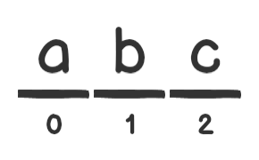
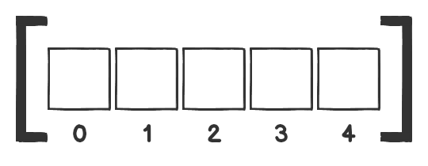
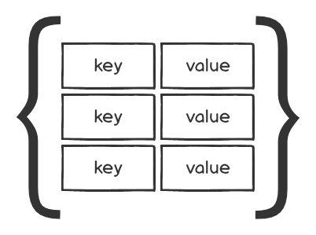

# Courses > JS101 Programming Foundations with JavaScript > Lesson 4: JavaScript Collections > 1. Introduction

## 1. Introduction

Programming involves working with data. It's common for programmers to store, search and manipulate data as part of their day-to-day work. Think about that first action for a moment: storing. How do we store data? The answer for most programming languages is to put them into structured containers, or collections. Collections come in many different forms, and it's useful to think of them as lists of data.

In this lesson, we'll work with three of the most commonly used collections in JavaScript: String, Array, and Object. String values in JavaScript generally aren't regarded as collections since strings are a primitive data type, but they do exhibit some properties of collections; for example, you can extract a character or a substring from a larger string. That is why we'll cover them here with the other collections.

You have already encountered these collections in previous lessons and assignments; in this lesson, we will explore them in greater depth.

Before you start, make sure to create a new directory for this lesson. Call it perhaps lesson_4, and do all your work in this lesson in that directory.

```sh
js_101          <-- this is your course 1 git repo
|
+--lesson_2     <-- all lesson 2 code goes here
|
+--lesson_3     <-- all lesson 3 code goes here
|
+--lesson_4     <-- all lesson 4 code goes here
```

## 2. Collections Basics

Collections are made up of individual elements. To work with collections, we need to understand how they are structured and how to reference and assign the individual elements within them.

### Element Reference

#### String Element Reference



Strings use an integer-based index that represents each character in the string. The index starts counting at zero and increments by one for the remaining index values. You can reference a specific character using this index.

```js
let str = 'abcdefghi';
str[2]; //=> 'c'
```

If you want to reference multiple characters within a string, you can use the `slice` method. The `slice` method takes two arguments. The first argument specifies the index at which to start the extraction and the second argument specifies the index where you want to end the extraction.

```js
str.slice(2, 5); // => 'cde'
```

Note that the character at index `5` wasn't included in the returned substring. The character at the ending index isn't part of the returned substring.

How would you reference `grass` from within this string? Try it out in the node REPL.

```sh
> let str = 'The grass is green'
```

Solution

```sh
> str.slice(4, 9)
'grass
```

You can also omit the second argument to `String.prototype.slice`. In that case, all characters from the start index to the end are returned in the substring.

```js
let str = 'abcdefghi';
str.slice(2); // => 'cdefghi'
```

Calling the `slice` method without any arguments will return a copy of the original string:

```js
'abcdefghi'.slice(); // => 'abcdefghi'
```

What happens when you provide *negative* arguments to `slice`?

```js
'abcdefghi'.slice(-4, -2) // => 'fg'
```

When given negative numbers as the indices, `slice` treats them as `string length + index`. In the above, an index of `-4` is equivalent `9 + (-4)` since the length of the string is 9 and `9 + (-4)` equals `5`. Likewise, `-2` is equivalent to `7`.

A method that is very similar to `slice`, but differs in some respects, is `String.prototype.substring`. It also takes a start index and an end index and returns a substring from the start of the index up to, but not including, the end index.

```js
let str = 'The grass is green';
str.substring(4, 9); // => 'grass'
```

`slice` and `substring` differ in the following ways:

1. When the start index is greater than the end index, `substring` *swaps* the two arguments while `slice` returns an empty string:

```js
// swap
'abcdef'.substring(3, 1); // => 'bc'

// empty string
'abcdef'.slice(3, 1); // => ''
```

1. When either argument is negative, `substring` treats them as `0`, while, as we saw above, `slice` treats them as `length + index`:

```js
// negative argument treated as 0
'abcdef'.substring(-2); // => 'abcdef'
'abcdef'.slice(-2) // => 'ef'
```

We recommend using `String.prototype.slice`. Its behavior is more natural and predictable when dealing with these edge cases.

You'll often see another method, `String.prototype.substr`, used in some old code. This method isn't strictly deprecated, but it is now defined as a **legacy function**. Eventual deprecation seems likely, which means it may be removed from future implementations of JavaScript. We don't recommend using it, but it's worth knowing about since you may come across it in the wild. See the documentation [here](https://developer.mozilla.org/en-US/docs/Web/JavaScript/Reference/Global_Objects/String/substr).

#### Array Element Reference

Arrays, like strings, are also ordered, zero-indexed collections.



Arrays are lists of elements that are ordered by index, where each element can be any value. Arrays use an integer-based index to maintain the order of its elements. A specific element can be reference by its index.

```js
let arr = ['a', 'b', 'c', 'd', 'e', 'f', 'g'];
arr[2]; // => 'c'
```

What do you think would be returned here? Try it out in the console.

```js
> let arr = ['a', 'b', 'c', 'd', 'e', 'f', 'g']
> arr.slice(2, 5)[0] // => 'c'
```

Solution

```sh
> arr.slice(2, 5)
['c', 'd', 'e']
> arr.slice(2, 5)[0]
'c'
```

Since `slice` returns an array value, we can use `[0]` to extract the first element of the array.

It is important to note that `Array.prototype.slice()` and `String.prototype.slice()` are not the same method, even though they have the same name. They do share a lot of the same functionality, but they are separate implementations. One key distinction is that `String.prototype.slice()` returns a new **string** whereas `Array.prototype.slice` returns a new **array**.

As with `String.prototype.slice()`, you can also omit the second argument to `Array.prototype.slice`. The result is similar:

```js
let arr = ['a', 'b', 'c', 'd', 'e', 'f', 'g']
arr.slice(2); // => ['c', 'd', 'e', 'f', 'g']
```

Calling `slice` without any arguments returns a shallow copy of the original array:

```js
arr.slice(); // => [ 'a', 'b', 'c', 'd', 'e', 'f', 'g' ]
```

Note that we said `slice` returns a copy of the array and not the original array. How would you verify that in the node console?

Solution

```sh
> let arr = ['a', 'b', 'c', 'd']
> let arrCopy = arr.slice()
> arrCopy.push('e')
5

> arr
[ 'a', 'b', 'c', 'd' ]
> arrCopy
[ 'a', 'b', 'c', 'd', 'e' ]
```

Notice that the original array `arr` doesn't get mutated when we call the `push` method on `arrCopy`. That tells us that `slice` returns a copy, not the original array object.

It's also a shallow copy instead of a deep copy. This becomes important when the copied array contains objects and other arrays as elements. How would you verify that in the node console?

Solution

```sh
> let nestedArr = [1, [2, 3], { foo: 4 } ]
> let nestedCopy = nestedArr.slice()

> nestedCopy.push(5)
4
> nestedCopy[1].push(6)
3
> nestedCopy[2].bar = 7;
7

> nestedArr
[ 1, [ 2, 3, 6 ], { foo: 4, bar: 7 } ]
> nestedCopy
[ 1, [ 2, 3, 6 ], { foo: 4, bar: 7 }, 5 ]
```

Notice that we mutated both the nested array and the nested object using the `nestedCopy` variable, but those mutations also showed up in `nestedArr`. However, when we just added a single element to `nestedCopy`, it had no effect on `nestedArr`.

#### Object Element Reference

Objects are another common collection data structure that, instead of using an integer-based index, uses key-value pairs, where the key is a string and the value can be any JavaScript value. That allows for a more expansive and descriptive collection of elements. Object keys are also called **properties**.



```js
let obj = { fruit: 'apple', vegetable: 'carrot' };
obj.fruit; // => 'apple'
obj.fruit[3]; // => 'l'
obj['vegetable']; // => 'carrot'
obj['vegetable'][0]; // => 'c'
```

Note that there are two ways of referencing an element in an object. The first one is called the **dot notation** of object property access and the second one is the **bracket notation**. In the above example, we use dot notation to access the value of the `'fruit'` key and bracket notation to access the value of the `'vegetable'` key. It is important to note that the `[0]` part of `obj['vegetable'][0]` and `[3]` in `obj.fruit[3]` in the above example is **string element reference**. The string `'carrot'` is returned by `object['vegetable']` and `[0]` is used to access the first letter of that value.

When initializing an object, the keys/property names must be unique. Try the following code out in the console.

```sh
> let obj = { fruit: 'apple', vegetable: 'carrot', fruit: 'pear' }
```

Solution

```sh
> let obj = { fruit: 'apple', vegetable: 'carrot', fruit: 'pear' }
> obj
{ fruit: 'pear', vegetable: 'carrot' }
```

Our object ends up with only two key-value pairs. The first one is *overwritten* by the third as they have identical keys.

Values, however, can be **duplicated**:

```js
let obj = { apple: 'fruit', carrot: 'vegetable', pear: 'fruit' };
```

We can access just the keys or just the values from an object with the `Object.keys` and `Object.values` methods. These methods return an array:

```js
let capitals = { uk: 'London', france: 'Paris', germany: 'Berlin' };
Object.keys(capitals); // => ['uk', 'france', 'germany']
Object.values(capitals); // => ['London', 'Paris', 'Berlin']
Object.values(capitals)[0]; // => 'London'
```

In the final line of the example above, `[0]` is referencing the item at index `0` of the array `['London', 'Paris', 'Berlin']` since this is the return value of `Object.values(capitals)`.

#### Element Reference Gotchas

There are a few things that can catch you off guard when referencing elements in a collection, so you need to be aware of these to avoid unintended behavior in your code.

##### Out of Bounds Indices

We know that strings and arrays are indexed collections and that we can reference individual elements within the collection via their index.

```js
let string = 'abcde';
let array = ['a', 'b', 'c', 'd', 'e'];

string[2]; // => 'c'
array[2]; // => 'c'
```

The indices of both of these collections run from 0 to 4. What if we try to reference an index greater than 4?

```js
string[5] // => undefined
array[5] // => undefined
```

Referencing an **out-of-bounds** index in this way returns `undefined`.

What happens if we try to reference an index less than `0`?

```js
string[-1]; // => undefined
array[-1]; // => undefined
```

Accessing an index less than `0` on an array or a string also returns `undefined` in JavaScript.

##### Invalid Object Keys

Using a key to access a property that doesn't exist on an object also returns `undefined`:

```js
let obj = { a: 'foo', b: 'bar' };
obj['c']; // => undefined
```

Sometimes, though, an object contains properties with `undefined` values on purpose. In that case, how would we differentiate between a non-existent property versus a property that has `undefined` as its value? There are a number of ways do that. The `Object.prototype.hasOwnProperty` method returns a boolean indicating whether it exists as a property in the object:

```js
let obj = { a: 'foo', b: 'bar', c: undefined};
obj.hasOwnProperty('c'); // => true
obj.hasOwnProperty('d'); // => false
```

 Another way to differentiate a non-existent property from a property with `undefined` as its value is to use `Object.keys` along with the array `includes` method:

```js
Object.keys(obj).includes('c'); // => true
Object.keys(obj).includes('d'); // => false
```

##### Arrays are Objects

It's important to remember that JavaScript arrays are objects. The chief difference between an array and some other object is that it uses non-negative integers as its primary keys. Another significant difference is that adding elements to the array increases the value of its `length` property, and changing the value of the `length` property causes the number of elements to change.

Since arrays are objects, we can add additional properties to them:

```js
let arr = ['foo', 'bar', 'qux'];
arr['boo'] = 'hoo';
arr[-1] = 374;
arr; // => ['foo', 'bar', 'qux', boo: 'hoo', '-1': 374]
arr.length; // => 3 (not 5!) - just counting indexes
arr.forEach(element => console.log(element)); // prints: foo, bar, qux
Object.keys(arr); // => [ '0', '1', '2', 'boo', '-1' ]
```

Note that `arr[-1] = 374` looks like we're creating an element at index position `-1`. In fact, the `'-1'` property is not really an element of the array, but is an ordinary property of the object. You can see this in the return value from line 4 where the property is shown as `'-1': 374`. By the same token, `arr['boo']` isn't an element of the array, but a property of the object.

It's also important to note that the value of the length property *does not change after we add non-element properties* to the array. Furthermore, those properties are *ignored* by array methods like `forEach`, `map`, and `filter`. (We'll talk about those methods in a later assignment.)

However, when we use an `Object` method, such as `keys`, we get a list of all of the property names. Curiously, the return value here shows the indices of the array elements as string keys, `'0'`, `'1'`, and `'2'`.

Finally, you must be careful when you need to distinguish between arrays and other objects. You might, for instance, assume that the `typeof` operator would identify an array as an `'array'`. It doesn't. It returns `'object'` instead. If you really need to detect an array, you can use the `Array.isArray` method:

```js
let arr = ['foo', 'bar', 'qux'];
let obj = { a: 1, b: 2 };
typeof arr; // => 'object'
typeof obj; // => 'objet'
Array.isArray(arr); // => true
Array.isArray(obj); // => false
```

### Conversion

The fact that strings and arrays share similarities makes it intuitive to convert from one to the other, which is quite common in JavaScript code. There are a few methods that facilitate this type of conversion including `String.prototype.split` and `Array.prototype.join`.

`String.prototype.split()`, when called without any arguments, returns an array with the string as its only element:

```js
'this is a string'.split(); // => ['this is a string']
```

However, if you provide it with an empty string as the argument, it returns an array of all the characters in the string:

```js
'abcdef'.split(''); // => ['a', 'b', 'c', 'd', 'e', 'f']
'abcdef'.split('')[0]; // => 'a'
```

Note that we use the `[]` operator on the return value of `split`. The `split` method returns an array so we can access element from that array using the `[]` operator.

Any other string provided to `split` as the argument will be used to separate the string using the argument as the delimiter:

```js
'apple,orange,mango'.split(',') // => ['apple', 'orange', 'mango']
```

When called without any arguments, `Array.prototype.join()` returns a string with the elements of the array joined together into a string, separated by commas.

```js
let arr = ['a', 'b', 'c', 'd', 'e', 'f'];
arr.join() // => 'a,b,c,d,e,f'
```

How would you join the characters in the array into a string without delimiting each character with a comma? You may want to check the MDN docs to read up on `Array.prototype.join()`.

Solution

```js
let arr = ['a', 'b', 'c', 'd', 'e', 'f'];
arr.join(''); // => 'abcdef'
```

We can also convert objects to arrays. Apart from `Object.keys` and `Object.values` methods, you can use `Object.entries` to convert an object to an array.

```js
let obj = { sky: 'blue', grass: 'green' };
Object.entries(obj); // => [[ 'sky', blue], [ 'grass', 'green ]]
```

The array returned by `Object.entries` contains nested arrays, with each sub-array containing two values. The sub-arrays are equivalent to the key-value pairs from the initial object.

### Element Assignment

#### Array Element Assignment

We can use the element assignment notation of arrays to change the value of a specific element within an array by referring to its index. Say, for example, that we wanted to increment the first element of an array of numbers by 1, we could do this in the following way.

```js
let numbers = [1, 2, 3, 4];
numbers[0] = numbers[0] + 1; // => 2
numbers; // => [2, 2, 3, 4]
```

Note that this way of modifying an array is a **destructive** action; that is, the `numbers` array is **mutated**.

In the node REPL or a code file, use the same method to increase the value of the rest of the numbers in the array by 1. Also, try incrementing an element that doesn't exist, such as numbers[4].

Solution

```js
numbers[1] = numbers[1] + 1;
numbers[2] = numbers[2] + 1;
numbers[3] = numbers[3] + 1;
numbers[4] = numbers[4] + 1;
numbers;    // [ 2, 3, 4, 5, NaN ]
```

#### Object Key Assignment

Object element assignment is similar. The object key is used instead of assigning a value using an index.

```sh
> let obj = { apple: 'Produce', carrot: 'Produce', pear: 'Produce', broccoli: 'Produce' }
> obj['apple'] = 'Fruit'
> obj.carrot = 'Vegetable'
> obj
{ apple: 'Fruit',
  carrot: 'Vegetable',
  pear: 'Produce',
  broccoli: 'Produce' }
```

As you can see, we can use dot notation as well as bracket notation for object key assignment.

Note that, once again, this is a **destructive** action that permanently modifies `obj`.

In the node REPL or a code file, use the same method to set a value of either 'Fruit' or 'Vegetable' to the pear and broccoli properties.

#### String Character Assignment

Here is where the major difference between strings and the other two collection types begins to show. JavaScript strings are **immutable** and, hence, cannot be altered permanently. You can try to use the array element assignment syntax with strings without getting any errors, but it does not affect the string:

```js
let str = 'bob';
str[0] = 'B'; // => 'B'
str; // => 'bob'
```

You can see that after the "reassignment," `str` has the same value as it had before. One question you might ask is why JavaScript lets you do the reassignment if it doesn't affect the original string. We'll talk about why that is in a later course. For now, remember that string element reassignment, even though it's syntactically permitted, doesn't affect the string. That behavior can lead to frustrating bugs, so beware!

If that's the case, how can one make changes to a string? Well, just create a new string with the desired changes. For example, we can reassign the `str` value to a new string and reassign the variable to the new value:

```js
str = 'B' + str.slice(1);
str; // => 'Bob'
```

### Collections Basics Summary

We've talked about quite a few important topics in this assignment. More specifically, we covered the core ways to reference elements or assign values for particular elements in a collection using some of the various element reference and element assignment methods of String, Array, and Object.

These concepts are fundamental to working with collections, so it's critical to understand everything we talked about in this assignment before moving forward. Taking the time to have a clear understanding of these topics will make it much easier to handle topics that build upon these fundamentals in the future.

20210817 17:35 Finish Assignment 2

## 3. String Methods

As mentioned in the previous assignment, JavaScript strings aren't really collections since you can't store generic data in them. You can, perhaps, think of them as collections of characters; they have some properties that one would associate with collections. For example, you can access individual characters or multiple characters of the string and can loop through all the characters by using the `length` property in conjunction with the `for` and `while` loops. That's the reason behind covering strings in a lesson about JavaScript collections.

Before we start diving into the most common string methods you're expected to know about, be sure to refresh your memory on the various ways of writing string literals and when to use each one, from the [book](https://launchschool.com/books/javascript/read/basics#datatypes).

Time to learn about some string methods.

### `String.prototype.concat()`

We've already seen one way of joining two strings together, the + operator. Another way to concatenate two strings together is by using the concat method. It works exactly the way the + operator works with two strings.

```sh
> 'Hello '.concat('World!')
'Hello World!'
```

Since JavaScript strings are **primitive values**, any operation performed on them, including the `concat` method, *results in a new string*. We won't reiterate this point in the rest of the assignment. None of the methods that operate on strings mutate the string since JavaScript strings are **immutable**.

Open a console session and verify that that's the case with the `concat` method.

Solution

```sh
> let str = 'Hello'
undefined
> str.concat(' World!')
'Hello World!'
> str
'Hello'
```

Note that the original string assigned to `str`, remains unchanged after we call the `concat` method on it. If you want to change the value that `str` refers to, reassign it the return value of the `concat` method call.

```sh
> let str = 'Hello'
> str = str.concat(' there!')
'Hello there!'
> str
'Hello there!'
```

Concat can take more than one string as arguments. It combines all those strings into one:

```sh
> let str1 = 'Hello'
> let str2 = 'World!'

> str1.concat(' ', str2)
'Hello World!'
```

### `String.prototype.includes()`

The `includes` method takes a string as the argument and returns a boolean signifying whether that string exists within the string that `includes` was called on.

```sh
> 'One potato, two potato, three potato, four'.includes('three')
true
> 'One potato, two potato, three potato, four'.includes('tater')
false
> 'abc'.includes('a')
true
```

`includes` also takes an optional second argument that specifies which index in the string to start looking for the substring.

```sh
> 'abcdefg'.includes('b', 2)
false
```

Even though the string `abcdefg` includes `'b'`, the method call returns `false` since we're telling it to start its search from index `2`.

### `String.prototype.split()`

We've already seen the `split` method in previous assignments, but we'll cover it again here because `split` is one of the more important string methods. `String.prototype.split`, as the name signifies, separates a given string into multiple strings and returns them in the form of an array. How the string gets split depends on the argument you provide to `split`. The basic case is when you don't provide any argument:

```sh
> 'abcdef'.split()
['abcdef']
```

In this case, the whole string is simply returned as the first element of an array. If you provide an **empty string**, each character of the string will be split into individual characters:

```sh
> 'abcdef'.split('')
['a', 'b', 'c', 'd', 'e', 'f']
```

Any other string argument you provide to `split` will be used as the separator by which to split the string:

```sh
> 'One potato, two potato, three potato, four'.split(', ')
[ 'One potato', 'two potato', 'three potato', 'four' ]
```

Note that we provided the `,` character and space as the separator. Open the node console and see how the string gets split if we provide `','` as the argument.

```sh
> 'One potato, two potato, three potato, four'.split(',')
[ 'One potato', ' two potato', ' three potato', ' four' ]
```

### `String.prototype.trim()`

The `trim` method removes whitespace from both ends of a string it's called on. The `trim` method is often useful when getting input from users, which can often contain unnecessary whitespace at either end.

```sh
> '  abcdef   '.trim()
'abcdef'
```

`trim` removes any number of space characters as well as whitespace characters like `\n` and `\t`.

```sh
> '\nabcdef\t'.trim()
'abcdef'
```

There are a couple of variations and the `trim` method that are also very useful. The `trim Start` method removes whitespace from the beginning of a string while `trimEnd` does so at the end of the string.

```sh
> '  abcdef  '.trimStart()
'abcdef  '
>'  abcdef  '.trimEnd()
'  abcdef'
```

### `toUpperCase()` and `toLowerCase()`

 You've already seen both of these methods and the names are pretty self-explanatory. `toUpperCase()` and `toLowerCase()` convert the strings to uppercase or lowercase respectively:

```sh
> 'pete'.toUpperCase()
'PETE'
> 'PETE'.toLowerCase()
'pete'
```

 Sometimes, you want to convert only the first character of a string to it uppercase equivalent. You can do that by combining `toUpperCase()` with `slice()` and any of the string concatenation methods:

 ```js
function capitalize(str) {
  return str[0].toUpperCase() + str.slice();
}

capitalize('pete'); // => 'Pete'
 ```

### `String.prototype.charAt`

The `charAt` method is nearly identical to using brackets on a string. It takes an index as an argument and returns the character at that index in the given string:

```sh
> let sentence = "It's a walk in the park."
> sentence.charAt(5)
'a'
```

We see that the character `a` is at index five in the string `"It's a walk in the park."`

Note that when we create the string literal, `It's a walk in the park.`, we are using double quotes (`""`) instead of the single quotes that we have normally been using. The reason is that our string itself contains a single quote. Using single quotes to wrap a string that contains a single quote will confuse the JavaScript engine; instead of being a part of our string, it will be interpreted as syntax. You can use a similar technique with strings that contain double quotes:

```sh
> let sentence = 'He said, "I will come back!"'
```

 You can of course always use the escape character (`\`) to let JavaScript know that the character immediately after the `\` should not be interpreted as part of the syntax:

```sh
> let sentence = 'It\'s a walk in the park'
> sentence
"It's a walk in the park"
```

 The chief difference between `charAt()` and `[]` occurs when using indices for characters that don't exist: `charAt()` returns an empty string (`''`), while `[]` returns undefined:

```sh
> 'abc'[5]
undefined
> 'abc'.charAt(5)
''
> 'abc'[-2]
undefined
> 'abc'.charAt(-2)
''
```

### `String.prototype.charCodeAt()`

 The method `charCodeAt()` is similar to `charAt()`, but instead of returning the character at the given index, it returns the **Unicode code point** or **character code** of the character at the index. A unicode code point is the number that represents the machine level.

```sh
> 'abcdef'.charCodeAt(1)
98
```

Index `1` contains the character `'b'` and the code point for `'b'` is 98.

If you don't provide an index, `charCodeAt() assumes the index`0`.

```sh
> 'abcdef'.charCodeAt()
97 // the character code for 'a'
```

The `String.fromCharCode()` method does the opposite of `String.prototype.charCodeAt()`. It takes a character code (Unicode code point) and returns the character represented by that character code.

```sh
> String.fromCharCode(97)
'a'
```

Note that `fromCharCode()` is not a prototype method. It's instead what we call a **static method** or a function. We can't call `fromCharCode` directly on a string; instead, it must be called on the constructor `String`. It's a common pattern in different languages to write methods that don't pertain to a specific value of a type directly on the class/constructor for that type. In this case, `fromCharCode` isn't an operation you'd perform on a string value. That is, something like the following doesn't make sense:

```sh
'abcd'.fromCharCode(97)
=> Uncaught TypeError: "abcd".fromCharCode is not a function
```

The operator `fromCharCode` isn't doing anything with the string `'abcd'`. It's simply a function that, given a character code, returns a string that contains the character for that character code. That's why it makes sense to call `fromCharCode()` directly on the `String` constructor.

### Other String Methods

The following are a few other string methods of note. Read the MDN documentation to see what each method does:

`String.prototype.endsWith()`

- The `endsWith()` method determines whether a string ends with the characters of a specified string, returning `true` or `false` as appropriate.
- Syntax
  - `endsWith(searchString)`
  - `endsWith(searchString, length)`

```js
const str1 = 'Cats are the best!';

console.log(str1.endsWith('best', 17));
// expected output: true

const str2 = 'Is this a question';

console.log(str2.endsWith('?'));
// expected output: false
```

`String.prototype.startsWith()`

- The `startsWith()` method determines whether a string begins with the characters of a specified string, returning `true` or `false` as appropriate.
- Syntax
  - `startsWith(searchString)`
  - `startsWith(searchString, position)`

```js
const str1 = 'Saturday night plans';

console.log(str1.startsWith('Sat'));
// expected output: true

console.log(str1.startsWith('Sat', 3));
// expected output: false
```

`String.prototype.repeat()`

- The `repeat()` method constructs and returns a new string which contains the specified number of copies of the string on which it was called, concatenated together.
- Syntax
  - `repeat(count)`

```js
const chorus = 'Because I\'m happy. ';

console.log(`Chorus lyrics for "Happy": ${chorus.repeat(27)}`);

// expected output: "Chorus lyrics for "Happy": Because I'm happy. Because I'm happy. Because I'm happy. Because I'm happy. Because I'm happy. Because I'm happy. Because I'm happy. Because I'm happy. Because I'm happy. Because I'm happy. Because I'm happy. Because I'm happy. Because I'm happy. Because I'm happy. Because I'm happy. Because I'm happy. Because I'm happy. Because I'm happy. Because I'm happy. Because I'm happy. Because I'm happy. Because I'm happy. Because I'm happy. Because I'm happy. Because I'm happy. Because I'm happy. Because I'm happy. "
```

### String Methods Summary

Strings are an important data-type in JavaScript. Most programs in modern JavaScript involve working with strings in one form or another. Get familiar with the methods that operate on strings; doing so will serve you well as you learn more about JavaScript.

20210818 16:46 Assignment complete.

## 4. Iterating with for and while Loops

20210819 06:02

When working with a collection, it's common to perform a single action on each element in the collection. Instead of writing the action over and over again, loops can be used to process many, if not all, of the elements in a collection.

In a previous assignment, we looked at manually incrementing all the numbers in an array by 1. Here's a reminder of what that looked like (slightly modified).

```js
let numbers = [1, 2, 3, 4];
numbers[0] += 1;
numbers[1] += 1;
numbers[2] += 1;
numbers[3] += 1;
numbers;               // => [ 2, 3, 4, 5 ]
```

You probably noticed that lines 2 - 5 of the above code are almost identical other than the array indices. This array is relatively small; imagine if we needed to increment each value in a much larger array - say, one containing 20 or 30 numbers or maybe even 1,000,000. That's a lot of repetitive code. Situations like this are where we can use a loop to do the hard work for us.

Let's see how we'd solve this problem with a `while` loop:

```js
let numbers = [1, 2, 3, 4];
let idx = 0;

while (idx < numbers.length) {
  numbers[idx] += 1;
  idx += 1;
}

console.log(numbers) // => [2, 3, 4, 5]
```

If you understand this code immediately, you can glance at the rest of this assignment. If you have a little bit of trouble with it, though, make sure you reread the [chapter on loops](https://launchschool.com/books/javascript/read/loops_iterating) in the book, then read the rest of this assignment. Take notes and pay attention -- it's extremely critical.

### Generic Loops

In JavaScript, the most basic kind of loop uses the while statement with a conditional expression that is always true:

```js
while (true) {
  // some code here
}
```

Any code within the block gets executed during each iteration. Since the condition never becomes false, the loop continues to repeat forever: it becomes an infinite loop. Try the following code in the node REPL:

```sh
> while (true) {
>   console.log('Hello!')
> }
```

You should see thousands of lines of text output on the console, though they may occur so rapidly, it may look like the program isn't doing anything. Press `Ctrl + C` to cancel the program. You can safely ignore the error and stack trace caused by `Ctrl + C` -- that's normal behavior.

Let's add a `break` statement after the `console.log` call. When we do, the loop iterates just once since `break` causes JavaScript to exit the nearest loop:

```js
while (true) {
  console.log('Hello!');
  break;
}
```

If we want the loop to iterate more than once, we can use a conditional statement with `break` so it only breaks out of the loop when a specific condition occurs. For example, let's say we have a variable named `number` that represents a random number. We can exit the loop when `number` equals `5` by writing the `if` condition as `number === 5`:

```js
while (true) {
  let number = Math.floor(10 * Math.random());
  console.log(number);

  if (number === 5) {
    console.log('Exiting ...')
    break;
  }
}
```

Try running this code a few times (either from a code file or in the node REPL) and make a note of what you notice.

Once you've done that, compare your notes with these:

1. One or more numbers are output.
2. The last number output is 5.
3. 'Exiting...' is output once

On each iteration:

- number is assigned to a random number between 0 and 9.
- The number is output.
- The if statement checks whether number is equal to 5.
- If it is, it displays 'Exiting...' and then executes break to exit the loop.
- If it isn't, then the loop repeats.

### **Iterating Over Collections**

Let's see how we can use our knowledge of loops to iterate over collections.

#### Strings

Here's a loop that iterates over a string and prints each character.

```js
let alphabet = 'abcdefghijklmnopqrstuvwxyz';
let counter = 0;

while (counter < alphabet.length) {
  console.log(alphabet[counter]);
  counter += 1;
}
```

Here's the same iteration performed with a for loop:

```js
let alphabet = 'abcdefghijklmnopqrstuvwxyz';

for (let counter = 0; counter < alphabet.length; counter++) {
  console.log(alphabet[counter]);
}
```

The `for` loop is a little more succinct as it puts the `counter` declaration and initialization, the looping condition, and the counter incrementing statement on a single line. The `for` loop is the preferred approach of the two when it comes to iterating over collections.

To print each character in the string, we need to iterate over the entire string and use string references to retrieve each letter based on its index. Since our `counter` starts at `0`, we can use that. Our looping condition, `counter < alphabet.length` makes sure that the loop stops as soon as the value of `counter` becomes equal to the length of our string, which is 26.

To print a specific character in a string, we use the index value associated with that character. Since `counter` represents the current iteration number, we can use its value as the index value for each character. That results in every character being printed one at a time.

Note that our looping condition is not `counter <= alphabet.length`. In other words, we want the loop to continue only as long as the counter is less than 26 and not until its equal to 26. The reason for that is that strings and arrays have 0-based indices and our counter also starts at zero. By the time the counter reaches `26`, the loop has already performed 26 operations and accessing `alphabet[26]` would be an out of bounds access.

Suppose the string includes spaces. Since strings can only contain characters, we know that spaces are also characters. If the string were `'a b c'` for example, each character would be printed, including the spaces.

```sh
a

b

c
```

#### Arrays

To iterate over an array, we can use the for loop in the same way we did with a string.

```js
let colors = ['green', 'blue', 'purple', 'orange'];

for (let counter = 0; counter < colors.length; counter += 1) {
  console.log(`I'm the color ${colors[counter]}!`);
}
```

What do you think will be output by the loop?

Solution

```sh
I'm the color green!
I'm the color blue!
I'm the color purple!
I'm the color orange!
```

In the above example, the array only contains strings. However, arrays can contain any JavaScript values, regardless of type, and can contain different types at the same time. Let's modify the array so that it contains different data types. We also modify the call to `console.log` to print the type of each element. We can use the `typeof` operator to do that.

```js
let mixed = ['hello', 10, undefined];

for (let counter = 0; counter < mixed.length; counter += 1) {
  console.log(typeof mixed[counter]);
}

Now our output looks a little different.

```sh
string
number
undefined
```

#### Objects

Using the `for` and `while` loops to iterate over an object is a bit harder — it requires a couple more steps. That's because objects use key-value pairs instead of a zero-based index. Each value in an object is associated with a specific key. Since object keys are strings, a simple counter variable won't allow us to fetch the values we want.

To remedy this, we have to create an array containing all of the keys in the object. We can do this by using `Object.keys`, which returns an array containing all of the keys in the object. We can then use the new array of keys to iterate over the object.

```js
let numberOfPets = {
  dogs: 2,
  cats: 4,
  fish: 1
};

let pets = Object.keys(numberOfPets);
let counter = 0;

while (counter < pets.length) {
  let currentPet = pets[counter];
  let currentPetNumber = numberOfPets[currentPet];
  console.log(`I have ${currentPetNumber} ${currentPet}!`);
  counter += 1;
}
```

The most important thing to realize here is that this is a two-step process. First, we're iterating over the array of keys, `pets`, and saving each key into the `currentPet` variable. We then use the `currentPet` key to retrieve the appropriate value from the `numberOfPets` object.

The `console.log` statement interpolates both the current object value, `currentPetNumber`, and the current object key, `currentPet`, into the "I have ... !" string.

```sh
I have 2 dogs!
I have 4 cats!
I have 1 fish!
```

Recall from the [Objects chapter](https://launchschool.com/books/javascript/read/objects#whatareobjects) of the book that you don't have to use `for` or `while` loops to iterate over an object. The [for/in](https://launchschool.com/books/javascript/read/objects#iteration) loop provides a simpler way to iterate over objects:

```js
let numberOfPets = {
  dogs: 2,
  cats: 4,
  fish: 1
};

for (let currentPet in numberOfPets) {
  let currentPetNumber = numberOfPets[currentPet];
  console.log(`I have ${currentPetNumber} ${currentPet}!`);
}
```

The book discusses why `for/in` may not produce the same results as the `while` loop shown above.

#### Loop Controls: break and continue

##### Positioning break

Every loop in JavaScript, whether it uses `while`, `do/while`, or `for` can be rewritten as a generic `while (true)` loop. If you're not sure what type of loop you need, you can always start with a generic loop, then modify the finished code to use the appropriate non-generic loop.

In our earlier example with random numbers, we put the `break` at the end of the loop:

```js
while (true) {
  let number = Math.floor(10 * Math.random());
  console.log(number);

  if (number === 5) {
    console.log('Exiting...');
    break;
  }
}
```

That mimics the behavior of a `do/while` loop. For instance, here's the equivalent `do/while` code:

```js
let number;

do {
  number = Math.floor(10 * Math.random());
  console.log(number);
} while (number !== 5);

console.log('Exiting...');
```

If we put the `break` at the beginning of the loop, it mimics a regular `while` loop:

```js
let str = '';

while (true) {
  if (str.length >= 10) {
    break;
  }

  str += '*';
  console.log(str);
}
```

```js
let str = '';

while (str.length < 10) {
  str += '*';
  console.log(str);
}
```

These last few examples demonstrate that we can often replace `while (true)` loops with an equivalent `while` or `do/while` loop. In most cases, you can and should. However, that's not always the case. Sometimes, you have to exit from the middle of a loop rather than the beginning or end:

```js
while (true) {
  let number = Math.floor(10 * Math.random());
  if (number === 5) {
    console.log('Exiting...');
    break;
  }

  console.log(number);
}
```

This loop is similar to the `while (true)` loop we wrote at the beginning of this section. There, we exited after we displayed the number `5`. This one, though, never displays the number `5`. Instead, it tests the termination condition in the middle of the loop and exits before outputting the number.

Note that we can use the `break` statement in any `while`, `do/while`, or `for` loop; you aren't restricted to using it only in `while (true)` loops.

```js
let names = ['Pete', 'Naveed', 'Chris', 'Elizabeth', 'Wendy', 'Kim'];
let index = 0;

while (index < names.length) {
  if (names[index][0] === 'E') {
    break;
  }

  console.log(names[index]);
  index += 1;
}
```

This loop iterates over the elements of the `names` array, but terminates the loop early if it encounters a name that begins with `'E'`.

##### continue and Guard Clauses

The `break` statement lets us terminate a loop at any time. The `continue` statement provides a similar service, but, instead of terminating the loop, it terminates the current iteration and returns to the top of the loop.

Suppose we want to display the squares of all the even numbers in an array. Our solution might look like this:

```js
let numbers = [1, 4, 3, 7, 6, 5, 2, 1];

for (let index = 0; index < numbers.length; index += 1) {
  if (numbers[index] % 2 !== 1) {
    let square = numbers[index] * numbers[index];
    console.log(square);
  }
}
```

That's simple enough. However, the nested logic is a little harder to understand than unnested logic would be. It also doesn't clearly show that the loop has no interest in the odd numbers. In a small loop like this, that's not significant, but in a larger loop, you have to scan down to find out whether the loop ever does something with the odd numbers. That decreases the readability of your code.

One way to deal with this issue is to use a **guard clause** to exclude the odd numbers from further consideration:

```js
let numbers = [ 1, 4, 3, 7, 6, 5, 2, 1 ];

for (let index = 0; index < numbers.length; index += 1) {
  if (numbers[index] % 2 === 1) continue;

  let square = numbers[index] * numbers[index];
  console.log(square);
}
```

A guard clause is a conditional statement that protects the body of a loop or function from having to deal with values it doesn't need to handle. In this case, we don't want the main body of our loop (lines 6 and 7) to handle odd numbers, so we use a guard clause at the top of the loop to end the current iteration of the loop and resume with the next. In this example, we use the `continue` statement to terminate the current iteration of the loop and perform the next. The guard clause also clearly shows that we have no further interest in odd numbers.

Note that `continue` doesn't restart the loop. Instead, it ends the current iteration and starts the next. In the above example, for instance, `continue` doesn't reset `index` to `0` as it would if it restarted the loop. However, since it starts the next iteration, it increments the `index` variable (`index += 1`) and tests the termination condition again.

Guard clauses always include a `continue`, `break`, or `return` statement in the body of the `if` statement, depending on need. Most shouldn't do anything else, but that's not a strict rule.

Actually, there are some other statements you can use in a guard clause besides `continue`, `break`, and `return`, but we don't talk about them in this course.

Note that we used a single-line version of the `if` statement when writing our guard clause, contrary to the general rule that you should always use blocks with braces. It's common practice to use the single-line version of the `if` statement with guard clauses, but it isn't required. You could, for example, write:

```js
if (numbers[index] % 2 === 1) {
  continue;
}
```

However, the multi-line form makes for longer functions, especially if you have multiple guard clauses.

### **Iterating Summary**

Looping comprises four primary elements: a looping construct such as `for` or `while`, a counter (or control variable), a way to retrieve a current value, and a way to exit the loop. It's important to understand how to manually loop over collections with nothing more than these 4 tools. It's often tempting to go "method hunting" to search for a method to iterate over a collection, but, if you master the basics of looping, you'll find that you can perform nearly any operation you need with the simple techniques in this assignment. Methods can be useful, but they shouldn't be used as a crutch.

In later assignments, you'll see how to combine `for` and `while` with a few other tools to manipulate collections according to your will.

20210819 10:48 Assignment complete.

## Introduction to the PEDAC Process

The PEDAC process is one approach to solving programming problems. Its primary goal is to help you identify and avoid pitfalls that you may encounter when you don't code with intent.

P - [Understand the] **P**roblem

E - **E**xamples / Test cases

D - **D**ata Structure

A - **A**lgorithm

C - **C**ode

This guide describes a "lighter" version of the PEDAC process that should help you prepare for the upcoming interview assessment. We'll discuss PEDAC in much more detail in a later course.

When given a programming problem, students often jump straight to the coding part. At first glance, this approach seems reasonable. In an interview setting with limited time, you want to solve the problem quickly. Writing an algorithm may seem like an unnecessary use of your limited time, especially when the problem seems simple. However, in this guide, we want to show you that following the PEDAC process saves time and lets you solve **complex** problems efficiently.

Note that we've bolded the word "complex." Some problems, like, writing a function that takes a string and returns its uppercased version are so simple that they don't need a detailed algorithm. However, writing a function that returns all the substrings from a given string that are palindromes is not simple, and following the PEDAC process is crucial to solving the problem in the time allotted.

In this guide, we will focus on the "understand the problem" and "data structure/algorithm" steps of the PEDAC process. We won't spend much time talking about the Examples/Test Cases step since we will provide test cases during the first interview assessment. We also won't spend much time on the Code: most students have sufficient knowledge of JavaScript syntax, functions and methods to solve even the hardest problems. Where they run into trouble is *understanding the problem and determining an appropriate algorithm*.

### P - [Understand the] Problem

Understanding the problem has three steps:

1. Read the problem description.
2. Check the test cases, if any.
3. If any part of the problem is unclear, ask the interviewer or problem requester to clarify the matter.

Let's walk through this process for the problem given below:

```js
// PROBLEM:

// Given a string, write a function changeMe which returns the same
// string but with all the words in it that are palindromes uppercased.

// changeMe("We will meet at noon") === "We will meet at NOON"
// changeMe("No palindromes here") === "No palindromes here"
// changeMe("") === ""
// changeMe("I LOVE my mom and dad equally") === "I LOVE my MOM and DAD equally"
```

After reading this problem, some items may need clarification:

1. **What is a palindrome?** You might ask the interviewer to tell you what a palindrome is, and the interviewer would tell you that it is a word that reads the same forwards and backward.

2. **Should the words in the string remain the same if they already use uppercase?** Here, you can check the test cases. In the fourth test case, the word LOVE already uses uppercase, and it remains uppercase in the solution.

3. **How should I deal with empty strings provided as input?** The test cases frequently answer this question. In this case, test case number 3 provides the answer. This is an implicit requirement that we can infer from the test cases.

4. **Can I assume that all inputs are strings?** Test cases don't show any non-string inputs, so you should ask whether the inputs can contain non-string values, and what you should do with them. In this problem, we won't worry about non-string values.

5. **Should I consider letter case when deciding whether a word is a palindrome?** Again, test cases don't show any appropriate examples. The interviewer might tell you that the palindrome words should be case sensitive: mom is a palindrome, Mom is not.

6. **Do I need to return the same object or an entirely new one?** This question isn't relevant to our current problem since JavaScript strings are immutable and any operation on them will result in a new string. In general, though, this question is one of the most important and most overlooked that you can ask. Typically, while solving problems, students make certain assumptions. One assumption they might make is to return the same object; they often start solving the problem without checking whether that assumption is correct. For this reason, the student may end up losing 10-15 minutes struggling with the wrong problem.

7. **Always verify your assumptions by looking at the test cases or by asking the interviewer.** As discussed in the above point, students often make assumptions about the problem or the expected output that may not be what the interviewer has in mind. That can lead to a waste of time pursuing an incorrect or incomplete solution. Make sure to confirm that your assumptions are correct before you proceed to start developing your algorithm.

To conclude this part of the PEDAC process, you need to write down what the inputs and outputs for the problem are. You should also describe the rules that you must follow. The rules should encapsulate all the explicit and implicit requirements in the problem. So, you should identify what the explicit requirements are, write them down, and then repeat the process for the implicit requirements:

```js
// input: string
// output: string (not the same object)
// rules:
//      Explicit requirements:
//        - every palindrome in the string must be converted to
//          uppercase. (Reminder: a palindrome is a word that reads
//          the same forwards and backward).
//        - Palindromes are case sensitive ("Dad" is not a palindrome, but
//          "dad" is.)

//      Implicit requirements:
//        - if the string is an empty string, the result should be an empty string
```

### Data Structure / Algorithm

Data structures influence your algorithm, and for that reason, these two steps are often paired. Deciding what data structure to use is generally easy. A case that calls for an array rather than an object, for instance, is generally easy to identify. However, designing the right algorithm is far more challenging. The biggest problem that students have when writing algorithms is providing sufficient detail.

Let's consider another problem. Try to work through the "understand the problem" part of this problem on your own, and write the input, output, and rules for it. We'll provide a solution below. Later, we'll tackle the data structure and algorithm.

```js
// PROBLEM:

// Given a string, write a function `palindromeSubstrings` which returns
// all the substrings from a given string which are palindromes. Consider
// palindrome words case sensitive.

// Test cases:

// console.log(palindromeSubstrings("supercalifragilisticexpialidocious"))
// should return: ["ili"]
//
// console.log(palindromeSubstrings("abcddcbA"))
// should return: ["bcddcb", "cddc", "dd"]
//
// console.log(palindromeSubstrings("palindrome"))
// should log: []
//
// console.log(palindromeSubstrings(""))
// should log: []
```

Answer

```js
// Some questions you might have?
// 1. What is a substring?
// 2. What is a palindrome?
// 3. Will inputs always be strings?
// 4. What does it mean to treat palindrome words case-sensitively?

// input: string
// output: an array of substrings
// rules:
//      Explicit requirements:
//        - return only substrings which are palindromes.
//        - palindrome words should be case sensitive, meaning "abBA"
//          is not a palindrome.

//      Implicit requirements:
//        - if the string is an empty string, the result should be an empty array
```

What data structure could we use to solve this problem? The obvious choice seems to be an array since that's the desired output.

Now, we come to the algorithm part. Look at the algorithm written below.

```js
// Algorithm:
//  - declare a result variable and initialize it to an empty array
//  - create an array named substrArray that contains all of the
//    substrings of the input string that are at least 2 characters long.
//  - loop through the words in the substrArray array.
//  - if the word is a palindrome, append it to the result
//    array
//  - return the result array
```

Does this algorithm look complete to you?

This algorithm is a "high-level" algorithm and it resembles those that we often see students write during interviews. It looks complete, but let's think about it for a moment: what is the hardest part of this problem? Is it looping through an array and pushing substrings that are palindromes in the result array? Is it determining whether a substring is a palindrome? Is it something else entirely?

Determining whether a word is a palindrome isn't that difficult for most students. Looping through the array and selecting all the palindromes is relatively easy as well. However, finding all the substrings for a given string can be challenging. The above algorithm doesn't tackle that issue. It lacks implementation details for the "hard" parts.

When a student starts writing code based on this algorithm, he soon realizes that returning all the substrings won't be easy. Ideally, the student should return to the algorithm and try to come up with a way to find all the substrings from the input string. He might also create a new function named substrings that returns the array of substrings. In practice, though, the time limitations often lead him to take a hack & slash approach instead. That almost always leads to spending more time than necessary on the problem or, worse yet, not solving it at all.

Let's now follow the correct approach. The student can use the "high-level" algorithm from above and first write the code for it. The code might look like this:

```js
function palindromeSubstrings(str) {
  let result = [];
  let substringsArr = substrings(str);

  substringsArr.forEach(substring => {
    if (isPalindrome(substring)) {
      result.push(substring);
    }
  });

  return result;
}
```

Note that we are calling functions named `substrings` and `isPalindrome`. We haven't defined those functions yet. Instead of trying to write the code for those functions, let's return to our algorithm and determine how they need to work. Let's see how that might look; we'll tackle the `substrings` function first.

To find a correct algorithm, we can simplify the problem by using a small, concrete example to determine what we need to do. For instance, we can start with a short word like `halo` and write all its substrings that are at least 2 characters in length. The resulting list is `['ha', 'hal', 'halo', 'al', 'alo', 'lo']`. Do you see a pattern here? It's clear that some sort of complex looping is going on.

The first loop - the outermost loop - iterates over the starting index for the substrings. With `halo` as a starting string, we need to iterate over the letters `h`, `a`, and `l`. (We don't need to iterate over `o` since there are no substrings of at least 2 characters that start with `o`.)

Within the first loop, we need to iterate over the substrings that start at the given starting index. It's easiest to start with the substring of length 2, then the substring of length 3, and so on. The resulting loops look something like this:

```js
for each starting index from 0 through the next to last index position
  for each substring length from 2 until there are no substrings of that length
    extract the substring of the indicated length starting at the indicated index position
  end of inner loop
end of outer loop
```

Beginning with the first letter of the string at index 0, `'h'`, we first find all of the substrings that begin with that letter: `['ha', 'hal', 'halo']`. As you can see, we're showing the inner loop at work here:

- First, we get a 2-letter substring that begins at index 0: `'ha'`
- Next, we get a 3-letter substring that begins at index 0: `'hal'`
- Finally, we get a 4-letter substring that begins at index 0: `'halo'`

The loop, in this case, is one that starts with a length of 2 and ends with a length of 4.

Next, we need to find the substrings that start at index 1 (`a`). The loop, in this case, starts with a length of 2 and ends with a length of 3.

- First, we get a 2-letter substring that begins at index 1: `'al'`
- Next, we get a 3-letter substring that begins at index 1: `'alo'`

Finally, we get all of the substrings that begin at index 2. This time, the loop starts and ends with a length of 2, so there is only one iteration:

- We get a 2-letter substring that begins at index 2: `'lo'`

What would happen if the original string was, say, 7 characters in length, such as `goalies`? In that case, we'd still have to go through the same process - an outer loop that iterates from index 0 (the letter g) to index 5 (the letter e), and an inner loop that starts with a length of 2 and continues until there are no substrings of the desired length:

- On the first iteration of the outer loop, the substring length used in the inner loop ranges from 2 to 7.
- On the second iteration, the substring length ranges from 2 to 6.
- On the third iteration, the substring length ranges from 2 to 5.
- On the fourth iteration, the substring length ranges from 2 to 4.
- On the fifth iteration, the substring length ranges from 2 to 3.
- On the sixth, the substring length starts and ends at 2.

Looking at these two examples, we can determine that the outer loop iterates over indices from 0 to the length of the next to the last index position (i.e., `string.length - 2`). We can also see that the inner loop ranges from 2 to the original string length minus the starting index (`string.length - startingIndex`). We can use both of these facts in our algorithm. Let's go ahead and write the complete algorithm for this function:

```js
// - create an empty array called `result` that will contain all required substrings
// - create a `startingIndex` variable (value `0`) for the starting index of a substring
// - start a loop that uses `startingIndex` to iterate over `string` from `0` to the length of the string minus 2
//   - create a `numChars` variable (value `2`) for the length of a substring
//   - start an inner loop that uses `numChars` to iterate over `string` from `2` to `string.length - startingIndex`
//     - extract a substring of length `numChars` from `string` starting at `startingIndex`
//     - append the extracted substring to the `result` array
//     - increment the `numChars` variable by `1`
//   - end the inner loop
//   - increment the `startingIndex` variable by `1`
// - end the outer loop
// - return the `result` array
```

Since this pseudocode is relatively complex, you might decide to convert it to formal pseudocode as shown in the [Pseudocode assignment(https://launchschool.com/lessons/64655364/assignments/fea216fc)]. For instance, we might write the following formal pseudocode:

```js
// START
//
//   /* Given a string named `string` */
//
//   SET result = []
//   SET startingIndex = 0
//
//   WHILE startingIndex <= length of string - 2
//     SET numChars = 2
//     WHILE numChars <= length of string - startingIndex
//       SET substring = numChars characters from string starting at index startingIndex
//       append substring to result array
//       SET numChars = numChars + 1
//
//     SET startingIndex = startingIndex + 1
//
//   RETURN result
//
// END
```

Formal pseudocode is an intermediate step between the informal pseudocode shown above and the final program code shown below - it isn't always needed, but can sometimes be helpful. We'll skip that step in the rest of this assignment.

Here's some code that we might write for the `substrings` function:

```js
function substrings(str) {
  let result = [];
  let startingIndex = 0;

  while (startingIndex <= str.length - 2) {
    let numChars = 2;
    while (numChars <= str.length - startingIndex) {
      let substring = str.slice(startingIndex, startingIndex + numChars);
      result.push(substring);
      numChars += 1;
    }

    startingIndex += 1;
  }

  return result;
}
```

Notice how similar it is to the formal pseudocode; that made writing the code straightforward. However, we could easily write this same code using the informal pseudocode with which we started.

Checking whether the string is a palindrome is easy enough. However, we can write a function for it to help make our code more readable. Let's include that function in our algorithm.

```js
// - Inside the `isPalindrome` function, check whether the string
//   value is equal to its reversed value.
```

You can use the `Array.prototype.reverse` method along with `split` and `join`:

```js
function isPalindrome(str) {
  return str === str.split('').reverse().join('');
}
```

Here's the complete informal **pseudocode** for this problem:

```js
// input: a string
// output: an array of substrings
// rules: palindrome words should be case sensitive, meaning "abBA"
//        is not a palindrome

// Algorithm:
//  substrings function
//  =================
//    - create an empty array called `result` that will contain all required substrings
//    - create a `startingIndex` variable (value `0`) for the starting index of a substring
//    - start a loop that uses `startingIndex` to iterate over `string` from `0` to the length of the string minus 2
//      - create a `numChars` variable (value `2`) for the length of a substring
//      - start an inner loop that uses `numChars` to iterate over `string` from `2` to `string.length - startingIndex`
//        - extract a substring of length `numChars` from `string` starting at `startingIndex`
//        - append the extracted substring to the `result` array
//        - increment the `numChars` variable by `1`
//      - end the inner loop
//      - increment the `startingIndex` variable by `1`
//    - end the outer loop
//    - return the `result` array

//  isPalindrome function
//  =====================
//    - Inside the `isPalindrome` function, check whether the string
//      value is equal to its reversed value.

//  palindromeSubstrings function
//  ============================
//    - declare a `result` variable and initialize it to an empty array
//    - create an array named `substrArray` that will contain all of the
//      substrings of the input string that are at least 2 characters long.
//    - loop through the words in the `substrArray` array.
//      - if the word is a palindrome, append it to the `result` array
//    - return the `result` array
```

The code for this with all the helper functions:

```js
function substrings(str) {
  let result = [];
  let startingIndex = 0;

  while (startingIndex <= str.length - 2) {
    let numChars = 2;
    while (numChars <= str.length - startingIndex) {
      let substring = str.slice(startingIndex, startingIndex + numChars);
      result.push(substring);
      numChars += 1;
    }

    startingIndex += 1;
  }

  return result;
}

function isPalindrome(str) {
  return str === str.split('').reverse().join('');
}

function palindromeSubstrings(str) {
  let result = [];
  let substringsArr = substrings(str);

  substringsArr.forEach(substring => {
    if (isPalindrome(substring)) {
      result.push(substring)
    }
  });

  return result;
}

console.log(palindromeSubstrings("supercalifragilisticexpialidocious")); // ["ili"]
console.log(palindromeSubstrings("abcddcbA"));   // ["bcddcb", "cddc", "dd"]
console.log(palindromeSubstrings("palindrome")); // []
console.log(palindromeSubstrings(""));           // []
```

Once again, we want to emphasize that you don't need to write all your pseudocode before you start coding. As you saw above, we first wrote the pseudocode for the `palindromeSubstrings` function. We then wrote the corresponding JavaScript code before we returned to write the pseudocode for the other two functions. Afterwards, we wrote the corresponding code, and then returned to the two lower-level functions.

We also want to emphasize that you don't need the formal pseudocode step. You can use it if it helps you, but it is an extra step.

Finally, the main takeaway is that you should be able to write a plain English solution to the problem. If you can't do that, you won't be able to code it either. You also don't need any "fancy" functions to solve these problems.

### Testing Frequently

### Introduction to the PEDAC Process Summary

In conclusion, practice working through the PEDAC process while solving problems. It may be hard, at first. For simple problems, it might even seem unnecessary, but, stick with it. In time, your process will improve; you'll soon be able to solve difficult problems much more readily.
