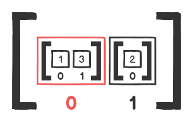
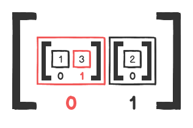
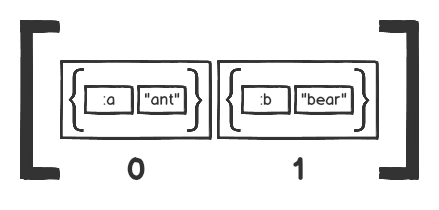

# Lesson 5: Advanced JavaScript Collections (20210901 07:30)

## Introduction

In the previous lesson, we took an in-depth look at JavaScript collections. You should now feel comfortable with what collections are on a conceptual level, as well as with working with them on a practical level, through looping and using iterative methods. If any of those areas still feel unclear, it would be a good idea to review them again before moving on.

In this lesson, we will be building on what we learned in the previous lesson and exploring some more advanced aspects of working with collections in JavaScript such as sorting, nested collections and working with callback functions.

Before you start, make sure to create a new directory for this lesson. Call it perhaps `lesson_5`, and do all your work for this lesson in that directory.

```sh
js_101          <-- this is your course 1 git repo
|
+--lesson_2     <-- all lesson 2 code goes here
|
+--lesson_3     <-- all lesson 3 code goes here
|
+--lesson_4     <-- all lesson 4 code goes here
|
+--lesson_5     <-- all lesson 5 code goes here
```

## 2. Sorting

Thus far in our explorations, we've looked at various ways to work with collections, such as iterating through them, performing selection on the collection, or performing a transformation on the elements in the collection. We've also studied several methods that can make those tasks easier.

Another way to work with collections is to sort them into some predictable sequence or order. Sorting is typically performed on arrays; since items in arrays are accessed via their index, their order in the array is important.

Strings don't have access to any built-in sorting methods. However, it is easy to convert a string into an array, sort it, and then build a new string from the result.

JavaScript objects don't maintain a set order, so there's no point in sorting them. Most JavaScript implementations order the key-value pairs of an object based on the sequence in which they were added to the object, but the specification doesn't guarantee a set order, so you should not rely on it. Since object values are accessed via their keys, there generally is no need to sort them.

### What is sorting?

Sorting is setting the order of the items in a collection according to some criteria. For example, if we look at these two arrays of numbers:

```js
[2, 11, 9, 4, 107, 21, 1]
[1, 2, 4, 9, 11, 21, 107]
```

They both contain the same numbers, but, in the second array, the sequence is different: they're sorted numerically.

Given the first array in the above example as a starting point, how can we go from that to the second array? We need a mechanism that we can use on the first array to put all the items of that array into a particular order; numerical, in this case.

With some of the other concepts we've looked at so far in this course - such as iteration, selection, and transformation - we first showed how those actions could be performed algorithmically, via the use of reasonably simple looping mechanisms. Once we did that, we moved on to look at specific methods in JavaScript that do those things for us.

Though it's possible to write sorting code manually, such code is relatively complex and is beyond the scope of what you need to know right now. (If you're curious, discussions of sorting algorithms are easy to find on the Internet.) Luckily for us, JavaScript provides the `Array.prototype.sort` method to handle this complex operation.

### Sorting in JavaScript

Comparisons are at the heart of how sorting works. Sorting algorithms must perform a comparison of some kind between the items in a collection. They use the results of the comparison to rearrange the order of the collection, eventually leading to the sorted result.

Sorting integers via numeric comparison may seem easy. For example, we all know that 2 comes after 1 in numerical order. However, the default behavior of sort doesn't perform numerical sorting. What would you expect the following code to return?

```js
[2, 11, 9, 4, 107, 21, 1].sort();
```

You'd expect it to return `[1, 2, 4, 9, 11, 21, 107]` since that's the natural order of numbers. The number `1` comes before `2`, which comes before `4`, which comes before `11`, and so on. Try it out in the node console. You may be surprised when you see the following result:

```sh
> [2, 11, 9, 4, 107, 21, 1].sort()
[ 1, 107, 11, 2, 21, 4, 9 ]
```

What on Earth is going on here? Can you see what's happening by studying the return value? Think about it for a minute or two before moving on.

JavaScript being JavaScript, it converts all the numbers to strings and compares them by their **Unicode character codes**. Thus, all the numbers that begin with `1` move to the beginning of the array, then all the numbers that begin with `2` come next, and so on. The numbers are compared digit by digit, so `1`comes before `107` which comes before `11`, which comes before `2`. Given this behavior, how would you sort numbers by their numerical value? We'll return to this question later in the assignment.

When `sort` is called without arguments, it coerces all the array elements except those that are `undefined` to their string equivalents, then sorts them using string comparisons:

```sh
> [null, 'a', true, 1].sort()
[ 1, 'a', null, true ]
```

`undefined` values are a special case when it comes to sorting. They are always placed at the end of the array no matter what the other values are:

```sh
> [undefined, 11, 'z', 'x', 'y', undefined].sort()
[ 11, 'x', 'y', 'z', undefined, undefined ]
```

#### Sorting Arrays of Strings Alphabetically

Calling `sort` on an array of characters returns an array of characters, ordered alphabetically.

```sh
> ['c', 'a', 'e', 'b', 'd'].sort()
[ 'a', 'b', 'c', 'd', 'e' ]
```

This makes sense; after all, we know that 'a' comes before 'b', which comes before 'c', and so on. Without running the code, try to figure out what would be returned here:

```js
['arc', 'bat', 'cape', 'ants', 'cap'].sort();
```

Solution

```sh
> ['arc', 'bat', 'cape', 'ants', 'cap'].sort()
[ 'ants', 'arc', 'bat', 'cap', 'cape' ]
```

When working with strings that have multiple characters, `sort` compares them character by character, so the strings beginning with `a` come before those beginning with `b`; if both characters are the same, then the next character in each string is compared, and so on. If one string is shorter than another, but equal through the length of the shorter string, then the shorter string comes before the longer one. For instance, `'cap'` is shorter than `'cape'`, so `'cap'` comes first in the result.

It's important to note that `sort` is **destructive**. It doesn't return a new array; it sorts the original array, in-place, and *returns a reference to that array*.

```js
> let vowels = ['u', 'i', 'a', 'e', 'o']
> vowels.sort()
[ 'a', 'e', 'i', 'o', 'u' ]
> vowels
[ 'a', 'e', 'i', 'o', 'u' ]
```

Often, though, we don't want to sort arrays in-place. We can *create a copy of the array* using `slice` and call the `sort` method on the copy *to avoid mutation* of the original array:

```js
> let vowels = ['u', 'i', 'a', 'e', 'o']
> vowels.slice().sort()
[ 'a', 'e', 'i', 'o', 'u' ]
> vowels
[ 'u', 'i', 'a', 'e', 'o' ]
```

`Array.prototype.sort` is an example of a function/method that has a side effect **and** returns a meaningful value at the same time, contrary to our advice to not mix side effects with meaningful return values. You can argue that that's a little deceptive; returning the sorted array might lead one to believe that it doesn't mutate the original. You'll often see such design inconsistencies in programming languages, especially JavaScript. That doesn't mean that you should emulate them -- leave breaking the rules to the experts.

#### UTF-16

Concepts like greater than, less than, and equal to are easy to understand when dealing with numbers. However, how do the operators like `<`, `>`, and `===` work with strings? The answer is that string order is determined by a character's **code point** in the UTF-16 encoding. It is the code point that determines the result when we compare one character with another using the relational operators.

If we want to compare the UTF-16 character `+` with the UTF-16 character `3`, we need to know the code point for both characters. We can use `String.prototype.charCodeAt` to determine that value, then use the results to determine the order in which the characters will be sorted.

```js
> '+'.charCodeAt()
43
> '3'.charCodeAt()
51
> '+' < '3'
true // since 43 < 51
```

You may sometimes see people talk about ASCII characters when talking about JavaScript's strings (and `sort` in particular). In fact, it *uses UTF-16*.

Here are some examples:

```js
> 'A' < 'a' // 65 < 97
true
> 'Z' < 'a' // 90 < 97
true
> '!' < 'A' // 33 < 65
true
```

You don't need to memorize the UTF-16 code points, nor do you need to memorize the ASCII table. However, when comparing or sorting strings, it's essential to know how they are ordered and roughly what that order is. Some useful rules to remember are:

* Uppercase letters come *before* lowercase letters (sometimes called **ASCIIbetical** order, but that is imprecise when talking about UTF-16 code points).
* Digits and most punctuation *come before* letters.
* There are several punctuation characters between the uppercase and lowercase letters, and several more that come after all of the letters.
* There is an extended ASCII table that contains accented and other characters - this comes after the main ASCII table.
* All other UTF-16 characters come after the extended ASCII table and have a code point of at least 256.

#### Generic Sorting

Let's go back to our original question. How can we sort the following array numerically?

```js
[2, 11, 9, 4, 107, 21, 1] // sorted result: [ 1, 2, 4, 9, 11, 21, 107 ]
```

The default behavior of `sort` is no help since it converts all numbers to strings before comparing them. The answer lies in the fact that `sort` takes an optional callback argument. The return value of that callback determines the final sequence produced by the sort:

```js
[2, 11, 9, 4, 107, 21, 1].sort((a, b) => {
  if (a < b) {
    return -1;
  } else if (a > b) {
    return 1;
  } else {
    return 0;
  }
}); // => [ 1, 2, 4, 9, 11, 21, 107 ]
```

Some explanation is in order here. The `sort` method iterates over our array and supplies our callback function with two elements each time. It arranges the relative positions of the two elements using the following rules:

1. If the callback returns a number less than `0`, place `a` before `b`.
2. If the callback returns a number greater than `0` place `b` before `a`.
3. If the callback returns `0`, leave the relative positions of `a` and `b` unchanged.

Let's use the first two numbers in the array, `2` and `11`, as an example. When our callback function gets invoked for the first time, `a` will be `2` and `b` will be `11`. Since `a < b`, our callback returns -1, and, therefore, 2 will be placed before 11 in the sorted array. The same comparison gets performed for each pair of numbers, and the result is an array of numbers sorted in ascending order.

Our callback function can be simplified a bit. We know that we want to return a negative number when `a < b` and a positive number when `a > b`. Looking at our logic, we can easily replace the whole `if/else` conditional with `return a - b;`:

```js
[2, 11, 9, 4, 107, 21, 1].sort((a, b) => a - b);
```

That's a little less clear, but not extraordinarily so, and it removes some code clutter, so many developers think the tradeoff is worth the slight reduction in clarity.

Suppose we want to sort our array in descending order; that is, by decreasing numeric value. All we have to do is flip the logic of our callback:

```js
[2, 11, 9, 4, 107, 21, 1].sort((a, b) => {
  if (a > b) {
    return -1;
  } else if (a < b) {
    return 1;
  } else {
    return 0;
  }
}); // => [ 107, 21, 11, 9, 4, 2, 1 ]
```

Or more succinctly:

```js
[2, 11, 9, 4, 107, 21, 1].sort((a, b) => b - a);
```

You are allowed to write additional code in the block, as long as the block returns a number.

```js
[2, 11, 9, 4, 107, 21, 1].sort((a, b) => {
  console.log(`a is ${a} and b is ${b}`);
  return a - b;
});

// a is 11 and b is 9
// a is 2 and b is 9
// a is 11 and b is 4
// a is 9 and b is 4
// a is 2 and b is 4
// a is 11 and b is 107
// a is 107 and b is 21
// a is 11 and b is 21
// a is 107 and b is 1
// a is 21 and b is 1
// a is 11 and b is 1
// a is 9 and b is 1
// a is 4 and b is 1
// a is 2 and b is 1
// => [ 1, 2, 4, 9, 11, 21, 107 ]
```

If you study the above output, you can see that the algorithm that `sort` uses doesn't compare every possible pair of values. If you need every possible pair, don't rely on `sort` to give it to you.

It's also worth noting that your JavaScript engine may not produce the exact same output, though the end result may be the same. The JavaScript standards don't specify the algorithm that `sort` must use, just that it should properly order the array. As a result, different implementations of `sort` compare elements in different ways.

How would you sort the following array by the lengths of each word?

```js
let words = ['go', 'ahead', 'and' 'jump'];
```

Solution

```js
words.sort((a, b) => {
  if (a.length < b.length) {
    return -1;
  } else if (a.length > b.length) {
    return 1;
  } else {
    return 0;
  }
}); // => [ 'go', 'and', 'jump', 'ahead' ]
```

```js
words.sort((a, b) => a.length - b.length);
```

Using a callback to sort collections lets us sort all kinds of values in a variety of ways. Take the following nested array, for example:

```js
let scores = [[3, 6, 4], [6, 8, 9], [1, 4, 2]];
```

Let's give it a shot:

```js
let scores = [[3, 6, 4], [6, 8, 9], [1, 4, 2]];
scores.sort((a, b) => {
  let totalAScore = a.reduce((number, next) => number + next);
  let totalBScore = b.reduce((number, next) => number + next);

  return totalAScore - totalBScore;
});
```

Here, `a` and `b` will be assigned to the subarrays. We use `Array.prototype.reduce` to find the sum of all three scores in the subarrays, then return their difference, which will be used to sort our arrays.

Using `a` and `b` parameters in a callback function for `sort` is a common convention, even though it conflicts with the style rules that say you shouldn't use single-character variable names. Our `.eslintrc.yml` file explicitly tells ESLint to allow these two variable names, but it lets ESLint complain about most others. Even so, you should only use `a` and `b` for comparison callbacks.

### Sorting Summary

In this assignment, we've looked at sorting as another way that we can work with collections. Sorting is complicated to perform algorithmically, but we can use the built-in `Array.prototype.sort` method to handle that complex work for us. At this point, you should understand the concept of sorting and be comfortable using the `sort` method that JavaScript arrays provide.

20210902 13:46 Assignment complete.

## 3. Nested Data Structures

It's not uncommon for collections to contain other collections. Let's explore a few examples which illustrate how to work with nested data structures.

### Reference collection elements

```js
let arr = [[1, 3], [2]];
```

In this example, we have one array that contains two separate arrays: [1, 3] and [2]. Each inner array still has its own index even though they're both inside another array.


Each inner array can be accessed in the same way that you'd access any other array element; the trick is to remember that it's another collection you're referencing. Let's retrieve the first inner array like we typically reference array elements.

```js
arr[0]; // => [1, 3]
```



With access to the first array, let's dig into the inner array and retrieve its second element -- the integer `3`. To access that element, we need to reference it, chaining our element references.

```js
arr[0][1]; // => 3
```



### Updating collection elements

Recall that JavaScript gives us a very convenient way to update array elements.

```js
let arr = [[1, 3], [2]];
arr[1] = 'hi there';
arr; // => [ [1, 3 ], 'hi there' ]
```

The `arr[1] = 'hi there'` is a **destructive** action that permanently changed the second element in the `arr` array; it replaced the entire `[2]` inner array with the string `'hi there'`.

Likewise, we can modify a value in a nested array in a similar way.

```js
let arr = [[1, 3], [2]];
arr[0][1] = 5;
```

There's a lot going on in that second line, so let's unpack it. It looks like a chained reference, similar to what we saw before. However, it's not. The first part, `arr[0]`, is an element reference that returns the inner array `[1, 3]`. The second part, `[1] = 5`, is the same as `[1, 3][1] = 5`, which is an array element assignment, not a reference. The code `[1, 3][1] = 5` says "change the second element in the array `[1, 3] to 5`". As we saw above, this is a destructive action, so the change is permanent. Thus, it's a chained action, but t*he first part of that chain is element reference*, while t*he second part of that chain is element assignment*.

The first inner array is now permanently changed: the first inner array's second element is changed to 5 from the previous value of 3:

```js
arr; // => [ [ 1, 5], [ 2 ] ]
```

Before moving on, let's learn how to insert an additional element into an inner array. The idea is similar to the above example: we have to chain an element reference with appending an element.

```js
let arr = [[1], [2]];

arr[0].push(3);
arr; // => [ [1, 3], [2] ]
```

The code `arr[0].push(3)` is again a two-part chain: the first part, `arr[0]` is element reference and returns `[1]`; and the second part can be thought of as `[1].push(3)`, which destructively appends 3 into the inner array.

We can also add another array instead of an integer:

```js
let arr = [[1,], [2]];

arr[0].push([3])
arr; // => [ [ 1 , [ 3 ] ], [ 2 ] ]
```

That leaves us with a three-layer nested data structure.

### Other nested structures

Arrays aren't the only data structure that can be nested. Objects can be nested within an array as well. Let's study a simple example of that.

```js
[{ a: 'ant' }, { b: 'bear' }]
```



Let's suppose we want to insert a new key/value pair into the first inner object. Once again, there has to be a two-step process: first, reference the first element in the array; next, update the object.

```js
let arr = [{ a: 'ant' }, { b: 'bear' }];

arr[0]['c'] = 'cat';
arr[0].d = 'dog';
arr; // => [{ a: 'ant', c: 'cat', d: 'dog' }, { b: 'bear' }]
```

Hopefully, you can recognize the pattern by now. First we use `arr[0]` to retrieve the first inner object, so we get `{ a: 'ant' }`. Next, we use the normal object key/value creation syntax to create a new key/value pair: `{ a: 'ant' }['c'] = 'cat'` or `{ a: 'ant' }.d = 'dog'`. The change is **destructive**, so the array, `arr`, reflects the change when we inspect it.

As we know, arrays can contain any JavaScript value, regardless of type. Arrays can hold multiple different objects at the same time, including nested data structures. Let's take a look at an example and *retrieve* a few elements from it.

```js
let arr = [['a', ['b']], { b: 'bear', c: 'cat' }, 'cab'];

arr[0]; // => ['a', ['b']]
arr[0][1][0]; // => 'b'
arr[1]; // => { b: 'bear', c: 'cat' }
arr[1]['b']; // => 'bear'
arr[1].b[1]; // => 'e'
arr[2][1]; // => 'a'
```

### Variable reference for nested collections

A common confusing aspect when working with nested collections occurs when variables reference inner collections. Let's study some code.

```js
let a = [1, 3];
let b = [2];
let arr = [a, b];
arr // => [[ 1, 3 ], [2] ]
```

The variables `a` and `b` are pointing to Array objects. When we create an array that uses these variables to specify elements, the result looks as if we've actually added the arrays to the array. However, we've *only added references to those arrays*. To see how this affects things, let's consider some examples.

First, what happens if we modify `a` after placing it in `arr`?

```js
let a = [1, 3];
let b = [2];
let arr = [a, b];

arr; // => [ [1, 3 ], [2] ]

a[1] = 5;
arr; // => [ 1, 5 ], [ 2 ]
```

Did that do what you expected? Is it intuitive that `arr` was also changed? The value of `arr` changed because `a` still points to the same Array object that's in `arr`. When we modified it by replacing `3` with `5`, we were modifying the Array object.

Take a moment to study the following diagram to establish a mental model of variables pointing to objects.


What if we modify the first array in `arr`? Is it different than modifying `a` directly?

```js
arr[0][1] = 8;
arr; // => [ [ 1, 8 ], [ 2 ] ]
a;   // => [ 1, 8 ]
```

It produces the same result as modifying `a` directly. Why is that? In both cases, we're modifying the object that `a` and `arr[0]` point to; we now have two ways to reference the same object. In the first example, the object was modified through `a`. In the second example, the object was modified through `arr[0]`.

As can be seen in the diagram below, `a` and `arr[0]` are, in fact, two different ways to reference the same object. The assignment `arr[0][1] = 8` is equivalent to `a[1] = 8`.


It's essential to understand variables as pointers, as this is a fundamental concept. If you need to gain a clearer understanding, now would be a good time to go back to the Introduction to JavaScript book and re-read the [Variables as Pointers](https://github.com/hyosung11/Launch-School/blob/main/Courses/JS101/Lesson-4-JavaScript-Collections/notes.md) section.

### Shallow Copy

Sometimes, you may find that you need to copy an entire collection, perhaps to save the original collection before performing some modifications. There are different ways to copy different kinds of collections. In this section, we'll discuss how to shallow copy objects and arrays.

#### Shallow Copying Arrays

One way to copy an array is to use the `Array.prototype.slice()` method without arguments:

```js
let arr = ['a', 'b', 'c'];
let copyOfArr = arr.slice();
copyOfArr; // => [ 'a', 'b', 'c' ];
```

A more modern way is to use the ES6 **spread syntax**, which uses `...` to expand an array to a list of values:

```js
let arr = ['a', 'b', 'c'];
let copyOfArr = [...arr];
copyOfArr; // => [ 'a', 'b', 'c' ];
```

Let's verify that the new arrays are in fact copies of the original arrays and not the same arrays.

```js
let arr = ['a', 'b', 'c'];
let copyOfArr = [...arr];

copyOfArr.push('d');

arr;       // => [ 'a', 'b', 'c' ]
copyOfArr; // => [ 'a', 'b', 'c', 'd' ]
```

You can do the same with the copy created by using `slice`. Both techniques create a shallow copy of an array: only the top level array is copied. When the array contains other objects, like a nested array, then those objects are shared, not copied. That has major ramifications for nested collections:

```js
let arr = [['a'], ['b'], ['c']];
let copyOfArr = arr.slice();

copyOfArr[1].push('d');

arr;       // => [ [ 'a' ], [ 'b', 'd' ], [ 'c' ] ]
copyOfArr; // => [ [ 'a' ], [ 'b', 'd' ], [ 'c' ] ]
```

You may have noticed that both `arr` and `copyOfArr` were changed. That might not fit with how you assumed that an array copy should behave.

It's important to understand that this behavior occurs because the destructive method `push` was called on a shared array object, `['b']`, rather than a separate array. When you mutate a shared object in an array or other collection, it is the shared object you are affecting rather than the collection.

Let's try that with plain objects nested within an array:

```js
let arr = [{ a: 'foo' }, { b: 'bar' }, { c: 'baz' }];
let copyOfArr = [...arr];

copyOfArr[1].d = 'qux';

arr;       // => [ { a: 'foo' }, { b: 'bar', d: 'qux' }, { c: 'baz' } ]
copyOfArr; // => [ { a: 'foo' }, { b: 'bar', d: 'qux' }, { c: 'baz' } ]
```

The critical thing to be aware of is what level you're working at, especially when working with nested collections and using variables as pointers. Are you working at the level of an outer array or object or at the level of an object within that?

#### Shallow Copying Objects

We've previously seen that the `Object.assign` method can be used to copy properties of one or more objects into another:

```js
let obj1 = { a: 'foo' };
let obj2 = { b: 'bar' };

Object.assign(obj1, obj2); // => { a: 'foo', b: 'bar' }
obj1;                      // => { a: 'foo', b: 'bar' }
```

As you can see, `Object.assign` copies over the properties from `obj2` into `obj1` and returns `obj1`. You might be able to see that we can use `Object.assign` to create a copy of an object by providing an empty object as the first argument:

```js
let obj = { a: 'foo', b: 'bar' };
let copyOfObj = Object.assign({}, obj);

copyOfObj; // => { a: 'foo', b: 'bar' }
```

To verify that it's indeed a copy, we can modify the copy and check whether the original is affected by the modification.

```js
copyOfObj['c'] = 'baz';
copyOfObj; // => { a: 'foo', b: 'bar', c: 'baz' }
obj;       // => { a: 'foo', b: 'bar' }
```

Note that `Object.assign` only creates a shallow copy of the object. That is, changes to nested objects within the copy will be reflected in the original:

```js
let obj = { a: { b: 'foo' }, c: ['bar'] };
let copyOfObj = Object.assign({}, obj);

obj['a']['d'] = 'baz';
copyOfObj; // => { a: { b: 'foo', d: 'baz' }, c: [ 'bar' ] }
obj;       // => { a: { b: 'foo', d: 'baz' }, c: [ 'bar' ] }
```

### Deep Copy

JavaScript doesn't have an explicit method or function for deep copying objects, but there is an indirect way to do it. However, it only works with nested arrays and plain objects. Objects that have methods and complex objects like dates or custom objects cannot be deep-cloned with this technique. Most use cases of deep copying objects involve only plain objects and arrays, so this technique is useful to learn:

```js
let arr = [{ b: 'foo' }, ['bar']];
let serializedArr = JSON.stringify(arr);
let deepCopiedArr = JSON.parse(serializedArr);
```

The `JSON.stringify` method **serializes** any object, including arrays, that only have primitives, arrays, and plain objects as elements. Serializing involves converting an object to a string form that can be subsequently converted back into an identical object. The `JSON.parse` method performs that conversion from a string back to an object.

To verify that this is indeed a deep copy, we'll modify the second element of the `deepCopiedArr` array, which itself is an array. If the modification doesn't show in the original `arr`, we can conclude that it's a deep copy:

```js
deepCopiedArr[1].push('baz');
deepCopiedArr; // => [ { b: 'foo' }, [ 'bar', 'baz' ] ]
arr;           // => [ { b: 'foo' }, [ 'bar' ] ]
```

Sure enough, modifying the nested array within `deepCopiedArr` doesn't modify the nested array inside `arr`.

### Freezing Objects

Another example of an operation not affecting objects nested within objects is the operation of freezing objects. What is freezing? In JavaScript, objects can be frozen using the `Object.freeze` method. The method prevents objects (including arrays) from being modified.

```js
let obj = Object.freeze({ a: 'foo' });
let arr = Object.freeze(['a', 'b', 'c']);

obj['b'] = 'bar';
obj; // => { a: 'foo' }

obj.c = 'ccc';
obj; // => { a: 'foo' }

arr[3] = 'x';
arr; // => [ 'a', 'b', 'c' ]

arr.push('d'); // => TypeError: Cannot add property 3, object is not extensible
```

In each case, we can't modify the object once it's frozen. Interestingly, trying to use a method to mutate a frozen object raises an exception. However, if we try to use assignment, the assignment fails silently. Another one of those JavaScript quirks!

Only objects can be frozen with `Object.freeze`. Primitive values are already frozen.

We can check whether an object is frozen with the `Object.isFrozen` method:

```js
Object.isFrozen('abc'); // => true
```

What, exactly, does `Object.freeze` freeze? It only freezes the object that is passed to it. If the object passed to it contains other objects, those objects won't be frozen. For example, if we have a nested array, the nested objects can still be modified after passing it to `Object.freeze`.

```js
let arr = Object.freeze([[1], [2], [3]]);
arr[2].push(4);
arr; // =>  [ [ 1 ], [ 2 ], [ 3, 4 ] ]
```

This behavior also applies to objects within arrays, objects within objects and arrays within objects.

In JavaScript, there's no built-in function or an easy workaround to deep-freeze objects.

### Nested Data Structures Summary

By taking the time to learn how nested data structures work, and what it means to copy an object, we're further able to clarify our understanding of collections and how to work with them. The deeper our knowledge is of a concept, the easier it is to implement solutions using that concept.

In this assignment, we looked at examples that illustrated how nested data structures work and the syntax needed to manipulate them as needed. We also looked at how to copy an object and what freezing means. At this point, you should have a clear understanding of how to work with collections. You should be comfortable with complicated data structures and how to manipulate them to fit your needs. In the next assignment, we'll look at combining the concepts we've learned so far in this lesson.

20210903 19:16 Assignment complete.

## Working with Callback Functions

In the last two lessons, we've looked at a variety of fundamental concepts related to working with collections, such as iterating, selecting, transforming, sorting, nested collections, and using callbacks. In this assignment, we'll focus on combining all of these concepts, while taking the time to understand fully how each component works. Take your time to analyze each example in this assignment. An example may look very easy or hard, but it probably requires roughly the same effort to understand if you focus on the right details. The goal is to have a deep understanding of how each detail works, not to complete this assignment as fast as possible.

Before we look at some examples, let's talk about higher order functions.

### Functions as First-Class Objects and Higher Order Functions

In most computer languages, the term **first-class value** or **first-class object** is used to describe values that meet the following conditions:

* They can be assigned to a variable or an element of a data structure (such as an array or object).
* They can be passed as an argument to a function.
* They can be returned as the return value of a function.

Clearly, in JavaScript, primitive values, arrays, and objects all meet this criteria. What you might not realize is that functions also do. Not only can you invoke functions, but you can also pass them around your program like any other value. If JavaScript is your first language, this might not be a big revelation. However, if you have prior experience with some other languages, it may come as a surprise. Since functions can be treated as values, we can create functions that can take other functions as arguments and return other functions. That, in turn, allows for a more declarative and expressive style of programming.

We'll sometimes refer to JavaScript functions as **first-class functions** to distinguish them from functions in other languages where functions are not first-class objects.

For example, let's compare a transformation operation that uses a for loop to a transformation performed that uses map. Our program will transform an array of numbers by squaring every number in the array. First, here it is with a for loop:

```js
// for loop transformation
let numbers = [1, 2, 3, 4, 5];
let transformedNumbers = [];

for (let index = 0; index < numbers.length; index += 1) {
  let currentNum = numbers[index];
  let squaredNum = currentNum * currentNum;

  transformedNumbers.push(squaredNum);
}

transformedNumbers; // => [ 1, 4, 9, 16, 25 ]
```

Now, here's the same operation using `Array.prototype.map`:

```js
// map transformation
let numbers = [1, 2, 3, 4, 5];
let transformedNumbers = numbers.map(currentNum => currentNum * currentNum);

transformedNumbers; // => [1, 4, 9, 15, 25]
```

As you can see, there is a dramatic difference between the styles in these two snippets. The first one uses what we call an **imperative** approach. It's called imperative since you're telling the interpreter what to do each step of the way:

* Declare and initialize an empty `transformedNumbers` array.
* Declare a counter.
* Increment a counter.
* Assign the element at the `index` to `currentNum`.
* Compute the square of `currentNum` and assign it to `squaredNum`.
* Append the squared number to the end of the `transformedNumbers` array.

The second approach, on the other hand, uses what we call a **declarative** approach. We're declaring what we need to do with the `numbers` array by saying "We want to map each element of the array to the return value of passing that element to the given callback function."

This declarative style of programming is possible only because we can treat functions as values. The `map` method takes a function as an argument and calls it for each element of the array used to call `map`. Functions that take other functions as arguments are called **Higher Order Functions**, as are functions that return other functions. In this assignment, we'll focus on array methods that take functions as arguments. In the JavaScript world, functions that we pass to other functions are often called **callback functions** or, more simply, **callbacks**.

We'll now take a look at a few examples of methods that take callbacks and analyze each component in depth:

### Example 1

Take a moment to digest this example:

```js
[[1, 2], [3, 4]].forEach(arr => console.log(arr[0]));
// 1
// 3
// => undefined
```

What's happening in this seemingly-simple piece of code? Take it apart and try to describe every interaction with precision.

First, notice that we're calling `Array.prototype.forEach` with a callback function:

```js
arr => console.log(arr[0])
```

That means that `Array.prototype.forEach` is a higher order function - we can pass another function (the callback) to `forEach` as an argument.

We use the multi-dimensional array `[[1, 2], [3, 4]]` to call `forEach`. Each inner array is passed to the callback, in turn, and assigned to the parameter `arr`. We then use the element reference operator, `[]`, to get the value at index `0` of the array. On the first invocation of the callback, `arr[0]` returns `1`, and on the second, it returns `3`. In each invocation, `console.log` outputs a string representation of the value returned by `arr[0]`. Since this is a single statement callback, the callback's return value is the return value of `console.log(arr[0])`, which is `undefined`. `forEach` doesn't do anything with that returned value though. Finally, no matter what the callback returns, `forEach` always returns `undefined`.

A lot is going on in just one line of code! It isn't easy to parse all of that in your head at once, and this is a relatively simple example. We'll examine some much more complex ones later. It can be helpful to map things out visually to keep track of what is happening. Let's try it.

The technique we're about to show is designed to help you break down code in a way that makes it easier to understand. It can be very helpful when you're first learning to deal with iterative code and callbacks. As such, it's an informal process, much like pseudocode. We don't expect you produce the exact same results we do, but you should be able perform some sort of analysis that helps you understand the code.

What specific pieces of information should we track, then? When evaluating code like this, ask the following questions:

* What type of action is being performed? Method call? Callback? Conditional? Something else?
* On what value is that action performed?
* What is the side-effect of that action (e.g., output or destructive action)?
* What is the return value of that action?
* Is the return value used by whatever instigated the action?

We can take these pieces of information and set them out in a tabular format:

Action  | Performed on  | Side Effect  | Return Value  | Is Return Value Used?
--------|---------------|--------------|---------------|----------------------
method call (`forEach`)  | the outer array  | None  | `undefined`  | No, but shown on line 4
callback execution  | Each sub-array  | None  | `undefined`  | No
element reference (`[0]`)  | Each sub-array  | None  | Element at index 0 of sub-array  | Yes, used by `console.log`
method call (`console.log`)  | Element at index `0` of the sub-array  | Outputs string representation of a Number  | `undefined`  | Yes, used to determine callback's return value

### Example 2

```js
[[1, 2], [3, 4]].map(arr => console.log(arr[0]));
// 1
// 3
// => [undefined, undefined]
```

This example is similar to the previous one, but with one small variation: `forEach` is replaced with `map`. At first, this may seem insignificant, but when you take a closer look, you'll notice the return value of the `map` call is significantly different.

Let's break down this example to see if we can understand the difference:

Action  | Performed on  | Side Effect  | Return Value  | Is Return Value Used?
--------|---------------|--------------|---------------|----------------------
method call (`map`)  | The outer array  | None  | New array (`[undefined, undefined]`)  | No, but shown on line 4
callback execution  | Each sub-array  | None  | `undefined`  | Yes, used by `map` for transformation
element access (`[0]`)  | Each sub-array  | None  | Element at index 0 of sub-array  | Yes, used by `console.log`
method call (`console.log`)  | Element at index 0 of each sub-array  | Outputs a string representation of an Integer  | `undefined`  | Yes, used as the return value of the callback

The new return value is a result of how `map` handles the return value of the callback. Unlike `forEach`, `map` uses the return value of the callback to perform a transformation. Thus, the return value of the callback is critical to understanding this code.

### Example 3

Let's mix it up a little and have you try taking apart an example on your own.

```js
[[1, 2], [3, 4]].map(arr => {
  console.log([arr[0]]);
  return arr[0];
});
```

Map out a detailed breakdown for this example using an approach similar to the previous two. What do you think will be returned and what will the side-effects be? You shouldn't have to guess. While there isn't a single right way to break this code down, you should be able to identify all of the different parts like we did above. You have all the knowledge you need. Take your time and analyze the code as completely as you can. Compare your solution to our solution.

Solution

This example outputs and returns the following:

```js
1
3
=> [1, 3]
```

When breaking down the example, pay close attention to:

* The return value of the callback
* The return value of the method
* Any side-effects

Use the following table to gauge the depth you should be thinking at when breaking down this code:

Action  | Performed on  | Side Effect  | Return Value  | Is Return Value Used?
--------|---------------|--------------|---------------|----------------------
method call (`map`)  | The outer array  | None  | New array (`[1, 3]`)  | No
callback execution  | Each sub-array  | None  | Number at index 0 of sub-array | Yes, used by `map` for transformation
element reference (`[0]`)  | Each sub-array  | None  | Element at index 0 of sub-array  | Yes, used by `console.log`
method call (`console.log`)  | Element at index `0` of each sub-array  | Outputs string representation of a Number | `undefined`  | No
element reference (`[0]`) | Each sub-array | None | Element at Index 0 of sub-array | Yes, explicitly returned by callback

The main difference to understand here is the return value of the callback: we're explicitly returning the first element of each subarray with return. The callback's return value is then used by map to perform the transformation, replacing the inner array with a number. Finally, map returns a new array with two numbers in it.

Note that the following slight change to our callback again results in map returning `[undefined, undefined]`.

```js
[[1, 2], [3, 4]].map(arr => {
  console.log(arr[0]);
  arr[0];
});

// 1
// 3
// => [undefined, undefined]
```

We removed the explicit `return` from the last line in the callback function. As we know, when using callbacks with curly braces, we must explicitly return values. Even though the `arr[0]` element reference returns a number, the callback returns `undefined` since the callback doesn't explicitly return the number.

Remember: your solution doesn't need to be precisely the same as ours. However, make sure that you fully understand the code, and that you didn't leave out any essential details.

### Example 4

Here's another example.

```js
let myArr = [[18, 7], [3, 12]].forEach(arr => {
  return arr.map(num => {
    if (num > 5) {
      return console.log(num)
    }
  });
});
```

Can you take this code apart, just like before? What will it output and what will the value of myArr be? Check the solution below once you have tried this on your own.

Solution

This code outputs 18, 7, 12. The value of `myArr` will be undefined.

### Example 5

### Example 6

### Example 7

### Example 8

### Example 9

### Working with Callback Functions Summary

The goal of this assignment is to give you the tools to deconstruct and analyze code dealing with collections. Working with collections is a core task of most problems, so it's common to come across code that's iterating, selecting and transforming nested data structures. To the untrained eye, it can seem like a jumbled mess, and there's no way anyone can understand it without running the code to "see if it works." The trained practitioner, however, can adopt an engineering mindset and take the code apart, line by line, letter by letter.

At this point, you should be very comfortable with loops and iterative methods, and using them to work with collections. You should also be comfortable with data structures and manipulating them to fit your needs. Combine that knowledge with practice, and you'll be able to understand more complex problems like the ones in this assignment.

Some important things to remember:

* If, at first, the code appears opaque or complex, take the time to break it down step by step.
* If necessary, use a systematic approach, such as the tabular method outlined in this assignment.
* Figure out what is happening at each step, paying particular attention to:
  * The return value
  * Side effects

* Pay attention to the return values of all expressions in your code, especially where implicit return values are used.
* Make sure you have a clear understanding of the underlying concepts such as data structures, loops, iterative methods, and the callback functions passed to them.
* Be clear about the implementation of the iterative method(s) being used, particularly:
  * What values are passed to the callback?
  * What does the method do with the return value of the callback?

* If you're unclear about how a method works, a good first step is to refer to the MDN Docs.
