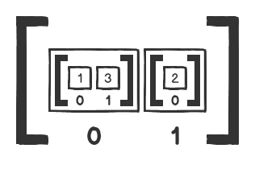

# Lesson 5: Advanced JavaScript Collections (20210901 07:30)

## Introduction

In the previous lesson, we took an in-depth look at JavaScript collections. You should now feel comfortable with what collections are on a conceptual level, as well as with working with them on a practical level, through looping and using iterative methods. If any of those areas still feel unclear, it would be a good idea to review them again before moving on.

In this lesson, we will be building on what we learned in the previous lesson and exploring some more advanced aspects of working with collections in JavaScript such as sorting, nested collections and working with callback functions.

Before you start, make sure to create a new directory for this lesson. Call it perhaps `lesson_5`, and do all your work for this lesson in that directory.

```sh
js_101          <-- this is your course 1 git repo
|
+--lesson_2     <-- all lesson 2 code goes here
|
+--lesson_3     <-- all lesson 3 code goes here
|
+--lesson_4     <-- all lesson 4 code goes here
|
+--lesson_5     <-- all lesson 5 code goes here
```

## 2. Sorting

Thus far in our explorations, we've looked at various ways to work with collections, such as iterating through them, performing selection on the collection, or performing a transformation on the elements in the collection. We've also studied several methods that can make those tasks easier.

Another way to work with collections is to sort them into some predictable sequence or order. Sorting is typically performed on arrays; since items in arrays are accessed via their index, their order in the array is important.

Strings don't have access to any built-in sorting methods. However, it is easy to convert a string into an array, sort it, and then build a new string from the result.

JavaScript objects don't maintain a set order, so there's no point in sorting them. Most JavaScript implementations order the key-value pairs of an object based on the sequence in which they were added to the object, but the specification doesn't guarantee a set order, so you should not rely on it. Since object values are accessed via their keys, there generally is no need to sort them.

### What is sorting?

Sorting is setting the order of the items in a collection according to some criteria. For example, if we look at these two arrays of numbers:

```js
[2, 11, 9, 4, 107, 21, 1]
[1, 2, 4, 9, 11, 21, 107]
```

They both contain the same numbers, but, in the second array, the sequence is different: they're sorted numerically.

Given the first array in the above example as a starting point, how can we go from that to the second array? We need a mechanism that we can use on the first array to put all the items of that array into a particular order; numerical, in this case.

With some of the other concepts we've looked at so far in this course - such as iteration, selection, and transformation - we first showed how those actions could be performed algorithmically, via the use of reasonably simple looping mechanisms. Once we did that, we moved on to look at specific methods in JavaScript that do those things for us.

Though it's possible to write sorting code manually, such code is relatively complex and is beyond the scope of what you need to know right now. (If you're curious, discussions of sorting algorithms are easy to find on the Internet.) Luckily for us, JavaScript provides the `Array.prototype.sort` method to handle this complex operation.

### Sorting in JavaScript

Comparisons are at the heart of how sorting works. Sorting algorithms must perform a comparison of some kind between the items in a collection. They use the results of the comparison to rearrange the order of the collection, eventually leading to the sorted result.

Sorting integers via numeric comparison may seem easy. For example, we all know that 2 comes after 1 in numerical order. However, the default behavior of sort doesn't perform numerical sorting. What would you expect the following code to return?

```js
[2, 11, 9, 4, 107, 21, 1].sort();
```

You'd expect it to return `[1, 2, 4, 9, 11, 21, 107]` since that's the natural order of numbers. The number `1` comes before `2`, which comes before `4`, which comes before `11`, and so on. Try it out in the node console. You may be surprised when you see the following result:

```sh
> [2, 11, 9, 4, 107, 21, 1].sort()
[ 1, 107, 11, 2, 21, 4, 9 ]
```

What on Earth is going on here? Can you see what's happening by studying the return value? Think about it for a minute or two before moving on.

JavaScript being JavaScript, it converts all the numbers to strings and compares them by their **Unicode character codes**. Thus, all the numbers that begin with `1` move to the beginning of the array, then all the numbers that begin with `2` come next, and so on. The numbers are compared digit by digit, so `1`comes before `107` which comes before `11`, which comes before `2`. Given this behavior, how would you sort numbers by their numerical value? We'll return to this question later in the assignment.

When `sort` is called without arguments, it coerces all the array elements except those that are `undefined` to their string equivalents, then sorts them using string comparisons:

```sh
> [null, 'a', true, 1].sort()
[ 1, 'a', null, true ]
```

`undefined` values are a special case when it comes to sorting. They are always placed at the end of the array no matter what the other values are:

```sh
> [undefined, 11, 'z', 'x', 'y', undefined].sort()
[ 11, 'x', 'y', 'z', undefined, undefined ]
```

#### Sorting Arrays of Strings Alphabetically

Calling `sort` on an array of characters returns an array of characters, ordered alphabetically.

```sh
> ['c', 'a', 'e', 'b', 'd'].sort()
[ 'a', 'b', 'c', 'd', 'e' ]
```

This makes sense; after all, we know that 'a' comes before 'b', which comes before 'c', and so on. Without running the code, try to figure out what would be returned here:

```js
['arc', 'bat', 'cape', 'ants', 'cap'].sort();
```

Solution

```sh
> ['arc', 'bat', 'cape', 'ants', 'cap'].sort()
[ 'ants', 'arc', 'bat', 'cap', 'cape' ]
```

When working with strings that have multiple characters, `sort` compares them character by character, so the strings beginning with `a` come before those beginning with `b`; if both characters are the same, then the next character in each string is compared, and so on. If one string is shorter than another, but equal through the length of the shorter string, then the shorter string comes before the longer one. For instance, `'cap'` is shorter than `'cape'`, so `'cap'` comes first in the result.

It's important to note that `sort` is **destructive**. It doesn't return a new array; it sorts the original array, in-place, and *returns a reference to that array*.

```js
> let vowels = ['u', 'i', 'a', 'e', 'o']
> vowels.sort()
[ 'a', 'e', 'i', 'o', 'u' ]
> vowels
[ 'a', 'e', 'i', 'o', 'u' ]
```

Often, though, we don't want to sort arrays in-place. We can *create a copy of the array* using `slice` and call the `sort` method on the copy *to avoid mutation* of the original array:

```js
> let vowels = ['u', 'i', 'a', 'e', 'o']
> vowels.slice().sort()
[ 'a', 'e', 'i', 'o', 'u' ]
> vowels
[ 'u', 'i', 'a', 'e', 'o' ]
```

`Array.prototype.sort` is an example of a function/method that has a side effect **and** returns a meaningful value at the same time, contrary to our advice to not mix side effects with meaningful return values. You can argue that that's a little deceptive; returning the sorted array might lead one to believe that it doesn't mutate the original. You'll often see such design inconsistencies in programming languages, especially JavaScript. That doesn't mean that you should emulate them -- leave breaking the rules to the experts.

#### UTF-16

Concepts like greater than, less than, and equal to are easy to understand when dealing with numbers. However, how do the operators like `<`, `>`, and `===` work with strings? The answer is that string order is determined by a character's **code point** in the UTF-16 encoding. It is the code point that determines the result when we compare one character with another using the relational operators.

If we want to compare the UTF-16 character `+` with the UTF-16 character `3`, we need to know the code point for both characters. We can use `String.prototype.charCodeAt` to determine that value, then use the results to determine the order in which the characters will be sorted.

```js
> '+'.charCodeAt()
43
> '3'.charCodeAt()
51
> '+' < '3'
true // since 43 < 51
```

You may sometimes see people talk about ASCII characters when talking about JavaScript's strings (and `sort` in particular). In fact, it *uses UTF-16*.

Here are some examples:

```js
> 'A' < 'a' // 65 < 97
true
> 'Z' < 'a' // 90 < 97
true
> '!' < 'A' // 33 < 65
true
```

You don't need to memorize the UTF-16 code points, nor do you need to memorize the ASCII table. However, when comparing or sorting strings, it's essential to know how they are ordered and roughly what that order is. Some useful rules to remember are:

* Uppercase letters come *before* lowercase letters (sometimes called **ASCIIbetical** order, but that is imprecise when talking about UTF-16 code points).
* Digits and most punctuation *come before* letters.
* There are several punctuation characters between the uppercase and lowercase letters, and several more that come after all of the letters.
* There is an extended ASCII table that contains accented and other characters - this comes after the main ASCII table.
* All other UTF-16 characters come after the extended ASCII table and have a code point of at least 256.

#### Generic Sorting

Let's go back to our original question. How can we sort the following array numerically?

```js
[2, 11, 9, 4, 107, 21, 1] // sorted result: [ 1, 2, 4, 9, 11, 21, 107 ]
```

The default behavior of `sort` is no help since it converts all numbers to strings before comparing them. The answer lies in the fact that `sort` takes an optional callback argument. The return value of that callback determines the final sequence produced by the sort:

```js
[2, 11, 9, 4, 107, 21, 1].sort((a, b) => {
  if (a < b) {
    return -1;
  } else if (a > b) {
    return 1;
  } else {
    return 0;
  }
}); // => [ 1, 2, 4, 9, 11, 21, 107 ]
```

Some explanation is in order here. The `sort` method iterates over our array and supplies our callback function with two elements each time. It arranges the relative positions of the two elements using the following rules:

1. If the callback returns a number less than `0`, place `a` before `b`.
2. If the callback returns a number greater than `0` place `b` before `a`.
3. If the callback returns `0`, leave the relative positions of `a` and `b` unchanged.

Let's use the first two numbers in the array, `2` and `11`, as an example. When our callback function gets invoked for the first time, `a` will be `2` and `b` will be `11`. Since `a < b`, our callback returns -1, and, therefore, 2 will be placed before 11 in the sorted array. The same comparison gets performed for each pair of numbers, and the result is an array of numbers sorted in ascending order.

Our callback function can be simplified a bit. We know that we want to return a negative number when `a < b` and a positive number when `a > b`. Looking at our logic, we can easily replace the whole `if/else` conditional with `return a - b;`:

```js
[2, 11, 9, 4, 107, 21, 1].sort((a, b) => a - b);
```

That's a little less clear, but not extraordinarily so, and it removes some code clutter, so many developers think the tradeoff is worth the slight reduction in clarity.

Suppose we want to sort our array in descending order; that is, by decreasing numeric value. All we have to do is flip the logic of our callback:

```js
[2, 11, 9, 4, 107, 21, 1].sort((a, b) => {
  if (a > b) {
    return -1;
  } else if (a < b) {
    return 1;
  } else {
    return 0;
  }
}); // => [ 107, 21, 11, 9, 4, 2, 1 ]
```

Or more succinctly:

```js
[2, 11, 9, 4, 107, 21, 1].sort((a, b) => b - a);
```

You are allowed to write additional code in the block, as long as the block returns a number.

```js
[2, 11, 9, 4, 107, 21, 1].sort((a, b) => {
  console.log(`a is ${a} and b is ${b}`);
  return a - b;
});

// a is 11 and b is 9
// a is 2 and b is 9
// a is 11 and b is 4
// a is 9 and b is 4
// a is 2 and b is 4
// a is 11 and b is 107
// a is 107 and b is 21
// a is 11 and b is 21
// a is 107 and b is 1
// a is 21 and b is 1
// a is 11 and b is 1
// a is 9 and b is 1
// a is 4 and b is 1
// a is 2 and b is 1
// => [ 1, 2, 4, 9, 11, 21, 107 ]
```

If you study the above output, you can see that the algorithm that `sort` uses doesn't compare every possible pair of values. If you need every possible pair, don't rely on `sort` to give it to you.

It's also worth noting that your JavaScript engine may not produce the exact same output, though the end result may be the same. The JavaScript standards don't specify the algorithm that `sort` must use, just that it should properly order the array. As a result, different implementations of `sort` compare elements in different ways.

How would you sort the following array by the lengths of each word?

```js
let words = ['go', 'ahead', 'and' 'jump'];
```

Solution

```js
words.sort((a, b) => {
  if (a.length < b.length) {
    return -1;
  } else if (a.length > b.length) {
    return 1;
  } else {
    return 0;
  }
}); // => [ 'go', 'and', 'jump', 'ahead' ]
```

```js
words.sort((a, b) => a.length - b.length);
```

Using a callback to sort collections lets us sort all kinds of values in a variety of ways. Take the following nested array, for example:

```js
let scores = [[3, 6, 4], [6, 8, 9], [1, 4, 2]];
```

Let's give it a shot:

```js
let scores = [[3, 6, 4], [6, 8, 9], [1, 4, 2]];
scores.sort((a, b) => {
  let totalAScore = a.reduce((number, next) => number + next);
  let totalBScore = b.reduce((number, next) => number + next);

  return totalAScore - totalBScore;
});
```

Here, `a` and `b` will be assigned to the subarrays. We use `Array.prototype.reduce` to find the sum of all three scores in the subarrays, then return their difference, which will be used to sort our arrays.

Using `a` and `b` parameters in a callback function for `sort` is a common convention, even though it conflicts with the style rules that say you shouldn't use single-character variable names. Our `.eslintrc.yml` file explicitly tells ESLint to allow these two variable names, but it lets ESLint complain about most others. Even so, you should only use `a` and `b` for comparison callbacks.

### Sorting Summary

In this assignment, we've looked at sorting as another way that we can work with collections. Sorting is complicated to perform algorithmically, but we can use the built-in `Array.prototype.sort` method to handle that complex work for us. At this point, you should understand the concept of sorting and be comfortable using the `sort` method that JavaScript arrays provide.

20210902 13:46 Assignment complete.

## 3. Nested Data Structures

It's not uncommon for collections to contain other collections. Let's explore a few examples which illustrate how to work with nested data structures.

### Reference collection elements

```js
let arr = [[1, 3], [2]];
```

In this example, we have one array that contains two separate arrays: [1, 3] and [2]. Each inner array still has its own index even though they're both inside another array.



Each inner array can be accessed in the same way that you'd access any other array element; the trick is to remember that it's another collection you're referencing. Let's retrieve the first inner array like we typically reference array elements.

```js
arr[0]; // => [1, 3]
```


With access to the first array, let's dig into the inner array and retrieve its second element -- the integer `3`. To access that element, we need to reference it, chaining our element references.

```js
arr[0][1]; // => 3
```


### Updating collection elements

Recall that JavaScript gives us a very convenient way to update array elements.

```js
let arr = [[1, 3], [2]];
arr[1] = 'hi there';
arr; // => [ [1, 3 ], 'hi there' ]
```

The `arr[1] = 'hi there'` is a **destructive** action that permanently changed the second element in the `arr` array; it replaced the entire `[2]` inner array with the string `'hi there'`.

Likewise, we can modify a value in a nested array in a similar way.

```js
let arr = [[1, 3], [2]];
arr[0][1] = 5;
```

There's a lot going on in that second line, so let's unpack it. It looks like a chained reference, similar to what we saw before. However, it's not. The first part, `arr[0]`, is an element reference that returns the inner array `[1, 3]`. The second part, `[1] = 5`, is the same as `[1, 3][1] = 5`, which is an array element assignment, not a reference. The code `[1, 3][1] = 5` says "change the second element in the array `[1, 3] to 5`". As we saw above, this is a destructive action, so the change is permanent. Thus, it's a chained action, but t*he first part of that chain is element reference*, while t*he second part of that chain is element assignment*.

The first inner array is now permanently changed: the first inner array's second element is changed to 5 from the previous value of 3:

```js
arr; // => [ [ 1, 5], [ 2 ] ]
```

Before moving on, let's learn how to insert an additional element into an inner array. The idea is similar to the above example: we have to chain an element reference with appending an element.

```js
let arr = [[1], [2]];

arr[0].push(3);
arr; // => [ [1, 3], [2] ]
```

The code `arr[0].push(3)` is again a two-part chain: the first part, `arr[0]` is element reference and returns `[1]`; and the second part can be thought of as `[1].push(3)`, which destructively appends 3 into the inner array.

We can also add another array instead of an integer:

```js
let arr = [[1], [2]];

arr[0].push([3])
arr; // => [ [ 1 , [ 3 ] ], [ 2 ] ]
```

That leaves us with a three-layer nested data structure.

### Other nested structures

### Variable reference for nested collections

### Shallow Copy

#### Shallow Copying Objects

### Deep Copy

### Freezing Objects

### Nested Data Structures Summary

By taking the time to learn how nested data structures work, and what it means to copy an object, we're further able to clarify our understanding of collections and how to work with them. The deeper our knowledge is of a concept, the easier it is to implement solutions using that concept.

In this assignment, we looked at examples that illustrated how nested data structures work and the syntax needed to manipulate them as needed. We also looked at how to copy an object and what freezing means. At this point, you should have a clear understanding of how to work with collections. You should be comfortable with complicated data structures and how to manipulate them to fit your needs. In the next assignment, we'll look at combining the concepts we've learned so far in this lesson.
