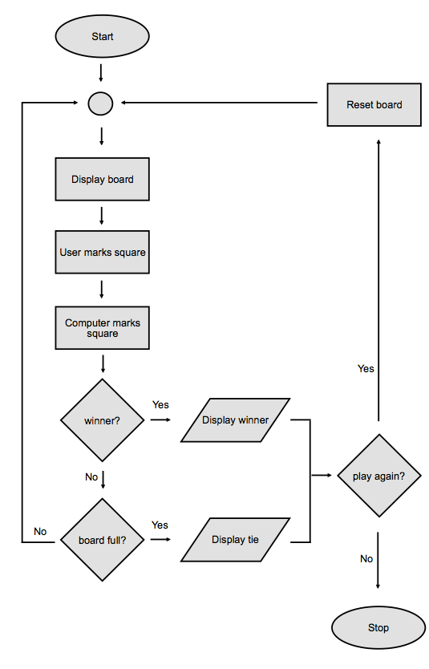

# Lesson 6: Slightly Larger Programs

## 1. Introduction

In this lesson, we'll work on some slightly more complicated programs. These programs will be a departure from the simple ones you've seen so far; they are also beyond what you need for the JS109 assessment. However, they will challenge you to put everything you've learned to use and provide good practice for working with more extensive programs.

For the best results, take the following approach:

* Break down each problem into smaller pieces. Decomposition of the problem is probably the most challenging and most important task since you first have to understand the problem well. Your first attempt may not lead to a good solution, so don't be afraid to start over.

* Map the flow of the program in a flowchart, using sub-processes to encapsulate distinct components of the problem.

* When you're ready to tackle a component or sub-process, write the pseudocode for that sub-process. The pseudocode will probably translate into one or more functions, so be sure you understand what your inputs and outputs will be.

* Play around with the code. **Write every line of code and make sure you understand it.** Don't use copy and paste.

* *Do the assignments in sequence.* We'll walk you through the necessary steps to break down the problem.

* Don't be afraid to read the walk-throughs. Use them as guard rails so that you don't get stuck and spin your wheels for too long. However, don't sit back and read them without typing or coding along, either.

Before you start, make sure that you create a new directory for lesson 6. Call it something like lesson_6, and do all your work for this lesson in that directory.

Your working directory should now look something like this:

```sh
work            <-- this is your course 1 git repo
|
+--lesson_2     <-- all lesson 2 code goes here
|
+--lesson_3     <-- all lesson 3 code goes here
|
+--lesson_4     <-- all lesson 4 code goes here
|
+--lesson_5     <-- all lesson 5 code goes here
|
+--lesson_6     <-- all lesson 6 code goes here
```

## 2. More Node Debugger Commands

Earlier in the course we introduced some debugging techniques, including the basics of using the built-in Node.js debugger. As programs get larger and grow in complexity, the likelihood of bugs occurring in your code increases. When dealing with larger programs it is even more important to know how to identify and eliminate bugs when they occur. Before continuing with this lesson we recommend that you review [this assignment](https://launchschool.com/lessons/64655364/assignments/3b953f14).

In that earlier assignment, we listed some of the debugger's commands and outlined their basic usage. The debugger provides some additional functionality, some of which can be especially useful when working with larger or more complex programs. This functionality is described in the [Node documentation](https://launchschool.com/lessons/64655364/assignments/3b953f14). In this assignment, we'll explain and demonstrate some of it.

### Executing Expressions or Functions

You should already be familiar with the `exec` command as a way of accessing in-scope variables within the debugger. Something you may not be aware of is that the `exec` command can also be used to evaluate expressions or execute functions.

```sh
break in exec.js:8
  6
  7 let a = 1;
> 8 let b = 2;
  9
debug> exec a + b
3
```

Note that to execute a function with `exec` you need to have an invocation for that function in your code, not just the function definition.

Another way to evaluate expressions or execute functions within the debugger is to access the built in REPL. You can access the REPL via the `repl` command. Within the REPL, you can access variables that are in scope at the point where program execution was paused, and you can evaluate expressions or execute functions. Within the REPL, all of this can be done without the need for the `exec` command.

```sh
debug> repl
Press Ctrl + C to leave debug repl
> a
1
> a + b
3
```

To exit the REPL, you can use `Ctrl + C` (or `Ctrl + Shift + C` on some systems).

Video Demo `exec.js`

### Setting and Clearing Breakpoints

In the earlier assignment, we covered manually setting a breakpoint using the debugger keyword in the code file. This approach works fine, though it does mean that in order to set a breakpoint you have to exit the debugger, edit the file, and restart the debugger. This can be a pain if you want to add and then remove breakpoints at numerous points during the program execution.

Luckily there's a way to add and remove breakpoints within the debugger itself while it's running. Breakpoints can be set using the `setBreakpoint()` or `sb()` commands, and removed using the `clearBreakpoint()` or `cb()` commands.

* `setBreakpoint()` / `sb()` can be used without an argument to set a breakpoint on the current line, or with a line number passed as an argument in order to set a breakpoint on the line specified.

* `clearBreakpoint()` / `cb()` takes two arguments, the name of the file and the line number.

Video

### Stepping Into Functions

You should hopefully already be familiar with stepping through code using `n` or `next` command. This is sufficient for many situations, but if you have a function that calls another function (for example, a callback function), you may want to 'step into' the inner function at the appropriate point in the overall program execution in order to look at what's happening with the inner function execution. The Node debugger allows you to do this with the `s` or `step` command.

When you reach the inner function invocation, you can use `s` / `step` to move *into* the execution of that function, rather than just moving *over* it to the next expression or function call. Once 'inside' the function, you can step out of it using `o` or `out`.

Video => `step.js`

### Other Commands

There are a couple of other commands that might come in useful when using the debugger.

* The `help` command simply lists all of the commands that are available.
* The `list()` command can be used to reveal additional lines of code within the debugger UI.
  * Normally only five lines are visible (the current line, two above, and two below)
  * The `list()` command (called without arguments) will display five lines above and five below the current line
  * An argument can be passed in to the command to specify the number of lines to display above and below the current line. For example `list(8)` would show the current line, eight lines above it, and eight lines below it.

## 3. Tic Tac Toe Problem Decomposition

You've probably played Tic Tac Toe before. If you haven't, you can read more about it on its Wikipedia page. You only need a general idea of how to play the game, its rules, and some basic strategy, so don't get hung up on the details like history and combinatorics.

We want to build a single player Tic Tac Toe game where a user can play against the computer.

### Decomposing the Problem

Before we start coding, we must first come up with a mental map of the solution: we must first understand the problem better and decompose it into a set of smaller problems. For complex problems, a good starting point is to describe the problem in words and then build a high-level flowchart.

Let's first describe the game:

> Tic Tac Toe is a 2-player game played on a 3x3 grid called the board. Each player takes a turn and marks a square on the board. The first player to get 3 squares in a row–horizontal, vertical, or diagonal–wins. If all 9 squares are filled and neither player has 3 in a row, the game is a tie.

That's a generic description, but we need to outline the sequence of game play a bit more before we can build a flow chart:

1. Display the initial empty 3x3 board.
2. Ask the user to mark a square.
3. Computer marks a square.
4. Display the updated board state.
5. If it's a winning board, display the winner.
6. If the board is full, display tie.
7. If neither player won and the board is not full, go to #2
8. Play again?
9. If yes, go to #1
10. Goodbye!

You can see from the above sequence that there are two main loops:

* An inner loop between steps #2 and #7 that repeats as long as there is no winner and the board isn't full.
* An outer loop between steps #1 and #9 that repeats as long as the player wants to keep playing.

You may have noticed that we're using high-level pseudocode instead of formal pseudocode. We want to stay at a zoomed-out higher-level for now since all of the imperative code–the step by step directions–is encapsulated as sub-processes. For example, "display the board" doesn't go into how we should display the board; instead, we'll trust that a sub-process (a function), can take care of it. In other words, we'll figure that part out later. For now, we need to focus on higher-level thinking.

### Flowchart

Let's draw a flowchart based on the sequence outlined above:



If you need a refresher on flowcharts, see the [Flowchart assignment](https://launchschool.com/lessons/64655364/assignments/998c996d) from the *Small Programs* lesson.

Notice that there are a number of shapes, each of which stands for some specific processing. These shapes depict the general flow of the program, but it's at a much higher level than what we've worked with before. You can see that the sub-processes need to work with a concept that we call the "board." Every sub-process–"Display board," "User marks square," "board full?" and so on–requires us to inspect the board. In some cases, such as when we mark a square, we must permanently modify the board state.

With this flow chart in hand, we're finally ready to start writing some code.

Note: yes, you could spend more time here by writing out formal pseudocode for each sub-process. That technique would be far more detailed and would be great in a more complex program. If you're still having a hard time deconstructing the logic of this program, go ahead and take that step. Zoom in to each sub-process and try to outline a detailed approach to that problem.
