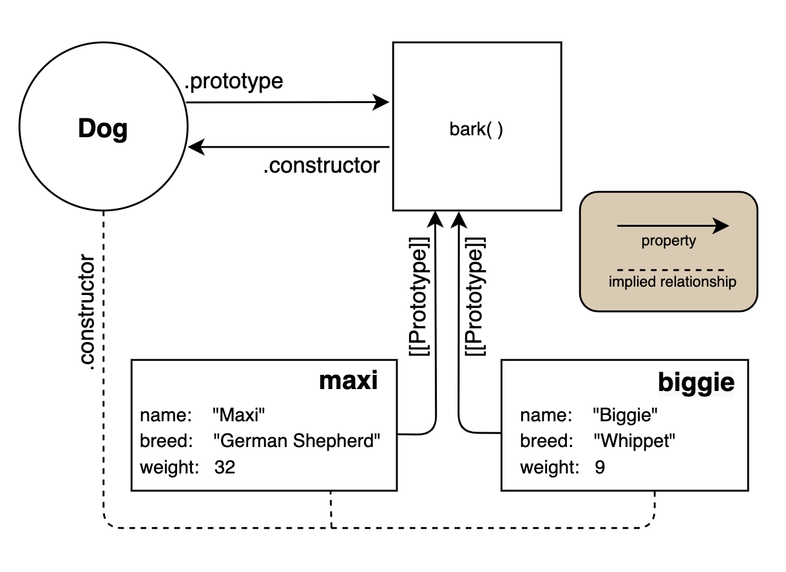

# Lesson 3: Object Creation Patterns

## Assignment 1. Introduction

In lesson 1, we saw the power of an object creation mechanism when we studied the **object factory pattern** for creating objects. In this lesson, we'll review that pattern, and talk about some other patterns.

Unlike other mainstream languages, JavaScript doesn't implement behavior sharing using class-based inheritance even though ES6 introduced the class keyword to the language. Instead, it *uses the object prototype to share properties*. This distinction is crucial to understanding how JavaScript generates individual objects; it forms the basis of all object-creation patterns in JavaScript that feature behavior sharing.

We'll begin by looking at different ways to generate individual objects and then explore object prototypes. Next, we'll highlight two ways to create objects in an object-oriented pattern - one which simulates a classical approach, and another that uses the `class` syntax.

The topics covered by this lesson are at the heart of OOP in JavaScript. Prototype-based object-orientation is not a straightforward concept to grasp, and it takes time to get used to this way of thinking. Take it slow, read the assignment multiple times, and be sure to work through all the practice problems to let the concepts sink in. Let's start!

## Assignment 2. Review - OOP Principles: Encapsulation

In the previous course, we dealt mostly with procedural programming where we have data stored in a bunch of variables, and functions that operate on this data. As the program grows, so does the complexity and, before you know it, you end up with functions all throughout the code split up from the data that they operate on.

Object-oriented programming solves this problem. Objects provide a means to group related data and functions into one unit. In the context of the object, the data and functions are commonly called state and methods respectively.

### 2.1 Encapsulation

This grouping together of related data and functions is what’s called **encapsulation** and is one of the fundamental principles of object-oriented programming.

To illustrate, let’s take the following code:

```js
let overtime = 10;
let baseSalary = 6000;
let rate = 50;

function computeWage(baseSalary, overtime, rate) {
  return baseSalary + (overtime * rate)
}
```

Up top are the data related to the employee’s wage and a function that operates on the data. The object-oriented way of solving this problem by using encapsulation is done by simply combining data and related functions into one unit like so:

```js
let employee = {
  baseSalary: 6000,
  overtime: 10,
  rate: 50,
  computeWage: function() {
    return this.baseSalary + (this.overtime * this.rate)
  }
}
```

As you can see, everything that's related to the `employee` object is bundled. This is the beauty of object-oriented programming. It organizes code into logical units.

### 2.2 Review - OOP Principles: Encapsulation Summary

We've just reviewed the concept of encapsulation and how it's relevant to object-oriented programming. In the example given, we *instantiated an object using the object literal syntax*. There are other more sophisticated patterns of object creation that we'll cover over the remaining assignments. However keep in mind that, at the very core, we are essentially doing the same thing: *grouping data and related functions together*.

## Assignment 3. Review - Factory Functions

In lesson 1, we learned how to *create objects in bulk* by using the factory function pattern. We'll review that concept before we move forward and discuss some other object creation patterns.

### 3.1 Factory Functions

Object factories, or factory functions (also called the Factory Object Creation Pattern), provide a simple way to create related objects based on a predefined template:

```js
function createPerson(firstName, lastName = '') {
  let person = {};

  person.firstName = firstName;
  person.lastName = lastName;

  person.fullName = function() {
    return `${this.firstName} ${this.lastName}`.trim();
  };

  return person;
}

let john = createPerson('John', 'Doe');
let jane = createPerson('Jane');

john.fullName(); // => 'John Doe'
jane.fullName(); // => 'Jane'
```

We can simplify that somewhat by returning an object literal:

```js
function createPerson(firstName, lastName = '') {
  return {
    firstName: firstName,
    lastName: lastName,

    fullName: function() {
      return `${this.firstName} ${this.lastName}`.trim();
    }
  };
}
```

The factory function lets us create multiple objects of the same "type" with a pre-defined "template." However, it has some disadvantages:

- Every object created with a factory function has a full copy of all the methods. That's **redundant**, and it can place a heavy load on system memory.

- There is no way to inspect an object and learn whether we created it with a factory function. That effectively *makes it impossible to identify the specific "type" of the object*; at best, you can only determine that an object has some specific characteristics.

## Assignment 4. Practice Problems - Factory Functions

### 4.1 What are two disadvantages of working with factory functions?

1. Every object created with a factory function has a full copy of all the methods. That's redundant, and it can place a heavy load on system memory.

2. There is no way to inspect an object and learn whether we created it with a factory function. That effectively makes it impossible to identify the specific "type" of the object; at best, you can only determine that an object has some specific characteristics.

**Solution**

1. Each object created by a factory function has a copy of all methods, which can be redundant and memory intensive.

2. There is no way to tell which factory function created an object, so there's no way to be sure that you're working with the right kind of object.

### 4.2 Rewrite the following code to use the object literal syntax to generate the returned object:

```js
function makeObj() {
  let obj = {};
  obj.propA = 10;
  obj.propB = 20;
  return obj;
}
```

**Solution**

```js
function makeObj() {
  return {
    propA = 10,
    propB = 20,
  }
}
```

### 4.3 In this problem and the remaining problems, we'll build a simple invoice processing program. To get you started, here's the code to process a single invoice:

```js
let invoice = {
  phone: 3000,
  internet: 6500
};

let payment = {
  phone: 1300,
  internet: 5500
};

let invoiceTotal = invoice.phone + invoice.internet;
let paymentTotal = payment.phone + payment.internet;
let remainingDue = invoiceTotal - paymentTotal;

console.log(paymentTotal); // => 6800
console.log(remainingDue); // => 2700
```

To process multiple invoices, we need a factory method that we can use to create invoices. The requirements for the factory function are as follows:

1. It returns an invoice object, with `phone` and `internet` properties, and a `total` method.
2. The default value for the phone service is 3000, and the internet service is 5500 (in cents, of course!).
3. The function takes an object argument whose attributes override the default values.

Your function should work with the following code:

```js
function createInvoices(services = {}) {
  // implemented the factory function here
  let phoneCharge = services.phone;
  if (phoneCharge === undefined) {
    phoneCharge = 3000;
  }

  let internetCharge = services.internet;
  if (internetCharge === undefined) {
    internetCharge = 5500;
  }

  return {
    phone: phoneCharge,
    internet: internetCharge,

    total: function() {
      return this.phone + this.internet;
    }
  };
}

function invoiceTotal(invoices) {
  let total = 0;

  for (let index = 0; index < invoices.length; index += 1) {
    total += invoices[index].total();
  }

  return total;
}

let invoices =[];
invoices.push(createInvoice());
invoices.push(createInvoice({ internet: 6500 }));
invoices.push(createInvoice({ phone: 2000 }));
invoices.push(createInvoice( {
  phone: 1000,
  internet: 4500,
}));

console.log(invoiceTotal(invoices)); // 31000
```

### 4.4 Now we can build a factory function to create payments. The function can take an object argument in one of 3 forms:

1. Payment for one service, e.g., `{ internet: 1000 }` or `{ phone: 1000 }`.
2. Payment for both services, e.g., `{ internet: 2000, phone: 1000 }`.
3. Payment with just an amount property, e.g., `{ amount: 2000 }`.

The function should return an object that has the amount paid for each service and a `total` method that returns the payment total. If the `amount` property is not present in the argument, it should return the sum of the phone and internet service charges; if the `amount` property is present, return the value of that property.

Your function should work with the following code:

```js
function createPayment(services = {}) {
  // implemented the factory function here
  let payment = {
    phone: services.phone || 0,
    internet: services.internet || 0,
    amount: services.amount,
  };

  payment.total = function() {
    return this.amount || (this.phone + this.internet);
  };

  return payment;
}

function paymentTotal(payments) {
  return payments.reduce((sum, payment)  => sum + payment.total(), 0);
}

let payments = [];
payments.push(createPayment());
payments.push(createPayment({
  internet: 6500,
}));

payments.push(createPayment({
  phone: 2000,
}));

payments.push(createPayment({
  phone: 1000,
  internet: 4500,
}));

payments.push(createPayment({
  amount: 10000,
}));

console.log(paymentTotal(payments)); // => 24000
```

### 4.5 Update the `createInvoice` function so that it can add payment(s) to invoices. Use the following code as a guideline:

```js
let invoice = createInvoice({
  phone: 1200,
  internet: 4000,
});

let payment1 = createPayment({ amount: 2000 });
let payment2 = createPayment({
  phone: 1000,
  internet: 1200
});

let payment3 = createPayment({ phone: 1000 });

invoice.addPayment(payment1);
invoice.addPayments([payment2, payment3]);
invoice.amountDue(); // this should return 0

function createInvoice(services = {}) {
  let phoneCharge = services.phone;
  if (phoneCharge === undefined) {
    phoneCharge = 3000;
  }

  let internetCharge = services.internet;
  if (internetCharge === undefined) {
    internetCharge = 5500;
  }

  return {
    phone: phoneCharge,
    internet: internetCharge,
    payments: [];

    total: function() {
      return this.phone + this.internet;
    },

    addPayment: function(payment) {
      this.payments.push(payment);
    },

    addPayments: function(payments) {
      payments.forEach(this.addPayment, this);
    },

    paymentTotal: function() {
      return this.payments.reduce((sum, payment) => sum + payment.total(), 0);
    },

    amountDue: function() {
      return this.total() - this.paymentTotal();
    },
  }'
}
```

Wow, this is confusing. It looks familiar from GA but not clear at all.

## Assignment 5. Constructors

**Object constructors**, or **constructors** for short, are another way to create objects in JavaScript. You can think of a constructor as a little factory that can create an endless number of objects of the same type. If that sounds a bit like a factory function, that's okay -- there are some differences, but the basic idea is the same.

Superficially, a constructor looks and acts a lot like a factory function: you define a constructor once then invoke it each time you want to create an object of that type. As we'll see soon, though, there's a little extra that goes into a constructor.

The best way to learn how constructors work is to create one. Let's look at the following `car` object:

```js
let car = {
  make: 'Toyota',
  model: 'Corolla',
  year: 2016,
  started: false,

  start() {
    this.started = true;
  },

  stop() {
    this.started = false;
  },
};
```

We don't just want *a* car, however. We want a mechanism that creates any car that has those properties and methods. To do that, we can use a factory function to create individual cars:

```js
function createCar(make, model, year) {
  return {
    make, // shorthand for `make: make`
    model,
    year,
    started: false,

    start() {
      this.started = true;
    },

    stop() {
      this.started = false;
    },
  };
}

let corolla = createCar('Toyota', 'Corolla', 2016);
let leaf = createCar('Nissan', 'LEAF', 2018);
let nova = createCar('Chevrolet', 'Nova', 1974);
```

This factory function creates new cars of any make, model, or year, and ensures that the engines are initially off.

Another way to accomplish the same thing is to use a constructor function and the `new` keyword:

```js
function Car(make, model, year) {
  this.make = make;
  this.model = model;
  this.year = year;
  this.started = false;

  this.start = function() {
    this.started = true;
  };

  this.stop = function() {
    this.started = false;
  };
}

let corolla = new Car('Toyota', 'Corolla', 2016);
let leaf = new Car('Nissan', 'LEAF', 2018);
let nova = new Car('Chevrolet', 'Nova', 1974);
```

Defining a constructor is nearly identical to defining an ordinary function, but there are differences. For starters, notice that *we gave the constructor a name that begins with a capital letter*: `Car`. Capitalizing the name isn't a language requirement, but it is a convention employed by most JavaScript developers.

The function parameters, in general, match the properties associated with each `Car` object. In this case, we supply parameters for all of the properties except `started`, which receives an initial value instead. *The initial value for such properties can come from anywhere.* For instance, we can compute the value from other properties or retrieve a value from a database.

### 5.1 Calling a Constructor Function

The most striking features that distinguish constructors from ordinary functions are that:

- we call it with the `new` keyword,
- we use `this` to set the object's properties and methods, and
- we *don't supply an explicit return value* (we can, but usually don't).

By now, we know that `this` always refers to an object. Which object does it refer to in this function? Of course, we already know the answer to that question: its value depends on how we call the function. Calling constructors is where you see the most significant difference between them and other functions.

Let's create a `Car` object:

```js
let corolla = new Car('Toyota', 'Corolla', 2016);

corolla.make;    // => 'Toyota'
corolla.model;   // => 'Corolla'
corolla.year;    // => 2016
corolla.started; // => false

corolla.start();
corolla.started; // => true
```

Notice that the `new` keyword precedes the function invocation. This combination of using `new` with a function call treats the function as a constructor.

How does that code work, then? What's so different about using the `new` keyword to invoke the function? JavaScript takes the following steps when you invoke a function with `new`:

1. It creates an entirely new object.
2. It sets the prototype of the new object to the object that is referenced by the constructor's `prototype` property. We'll discuss this in a later assignment. We mention it now for completeness.
3. It sets the value of `this` for use inside the function to point to the new object.
4. It invokes the function. Since `this` refers to the new object, we use it within the function to set the object's properties and methods.
5. Finally, once the function finishes running, `new` returns the new object even though we don't explicitly return anything.

We can now use the new object in any manner appropriate for a Car object.

**JavaScript won't complain about a missing `new` keyword.**

```js
Car(); // => undefined
```

If you don't use the `new` keyword, the constructor function won't work as intended. Instead, it acts like an ordinary function. In particular, no new objects are created, so `this` won't point to a new object.

Furthermore, since functions that don't return an explicit value return `undefined`, calling a constructor without `new` also returns `undefined`. When you use `new`, however, the function doesn't have to return anything explicitly: it returns the newly created object automatically.

### 5.2 Who Can be a Constructor

You can use `new` to call almost any JavaScript function that you create. However, *you cannot call arrow functions with `new`* since they use their surrounding context as the value of `this`:

```js
let Car = (make, model, year) => {
  this.make = make;
  this.model = model;
  this.year = year;
}

new Car(); // TypeError: Car is not a constructor
```

You can also use `new` on methods that you define in objects. Consider:

```js
let foo = {
  Car: function(make, model, year) {
    this.make = make;
    this.model = model;
    this.year = year;
  }
};

let car1 = new foo.Car('Toyota', 'Camry', 2019);
car1.make; //=> 'Toyota'
```

However, calling a method defined with concise syntax (also called a concise method) *won't work*:

```js
let foo = {
  Car(make, model, year) {
    this.make = make;
    this.model = model;
    this.year = year;
  }
};

new foo.Car(); //=> Uncaught TypeError: foo.Car is not a constructor
```

In addition, many -- but not all -- built-in objects and methods are *incompatible* with `new`:

```js

new console.log(); //=> Uncaught TypeError: console.log is not a constructor
new Math();        //=> Uncaught TypeError: Math is not a constructor
new parseInt("3"); //=> Uncaught TypeError: parseInt is not a constructor

new Date();        //=> 2019-06-26T02:50:20.191Z
```

`new` is also incompatible with special functions known as **generators** (a topic that we don't currently cover at Launch School).

### 5.3 Constructors with Explicit Return Values

What happens when you use `new` to call a function that returns an explicit value?

```js
function Cat(name, breed, weight) {
  this.name = name;
  this.breed = breed;
  this.weight = weight;

  return 'a cat';
}

let fluffy = new Cat('fluffy', 'Persian', 15);
fluffy.weight; // 15
```

That's curious. Even though we explicitly returned the string `'a cat'`, our constructor returned the cat object with `name`, `breed` and `weight` as its properties.

Note that `'a cat'` is a **primitive value**. Suppose we returned an object instead. What would happen, then?

```js
function Cat(name, breed, weight) {
  this.name = name;
  this.breed = breed;
  this.weight = weight;

  return { foo: 1 };
}

let fluffy = new Cat('fluffy', 'Persian', 15);
fluffy.weight; // undefined
fluffy.foo; // 1
```

This time the constructor returned the object { foo: 1 }, not a cat object.

The rule here is that a constructor that explicitly tries to return an object returns that object instead of a new object of the desired type. In all other situations, it returns the newly created object, provided no errors occur. In particular, the constructor ignores primitive return values and returns the new object instead.

### 5.4 Supplying Constructor Arguments with Plain Objects

Constructor functions sometimes have to grow with the needs of a program. That often means adding more arguments to the constructor. For instance, our `Car` constructor may one day end up looking like this:

```js
function Car(make, model, year, color, passengers, convertible, mileage) {
  this.make = make;
  this.model = model;
  this.year = year;
  this.color = color;
  this.passengers = passengers;
  this.convertible = convertible;
  this.mileage = mileage;
  this.started = false;

  this.drive = function() {
    this.started = true;
  };

  // rest of the methods
}
```

That's quite a few parameters, with plenty of opportunities for mistakes. For instance, we may pass the arguments in the wrong order, and JavaScript won't complain. That might seem like a minor inconvenience, but it causes more bugs than you might think. Not only that, those bugs are often quite nasty and hard to diagnose. The more parameters a function needs, the harder it is to read the code and the more likely that problems will arise.

One common technique that we can use to manage our parameters better involves *passing them to our constructor with an object argument*:

```js
let civicArgs = {
  make: 'Honda',
  model: 'Civic',
  year: 2016,
  color: 'black',
  passengers: 5,
  convertible: false,
  mileage: 16000
}

let civic = new Car(civicArgs);
```

Of course, that means that we now have to rework our `Car` constructor to accept an object as an argument:

```js
function Car(args) {
  this.make = args.make;
  this.model = args.model;
  this.year = args.year;
  this.color = args.color;
  this.passengers = args.passengers;
  this.convertible = args.convertible;
  this.mileage = args.mileage;
  this.started = false;

  this.drive = function() {
    this.started = true;
  };

  // rest of methods
}
```

With `Object.assign`, we can simplify this constructor considerably:

```js
function Car(args) {
  Object.assign(this, args);

  this.drive = function() {
    this.started = true;
  };

  // rest of methods
}
```

However, one drawback of the `Object.assign` approach is that the `args` object may contain properties that the `Car` object doesn't need. Those additional properties will, nevertheless, get added to the `Car` object. Those properties may just be excess baggage for the objects to carry around, but they *may also cause trouble*.

### 5.5 Determining an Object's Type

Many object-oriented languages, like Java or C++, have a strong notion of object types. In most such languages, it's easy to determine the object's type, such as a dog or car. JavaScript, however, treats objects and their types in a looser, more dynamic way. You can't determine the specific type of arbitrary JavaScript objects; they are dynamic structures with a type of `object`, no matter what properties and methods they have. However, *we can get some useful information about an object if we know which constructor created it*.

Remember that the `new` operator creates a new object. Suppose that you call the Car constructor with `new`. Informally, we can say that the resulting object is a car. More formally, we can say that the object is an **instance** of a `Car`.

The `instanceof` operator lets us determine whether a given constructor created an object:

```js
let civicArgs = {
  make: 'Honda',
  model: 'Civic',
  year: 2016,
  color: 'black',
  passengers: 5,
  convertible: false,
  mileage: 16000
};

let civic = new Car(civicArgs);

if (civic instanceof Car) {
  console.log("It's a car!");
} else {
  console.log("It's not a car.");
}
```

One effect that we didn't mention when talking about the `new` operator is that t*he object it returns contains some information that ties it back to the constructor that created the object*. The `instanceof` operator uses that information to determine what constructor created the object. We'll talk more about how this mechanism works in the next assignment.

### 5.6 `new` and Implicit Execution Context

In an earlier lesson, we discussed how a function could receive an implicit execution context. In particular, function and method calls provide an implicit context. For a function call, the implicit context is the global object; for a method call, it's the object used to call the method.

Now that we know about constructors, we can add a constructor call with `new` as a third way to provide an implicit execution context. When you call a function with `new`, its implicit context is the new object.

### 5.7 Problems

#### 5.7.1 What naming convention separates constructor functions from other functions?

Constructor function names are capitalized.

#### 5.7.2 What happens if you run the following code? Why?

```js
function Lizard() {
  this.scamper = function() {
    console.log("I'm scampering!");
  };
}

let lizzy = Lizard();
lizzy.scamper(); // ?
```

Solution:

This code throws a `TypeError` since `scamper` is an undefined property on `lizzy`. Since `Lizard` was invoked without the `new` operator and it doesn't have an explicit return value, the return value is `undefined`. Thus, `lizzy` gets assigned to `undefined` which causes the call to `scamper` to throw an error: you can't call a method on `undefined`.

#### 5.7.3 Alter the code in problem 2 so that it produces the desired output: I'm scampering!.

```js
function Lizard() {
  this.scamper = function() {
    console.log("I'm scampering!");
  };
}

let lizzy = new Lizard();
lizzy.scamper();
```

## 6. Constructors with Prototypes

### 6.1 Introduction

In the previous assignment, we learned how to use constructor functions as factories that create objects. One question we didn't answer, however, was why we need to have constructor functions along with their somewhat strange use of `this` and `new`. We can accomplish practically the same thing with object factories. We'll answer that question in this assignment.

Let's take a closer look at what happens when we create some objects with a constructor:

```js
function Dog(name, breed, weight) {
  this.name = name;
  this.breed = breed;
  this.weight = weight;

  this.bark = function() {
    console.log(this.weight > 20 ? 'Woof!' : 'Yip!');
  };
}

let maxi = new Dog('Maxi', 'German Shepherd', 32);
let dexter = new Dog('Dexter', 'Rottweiler', 50);
let biggie = new Dog('Biggie', 'Whippet', 9);

maxi.bark(); // 'Woof!'
```

Each of these dog objects, when created, receive the `name`, `breed`, and `weight` properties as well as the `bark` method. The properties have values that differ between objects, but the `bark` method remains the same in all. However, every time we create a new dog object, we must create a new `bark` method so we can add it to the object. We can verify that each object has its own `bark` method with `hasOwnProperty`:

```js
maxi.hasOwnProperty('bark');   // true
dexter.hasOwnProperty('bark'); // true
biggie.hasOwnProperty('bark'); // true
maxi.bark === dexter.bark;     // false
maxi.bark === biggie.bark;     // false
dexter.bark === biggie.bark;   // false
```

If that seems inefficient and wasteful to you, you're right! We're not repeating any code, but the runtime must create a new copy of the method every time we create an object. For small programs with few objects like this one, that may not be a problem. However, when you start getting into hundreds or thousands or even millions of objects, the multiple function objects can be hard on resources, especially on devices with little memory. Wouldn't it be nice if we could create the `bark` method just once rather than using a different copy of that method in every dog object?

### 6.2 Method Delegation to Prototypes

Earlier, we learned that we could use prototypes to share code between objects of the same type. Prototypes are especially useful for sharing methods as all objects of a particular type share the same prototype object. Furthermore, delegation means that we can share methods by putting them in the prototype object; if an object doesn't contain a requested method, JavaScript searches the prototype chain to find the method.

Thus, we can define a method once in the prototype object, and let the inheriting objects delegate the method calls to the prototype. We can use prototypes in conjunction with constructors to achieve the same result:

```js
let DogPrototype = {
  bark() {
    console.log(this.weight > 20 ? 'Woof!' : 'Yip!');
  }
};

function Dog(name, breed, weight) {
  Object.setPrototypeOf(this, DogPrototype);
  this.name = name;
  this.breed = breed;
  this.weight = weight;
  // this.bark method removed.
}
```

In this code, we've changed our `Dog` constructor and created a `DogPrototype` object. The first thing we do inside the constructor is set `DogPrototype` as the prototype of the newly created dog object. We then assign the arguments to the properties.

Note that we can continue to use our constructor without change:

```js
let maxi = new Dog('Maxi', 'German Shepherd', 32);
let dexter = new Dog('Dexter', 'Rottweiler', 50);
let biggie = new Dog('Biggie', 'Whippet', 9);

maxi.bark(); // 'Woof!'
```

This time, however, the `bark` method isn't defined on the individual objects, but is, instead, defined on the `[[Prototype]]` property:

```js
maxi.hasOwnProperty('bark'); // false
dexter.hasOwnProperty('bark'); // false
biggie.hasOwnProperty('bark'); // false
Object.getPrototypeOf(maxi).bark === DogPrototype.bark; // true
Object.getPrototypeOf(dexter).bark === DogPrototype.bark; // true
Object.getPrototypeOf(biggie).bark === DogPrototype.bark; // true
```

The `DogPrototype` object has the only copy of the method; all dog objects delegate `bark` to the `DogPrototype` object. If you have dozens of dog objects in your program, it's easy to see that adding prototypes into the mix can make better use of memory.

Okay, we now have a constructor and a related prototype object. Together, they construct objects of some type. In our code here, we can guess that the constructor and prototype are related by looking at their names. However, it would be better if we could establish that relationship more concretely. Let's assign the prototype object to a property of the `Dog` function.

```js
// Delete DogPrototype

function Dog(name, breed, weight) {
  Object.setPrototypeOf(this, Dog.myPrototype);
  // rest of the code
}

Dog.myPrototype = {
  bark() {
    console.log(this.weight > 20 ? 'Woof!' : 'Yip!');
  }
};
```

Since JavaScript functions are objects, we can add properties to them. Here, we assign the prototype object to a `myPrototype` property on the `Dog` function object. Thus, we clearly show our intent that all dogs inherit from the `Dog.myPrototype` object. Once we've done that, we can change our constructor function to use `Dog.myPrototype` as the prototype object.

Take some time to understand why this code works. It can be confusing when you first encounter it. It's a little like working with **recursive functions** as we did in the [Introduction to Programming With JavaScript book](https://launchschool.com/books/javascript/read/loops_iterating#recursion), which is to say, it's a bit hard to wrap your head around this code. To help, here's the complete code as it now stands:

```js
function Dog(name, breed, weight) {
  Object.setPrototypeOf(this, Dog.myPrototype);
  this.name = name;
  this.breed = breed;
  this.weight = weight;
}

Dog.myPrototype = {
  bark() {
    console.log(this.weight > 20 ? 'Woof!' : 'Yip!');
  }
};

let maxi = new Dog('Maxi', 'German Shepherd', 32);
let dexter = new Dog('Dexter', 'Rottweiler', 50);
let biggie = new Dog('Biggie', 'Whippet', 9);

maxi.bark(); // 'Woof!'

maxi.hasOwnProperty('bark'); // false
dexter.hasOwnProperty('bark'); // false
biggie.hasOwnProperty('bark'); // false

Object.getPrototypeOf(maxi).bark === Dog.myPrototype.bark; // true
Object.getPrototypeOf(dexter).bark === Dog.myPrototype.bark; // true
Object.getPrototypeOf(biggie).bark === Dog.myPrototype.bark; // true
```

### 6.3 The Constructor `prototype` Property

So far, so good. We have a constructor function and a prototype object that work together. Between them, they create dog objects for us that don't waste memory with multiple copies of methods. However, we still haven't explained why we should bother with constructors. We can pair a prototype with a factory function and get the same effect.

What makes constructors special is a characteristic of all function objects in JavaScript: they all have a prototype property that we call the **function prototype** to distinguish them from the prototypes used when creating ordinary objects. The code we showed in the previous section emulates something that JavaScript bundles with constructors. Let's take a look at that property:

```sh
Dog.prototype; // => Dog {}
```

When you call a function `Foo` with the `new` keyword, JavaScript sets the new object's prototype to the current value of `Foo`'s `prototype` property. That is, the constructor creates an object that inherits from the constructor function's prototype (`Foo.prototype`). Since inheritance in JavaScript uses prototypes, we can also say that the constructor creates an object whose prototype references `Foo.prototype`.

The terminology of constructor prototypes and object prototypes is extremely confusing. Note in particular that we use the term "prototype" to refer to 2 distinct but related concepts:

1. If `bar` is an object, then the object from which `bar` inherits is the **object prototype**. By default, constructor functions set the object prototype for the objects they create to the constructor's prototype object.

2. The **constructor's prototype object**, also called the **function prototype**, is an object that the constructor uses as the object prototype for the objects it creates. In other words, each object that the constructor creates inherits from the constructor's prototype object. The constructor stores its prototype object in its `prototype` property; that is, if the constructor's name is `Foo`, then `Foo.prototype` references the constructor's prototype object.

It's easy to get confused about the differences between these two kinds of prototypes. Be sure you understand the differences before moving on. In most cases, when we talk about a **prototype** without being more explicit, we mean an **object prototype**. We'll talk about the constructor's prototype, the function prototype, or the `prototype` property when talking about a constructor's prototype object.

Note that *constructors don't inherit from the constructor's prototype object*. Instead, *the objects that the constructor creates inherit from it*.

At this point, you may want to rewatch the first 12 minutes of the [JavaScript OOP video](https://www.youtube.com/watch?v=-N9tBvlO9Bo) that you watched earlier. The discussion of the differences between the object prototype (what the speaker calls *dunder proto* or `__proto__`) and the constructor's prototype object should help clarify these differences.

As we've said before, every JavaScript function has a `prototype` property. However, JavaScript only uses it when you call that function as a constructor, that is, by using the `new` keyword. With this information, we can abandon our home-grown constructor-prototype pairing and use the one that JavaScript provides instead:

```js
function Dog (name, breed, weight) {
  // deleted Object.setPrototypeOf(this, Dog.myPrototype);
  this.name = name;
  this.breed = breed;
  this.weight = weight;
}

Dog.prototype.bark = function() {
  console.log(this.weight > 20 ? 'Woof!' : 'Yip!');
};

let maxi = new Dog('Maxi', 'German Shepherd', 32);
maxi.bark(); // 'Woof!'

let biggie = new Dog('Biggie', 'Whippet', 9);
biggie.bark(); // 'Yip!'
```

Here's a diagram illustrating the `prototype` and `constructor` links we've discussed.



Note that our constructor doesn't have to explicitly set the prototype of `this` to `Dog.prototype`. JavaScript does that for us when we call the function with `new`. We left this detail out earlier, so let's restate those steps with updated information. We'll assume that the constructor function is named `Foo`:

1. It creates an entirely new object.
2. It sets `Foo.prototype` as the prototype for the new object. That is, the new object inherits from the object referenced by `Foo.prototype`.
3. It sets the execution context (`this`) for the function to point to the new object.
4. It invokes the function.
5. It returns the new object *unless the function returns another object*.

Since the `bark` method refers to `this` and `bark` belongs to the prototype object, you may think that `this` in `this.weight` refers to the prototype object rather than the object itself (e.g., `maxi` or `biggie`). However, that's not how `this` binding works. You already know those rules, so take a moment to think about what it means inside the `bark` method.

When you call a method on an object, JavaScript binds `this` to the object whose method you used to call it. If it doesn't find the method in that object, but it does find it in the prototype, that doesn't change the value of `this`. `this` always refers to the original object -- that is, the object used to call the method --even if the method is in the prototype. If we find the `bark` method in the prototype, `this` references the original dog object, not the prototype.

A property of interest on a prototype object is the constructor property. For instance:

```sh
Dog.prototype.constructor; // [Function: Dog]
```

As with the `instanceof` operator, the `constructor` property lets us determine the type of an object:

```js
let maxi = new Dog('Maxi', 'German Shepherd', 32);

if (maxi.constructor === Dog) {
  console.log("It's a dog");
} else {
  console.log("It's not a dog");
}
```

Be careful, however. It's possible to reassign the `constructor` property to something else. We'll learn about reassigning the `constructor` property in the next assignment. In that case, the test shown above would fail, even though the object is still a dog.

```js
Dog.prototype.constructor = function() {};

maxi.constructor === Dog; // false
maxi instanceof Dog;      // true
```

Note that `instanceOf` still works.

### 6.4 Overriding the Prototype

Inheriting methods from a prototype doesn't mean that the inheriting object is stuck with those methods. *JavaScript objects are incredibly dynamic and flexible*. Two objects created with the same constructor may end up looking completely different from each other because of changes and additions made after constructing the object. For instance, suppose we have a `dexter` dog that has an unusually loud and deep bark. We want to change the `bark` method to log `WOOF!` instead of `Woof!`. We can do that easily by defining a custom `bark` method on `dexter`.

```js
let maxi = new Dog('Maxi', 'German Shepherd', 32);
let dexter = new Dog('Dexter', 'Rottweiler', 50);

dexter.bark = function() {
  console.log('WOOF!');
}

maxi.bar(); // Woof!
dexter.bark(); // WOOF!
```

The `dexter` object now has its own `bark` method that **overrides** the `bark` method from `Dog.prototype`. Each time we call `bark` on `dexter`, JavaScript looks for it first in the `dexter` object itself. Since it finds it there, it doesn't need to check the prototype.

It's time to return to the [JavaScript OOP](https://www.youtube.com/watch?v=-N9tBvlO9Bo) video that you began watching earlier. The portion of the video that pertains to this assignment starts at about the 00:39:18 mark, and continues through examples 5 and 7 until the 01:25:15 point. Note that we haven't covered inheritance yet, but the video talks about it. If those sections confuse you, just ignore them for now.

If you want a refresher, you can also watch the earlier parts of the video.

### 6.5 A shallow dive into the constructor property in JavaScript by Aneesh Patel

You may also want to read this student article: [A shallow dive into the constructor property in JavaScript](https://medium.com/@patel.aneeesh/a-shallow-dive-into-the-constructor-property-in-javascript-b0a89747058b) to get a better handle on the `constructor` property from the perspective of a student at roughly the same point in the JavaScript curriculum as you. The article is meant to be a companion to the JS OOP video above.


End Assignment 6. Constructors with Prototypes ~ 20220308 13:22

## 7. Practice Problems - Constructors and Prototypes

### 7.1 What does the following code log to the console? Try to answer without running the code. Can you explain why the code produces the output it does?

```js
let RECTANGLE = {
  area: function() {
    return this.width * this.height;
  },

  perimeter: function() {
    return 2 * (this.width + this.height);
  },
};

function Rectangle (width, height) {
  this.width = width;
  this.height = height;
  this.area = RECTANGLE.area();
  this.perimeter = RECTANGLE.perimeter();
}

let rect1 = new Rectangle(2, 3);

console.log(rect1.area); // => ?
console.log(rect1.perimeter); // =?
```

**Solution:**

```sh
NaN
NaN
```

The value of `this` within the `RECTANGLE.area` and `RECTANGLE.perimeter` methods gets set to the `RECTANGLE` object when they are called. Since `RECTANGLE` doesn't define `width` and `height` properties, the property accesses both return `undefined`. Since mathematical operations on `undefined` produce a value of `NaN`, the return value of the methods is `NaN`.

### 7.2 How would you fix the problem in the code from problem 1?

```js
let RECTANGLE = {
  area: function() {
    return this.width * this.height;
  },
  perimeter: function() {
    return 2 * (this.width + this.height);
  }
};

function Rectangle(width, height) {
  this.width = width;
  this.height = height;
  this.area = RECTANGLE.area.call(this); // <--
  this.perimeter = RECTANGLE.perimeter.call(this); // <--
}

let rect1 = new Rectangle(2, 3);

console.log(rect1.area);      // => 6
console.log(rect1.perimeter); // => 10
```

### 7.3 Write a constructor function called `Circle` that takes a radius as an argument. You should be able to call an `area` method on any objects created by the constructor to get the circle's area. Test your implementation with the following code:

```js
// constructor function
const Circle = function(radius) {
  this.radius = radius;
};

// prototype
Circle.prototype.area = function() {
  return Math.PI * this.radius * this.radius;
};

// given code
let a = new Circle(3);
let b = new Circle(4);

a.area().toFixed(2); // => 28.27
b.area().toFixed(2); // => 50.27
a.hasOwnProperty('area'); // => false
```

### 7.4 What will the following code log to the console and why?

```js
function Ninja() {
  this.swung = true;
}

let ninja = new Ninja();

Ninja.prototype.swingSword = function() {
  return this.swung;
};

console.log(ninja.swingSword());
```

**Solution**

```sh
true
```

Even though we define the `swingSword` method on the prototype after we create the `ninja`, all objects created by the `Ninja` constructor *share the same prototype object*. Thus, when we define `swingSword`, it immediately becomes available to the `ninja` object.

### 7.5 What will the following code output and why? Try to answer without running the code.

```js
function Ninja() {
  this.swung = true;
}

let ninja = new Ninja();

Ninja.prototype = {
  swingSword: function() {
    return this.swung;
  },
};

console.log(ninja.swingSword());
```

**Solution**

```sh
Uncaught TypeError: ninja.swingSword is not a function
```

Despite the similarities to the code in the previous question, this code doesn't work the same way. That's because we're reassigning `Ninja.prototype` to an entirely new object instead of mutating the original prototype object. The prototype for the `ninja` object doesn't change; it's still the original prototype defined during the constructor's invocation. Thus, JavaScript can't find the `swingSword` method in the prototype chain of `ninja`.

### 7.6 Implement the method described in the comments below:

```js
function Ninja() {
  this.swung = false;
}

// Add a swing method to the Ninja prototype which
// modifies `swung` and returns the calling object
Ninja.prototype.swing = function() {
  this.swung = true;
  return this;
}

let ninjaA = new Ninja();
let ninjaB = new Ninja();

console.log(ninjaA.swing().swung);      // logs `true`
console.log(ninjaB.swing().swung);      // logs `true`
```

This pattern of "chainable" methods invocations and property accesses on an object requires that methods defined on the prototype always return the context object (in this case, ninjaA and ninjaB).

### 7.7 In this problem, we'll ask you to create a new instance of an object, without having direct access to the constructor function:

```js
let ninjaA;

{
  const Ninja = function() {
    this.swung = false;
  };

  ninjaA = new Ninja();
}

// create a `ninjaB` object here; don't change anything else
let ninjaB = new ninjaA.constructor(); // <-- solution


ninjaA.constructor === ninjaB.constructor // => true
```

Hint:

The value assigned to `ninjaA` is an object created by a constructor function. As such, this object has a `constructor` property that points back to its constructor. Think of a way to use this property; that should help lead you to a solution.

**Solution**

```js
let ninjaB = new ninjaA.constructor();
```

Does your answer use `Object.create()` instead?

```js
let ninjaB = Object.create(ninjaA);
```

This code works as well, but there is a flaw: it puts the `swung` property in the prototype object instead of in the `ninjaB` object where it belongs. Thus, `ninjaA` and `ninjaB` are somewhat different objects:

```sh
ninjaA:
  swung: false
  constructor: Ninja
  prototye: {}

ninjaB:
  constructor: Ninja
  prototye: {
    swung: false
  }
```

### 7.8 Since a constructor is just a function, you can call it without the `new` operator. However, that can lead to unexpected results and errors, especially for inexperienced programmers. Write a constructor function that you can use with or without the `new` operator. The function should return the same result with either form. Use the code below to check your solution:

```js
function User(first, last) {
  // ...
}

let name = 'Jane Doe';
let user1 = new User('John', 'Doe');
let user2 = User('John', 'Doe');

console.log(name);         // => Jane Doe
console.log(user1.name);   // => John Doe
console.log(user2.name);   // => John Doe
```

Hint:

In the constructor function, check the value of `this` to see whether it is an instance created by the constructor function. If it is, then the function was called with the `new` operator; otherwise, the function was called without `new`. You can use this in your code; if you determine that `new` wasn't used, then you can have the constructor call itself with the `new` keyword and use its return value.

**Solution**

```js
function User(first, last){
  if (!(this instanceof User)) {
    return new User(first, last);
  }

  this.name = first + ' ' + last;
}

let name = 'Jane Doe';
let user1 = new User('John', 'Doe');
let user2 = User('John', 'Doe');

console.log(name);         // => Jane Doe
console.log(user1.name);   // => John Doe
console.log(user2.name);   // => John Doe
```

Constructor functions built this way are called **scope-safe constructors**. Most, but not all, of JavaScript's built-in constructors, such as `Object`, `RegExp`, and `Array`, are scope-safe. `String` is not:

```js
new Object();          // Object {}
Object();              // Object {}

new Array(1, 2, 3);    // [1, 2, 3]
Array(1, 2, 3);        // [1, 2, 3]

new String("abc");     // [String: 'abc']
String("abc");         // 'abc'
```

End 7. Practice Problems - Constructors and Prototypes 20220308 17:16

I definitely need to review these practice problems again.

## 8. Static and Instance Properties and Methods

In OOP, we often refer to individual objects of a specific data type as **instances** of that type. For example, in the `Dog` example from the [Constructors with Prototypes assignment](https://launchschool.com/lessons/e3c64e3f/assignments/bdc27fe0), `maxi` and `dexter` are instances of the `Dog` type. An instance is just another term for the objects created using any means of defining multiple objects of the same kind (e.g., dogs). The term **object** is more general, while **instance** is more specific.

So far, we've been using constructors to create instances of the `Dog` type. We can also think of objects created by factory functions as instances. Later, we'll see even more ways to create new objects, all of which can be called instances.

Hold on there. Factory functions can create instances? How can that be? There's no way to tell that the objects created by, say, a `createDog` factory are indeed dogs, so how can we have instances?

That's a good point. However, in the end, we know that the `createDog` factory is going to create a bunch of objects that we know to represent dogs. We may not be able to tell whether an arbitrary object is a dog object, but all of the objects created by `createDog` should be dogs. They have a type -- dog -- even if there is no way to test that in your code. Thus, they are instances of a dog type.

### 8.1 Instance Properties

It's convenient to describe the properties of an instance as **instance properties**. These properties belong to a specific instance of some type. Thus, in our `Dog` example from the earlier assignment, we say that the `name`, `breed`, and `weight` properties are all instance properties of the various instances of the `Dog` type. If we want to access the weight for `Maxi` from the above example, we must use the `maxi` object:

```js
maxi.weight; // 32
```

If we try to use the constructor, instead, it won't work:

```js
Dog.weight; // undefined
```

This code returns `undefined` since `weight` isn't a property of the constructor; it's a property of the instances created by that constructor. It also doesn't make sense to define it on the constructor function: weight is a property of an individual dog, not one that is related to dogs as a type.

### 8.2 Instance Methods

Since methods are also properties on an object, we can refer to methods stored directly in an object as instance properties too. More commonly, we call them **instance methods** just to distinguish them from ordinary data properties.

However, methods usually aren't stored directly in instances. Instead, they are usually defined in the object's prototype object. While methods defined in the prototype object aren't stored in the instance object, they still operate on individual instances. Therefore, we usually refer to them as instance methods. In our `Dog` example, `bark` is an instance method since it's defined on the `Dog.prototype` object.

As with `weight`, we must use an object created by the `Dog` constructor to invoke `bark`:

```js
maxi.bark(); // Woof!
```

Again, we can't use the constructor to call this method:

```js
Dog.bark(); // TypeError: Dog.bark is not a function
```

In this specific example, we can call `Dog.prototype.bark()`, but that doesn't always work well. For instance, calling `Dog.prototype.bark()` won't recognize the fact that `dexter` has a different version of `bark`.

Any method defined in any prototype in the prototype chain of an object is considered to be an instance method of the object.

### 8.3 Static Properties

**Static properties** are defined and accessed directly on the constructor, not on an instance or a prototype. Typically, static properties belong to the type (e.g., `Dog`) rather than to the individual instances or the prototype object.

For instance, dogs belong to the species "Canis lupus". That property of dogs doesn't have anything to do with individual dogs; it's information that is pertinent about all dogs. Therefore, it makes sense to add this property directly to the `Dog` constructor as a static property:

```js
Dog.species = "Canis lupus";
```

Now, when our application needs to know the species that dogs belong to, we can access it from the constructor directly:

```js
console.log(`Dogs belong to the species ${Dog.species}`);
```

One common use of static properties is to keep track of all of the objects created by a constructor. For instance:

```js
function Dog(name, breed, weight) {
  this.name = name;
  this.breed = breed;
  this.weight = weight;
  Dog.allDogs.push(this);
}

Dog.allDogs = [];
```

In this case, the static property `allDogs` contains an array with a reference to every dog object created while the program is running. While `allDogs` maintains a list of all the dogs, it isn't information that is pertinent to a specific dog -- it's information about dogs in general. Therefore, it should be a static property.

### 8.4 Static Methods

Static properties don't have to be ordinary data properties. You can also define static methods:

```js
Dog.showSpecies = function() {
  console.log(`Dogs belong to the species ${Dog.species}`);
};

Dog.showSpecies();
```

You've already seen examples of static methods on built-in JavaScript constructors.`Object.assign`, `Array.isArray`, and `Date.now` are all examples of static methods.

End Instance and Static Properties and Methods 20220308 20:54

## 9. Built-in Constructors

JavaScript comes with a variety of built-in constructors and prototypes that let you instantiate useful objects. These constructors work like constructors for other objects; they're used with the `new` keyword to create objects. In this assignment, we will discuss some of JavaScript's built-in constructors, their prototypes, and how you can extend them.

### 9.1 The `Array` constructor

You've seen and worked with array objects many times so far. The simplest way to create an array object uses the bracket syntax:

```sh
> let numbers = [1, 2, 3, 4]
> numbers
[ 1, 2, 3, 4 ]
```

This syntax is how you usually create arrays in JavaScript. However, you can also use the `Array` constructor:

```sh
> let emptyArray = new Array();
> emptyArray
[]
```

As you might suspect, calling `new Array()` creates and returns a new array. That array is empty unless you also pass some arguments to the constructor. Each argument you provide gets added to the new array as an element:

```sh
> let numbers = new Array(1, 2, 3, 4)
> numbers
[ 1, 2, 3, 4 ]

> let colors = new Array('green', 'blue', 'yellow')
> colors
[ 'green', 'blue', 'yellow' ]
```

The behavior is considerably different when you *provide a single number argument*. In this case, the constructor creates an array with a length equal to the number specified by the argument, but with no actual elements:

```sh
> new Array(3)
[ < 3 empty items ]
```

You can think of `[ <3 empty items> ]` as an array that has three empty slots. In effect, it's an empty array that happens to contain spaces for three items; alternatively, it's a non-empty array that contains no values. Call it Schrödinger's array if you wish.

Note that the single-number form of the constructor does not accept non-integers or negative numbers:

```sh
> new Array(3.1415)
=> RangeError: Invalid array length

> new Array(-5)
=> RangeError: Invalid array length
```

The single-number constructor, together with the `Array.prototype.fill` method, lets you create arrays with a value that is repeated in every element:

```sh
> (new Array(3)).fill('*');
[ '*', '*', '*' ]
```

The `fill` method takes any value as an argument and replaces all elements of the array with that value. Note that the parentheses around `new Array(3)` aren't strictly necessary; however, you should *use them for clarity*. They show your intent to run `fill` on the new array.

You may recall that the `new` keyword provides some useful behavior when creating new objects. In many cases, omitting the keyword can lead to unexpected behavior and errors. Interestingly, `Array` *lets you omit the new keyword*:

```sh
> Array(1, 2, 3)
[ 1, 2, 3 ]
```

The behavior of this above code is identical to the earlier example that uses `new Array(1, 2, 3)`.

Some other JavaScript constructors exhibit this behavior. In fact, the ECMAScript specification document requires it in specific cases. However, that doesn't mean that you should omit `new` routinely in your code. You might be using a constructor that doesn't implement this behavior, which can sometimes lead to different behavior when you omit `new`.

For now, don't worry about why the specification requires this behavior or how you can do the same thing yourself. *Stay consistent and use `new` unless there's a good reason to omit it*.

#### 9.1.1 `Array.prototype`

As with any JavaScript function, the `Array` constructor has a `prototype` property. All arrays inherit from the object referenced by this property:

```sh
> let numbers = [1, 2, 3]
> Object.getPrototypeOf(numbers) === Array.prototype
true
```

This relationship implies that every array can use the methods defined in `Array.prototype`. In particular, that means that all arrays can use methods like `forEach`, `map`, `includes`, as well as all the other methods defined on `Array.prototype`:

```sh
// let numbers = [1, 2, 3] <-- from above
> numbers.map(number => number * number);
[ 1, 4, 9 ]

> numbers.includes(3)
true
```

If you go to the [MDN documentation page for arrays](https://developer.mozilla.org/en-US/docs/Web/JavaScript/Reference/Global_Objects/Array), you'll see a list of all these array methods with names that follow the pattern `Array.prototype.aMethod`. These methods are the instance methods for the Array type.

#### 9.1.2 Static Array Methods

Besides instance methods, the array type also has several static methods. We'll discuss two in this section. Remember: static methods belong directly to the constructor function; they aren't part of the prototype used to create new objects. As a result, their names don't include `.prototype`. Moreover, you usually use the constructor to invoke the static methods, not the object created by that constructor. (This definition isn't complete, but it will do for our purposes.)

**Array.isArray**

The `Array.isArray` method takes one argument and returns `true` if the argument is an array object, and `false` if it is not:

```sh
> Array.isArray([])
true

> Array.isArray({})
false

> Array.isArray(5)
false
```

Programs often use `Array.isArray` to verify or refute that a given value is an array object. Why do we need it? Won't `typeof` tell us whether the argument is an array? Unfortunately, no. The `typeof` operator returns an unexpected and somewhat useless value when used with an array:

```sh
> typeof []
'object'
```

That result may be unexpected, but it shouldn't be too surprising if you think about it. You already know that all arrays are objects. That doesn't make it any less useless, however, so we need `Array.isArray` to distinguish between arrays and other objects.

**Array.from**

The `Array.from` method takes an **array-like object** as an argument and returns a new array with the equivalent element values. An array-like object is any object that has a `length` property and provides indexed access to some of its properties with the `[index]` notation. Such objects have properties whose keys are non-negative integers. In many cases, the `length` property won't self-update if you add or remove properties to or from the object.

```sh
> Array.from({0: 'a', 1: 'b', 2: 'c', length: 3})
['a', 'b', 'c']
```

The following code shows one way to implement the logic behind `Array.from`. Studying this code should help you make sense of what `Array.from` does:

```js
let arrayFrom = obj => {
  let len = obj.length;
  let returnArr = [];

  for (let idx = 0; idx < len; idx += 1) {
    returnArr.push(obj[idx]);
  }

  return returnArr;
};

arrayFrom({0: 'a', 1: 'b', 2: 'c', length: 3});
// => [ 'a', 'b', 'c' ]
```

Why would somebody need to do that? It seems silly to create an object that looks like an array but isn't an array. Why bother?

The use case shown isn't particularly useful, but there are other use cases for `Array.from`. In particular, some functions and methods return objects that resemble arrays in some ways but serve some other purpose. For instance, if you use JavaScript to request a list of elements from your browser, the **DOM** (more on that much later) may return an array-like object called a **node list**. Such objects can *store live data* -- dynamic data that can change without intervention by your code. A simple array wouldn't do the trick here, but a node list does. Better yet, the node list is an array-like object, so `Array.from` can create an array based on its content.

In the degenerate case, all arrays are themselves array-like objects.

### 9.2 The `Object` constructor

As with the `Array` constructor, the `Object` constructor creates new objects:

```sh
> new Object()
{}
```

You can invoke `Object` without the `new` keyword, just as you can omit `new` with the `Array` constructor:

```sh
> Object()
{}
```

To repeat ourselves, omitting `new` is probably not a good practice.

#### 9.2.1 `Object.prototype`

All objects created by the `Object` constructor or with object literal syntax (e.g., `{ a: 1, b: 2 }`, inherit from `Object.prototype`. Thus, all such objects have access to the instance methods defined in `Object.prototype`. We've already seen some of these methods in action, such as `Object.prototype.hasOwnProperty` and `Object.prototype.isPrototypeOf`.

Since arrays are a subtype of objects, it should come as no surprise that *all array objects have access to all the methods* on `Object.prototype`.

```sh
> ['a', 'b', 'c'].hasOwnProperty(1)
true
```

You can think of the integer indices as properties of the array. In our example, `0`, `1`, `2` are the properties and `'a'`, `'b'`, `'c'` are the values. We can verify that `Array` is a subtype of `Object` by checking whether `Array.prototype` inherits from `Object.prototype`:

```sh
> Object.getPrototypeOf(Array.prototype) === Object.prototype
true
```

**Almost all JavaScript objects, whether built-in or custom-created, inherit from `Object.prototype`, either directly or further down the prototype chain.** That includes prototype objects of constructors. Note that we said "almost all"; as discussed in an earlier lesson, it is possible to create objects that don't inherit from `Object.prototype`.

Another oft-used method is `Object.prototype.toString`. It returns a string representation of the object that it's called on. Since `toString` is a method on `Object.prototype`, all JavaScript objects -- including arrays, functions, and dates -- inherit this method. However, the default behavior of `Object.prototype.toString` is not very useful; it merely returns `[object Object]` for objects that don't override this method to provide smarter behavior:

```sh
> let obj = { a: 1, b: 2 }
> obj.toString()
'[object Object]'   // not very helpful!

> [1, 2, 3].toString()
'1,2,3'

> let func = function hello() {}
> func.toString()
'function hello() {}'
```

#### 9.2.2 Static `Object` Methods

The list below shows some commonly used static `Object` methods. You've already seen and used several. Feel free to follow the links and read more about these methods, but you don't have to memorize them. Instead, learn what's available. You can look them up later when you need to use them:

- `Object.assign()`
- `Object.create()`
- `Object.entries()`
- `Object.freeze()`
- `Object.isFrozen()`
- `Object.keys()`
- `Object.values()`

### 9.3 The Date Constructor

The Date constructor creates objects, commonly called a **date object**, that represent a specific date and time. Calling `Date` without arguments returns a date object that represents the creation date and time of the object:

```sh
> let now = new Date()
> now
2022-03-09T14:57:44.473Z
```

You can create date objects that represent any given date and time by passing additional arguments to the Date constructor. For instance, to create a date object that represents "May 1, 1983", you can write:

```sh
> let birthday = new Date("May 1, 1983")
> birthday
1983-05-01T07:00:00.000Z
```

You can get even more specific by including the time:

```sh
> birthday = new Date("May 1, 1983 05:03 am")
> birthday
1983-05-01T12:03.00.000Z
```

The dates shown by the above code may appear as 1983-05-02. This issue is caused by the time zone of the environment where you run the code. Working with time zones is messy; we won't get into that in this course.

There are several other ways to specify the date and time, including variations on the date strings shown above, and by providing other arguments to the `Date` constructor. Check the [MDN documentation for Date](https://developer.mozilla.org/en-US/docs/Web/JavaScript/Reference/Global_Objects/Date) to learn more.

#### 9.3.1 Date.prototype

The `Date` prototype object provides a variety of convenient methods for working with dates. We'll mention a few here.

**`Date.prototype.toString()`**

The `toString` method returns a string that represents the date (it's pretty verbose):

```sh
> let now = new Date()
undefined
> now.toString()
'Wed Mar 09 2022 15:07:09 GMT+0000 (Coordinated Universal Time)'
>
```

**`Date.prototype.getFullYear()`**

The `getFullYear` method returns the year from the date as a number:

```sh
> now.getFullYear()
2022
```

**`Date.prototype.getDay()`**

The `getDay` method returns a number that represents the day of the week that corresponds to the date object. The return value is `0` for Sunday, `1` for Monday, and so on until it returns `6` for Saturday.

```sh
> now.getDay()
3 // (represents Wednesday)
```

The `Date` prototype has a bunch of useful methods for working with dates and times. Be sure to check the [MDN documentation page for Date](https://developer.mozilla.org/en-US/docs/Web/JavaScript/Reference/Global_Objects/Date) and explore a few more methods.

### 9.4 The `String` Constructor

Why do we need a constructor for strings? Aren't JavaScript strings a primitive type? We know they are since the strict equality operator compares strings by value rather than identity:

```sh
> 'abc' === 'abc'
true
```

Two strings with the same characters are considered equal in JavaScript. Equality for objects works by identity, however. Two objects are strictly equal only when they are the same object. Consider:

```sh
> let arr1 = [1, 2, 3];
> let arr2 = arr1    // arr1 and arr2 both reference the same object
> arr1 === [1, 2, 3] // false
> arr1 === arr2      // true
```

Interestingly, we can *access properties and call methods on strings*:

```sh
> 'abc'.length
3

> 'abc'.toUpperCase()
'ABC'
```

How is that possible given that strings are primitive values? Primitive values aren't objects, so where does JavaScript find those properties and methods?

We'll return to those questions shortly. First, though, we need to learn that JavaScript has two kinds of strings: **string primitives** and **`String` objects**. Thus far, all the strings we've created and used have been string primitives. We create string primitives by using quotes (single or double) or back-tick characters to define a string's value. To create a `String` object, on the other hand, we must use the `String` constructor:

```sh
> let strPrimitive = 'abc'
> typeof strPrimitive
'string'

> let strObject = new String('xyz')
> typeof strObject
'object'
```

That's interesting: a string primitive's type is `'string'`, but the `String` object's type is `'object'`. It's clear that JavaScript considers the two types of string as different types. That difference has implications. Consider this code:

```sh
> 'abc' === 'abc'
true

> new String('abc') === new String('abc')
false
```

Wow! Two string primitives that have the same value are equal, but not two `String` objects. If you're confused by that, think of poor JavaScript. What's an OOP language to do with weirdness like that? Fortunately, JavaScript is pretty good about remembering what's what.

That still leaves us with a big question: why in the world do we need a `String` object? That goes back to our original question: how can we call methods on string primitives?

The answer is that when you try to access a property or invoke a method on a string primitive, JavaScript *wraps* the string primitive in a `String` object behind the scenes. The process sounds complicated and costly in computing resources, but the implementation is reasonably lightweight; there is little impact on your program. Best of all, the process is invisible.

Once JavaScript has wrapped your string primitive in a `String` object, it then uses the object to access the property or call the method. When the wrapping object has served its purpose, JavaScript discards it.

If a property or method returns a string, it returns a string primitive, so you also don't have to worry about converting `String` objects to primitives.

As a general rule, *you should not create* `String` objects explicitly. That's where you're likely to run into problems with the distinction between string primitives and `String` objects. However, if you're writing code where you may have to operate on `String` objects, you can use `String.prototype.valueOf()` to retrieve the value of the `String` object as a primitive.

#### 9.4.1 `String` Without `new`

As with most constructors, with the notable exception of `Array` and `Object`, calling the constructor without the `new` keyword *does not create* an object. In the case of `String`, it simply returns a new string, not an object, when you omit the `new` keyword:

```sh
> let str = String('abc')
> typeof str
'string'

# with `new` keyword
> let str = new String('abc')
> typeof str
'object'
>
```

The `String` function takes non-string values as arguments as well. In that case, it *converts the value to a string*:

```sh
> String(undefined)
'undefined'

> String(3.14)
'3.14'

> String([1, 2, 3])
'1,2,3'

> String(a => a * a)
'a => a * a'
```

### 9.5 The `Number` and `Boolean` Constructors

The `Number` and `Boolean` constructors work in much the same way as the `String` constructor. When called with `new`, they create `Number` and `Boolean` objects. When called without `new`, the `Number` function *converts its argument to a number*, and the `Boolean` function *converts its argument to a boolean*.

```sh
> Number('123');
123

> Boolean(0);
false

> Boolean('abc');
true
```

As with strings, numbers and booleans both have primitive and object forms, and JavaScript invisibly wraps primitives in objects to access methods and properties. You should also *avoid creating `Number` and `Boolean` objects explicitly*.

### 9.6 Extending Built-in Prototypes

Since all JavaScript objects derive their behavior from the prototype objects associated with their constructors, we can add new capabilities to our built-in objects by changing those prototypes. For example, we can add a `first` method to all arrays by adding it to `Array.prototype`:

```js
Array.prototype.first = function() {
  return this[0];
}

[1, 2, 3].first(); // => 1
```

Since we use the array `[1, 2, 3]` to call `first`, `this` inside the function refers to `[1, 2, 3]`. Thus, the `first` method returns the first element of the array used to call it, or `undefined` if the array is empty.

Extending built-in objects is interesting to study, but it's *best to avoid doing so*. Adding a method like `first` to an array object *can confuse other developers* working on your project. It can lead to errors when other developers forget or don't realize that your array has an unexpected bonus.

### 9.7 Borrowing Array Methods for Strings

First-class functions in a programming language provide several benefits. One significant benefit is that methods aren't tied to a particular object type. *Using explicit context-binding techniques*, we can apply a method to a different object type than the one that defines the method. This "method borrowing," however, doesn't make sense for every object and every method. For example, it doesn't make sense to use the `getDay` date method on an array.

Array methods, however, are surprisingly useful with `String` objects. We can borrow many array methods to manipulate String objects. Consider the following code:

```js
let string = 'EEE';
Array.prototype.every.call(string, char => char === 'E'); // => true
```

JavaScript strings don't have an `every` method, but we can use `Array.prototype.every` on our string by using `call` or `apply`. Here, we use `every` to determine whether the string `EEE` contains all `E` characters.

We can shorten that expression noticeably by using an empty array instead of `Array.prototype` as the calling object:

```js
[].every.call(string, char => char === 'E'); // => true
```

Why does method borrowing work? Let's look at a simplified implementation of `Array.prototype.every`:

```js
Array.prototype.every = function(callback) {
  for (let index = 0; index < this.length; index++) {
    if (!callback(this[index])) return false;
  }

  return true;
};
```

Note how the method uses `this` to access the length and elements of the array that called it. Since `String` objects also have a `length` property and use index-based element access, this code works with strings as well as arrays.

Let's see another example:

```js
[].filter.call('olives', val => val < 'm'); // [ 'l', 'i', 'e' ]
```

Notice that the `filter` method *returns an array, even though we called it on a string*. If you think about it, that makes sense. The `call` and `apply` functions don't change a function's logic or return values; they merely change what object the method uses for its context. Array methods that return an array will still do so even when called on a string value. If you need a string result, you can use `join` to convert the array to a string:

```js
[].filter.call('olives', val => val < 'm').join(''); // => 'lie'
```

Note that not all array methods can operate on strings. Consider the following example:

```js
let ingredients = 'olives';
[].push.call(ingredients, ' and pepper');
// TypeError: Cannot assign to read only property 'length' of object '[object String]'
```

*Array methods that mutate the array won't work with strings*. Again, that makes sense: strings are **immutable**.

End Assignment 9. Built-in Constructors @ 20220309 11:03. I still need to make the Anki cards!

## Assignment 10. ES6 Classes

ES6 introduced a new `class` keyword to JavaScript. We take a brief look at the `class` keyword in this [Gist](https://launchschool.com/gists/6ba85481).

Once you've finished with the Gist, you can finish watching the [JavaScript OOP video](https://launchschool.com/gists/6ba85481) that you began watching earlier. The portion of the video that pertains to this assignment starts at about the 01:25:10 mark and continues through the end of the video (about 14 minutes remaining).

### 10.1 [Classes Introduction](https://launchschool.com/gists/6ba85481)

The ECMAScript 6 (ES6) standard added the `class` keyword to JavaScript. In effect, classes act like **syntactic sugar** -- syntax designed to be easier to read or use -- that makes it easier for programmers to migrate to JavaScript from other OOP languages. In essence, they provide little more than a more natural and possibly familiar way to create constructors and prototypes.

That's not the entire story, of course. In JavaScript, there always seems to be some unusual or unexpected behavior behind every feature, no matter how ordinary it looks. It should come as no surprise that classes are no different. We'll barely touch on that in this assignment. For now, think of classes as syntactic sugar, and you'll be okay.

The syntax for defining classes is similar to that of defining functions. In particular, both functions and classes have two significant definition styles: declarations and expressions. We'll examine how classes do that in this assignment.

### A Simple Type

Before we get into the `class` syntax, let's first define a simple `Rectangle` type using the familiar constructor and prototype pattern:

```js
function Rectangle(length, width) {
  this.length = length;
  this.width = width;
}

Rectangle.prototype.getArea = function() {
  return this.length * this.width;
};

let rec = new Rectangle(10, 5);
console.log(typeof Rectangle);         // function
console.log(rec instanceof Rectangle); // true
console.log(rec.constructor);          // [Function: Rectangle]
console.log(rec.getArea());            // 50
```

This code is straightforward and easy to follow, and the outputs should be exactly what you expect. In particular, the object created by the `Rectangle` constructor, `rec`, is an instance of the `Rectangle` type, and we can call the `getArea` method from its prototype to calculate the area.

It's interesting to note that you can call the `Rectangle` constructor without the `new` keyword. However, if you do, the constructor won't work properly. It's possible to write constructors that work with or without the `new` keyword, but most JavaScript developers won't bother.

Now, let's see what this code looks like using the `class` keyword.

### Class Declarations

The simplest way to create classes in JavaScript is with the **class declaration**, which looks similar to classes in other languages.

```js
class Rectangle {
  constructor(length, width) {
    this.length = length;
    this.width = width;
  }

  getArea() {
    return this.length * this.width;
  }
}

let rec = new Rectangle(10, 5);
console.log(typeof Rectangle); // function
console.log(rec instanceof Rectangle); // true
console.log(rec.constructor); // [class Rectangle]
console.log(rec.getArea()); // 50
```

Class declarations begin with the `class` keyword, followed by the name of the class. The rest of the syntax looks similar to the simplified (concise) method definition that you can use in object literals. However, there are *no commas between the properties of the class*.

One significant difference is that the `constructor` is now a method named constructor inside our class instead of being a standalone function. Other methods have no special meaning; you can define as many as you need. In this case, we define `getArea`, and it gets placed in `Rectangle.prototype`.

In most situations, instantiating a new object from a class is identical to creating one with the constructor/prototype pattern:

```js
let rec = new Rectangle(10, 5);
```

You can even call methods on `Rectangle.prototype` in the same way:

```js
console.log(rec.getArea());
```

The class code and instantiation is so similar to the constructor/prototype code that `typeof` even returns `'function'`, and the object checks out as an instance of `Rectangle`:

```js
console.log(typeof Rectangle); // "function"
console.log(rec instanceof Rectangle); // true
```

One minor difference is that `rec.constructor` may produce different results in the two patterns. For example, in Node, logging `rec.constructor` produces `[Function: Rectangle]` for the constructor/prototype example, and `[class Rectangle]` for the class example. This difference is implementation dependent, and not considered significant.

There is one significant difference, however: you ***must*** use the `new` keyword to call the constructor when using a `class`. JavaScript raises a `TypeError` if you try to call the constructor without the `new` keyword.

Using classes, it's possible to do everything you can with the constructor and prototype pattern. However, the class syntax is easier to read and write, and the enforced `new` keyword helps prevent bugs.

### Class Expressions

Functions have an expression form that does not require a name after the function keyword. Classes have a similar expression form. Consider the following code:

```js
let Rectangle = class {
  constructor(length, width) {
    this.length = length;
    this.width = width;
  }

  getArea() {
    return this.length * this.width;
  }
};
```

Aside from the syntax, class expressions are functionally equivalent to class declarations. Which you use is primarily a matter of style.

### Classes as First-Class Citizens

In programming, a **first-class citizen** is a value that can be passed into a function, returned from a function, and assigned to a variable. Like JavaScript functions, JavaScript classes are also first-class values. For example, you can pass classes into functions as arguments:

```js
function createObject(classDef) {
  return new classDef();
}

class Foo {
  sayHi() {
    console.log('Hi');
  }
}

let obj = createObject(Foo);
obj.sayHi(); // => logs 'Hi!'
```

If that doesn't surprise you, that's good! Earlier, we mentioned that classes are just functions, and demonstrated that with `typeof`:

```js
typeof Foo; // => "function"
```

Since functions are first-class objects, classes must also be first-class objects!

### Static Methods and Properties

You may remember seeing some methods like Array.isArray and Object.keys that are invoked with Array or Object as the caller instead of an actual array or object. For instance:

```js
Array.isArray([1, 2, 3]); // => true
[1, 2, 3].isArray();      // raises a TypeError
```

Methods like these are defined on the constructor for the type, e.g., `Array` or `Object`. You may sometimes hear such methods described as class methods. However, in JavaScript, that's a bit of a misnomer. Instead, you should call such methods **static methods**.

Ordinary methods -- those defined on a prototype object -- are sometimes called **instance methods** or **object methods** since you need an instance of (an object) the type. More commonly, they are simply called methods.

You can define static methods on your custom constructor methods. For instance, let's add one to the `Rectangle` type we defined earlier:

```js
function Rectangle(length, width) {
  this.length = length;
  this.width = width;
}

Rectangle.getDescription = function() {
  return 'A rectangle is a shape with 4 sides';
}

console.log(Rectangle.getDescription()); // A rectangle is a shape with 4 sides
```

This code defines a static method named `getDescription` on the `Rectangle` constructor. To use this method, you invoke it with the `Rectangle` function object.

It should come as no surprise that you can define static methods with the `class` keyword as well: just use the static keyword:

```js
class Rectangle {
  constructor(length, width) {
    this.length = length;
    this.width = width;
  }

  static getDescription() {
    return 'A rectangle is a shape with 4 sides';
  }

  getArea() {
    return this.length * this.width;
  }
}

console.log(Rectangle.getDescription()); // A rectangle is a shape with 4 sides
```

As before, we call the method with the name of the constructor function -- in the case of a class, the constructor function's name is the name of the class.

You can also define static properties. Static properties are properties that are defined on the constructor function instead of the individual objects. One well-known example of a static property is the `length` property used by the `String` type. To define a static property with the constructor and prototype pattern, just add it to the constructor function object:

```js
Rectangle.description = 'A rectangle is a shape with 4 sides';
```

To do the same thing with a `class`, just use the `static` keyword inside the `class`:

```js
class Rectangle {
  static description = 'A rectangle is a shape with 4 sides';
}
```

As of this writing in late 2020, static properties are a recent addition to JavaScript. They aren't completely supported, yet. Fortunately, recent versions of Node support them, which means we can use them in our code in this course. If you want to use static properties in a browser or an older version of Node that doesn't support them, you can accomplish the same effect by adding a property directly to the class:

```js
Rectangle.description = 'A rectangle is a shape with 4 sides';
```

Yes, that code is identical to what we would write if we were using the constructor/prototype pattern.

### ES6 Classes Summary

ES6 classes provide a cleaner, more compact alternative to constructors and prototypes. As with functions, they are first-class citizens and come in the form of declarations and expressions. Functionally, classes behave almost identically to the constructors and prototypes they aim to replace. Classes allow for static methods by using the `static` modifier.

End ES6 Classes on 20220309 # 19:42, but I still need to make Anki cards.

## Assignment 11. Practice Problems - Classes

### 11.1 What do we mean when we say that classes are first-class values?

**Solution**

We can treat JavaScript classes like any other JavaScript value. They can be passed around to functions, returned from functions, assigned to variables, and used anywhere a value is expected.

### 11.2 Consider the following class declaration:

```js
class Television {
  static manufacturer() {
    // omitted code
  }

  model() {
    // method logic
  }
}
```

What does the `static` modifier do? How would we call the method `manufacturer`?

**Solution**

The `static` modifier, when used with a method declaration, marks the method as static. That is, the method is defined directly on the class, not on the objects the class creates. We use it like this:

```js
Television.manufacturer();
```

The `model` method, on the other hand, is an instance method and must be called by an instance object:

```js
let tv = new Television();
tv.model();
```

## Assignment 12. Summary

1. Factory functions instantiate and return a new object in the function body. They let us create new objects based on a predefined template. However, they have two significant downsides:

  1.1 There is no way to tell whether a factory function created a given object.
  1.2 All objects created by a factory function have separate copies of the methods, which can be redundant and wasteful.

2. Constructor functions are meant to be invoked with the `new` operator. They instantiate a new object behind the scenes and let the developer manipulate it through the `this` keyword. A typical constructor uses the following pattern:

  2.1 The constructor is invoked with `new`.
  2.2 The JS runtime creates a new object that inherits from the constructor's prototype object.
  2.3 The new object is assigned to `this` within the function body.
  2.4 The code in the function body is executed.
  2.5 The function returns the object referenced by `this` unless the function returns an explicit object.

3. Every function has a `prototype` property that points to an object that contains a `constructor` property. The `constructor` property points back to the function itself. Thus, if `Kumquat` is a construction function, then `Kumquat.prototype.constructor === Kumquat`.

  If the function is used as a constructor, the returned object's `[[Prototype]]` will reference the constructor's `prototype` property. That lets us set properties on the constructor's prototype object so that all objects created by the constructor will share them. We call this the **pseudo-classical** pattern of object creation.

4. The pseudo-classical object creation pattern generates objects using a constructor function that defines state and a prototype object that defines shared behaviors.

5. The pseudo-classical inheritance pattern has types (e.g., classes) that inherit from other types. This way, all objects of a given type can share behaviors from the same source.

6. The class syntax, a relatively new addition to JavaScript, is **syntactic sugar** (cleaner syntax) for creating objects that use constructors and prototypes. JavaScript classes make it look more like a classical OO language to make the transition smoother for developers who have experience working with other OO languages.
