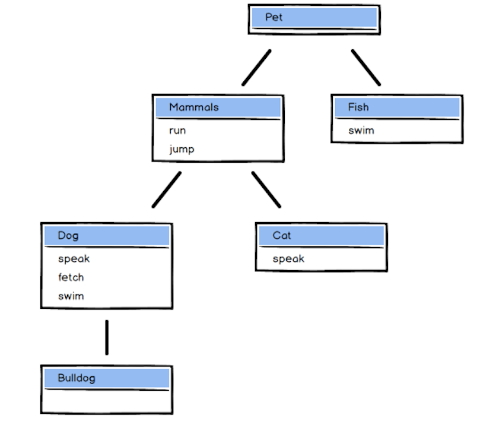

# Lesson 4: Subclassing and Code Reuse Patterns

## Assignment 1. Introduction

So far in this course, we've discussed a number of different concepts which underpin the Object Oriented Programming paradigm. We've also explored various different ways in which these concepts are implemented in the context of a JavaScript program.

By this point you should be comfortable with the concept of using objects to *encapsulate* data and behavior in order to add structure to your code, and the importance of **function execution context** when working with objects in this way. You should have an understanding of using prototypes to delegate property and method access. You should also be familiar with using object creation patterns in order to create multiple objects of the same **type**.

The advantages of using an object-oriented approach really start to become apparent when you combine some of these concepts together. In this lesson, we'll explore how you can *leverage prototypal delegation* to create object **subtypes**. This is one way of enabling code re-use within your programs. Another way of enabling code re-use is by using **mix-ins**, we'll look at how to do that too. Finally, we'll tie these ideas together by discussing another of the fundamental pillars of OOP: **polymorphism**.

As well as this, we'll demonstrate the flexibility of object-orientation in JavaScript by exploring another object creation pattern, the **OLOO pattern**.

## Assignment 2. Object Creation with Prototypes (OLOO)

### 2.1 Review of Factory Function

In a prior lesson, we showed an example of an object creation pattern called the **factory function**. We'll revisit that example and use it to illustrate another object creation pattern that uses prototypes. Here's the code that we saw earlier:

```js
function createCar(make, model, year) {
  return {
    make,
    model,
    year,
    started: false,

    start() {
      this.started = true;
    }

    stop() {
      this.started = false;
    },
  };
}
```

The `createCar` function takes three arguments and returns a car object with four properties and two methods. We can use it like this:

```js
let car1 = createCar('Toyota', 'Corolla', 2016);
let car2 = createCar('Honda', 'Civic', 2017);
```

### 2.2 The OLOO Pattern

As discussed earlier factory functions aren't the only way to create objects in bulk. Another pattern that we can use is the **OLOO** pattern: **Objects Linking to Other Objects**. It uses prototypes and involves extracting properties common to all objects of the same type (e.g., car objects) to a prototype object. All objects of the same type the inherit from the prototype.

Let's do that with car objects. What properties are common to all car objects? Here, those properties are the `start` and `stop` methods. All cars have `make`, `model`, `year`, and `started` properties as well, but each object has different values for those properties. Thus, we don't count them as being common to all cars.

We can extract the `start` and `stop` methods to a prototype object.

```js
let carPrototype = {
  start: function() {
    this.started = true;
  },

  stop: function() {
    this.started = false;
  },
};
```

Now that we have a car prototype object, all car objects can inherit from it:

```js
let car1 = Object.create(carPrototype);
car1.make = 'Toyota';
car1.model = 'Corolla';
car1.year = 2016;
```

We can now call `start` and `stop` on the `car1` object since both are accessible through it prototype, `carPrototype`.

```js
car1.start();
car1.started; // => true

car1.stop();
car1.started; // => false
```

Calling `start` and `stop` on the `car1` object changes the state of `car1` even though those methods don't belong to `car1`. That shouldn't come as a surprise since we're using `car1` as the execution context for the calls. When we call these methods, `this` is set to `car1`, so the methods change the `started` property in `car1`.

That's all well and good. We've set up a car prototype that all our car objects can inherit. However, we still have a small problem: *we must set the `make`, `model`, and `year` properties manually every time we create a car object*. Can we automate that? Fortunately, yes; there's more than one way. The most common technique uses an `init` method on the prototype object:

```js
let carPrototype = {
  start: function() {
    this.started = true;
  },

  stop: function() {
    this.started = false;
  },

  init(make, model, year) {
    this.make = make;
    this.model = model;
    this.year = year;
  },
};
```

We can then use it like so:

```js
let car1 = Object.create(carPrototype);
car1.init('Toyota', 'Corolla', 2016);
```

This code is certainly better, but we still need two lines of code to create a new car object. A small improvement to our `init` method can change that as well:

```js
let carPrototype = {
  start: function() {
    this.started = true;
  },

  stop: function() {
    this.started = false;
  },

  init(make, model, year) {
    this.make = make;
    this.model = model;
    this.year = year;
    return this; // <-- small improvement to the `init` method
  },
};
```

Since `init` now returns a reference to the car object it was called on, we can chain `create` and `init` and assign the result to the `car1` variable.

```js
let car1 = Object.create(carPrototype).init('Toyota', 'Corolla', 2016);
```

### 2.3 Advantage of OLOO over Factory Function

You can use both factory functions and the OLOO pattern to bulk create objects of the same type. Though the result is an object creation mechanism in both cases, the OLOO pattern has one significant advantage over factory functions: **memory efficiency**. Since all objects created with the OLOO pattern *inherit methods from a single prototype object*, the objects that inherit from that prototype object share the same methods. Factory functions, on the other hand, create copies of all the methods for each new object. That can have a significant performance impact, especially on smaller devices with limited memory.

However, that doesn't mean that OLOO is decidedly better than the factory pattern. An advantage of the factory pattern is that it lets us *create objects with private state*. If that doesn't make sense to you yet, don't worry. We'll return to this topic in a later course when we discuss **closures**.

## Assignment 3. Practice Problems: Object Creation with Prototypes

### 3.1 Use a factory function to create pet objects. The factory should let us create and use pets like this:

```js
function createPet(animal, name) {
  return {
    animal: animal, // animal,
    name: name, // name,

    sleep: function() { // sleep()
      console.log("I am sleeping");
    },

    wake: function() { // wake()
      console.log("I am awake");
    },
  };
}

let pudding = createPet("Cat", "Pudding");
console.log(`I am a ${pudding.animal}. My name is ${pudding.name}.`);
pudding.sleep(); // I am sleeping
pudding.wake(); // I am awake

let neptune = createPet("Fish", "Neptune");
console.log(`I am a ${neptune.animal}. My name is ${neptune.name}`);
neptune.sleep(); // I am sleeping
neptune.wake(); // I am awake
```

### 3.2 Use the OLOO pattern to create an object prototype that we can use to create pet objects. The prototype should let us create and use pets like this:

```js
const PetPrototype = {
  init(animal, name) {
    this.animal = animal;
    this.name = name;
    return this;
  },

  sleep: function() {
    console.log("I am sleeping");
  },

  wake: function() {
    console.log("I am awake");
  },
};

let pudding = Object.create(PetPrototype).init("Cat", "Pudding");
console.log(`I am a ${pudding.animal}. My name is ${pudding.name}`);
pudding.sleep(); // I am sleeping
pudding.wake(); // I am awake

let neptune = Object.create(PetPrototype).init("Fish", "Neptune");
console.log(`I am a ${neptune.animal}. My name is ${neptune.name}.`);
neptune.sleep(); // I am sleeping
neptune.wake();  // I am awake
```

### 3.3 Consider the objects created by the programs in problems 1 and 2. How do objects for the same animal differ from each other?

Objects created with the OLOO have a prototype object that contains the methods associated with the created objects. Since all pets created from the prototype share a single prototype object, they all share the same methods. With the factory function, each object has a copy of all the methods. Thus, objects created by OLOO are more efficient in terms of memory use.

Objects created with the factory function can have private state. Any state stored in the body of the factory function instead of in the returned object is private to the returned object. They can't be accessed or modified unless one of the object methods exposes the state. With OLOO, there is no way to define private state. All object state can be accessed and modified by outside code.

## Assignment 4. Subtyping with Constructors and Prototypes

### 4.1 Introduction

In an earlier lesson, we learned how to use constructors together with prototypes to create objects of the same type. The combination of constructors and prototypes gives us something that resembles a **class**, a construct used in classical OOP languages like Java, Python, and Ruby. A *class is a blueprint for creating objects*. Traditional OOP languages use classes to create distinct objects of a particular type and give those objects the behaviors and state that they need.

Constructors and prototypes let us mimic classes in JavaScript. Until recently, the language had nothing that you could reasonably call a class. That made it hard for developers familiar with class-based languages to switch to JavaScript. One can even argue that constructors and prototypes are part of the language solely to make it easier for developers to switch to JavaScript.

An essential part of the OO paradigm is the concept of inheritance. In most OOP languages, inheritance means something a bit different from the way we use it in conjunction with JavaScript. That can make JavaScript inheritance confusing if you've seen inheritance in other languages. For now, it may be wise to forget what you think you know about inheritance based on those other languages.

Let's look at an example that shows why we might need inheritance in an application. Assume that we have a drawing application that lets the user work with shapes. In this app, the constructor/prototype combination for rectangles might look like this:

```js
function Rectangle(length, width) {
  this.length;
  this.width;
}

Rectangle.prototype.getArea = function() {
  return this.length * this.width;
};

Rectangle.prototype.toString = function() {
  return `[Rectangle ${this.length} x ${this.width}]`;
}
```

We can create and manipulate `Rectangle` objects like so:

```js
let rect = new Rectangle(10, 5);
rect.getArea(); // => 50
rect.toString(); // '[Rectangle 10 x 5]'
```

Our `Rectangle` constructor creates rectangle objects that have `width` and `length` as properties and the methods `getArea` and `toString`.

Suppose our application also needs squares. We can set up another constructor/prototype combination for those squares, and then follow the same pattern we used for rectangles:

```js
function Square(size) {
  this.length = size;
  this.width = size;
}

Square.prototype.getArea = function() {
  return this.length * this.width;
};

Square.prototype.toString = function() {
  return `[Square ${this.length} x ${this.width}]`;
};

let sqr = new Square(5);
sqr.getArea();     // => 25
sqr.toString();    // => "[Square 5 x 5]"
```

There's some code duplication between this code and the `Rectangle` code. In particular, `Square.prototype.getArea` and `Rectangle.prototype.getArea` are identical. That gives us a chance to reuse some code.

We can *use prototypal inheritance to our advantage here*. One way to think about the relationship between `Square` and `Rectangle` is that a square is a special kind of rectangle where both the length and width are the same. We say that `Square` is a **sub-type** of `Rectangle`, or that `Rectangle` is a **super-type** of `Square`. Consider the following code:

```js
function Square(size) {
  this.length = size;
  this.width = size;
}

Square.prototype = Object.create(Rectangle.prototype);

Square.prototype.toString() = function() {
  return `[Square ${this.length} x ${this.width}]`;
};

let sqr = new Square(5);
sqr.getArea(); // => 25
sqr.toString(); // "[Square 5 x 5]"
```

Since a function's `prototype` property is writable -- we can change what object it references -- we can reassign `Square.prototype` to an object that inherits from `Rectangle.prototype`. The result is a prototype chain that looks like this:

```js
sqr ---> Square.prototype ---> Rectangle.prototype ---> Object.prototype
```

All objects created by the `Square` constructor inherit from `Square.prototype`, which we have set up to inherit from `Rectangle.prototype`. Thus, all square objects have access to methods on `Rectangle.prototype`. Since `toString` must be different for squares, we override it in `Square.prototype`. That is, we customize `Square.prototype.toString`. Since `getArea` *requires no customization*, we can let square objects use the inherited `Rectangle.prototype.getArea`.

### 4.2 Restoring the `constructor` property

One side-effect of this approach is that the `constructor` property on square objects points to `Rectangle` when it should point to `Square` instead:

```js
// omitted code

sqr.constructor === Rectangle; // => true
```

Why does that happen? It happens since we reassign `Square.prototype` to a new object that inherits from `Rectangle.prototype`, and the `constructor` property for `Rectangle.prototype` points back to `Rectangle`. Thus, `Square.prototype.constructor` points to `Rectangle`. To fix this situation, we merely need to reassign `Square.prototype.constructor` to `Square`:

```js
function Square(size) {
  this.length = size;
  this.width = size;
}

Square.prototype = Object.create(Rectangle.prototype);
Square.prototype.constructor = Square; // <-- reassign

Square.prototype.toString = function() {
  return `[Square ${this.length} x ${this.width}]`;
}

let sqr = new Square(5);
sqr.getArea(); // => 25
sqr.toString(); // => '[Square 5 x 5]'
sqr.constructor = Square; // => true
```

Why do we need to reassign the constructor property? In most cases, failure to reassign it won't hurt anything, and it certainly doesn't in this code. However, there are [situations where the value of the `constructor` property is important](https://2ality.com/2011/06/constructor-property.html).

### 4.3 Constructor Reuse

If you examine the bodies of the `Rectangle` and `Square` functions, you'll see that they're similar. That suggests that we may be able to use the `Rectangle` constructor in `Square`. To do that, we must *invoke `Rectangle` with its execution context explicitly set to the execution context of `Square`*:

```js
function Square(size) {
  Rectangle.call(this, size, size);
}
```

Our code now looks like this:

```js
function Rectangle(length, width) {
  this.length = length;
  this.width = width;
}

Rectangle.prototype.getArea = function() {
  return this.length * this.area;
}

Rectangle.prototype.toString = function() {
  return `[Rectangle ${this.length} x ${this.width}]`;
}

// rect test code omitted

function Square(size) {
  Rectangle.call(this, size, size);
}

Square.prototype = Object.create(Rectangle.prototype);
Square.prototype.constructor = Square;

Square.prototype.toString = function() {
  return `[Square ${this.length} x ${this.width}]`;
}

// sqr test code omittted
```

### 4.4 Prototypal Inheritance vs Pseudo-classical Inheritance

As used in JavaScript, the term **inheritance** is an *overloaded word*. It describes two related but distinct forms of inheritance: **prototypal** and **pseudo-classical**.

The *simpler form of inheritance* is **prototypal inheritance** or **prototypal delegation**. We sometimes call this form of inheritance **object inheritance** since it works with one object at a time. An object's internal `[[Prototype]]` property points to another object, and the object can delegate method calls to that other object. We've seen plenty of examples of prototypal inheritance in earlier assignments. For instance:

```js
let humanPrototype = {
  myName() { return this.name; },
  myAge() { return this.age; },
};

let personPrototype = Object.create(humanPrototype);
personPrototype.toString = function() {
  return `My name is ${this.myName()} and I'm ${this.myAge()} years old.`;
};

let will = Object.create(personPrototype);
will.name = 'William';
will.age = 28;
will.toString(); // => My name is William and I'm 28 years old.
```

Here, the `will` object inherits from the `personPrototype` object which, in turn, inherits from `humanPrototype`. `will`'s `[[Prototype]]` property refers to `personPrototype`, and the `[[Prototype]]` property of `personPrototype` refers to `humanPrototype`. When we invoke `toString`, it finds the methods `myName` and `myAge` on the `humanPrototype` object.

In this assignment, we've been using an object creation pattern called **pseudo-classical** object construction, also known as the **constructor/prototype pattern**. In this pattern, we use a constructor function and a prototype object to create objects and provide common methods for those objects. For instance:

```js
function Person(name, age) {
  this.name = name;
  this.age = age;
}

Person.prototype.toString = function() {
  return `My name is ${this.name} and I'm ${this.age} years old.`;
}
```

The term "pseudo-classical" refers to the fact that *the pattern mimics classes from other OO languages but doesn't actually use classes*.

This pattern forms the basis of **pseudo-classical inheritance**, also called **constructor inheritance**. When people talk about inheritance in the context of JavaScript, they often mean this kind of inheritance. In pseudo-classical inheritance, a constructor's prototype object (the object referenced by its `prototype` property) inherits from another constructor's prototype. That is, *a sub-type inherits from a super-type*.

For instance, we can *rewrite* the **prototypal inheritance** example to use **pseudo-classical inheritance**:

```js
function Human() {}
Human.prototype.myName = function() { return this.name; };
Human.prototype.myAge = function() { return this.age; };

function Person() {}
Person.prototype = Object.create(Human.prototype);
Person.prototype.constructor = Person;
Person.prototype.toString = function() {
  return `My name is ${this.myName()} and I'm ${this.myAge()} years old.`;
};

let will = new Person();
will.name = 'William';
will.age = 28;
will.toString(); // My name is William and I'm 28 years old.
```

Note that using `class` and the `extends` keyword is an alternative form of pseudo-classical inheritance. We'll meet the `extends` keyword a little later. So you'll recognize it later, here's what **pseudo-classical inheritance** looks like with `class` and `extends`:

```js
class Human {
  myName() { return this.name; }
  myAge() { return this.age; }
}

class Person extends Human {
  toString() {
    return `My name is ${this.myName()} and I'm ${this.myAge()} years old.`;
  }
}

let will = new Person();
will.name = 'William';
will.age = 28;
will.toString(); // => My name is William and I'm 28 years old.
```

Both pseudo-classical and prototypal inheritance *use prototypal delegation under the hood*. If the requested property isn't found, the object delegates the request to the object's prototype object. If the requested property isn't there either, the prototype object delegates the request to its own prototype object. This process follows the prototype chain until the property or method is found or the end of the prototype chain is found.

### 4.5 Practice Problem

Consider the following code:

```js
function Greeting() {}

Greeting.prototype.greet = function(message) {
  console.log(message);
};

function Hello() {}

Hello.prototype = Object.create(Greeting.prototype);

Hello.prototype.hi = function() {
  this.greet('Hello');
};

function Goodbye() {}

Goodbye.prototype = Object.create(Greeting.prototype);

Goodbye.prototype.bye = function() {
  this.greet('Goodbye');
};
```

What happens in each of the following cases? Try to answer without running the code.

**Case 1**

```js
let hello = new Hello();
hello.hi(); // Hello!
```

**Case 2**

```js
let hello = new Hello();
hello.bye(); // TypeError: hello.bye is not a function
```

**Case 3**

```js
let hello = new Hello();
hello.greet(); // undefined
```

**Case 4**

```js
let hello = new Hello();
hello.greet('Goodbye'); // Goodbye
```

**Case 5**

```js
Hello.hi(); // TypeError: Hello.hi is not a function
```

**Solution**

**Case 1** This code logs `Hello!` to the console.

**Case 2** This code raises a `TypeError`. Neither `Hello.prototype` nor its prototype, `Greeting.prototype`, have a `bye` method defined.

**Case 3** This code logs `undefined` to the console. Since `Hello` inherits from `Greeting`, the `hello` object has access to `greet`. However, `greet` takes an argument, which isn't supplied by this code.

**Case 4** This code logs `Goodbye` to the console.

**Case 5** This code also raises a `TypeError`. The `hi` method is defined on `Hello.prototype`, not on the `Hello` constructor itself. Thus, only instances of `Hello` have access to `hi`.

### 4.6 Further Reading

The following article summarizes the topics we've studied so far in this lesson and brings up some interesting aspects of constructors and prototypes that we haven't mentioned. (When is a cat a person?) Be sure to give it a read before you move forward:

[JavaScript Constructors and Prototypes](https://tobyho.com/2010/11/22/javascript-constructors-and/) by [Toby Ho](https://tobyho.com/)

Note that the referenced article takes advantage of JavaScript's automatic semicolon insertion mechanism. See the [On Semicolons section](https://launchschool.com/books/javascript/read/preparations#stylishjavascript) of our Introduction to Programming With JavaScript book for more information on why the author can do that.

```js
// simulate a class
function Person(name) {
  this.name = name;
}

// `new` statement to create a new `Person`
let omi = new Person('Omi');

// check that `Omi` is indeed a `Person`
omi instanceof Person // true

// don't call `Person` as a function without `new`
Person('Omi') // undefined

// unintentionally created a `name` global variable
name
// 'Omi'

/* Uh… that’s not good, especially if I already had a variable called name, it would have been overwritten. The reason this happens is because when you call a function as a function(without new), this is set to the global object - in the browser, this is the window object, see: */

window.name // // 'Omi'
this === window // true

/* So… if you want to write a constructor, use it like a constructor, if you want to write a function, use it like a function, don’t mix and match.

Someone pointed out though, that you can prevent this polluting of the namespace(those are just big words for creating global variables) by using this trick: */

function Person(name) {
  if (!(this instanceof Person));
    return new Person(name);
  this.name = name;
}

/* What this does is:

1. Check whether this is really a Person - which it would be if called using new.
2. If it indeed is a Person, go on your merry way.
3. If it is not a Person, use a new to create a Person - the correct way, and return it.

This allows calling it as a function to return a `Person`, and it doesn’t pollute the namespace. */

Person('Omi') // { name: 'Omi' }
name // undefined

// But what is surprising is that calling it with `new` still works too

new Person('Omi'); // { name: 'Omi' }

/* Why? It turns out that if you return a value in a constructor, Javascript will honor it, and return it as the newly created object when you use a `new`. But, you might be thinking, can I return a non-Person? That would be kind of like lying.

... I printed this to read again and annotate
*/
```

A Launch School student also wrote a [great article](https://medium.com/launch-school/javascript-design-patterns-building-a-mental-model-68c2d4356538) that may help solidify these concepts in your mind.

End 202203011 7:47

## Assignment 5. Subtyping with Classes

Of course, the new `class` keyword also supports subtyping. You'll learn how to do that in [this Gist](https://launchschool.com/gists/cdba6a8e).

### Inheritance with Class Declarations

In a prior assignment, we learned how one constructor's prototype can inherit from another constructor's prototype. For example:

```js
function Rectangle(length, width) {
  this.length = length;
  this.width = width;
}

Rectangle.prototype.getArea = function() {
  return this.length * this.width;
};

Rectangle.prototype.toString = function() {
  return `[Rectangle ${this.length} x ${this.width}]`;
};

function Square(size) {
  Rectangle.call(this, size, size);
}

Square.prototype = Object.create(Rectangle.prototype);
Square.prototype.constructor = Square;

Square.prototype.toString = function() {
  return `[Square ${this.length} x ${this.width}]`;
};
```

Let's convert that code to use classes instead of constructors and prototypes. The `Square` constructor's prototype inherits from `Rectangle.prototype`, which gives square objects access to methods defined for rectangle objects. We can do the same thing with classes, but we now use the clean, straightforward syntax provided for JavaScript classes:

```js
class Rectangle {
  constructor(length, width) {
    this.length = length;
    this.width = width;
  }

  getArea() {
    return this.length * this.width;
  }

  toString() {
    return `[Rectangle ${this.width * this.length}]`;
  }
}

class Square extends Rectangle {
  constructor(size) {
    super(size, size);
  }

  toString() {
    return `[Square] ${this.width * this.length}`;
  }
}
```

The `extends` keyword signifies that the class named to the left of `extends` should inherit from the class specified to the right of `extends`. Note that we don't define `getArea` on the `Square` class since `Square` inherits it from `Rectangle` and doesn't need to customize or override the method.

#### `super`

Note also that the `Square` constructor calls a function that is represented by the keyword `super`. When called inside the `constructor` method, the `super` keyword refers to the constructor method for the parent class (the class that we inherit from). Thus, `super(size, size)` performs the same role performed by this code from our constructor/prototype example:

```js
function Square() {
  Rectangle.call(this, size, size);
}
```

You don't need to use `super` in every subclass, but in most cases you do. In particular, if the superclass's constructor creates any object properties, you must call `super` to ensure that those properties are set properly. For instance, in the `Rectangle` class above, we create two properties in the `Rectangle` constructor, so we must call `super` in `Square`'s constructor.

If you do call `super` in a subclass's constructor, you must *call it before you use* `this` in that constructor.

### Inheritance with Class Expressions

Let's look at another example of inheritance with classes:

```js
let Person = class {
  constructor(name, age) {
    this.name = name;
    this.age = age;
  }

  sayName() {
    console.log(`My name is ${this.name}.`);
  }
};

let Student = class extends Person {
  constructor(name, age, semester) {
    super(name, age);
    this.semester = semester;
  }

  enrollInCourse(courseNumber) {
    console.log(`${this.name} has enrolled in course ${courseNumber}.`);
  }
};

let student = new Student('Kim', 22, 'Fall');
student.sayName(); // logs 'My name is Kim.'
student.enrollInCourse('JS120'); // logs 'Kim has enrolled in course JS120.'
```

In this example, the `Student` class inherits from the `Person` class. That gives student objects access to methods of the `Person` class and extends person objects further by adding a `semester` property and an `enrollInCourse` method. Notice that we've reused `Person`'s constructor inside the `Student` constructor, and calling `super` with `name` and `age` since the `Student` constructor expects those arguments. We also assign the `semester` argument to the `semester` property after `super` returns.

Note that this most recent example uses class expressions instead of class declarations.

End Inheritance with Classes

After reading this Gist, you might want to review the [JavaScript OOP video](https://www.youtube.com/watch?v=-N9tBvlO9Bo) in part or in full. We realize that this is a long video, but in this case, the repetition is worth your while if you have any shakiness surrounding these concepts.

If you haven't already read it, you may also want to read [A shallow dive into the constructor property in Javascript](https://medium.com/@patel.aneeesh/a-shallow-dive-into-the-constructor-property-in-javascript-b0a89747058b) to get a better handle on the constructor property from the perspective of a student at roughly the same point in the JavaScript curriculum as you.

## Assignment 6. Practice Problems: Subtyping with Classes

### 6.1 Suppose we have the following classes:

```js
class Game {
  play() {
    return 'Start the game!';
  }
}

class Bingo extends Game {
  rulesOfPlay() {
    // rules of play
  }
}
```

What would happen if we added a `play` method to the `Bingo` class, keeping in mind that there is already a method of this name in the `Game` class from which the `Bingo` class inherits? Explain your answer. What do we call it when we define a method like this?

**Solution**

If we add a new `play` method to the `Bingo` class, objects created by `Bingo` will use that method instead of looking up the prototype chain and finding it in the `Game` class. As soon as JavaScript finds a method, it calls it. When a class redefines a method that a superclass defines, we call this "method overriding".

### 6.2 Let's practice creating a class hierarchy.

Create a class named `Greeting` that has a single method named `greet`. The method should take a string argument, and it should print that argument to the console.

Now, create two more classes that inherit from `Greeting`: one named `Hello`, and the other `Goodbye`. The `Hello` class should have a `hi` method that takes no arguments and logs `"Hello"`. The `Goodbye` class should have a `bye` method that logs `"Goodbye"`. Use the `greet` method from the `Greeting` class when implementing `Hello` and `Goodbye`; don't call `console.log` from either `Hello` or `Goodbye`.

```js
class Greeting {
  greet(message) {
    console.log(message);
  }
}

class Hello {
  hi() {
    this.greet('Hello');
  }
}


class Goodbye {
  bye() {
    this.greet('Goodbye')
  }
}
```

## Assignment 7. Rewriting OO RPS with Constructors and Classes

In the first lesson of this course, we wrote an RPS game using factory functions. In this assignment, we'll take everything we've learned about constructors and classes and rewrite the game twice: first with constructors and prototypes, and then with classes.

Before we begin, here's the RPS code that we will convert:

```js
// oo_rps_cp.js
let readline = require('readline-sync');

function createPlayer() {
  return {
    move: null,
  };
}

function createComputer() {
  let playerObject = createPlayer();

  let computerObject = {
    choose() {
      const choices = ['rock', 'paper', 'scissors'];
      let randomIndex = Math.floor(Math.random() * choices.length);
      this.move = choices[randomIndex];
    },
  };

  return Object.assign(playerObject, computerObject);
}

function createHuman() {
  let playerObject = createPlayer();
  let humanObject = {
    choose() {
      let choice;

      while (true) {
        console.log('Please choose rock, paper, or scissors:');
        choice = readline.question();
        if (['rock', 'paper', 'scissors'].includes(choice)) break;
        console.log('Sorry, invalid choice.');
      }

      this.move = choice;
    },
  };

  return Object.assign(playerObject, humanObject);
}

const RPSGame = {
  human: createHuman(),
  computer: createComputer(),

  displayWelcomeMessage() {
    console.log('Welcome to Rock, Paper, Scissors!');
  },

  displayGoodbyeMessage() {
    console.log('Thanks for playing Rock, Paper, Scissors. Goodbye!');
  },

  displayWinner() {
    console.log(`You chose: ${this.human.move}`);
    console.log(`The computer chose: ${this.computer.move}`);

    let humanMove = this.human.move;
    let computerMove = this.computer.move;

    if ((humanMove === 'rock' && computerMove === 'scissors') ||
        (humanMove === 'paper' && computerMove === 'rock') ||
        (humanMove === 'scissors' && computerMove === 'paper')) {
      console.log('You win!');
    } else if ((humanMove === 'rock' && computerMove === 'paper') ||
               (humanMove === 'paper' && computerMove === 'scissors') ||
               (humanMove === 'scissors' && computerMove === 'rock')) {
      console.log('Computer wins!');
    } else {
      console.log("It's a tie");
    }
  },

  playAgain() {
    console.log('Would you like to play again? (y/n)');
    let answer = readline.question();
    return answer.toLowerCase()[0] === 'y';
  },

  play() {
    this.displayWelcomeMessage();
    while (true) {
      this.human.choose();
      this.computer.choose();
      this.displayWinner();
      if (!this.playAgain()) break;
    }

    this.displayGoodbyeMessage();
  },
};

RPSGame.play();
```

### 7.1 OO RPS with Constructors and Prototypes

If you've read and understood the assignments thus far in this lesson, converting the RPS game to use constructors and prototypes shouldn't be too challenging. We encourage you to try doing it on your own before you read the rest of the assignment. The conversion is mostly a mechanical process:

1. Write a constructor function for each factory function.
2. Move the initialization code from the factory function into the constructor.
3. Move all the other methods from the factory function into the constructor's prototype.
4. Replace the factory function invocations with constructor calls.

#### 7.1.1 Converting the `RPSGame` Object

The `RPSGame` object is a singleton object that doesn't use a factory function since we only need one object. Should we convert it to a constructor? By the same reasoning that we don't need a factory function, we probably don't need a constructor. However, since our objective is to practice using constructors and prototypes, let's write a constructor for it as well.

Our `RPSGame` object currently looks like this:

```js
const RPSGame = {
  human: createHuman(),
  computer: createComputer(),

  displayWelcomeMessage() {
    console.log('Welcome to Rock, Paper, Scissors!');
  },

  displayGoodbyeMessage() {
    console.log('Thanks for playing Rock, Paper, Scissors. Goodbye!');
  },

  displayWinner() {
    console.log(`You chose: ${this.human.move}`);
    console.log(`The computer chose: ${this.computer.move}`);

    let humanMove = this.human.move;
    let computerMove = this.computer.move;

    if ((humanMove === 'rock' && computerMove === 'scissors') ||
        (humanMove === 'paper' && computerMove === 'rock') ||
        (humanMove === 'scissors' && computerMove === 'paper')) {
      console.log('You win!');
    } else if ((humanMove === 'rock' && computerMove === 'paper') ||
               (humanMove === 'paper' && computerMove === 'scissors') ||
               (humanMove === 'scissors' && computerMove === 'rock')) {
      console.log('Computer wins!');
    } else {
      console.log("It's a tie");
    }
  },

  playAgain() {
    console.log('Would you like to play again? (y/n)');
    let answer = readline.question();
    return answer.toLowerCase()[0] === 'y';
  },

  play() {
    this.displayWelcomeMessage();
    while (true) {
      this.human.choose();
      this.computer.choose();
      this.displayWinner();
      if (!this.playAgain()) break;
    }

    this.displayGoodbyeMessage();
  },
};
```

As we've learned, we typically initialize the state of an object in its constructor and put the instance methods in the constructor's prototype. The `RPSGame` object's state consists of two properties: `human` and `computer`. We'll use the constructor to create and initialize these properties for each new object:

```js
function RPSGame() {
  this.human = createHuman();
  this.computer = createComputer();
}
```

Pretty straightforward, isn't it?

Next, we can move all of the methods from the `RPSGame` object and put them in the constructor's prototype:

```js
RPSGame.prototype = {
  displayWelcomeMessage() {
    console.log('Welcome to Rock, Paper, Scissors!');
  },

  displayGoodbyeMessage() {
    console.log('Thanks for playing Rock, Paper, Scissors. Goodbye!');
  },

  displayWinner() {
    console.log(`You chose: ${this.human.move}`);
    console.log(`The computer chose: ${this.computer.move}`);

    let humanMove = this.human.move;
    let computerMove = this.computer.move;

    if ((humanMove === 'rock' && computerMove === 'scissors') ||
        (humanMove === 'paper' && computerMove === 'rock') ||
        (humanMove === 'scissors' && computerMove === 'paper')) {
      console.log('You win!');
    } else if ((humanMove === 'rock' && computerMove === 'paper') ||
               (humanMove === 'paper' && computerMove === 'scissors') ||
               (humanMove === 'scissors' && computerMove === 'rock')) {
      console.log('Computer wins!');
    } else {
      console.log("It's a tie");
    }
  },

  playAgain() {
    console.log('Would you like to play again? (y/n)');
    let answer = readline.question();
    return answer.toLowerCase()[0] === 'y';
  },

  play() {
    this.displayWelcomeMessage();
    while (true) {
      this.human.choose();
      this.computer.choose();
      this.displayWinner();
      if (!this.playAgain()) break;
    }
    this.displayGoodbyeMessage();
  }
};
```

Finally, we can make sure that the prototype points back to the constructor:

```js
RPSGame.prototype.constructor = RPSGame;
```

To start playing the game with the new `RPSGame` constructor, we need to instantiate a game object and call its `play` method:

```js
let game = new RPSGame();
game.play();
```

That's all there is to the `RPSGame` conversion.

#### 7.1.2 Converting the Player Creation Factories

Let's now turn our attention to the simplest factory function in the program, `createPlayer`. There's not much to this function, and the corresponding constructor is even simpler:

```js
function Player() {
  this.move = null;
}
```

That's it. We don't need to add any methods to the `Player` constructor's prototype.

Next, we'll convert the `createHuman` factory function. Recall that `createHuman` reuses the `createPlayer` factory to create a human object. In terms of constructors, that means that the `Human` constructor must inherit from `Player`. We can do that by using `call` to invoke `Player`'s constructor with the `Human` object as context:

```js
function Human() {
  Player.call(this);
}

Human.prototye.choose = function() {
  let choice;

  while (true) {
    console.log('Please choose rock, paper, or scissors:');
    choice = readline.question();
    if (['rock', 'paper', 'scissors'].includes(choice)) break;
    console.log('Sorry, invalid choice.');
  }

  this.move = choice;
};
```

Since `Player.prototype` doesn't have any methods, `Human.prototype` doesn't need to inherit from it. We only need to reuse the `Player` constructor in our `Human` constructor. We'll give the same treatment to the `createComputer` factory function:

```js
function Computer() {
  Player.call(this);
}

Computer.prototype.choose = function() {
  const choices = ['rock', 'paper', 'scissors'];
  let randomIndex = Math.floor(Math.random() * choices.length);
  this.move = choices[randomIndex];
}
```

If you later add methods to `Player.prototype`, you must remember to inherit from it:

```js
Player.prototype.doSomething = function() { /* omitted code */ };

Human.prototype = Object.create(Player.prototype);
Human.prototype.constructor = Human;
Human.prototype.choose = { /* omitted code */ };

Computer.prototype = Object.create(Player.prototype);
Computer.prototype.constructor = Computer;
Computer.prototype.choose = { /* omitted code */ };
```

The transformation is almost complete. The final task is to change the `RPSGame` constructor to use the `Human` and `Computer` constructors instead of the factory functions.

```js
function RPSGame() {
  this.human = new Human();
  this.computer = new Computer();
}
```

We now have a working RPS game created using constructors and prototypes. Make sure you run the new code and verify that it works as expected.

```js
let readline = require('readline-sync');

function Player() {
  this.move = null;
}

function Computer() {
  Player.call(this);
}

Computer.prototype.choose = function() {
  const choices = ['rock', 'paper', 'scissors'];
  let randomIndex = Math.floor(Math.random() * choices.length);
  this.move = choices[randomIndex];
};

function Human() {
  Player.call(this);
}

Human.prototype.choose = function () {
  let choice;

  while (true) {
    console.log('Please choose rock, paper, or scissors:');
    choice = readline.question();
    if (['rock', 'paper', 'scissors'].includes(choice)) break;
    console.log('Sorry, invalid choice.');
  }

  this.move = choice;
};

function RPSGame() {
  this.human = new Human();
  this.computer = new Computer();
}

RPSGame.prototype = {
  displayWelcomeMessage() {
    console.log('Welcome to Rock, Paper, Scissors!');
  },

  displayGoodbyeMessage() {
    console.log('Thanks for playing Rock, Paper, Scissors. Goodbye!');
  },

  displayWinner() {
    console.log(`You chose: ${this.human.move}`);
    console.log(`The computer chose: ${this.computer.move}`);

    let humanMove = this.human.move;
    let computerMove = this.computer.move;

    if ((humanMove === 'rock' && computerMove === 'scissors') ||
        (humanMove === 'paper' && computerMove === 'rock') ||
        (humanMove === 'scissors' && computerMove === 'paper')) {
      console.log('You win!');
    } else if ((humanMove === 'rock' && computerMove === 'paper') ||
               (humanMove === 'paper' && computerMove === 'scissors') ||
               (humanMove === 'scissors' && computerMove === 'rock')) {
      console.log('Computer wins!');
    } else {
      console.log("It's a tie");
    }
  },

  playAgain() {
    console.log('Would you like to play again? (y/n)');
    let answer = readline.question();
    return answer.toLowerCase()[0] === 'y';
  },

  play() {
    this.displayWelcomeMessage();
    while (true) {
      this.human.choose();
      this.computer.choose();
      this.displayWinner();
      if (!this.playAgain()) break;
    }
    this.displayGoodbyeMessage();
  }
};

RPSGame.prototype.constructor = RPSGame;

let game = new RPSGame();
game.play();
```

### 7.2 OO RPS with Classes

You've learned enough about constructors and classes and their similarities to attempt a version of OO RPS using classes. As with the conversion from factory functions to constructors and prototypes, the conversion of constructors and prototypes to classes is straightforward and mostly mechanical:

1. Write a class with the same name as the original constructor function.
2. Move the constructor function into the class and rename it as constructor.
3. Move all the prototype functions into the class.

Go ahead and try to convert the game yourself. When you've finished, compare your code with our solution:

```js
let readline = require('readline-sync');

class Player {
  constructor() {
    this.move = null;
  }
}

class Computer extends Player {
  constructor() {
    super();
  }

  choose() {
    const choices = ['rock', 'paper', 'scissors'];
    let randomIndex = Math.floor(Math.random() * choices.length);
    this.move = choices[randomIndex];
  }
}

class Human extends Player {
  constructor() {
    super();
  }

  choose() {
    let choice;

    while (true) {
      console.log('Please choose rock, paper, or scissors:');
      choice = readline.question();
      if (['rock', 'paper', 'scissors'].includes(choice)) break;
      console.log('Sorry, invalid choice.');
    }

    this.move = choice;
  }
}

class RPSGame {
  constructor() {
    this.human = new Human();
    this.computer = new Computer();
  }

  displayWelcomeMessage() {
    console.log('Welcome to Rock, Paper, Scissors!');
  }

  displayGoodbyeMessage() {
    console.log('Thanks for playing Rock, Paper, Scissors. Goodbye!');
  }

  displayWinner() {
    console.log(`You chose: ${this.human.move}`);
    console.log(`The computer chose: ${this.computer.move}`);

    let humanMove = this.human.move;
    let computerMove = this.computer.move;

    if ((humanMove === 'rock' && computerMove === 'scissors') ||
        (humanMove === 'paper' && computerMove === 'rock') ||
        (humanMove === 'scissors' && computerMove === 'paper')) {
      console.log('You win!');
    } else if ((humanMove === 'rock' && computerMove === 'paper') ||
               (humanMove === 'paper' && computerMove === 'scissors') ||
               (humanMove === 'scissors' && computerMove === 'rock')) {
      console.log('Computer wins!');
    } else {
      console.log("It's a tie");
    }
  }

  playAgain() {
    console.log('Would you like to play again? (y/n)');
    let answer = readline.question();
    return answer.toLowerCase()[0] === 'y';
  }

  play() {
    this.displayWelcomeMessage();
    while (true) {
      this.human.choose();
      this.computer.choose();
      this.displayWinner();
      if (!this.playAgain()) break;
    }

    this.displayGoodbyeMessage();
  }
}

let game = new RPSGame();
game.play();
```

## Assignment 8. Code Reuse with Mixins

### 8.1 Introduction

One problem with inheritance in JavaScript is that *objects can inherit from only one object, and classes can extend only one other class*. Ultimately, those two statements mean the same thing; an object can have only one prototype object. We call this **single inheritance**.

This restriction can be limiting and sometimes makes modeling some problem domains challenging. For instance, suppose we have a `Pet` class from which several other specific classes inherit. The inheritance relationship might look like this:



Note that the `swim` method is in two classes: `Dog` and `Fish`. Assuming that they have the same implementation, we would like to provide that method in one place, perhaps in a class. However, where can we move it? Some programming languages allow classes to inherit from multiple classes, a functionality known as multiple inheritance. JavaScript doesn't support **multiple inheritance**, so a class can only inherit from one class.

To be clear, when we say that an object can only have one prototype or that a class can only inherit from one class, we don't mean that the object or class can't inherit from an entire chain of prototypes or classes. It's perfectly acceptable for a `Whale` class to inherit from a `Mammal` class, which in turn inherits from an `Animal` class, which again inherits from the built-in `Object` type. Some students see this as multiple inheritance, but it is not: each object or class inherits directly from a single thing, so it is **single inheritance**. The chain of prototypes or superclasses merely comes along for the ride.

### 8.2 Mix-ins

Enter JavaScript mix-ins – a pattern that adds methods and properties from one object to another. It's not delegation with prototypes; the mix-in pattern merely copies the properties of one object to another with `Object.assign` or some similar technique. We've already seen a mix-in at work in our first OO implementation of Rock Paper Scissors where we mixed in objects returned by `createPlayer` with `createHuman` and `createComputer`.

For now, we're concerned with objects that can, in principle, belong to multiple and distinct types. For instance, in the bird world, there are birds that can swim and birds that can fly, but there are also birds that can't swim and birds that can't fly. Some birds can even do both.

**Bird**  | **Swim?**  | **Fly?**
------|--------|-----
Stork  | no  | yes
Parrot  | no  | yes
Penguin  | yes  | no
Ostrich  | yes  | no
Duck  | yes  | yes
Goose  | yes  | yes

How would we model this in JavaScript with inheritance? We start like this:

```js
class Bird {}

class Stork extends Bird {
  fly() {}
}

class Parrot extends Bird {
  fly() {}
}

class Penguin extends Bird {
  swim() {}
}

class Ostrich extends Bird {
  swim() {}
}

class Duck extends Bird {
  fly() {}
  swim() {}
}

class Goose extends Bird {
  fly() {}
  swim() {}
}
```

That was easy enough. However, there's a lot of duplication going on here: 4 of the various bird classes each have their own copy of the `swim` method, while 4 have their own copy of the `fly` method. In all likelihood, those 4 `fly` methods are identical, as are the 4 `swim` methods.

One way we can try to reduce the duplication is by using inheritance and a new class. Let's start with the `fly` method. We can define a `FlyingBird` type to handle this:

```js
class Bird {}

class FlyingBird extends Bird {
  fly() {}
}

class Stork extends FlyingBird {}

class Parrot extends FlyingBird {}

class Penguin extends Bird {
  swim() {}
}

class Ostrich extends Bird {
  swim() {}
}

class Duck extends FlyingBird {
  swim() {}
}

class Goose extends FlyingBird {
  swim() {}
}
```

Great! Let's see what happens when we try to refactor the `swim` method:

```js
class Bird {}

class FlyingBird extends Bird {
  fly() {}
}

class SwimmingBird extends Bird {
  swim() {}
}

class Stork extends FlyingBird {}

class Parrot extends FlyingBird {}

class Penguin extends SwimmingBird {}

class Ostrich extends SwimmingBird {}

// Hmmm.... we have a problem.
// What to do with ducks and geese???

class Duck extends FlyingBird {
  swim() {}
}

class Goose extends FlyingBird {
  swim() {}
}
```

We've hit a roadblock. The `Duck` and `Goose` classes represent both flying birds and swimming birds, but JavaScript only allows single inheritance. The lack of support for multiple inheritance means we can't just add a new class in and inherit from it.

Instead of using inheritance, we can use a **mix-in** instead. A mix-in is an object that defines one or more methods that can be "mixed-in" to a class. This grants that class access to all of the methods in the object. It's the only real workaround for the lack of multiple inheritance short of duplication. Let's see what mix-ins look like:

```js
const Swimmable = {
  swim() {};
}

class Bird {}

class FlyingBird extends Bird {
  fly() {}
}

class Stork extends FlyingBird {}

class Parrot extends FlyingBird {}

class Penguin extends Bird {}
Object.assign(Penguin.prototype, Swimmable);

class Ostrich extends Bird {}
Object.assign(Ostrich.prototype, Swimmable);

class Duck extends FlyingBird {}
Object.assign(Duck.prototype, Swimmable);

class Goose extends FlyingBird {}
Object.assign(Goose.prototype, Swimmable);
```

In this code, we've created a `Swimmable` object that has a `swim` method. To mix it into our various swimming birds, we've used `Object.assign` to add the methods from `Swimmable` to the prototype objects of those classes. It's a bit tedious, but not too difficult, and it works well.

For consistency, we could even eliminate the inheritance aspect entirely:

```js
const Swimmable = {
  swim() {}
}

const Flyable = {
  fly() {}
}

class Stork {}
Object.assign(Stork.prototype, Flyable);

class Parrot {}
Object.assign(Parrot.prototype, Flyable);

class Penguin {}
Object.assign(Penguin.prototype, Swimmable);

class Ostrich {}
Object.assign(Ostrich.prototype, Swimmable);

class Duck {}
Object.assign(Duck.prototype, Swimmable, Flyable);

class Goose {}
Object.assign(Goose.prototype, Swimmable, Flyable);
```

### 8.3 Mix-ins vs Inheritance

Some JavaScript developers argue that you should use factory functions with mix-ins exclusively. They suggest that inheritance fails at modeling some scenarios, but a combination of factory functions and mix-ins can model any object relationship. Why bother with class/constructor inheritance at all? Why not just use factory functions that mix in other objects instead? If we did that, we could *rewrite our example like this*:

```js
const Swimmable = {
  swim() {}
}

const Flyable = {
  fly() {}
}

function createFlyingBird() {
  return Object.assign({}, Flyable);
}

function createSwimmingBird() {
  return Object.assign({}, Swimmable);
}

function createTalentedBird() {
  return Object.assign({}, Swimmable, Flyable);
}

function createStork() {
  return createFlyingBird();
}

function createParrot() {
  return createFlyingBird();
}

function createPenguin() {
  return createSwimmingBird();
}

function createOstrich() {
  return createSwimmingBird();
}

function createDuck() {
  return createTalentedBird();
}

function createGoose() {
  return createTalentedBird();
}
```

This approach is valid, but it suffers the downsides of all factory functions:

1. Every new object receives a new copy of all of its methods, including new copies of both mix-in methods and the methods that belong more directly to the object. That can be taxing on memory resources, even more so than the memory requirements of mix-ins.

2. You can't determine the type of an object created with a factory function: the `instanceof` operator only recognizes these objects as instances of the `Object` type. As far as JavaScript is concerned, a penguin and a fish and an automobile are indistinguishable. That's not as troubling as it might sound in terms of being able to solve programming problems, but it has a more significant impact on debugging.

We *suggest a balance of mix-in and classical inheritance* pattern instead:

1. Inheritance works well when one object type is positively a sub-type of another object. In our example, it's natural for a penguin to also be a swimming bird. These types have an **is a** relationship: a penguin *is a* swimming bird. Whenever two object types have an "is a" relationship, constructor or class inheritance makes sense.

2. On the other hand, the ability to swim doesn't have that kind of relationship with storks. Swimming is a capability that penguins have. Similarly, flying is a capability that storks have. When you want to endow your objects with some capability, a mix-in may be the correct choice.

### 8.4 Practice Problems

### 8.4.1 If we have a `Car` class and a `Truck` class, how can you use the `Speed` object as a mix-in to make them `goFast`? How can you check whether your `Car` or `Truck` can now go fast?

```js
const Speed = {
  goFast() {
    console.log(`I'm a ${this.constructor.name} and going super fast!`);
  }
};

class Car {
  goSlow() {
    console.log(`I'm safe and driving slow.`);
  }
}

Object.assign(Car.prototype, Speed);

class Truck {
  goVerySlow() {
    console.log(`I'm a heavy truck and like going very slow.`);
  }
}

Object.assign(Truck.prototype.Speed);
```

**Solution**

```js
const Speed = {
  goFast() {
    console.log(`I'm a ${this.constructor.name} and going super fast!`);
  }
};

class Car {
  goSlow() {
    console.log(`I'm safe and driving slow.`);
  }
}

Object.assign(Car.prototype, Speed); // <--

class Truck {
  goVerySlow() {
    console.log(`I'm a heavy truck and like going very slow.`);
  }
}

Object.assign(Truck.prototype, Speed); // <--
```

Testing that we can make our cars and trucks go fast is simple; all we must do is call `goFast` on a car or truck object:

```js
let blueTruck = new Truck();
blueTruck.goFast(); // => logs "I'm a Truck and going super fast!"

let smallCar = new Car();
smallCar.goFast(); // => logs "I'm a Car and going super fast!"
```

If you need to check whether an object responds to a specific method, you can use the `in` operator:

```js
'goFast' in smallCar; // => true
'goFast' in blueTruck; // => true
```

### 8.4.2

In the last question, we used a mix-in named `Speed` that contained a `goFast` method. We included the mix-in in the `Car` class and then called the `goFast` method from an instance of the `Car` class. You may have noticed that the string printed when we call `goFast` includes the name of the type of vehicle we are using. How is that done?

**Hint**

Since the `constructor` property references a function object, `constructor.name` references the `name` property on that object. Use MDN to lookup the definition of `Function.name`.

`Function.name`

A `Function` object's read-only `name` property indicates the function's name as specified when it was created, or it may be either `anonymous` or `''` (an empty string) for functions created anonymously.

**Solution**

We used `this.constructor.name` to determine the name. It works like this:

1. Within `goFast`, `this` refers to the object that invoked the method. In this case, we used `Car` and `Truck` objects.
2. The `constructor` property of an object references the class that the object belongs to, i.e., `Car` or `Truck`.
3. Constructors have a `name` property that merely contains the name of the class as a string, and that's what we output in `goFast`.

### 8.4.3 Ben and Alyssa are working on a vehicle management system. Thus far, they have created classes named `Auto` and `Motorcycle` to represent automobiles and motorcycles. After they noticed that the information and calculations performed was common to both vehicle types, they decided to break out the commonality into a separate class named `WheeledVehicle`. Their code, thus far, looks like this:

```js
class WheeledVehicle {
  constructor(tirePressure, kmTravelledPerLiter, fuelCapInLiter) {
    this.tires = tirePressure;
    this.fuelEfficiency = kmTravelledPerLiter;
    this.fuelCap = fuelCapInLiter;
  }

  tirePressure(tireIdx) {
    return this.tires[tireIdx];
  }

  inflateTire(tireIdx, pressure) {
    this.tires[tireIdx] = pressure;
  }

  range() {
    return this.fuelCap *  this.fuelEfficiency;
  }
}

class Auto extends WheeledVehicle {
  constructor() {
    // the array represents tire pressure for four tires
    super([30,30,32,32], 50, 25.0);
  }
}

class Motorcycle extends WheeledVehicle {
  constructor() {
    // array represents tire pressure for two tires
    super([20,20], 80, 8.0);
  }
}
```

Their boss now wants them to incorporate a new type of vehicle: a `Catamaran`.

```js
class Catamaran {
  constructor(propellerCount, hullCount, kmTravelledPerLiter, fuelCapInLiter) {
    // catamaran specific logic

    this.propellerCount = propellerCount;
    this.hullCount = hullCount;
  }
}
```

This new class doesn't fit well with our existing class hierarchy: Catamarans don't have tires, and aren't wheeled vehicles. However, we still want to share the code for tracking fuel efficiency and range. Modify the class definitions and move code into a mix-in, as needed, to share code between the `Catamaran` and the wheeled vehicle classes.

**Solution**

```js
const Moveable = {
  range() {
    return this.fuelCap * this.fuelEfficiency;
  }
};

class WheeledVehicle {
  constructor(tirePressure, kmTravelledPerLiter, fuelCapInLiter) {
    this.tires = tirePressure;
    this.fuelEfficiency = kmTravelledPerLiter;
    this.fuelCap = fuelCapInLiter;
  }

  tirePressure(tireIdx) {
    return this.tires[tireIdx];
  }

  inflateTire(tireIdx, pressure) {
    this.tires[tireIdx] = pressure;
  }
}

Object.assign(WheeledVehicle.prototype, Moveable);

class Auto extends WheeledVehicle {
  constructor() {
    // the array represents tire pressure for four tires
    super([30,30,32,32], 50, 25.0);
  }
}

class Motorcycle extends WheeledVehicle {
  constructor() {
    // array represents tire pressure for two tires
    super([20,20], 80, 8.0);
  }
}

class Catamaran {
  constructor(propellerCount, hullCount, kmTravelledPerLiter, fuelCapInLiter) {
    // catamaran specific logic

    this.propellerCount = propellerCount;
    this.hullCount = hullCount;
    this.fuelEfficiency = kmTravelledPerLiter;
    this.fuelCap = fuelCapInLiter;
  }
}

Object.assign(Catamaran.prototype, Moveable);
```

We've moved the code shared by `Catamaran` and `WheeledVehicles` to the `Moveable` mix-in. The definitions of `Auto` and `Motorcycle` remain unchanged since they both inherit from `WheeledVehicle`.

### 8.5 Code Reuse with Mixins Summary

JavaScript objects can only inherit from one other object. This limitation makes it difficult to model certain domains using class or constructor-based inheritance. You can use mix-ins to share behavior between otherwise unrelated classes.

## Assignment 9. Polymorphism

**Polymorphism** refers to the ability of objects with different types to respond in different ways to the same message (or method invocation); that is, data of different types can respond to a common interface. It's a crucial concept in OO programming that can lead to more maintainable code.

When two or more object types have a method with the same name, we can invoke that method with any of those objects. **When we don't care what type of object is calling the method, we're using polymorphism**. Often, polymorphism involves inheritance from a common superclass. However, inheritance isn't necessary as we'll see in this assignment.

For example, assume we have a method that expects an argument that has a `move` method. We can pass it any type of argument, provided it has a compatible `move` method. The object might represent a human, a cat, a jellyfish, or, conceivably, even a car or train. That is, it lets objects of different types respond to the same method invocation.

There are two chief ways to implement polymorphism.

### 9.1 Polymorphism through Inheritance

Examine the following code:

```js
class Animal {
  move() {}
}

class Fish extends Animal {
  move() {
    console.log("swimming");
  }
}

class Cat extends Animal {
  move() {
    console.log("walking");
  }
}

// Sponges and Corals don't have a separate move method - they don't move
class Sponge extends Animal {}
class Coral extends Animal {}

let animals = [new Fish(), new Cat(), new Sponge(), new Coral()];
animals.forEach(animal => animal.move());
```

Every object in the array is a different animal, but the client code -- the code that uses those objects -- doesn't care what each object is. The only thing it cares about here is that each object in the array has a `move` method that requires no arguments. That is, every generic animal object implements some form of locomotion, though some animals don't move. The interface for this class hierarchy lets us *work with all of those types in the same way even though the implementations may be dramatically different*. That is polymorphism.

If we run the above code, we call the `move` method for each of 4 different kinds of animal. Let's look at them in pairs.

The `Sponge` and `Coral` classes don't have a `move` method -- at least not one of their own. Instead, they both inherit it from the `Animal` class via the prototype chain. Thus, when we call `move` on a `Sponge` or `Coral` object, the `move` method in the `Animal` class gets called. That method does nothing here, so the `Sponge` or `Coral` doesn't move. This is polymorphism through inheritance -- instead of providing our own behavior for the `move` method, we're using inheritance to acquire the behavior of a supertype. In this case, that behavior does nothing, but *it could do something else*.

For `Fish` objects, we call the `move` method from the `Fish` class, which enables a fish to swim. Likewise, a `Cat` object walks when we tell it to `move`. This is a simple example of polymorphism in which two different object types can respond to the same method call simply by **overriding** a method inherited from a superclass. In a sense, overriding methods like this is similar to duck-typing, a concept that we'll meet shortly. However, overriding is generally treated as an aspect of inheritance, so this is polymorphism through inheritance.

An example of inheritance-based polymorphism in action is the JavaScript `toString` method. The `Object` type provides a default implementation of `toString()` that other types inherit. Other types can also override the method to return a customized string representation of the object. Without customization, `toString` returns the string `'[object Object]'` when called on an object. With customization, it can return something more meaningful and useful. For instance, arrays and dates are objects that have customized `toString` methods:

```js
> [1, 2, 3].toString()
'1,2,3'

> (new Date()).toString()
'Sun Mar 13 2022 10:51:46 GMT-0400 (Eastern Daylight Time)'
```

### 9.2 Polymorphism through Duck Typing

**Duck typing** occurs when objects of different *unrelated* types both respond to the same method name. With duck typing, we aren't concerned with the class or type of an object, but we do care whether an object has a particular behavior. *If an object quacks like a duck, then we can treat it as a duck*. Specifically, *duck typing is a form of polymorphism*. As long as the objects involved use the same method name and take the same number of arguments, we can treat the object as belonging to a specific category of objects.

For example, an application may have a variety of elements that can respond to a mouse click by calling a method named something like `handleClick`. Those elements may be completely different -- for instance, a checkbox vs. a text input field -- but they're all *clickable* objects. Duck typing is an informal way to classify or ascribe a type to objects. Classes and constructors provide a more formal way to do that.

In the next example, we define a `Wedding` class and several preparer classes. The example attempts to implement polymorphic behavior without using duck typing; it shows you ***how you shouldn't do it***!

```js
class Chef {
  prepareFood(guests) {
    // implementation
  }
}

class Decorator {
  decoratePlace(flowers) {
    // implementation
  }
}

class Musician {
  preparePerformance(songs) {
    // implementation
  }
}

class Wedding {
  constructor(guests, flowers, songs) {
    this.guests = guests;
    this.flowers = flowers;
    this.songs = songs;
  }

  prepare(preparers) {
    preparers.forEach(preparer => {
      if (preparer instanceof Chef) {
        preparer.prepareFood(this.guests);
      } else if (preparer instanceof Decorator) {
        preparer.decoratePlace(this.flowers);
      } else if (preparer instanceof Musician) {
        preparer.preparePerformance(this.songs);
      }
    });
  }
}
```

The problem with this code is that the `prepare` method has too many dependencies; it relies on specific classes and their names. It also needs to know which method it should call on each type of object, as well as the arguments that each method requires. If you change the way any of those methods are used or add a new type of preparer, you must also change `Wedding.prototype.prepare`. For instance, if we need to add a dressmaker, we must add another else clause. With only 4 preparers, `prepare` is already becoming long and messy.

The right way to implement this program is to *use duck typing to implement polymorphism*:

```js
class Chef {
  prepare(wedding) {
    this.prepareFood(wedding.guests);
  }

  prepareFood(guests) {
    // implementation
  }
}

class Decorator {
  prepare(wedding) {
    this.decoratePlace(wedding.flowers);
  }

  decoratePlace(flowers) {
    // implementation
  }
}

class Musician {
  prepare(wedding) {
    this.preparePerformance(wedding.songs);
  }

  preparePerformance(songs) {
    // implementation
  }
}

class Wedding {
  constructor(guests, flowers, songs) {
    this.guests = guests;
    this.flowers = flowers;
    this.songs = songs;
  }

  prepare(preparers) {
    preparers.forEach(preparer => {
      preparer.prepare(this);
    });
  }
}
```

Though there is no inheritance in this example, each of the preparer-type classes provides a `prepare` method. We still have polymorphism since all of the objects respond to the `prepare` method call. If we later need to add another preparer type, we can create another class and implement the `prepare` method to perform the appropriate actions.

Note that merely having two different objects that have a method with the same name and compatible arguments doesn't mean that you have polymorphism. In theory, those methods might be used polymorphically, but that doesn't always make sense. Consider the following two classes:

```js
class Circle {
  draw() {}
}

class Blinds {
  draw() {}
}
```

These classes each have a method named `draw`, and the methods take no arguments. In the `Circle` class, `draw` presumably draws a circle on the screen. In the `Blinds` class, `draw` may cause the window blinds in an office building to be drawn (as in close or open). In theory, you could write some code that uses these methods polymorphically:

```js
[new Circle(), new Blinds()].forEach(obj => obj.draw());
```

However, it's unlikely that this would ever make sense in real code. Unless you're actually calling the method in a polymorphic manner, you don't have polymorphism. In practice, polymorphic methods are *intentionally designed to be polymorphic*; if there's no intention, you probably shouldn't use them polymorphically.

## Assignment 10. Summary

1. The **Objects Linking to Other Objects (OLOO)** pattern of object creation uses a prototype object, an initializer method, and the `Object.create` method to create objects with shared behavior. The initializer customizes the state for each object, and is usually named `init`.

2. The combination of constructors and prototypes provides a way of mimicking classical inheritance with JavaScript. This lets us create **sub-type** objects, which can 'inherit' methods from a **super-type** object. This is one way of facilitating code re-use.

3. There's a limitation with the inheritance pattern, which is that objects can only directly 'inherit' from one super-type object. In other words, an object can have only one prototype object. Mixins provide a way of addressing this limitation. The mix-in pattern involves creating a mix-in object containing certain methods, and using `Object.assign()` to mix that object into another object.

4. Polymorphism refers to the ability of objects with different types to respond to the same method invocation. It can be implemented through inheritance by *method overriding*. It can also be implemented through **duck typing**; by ensuring that objects of different **types** use the same method name to perform different but related functions, those objects can be interacted with in a uniform way.

## Assignment 11. Lesson 4 Quiz 1

Assignment: Lesson 4 Quiz 1
Student Name: HyoSung Bidol-Lee
Submitted at: less than a minute ago
Time taken: 0.13 hour(s)
Score: 5/9 (55.56%)

I will make Anki cards of these questions.
