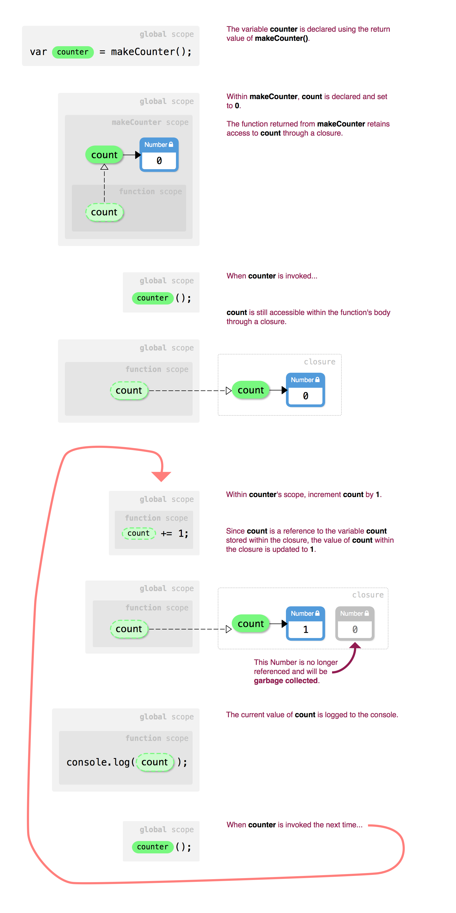

# Lesson 2 > Advanced Concepts

## 1. Introduction

With that bit of practice under your belt, it's time to move on and start learning some new concepts and techniques. We'll explore a bunch of new ideas, including hoisting, strict mode, closures, IIFEs, modules, exceptions, and garbage collection. It's a bit of a hodge-podge -- most of the assignments are standalone in that the later assignments don't lean heavily on the earlier ones. Nevertheless, the information presented is important.

At the end of this lesson, you'll have an excellent working knowledge of JavaScript, and will be ready to start using it in more advanced applications. Let's go!

## 2. The `var` Statement

It may surprise you to learn that `let` and `const` are relatively new language features. ES6 introduced these keywords in 2015, but it took a few years before they saw widespread use in applications.

Before `let` and `const` were added to JavaScript, developers declared variables with the `var` statement. While `let` and `const` are now preferred by many developers, there is plenty of old code around that still uses `var`. Inexplicably, some developers even prefer `var`. One way or the other, you will probably have to deal with `var`. Now is as good a time as any to learn about it.

Thus far, we've used the `let` and `const` statements to declare variables. These statements are simple and relatively easy to understand and use; they declare and initialize variables and constants, respectively, and create variables with block scope, which is easy to understand.

Unless stated otherwise, run the examples in this assignment with Node and a JavaScript file, e.g.:

```sh
$ node example.js
```

If you enter code one line at a time in the Node REPL, you may not see the behaviors we want to demonstrate. We'll talk about why this a little later.

### 2.1 What to Focus On

The `var` statement is no longer as important for JavaScript developers to understand as it once was. However, many older JavaScript programs and some newer programs contain `var` statements. You will undoubtedly encounter such code in your career, so you must understand how `var` works. In particular, you must know how it differs from `let` and `const`.

### 2.2 The `var` Statement

Specifically, the `var` statement looks a lot like the `let` and `const` statements.

```js
var foo;
var bar = "qux";
var baz = 3.1415;
```

All three of these statements create a variable. The first creates a variable named `foo`, but sets its value to `undefined`. The second creates a variable named `bar` and assigns `"qux"` as its initial value. The last statement creates a variable named `baz` and gives it an initial value of `3.1415`. Compare that with `let` and `const`:

```js
let foo;
let bar = "qux";
const baz = 3.1415;
```

The two `let` statements are similar to the `var` statements. The first creates a variable named `foo` with an initial value of `undefined`, while the second creates one named `bar` with a value of `qux`. The `const` statement creates a variable whose value cannot be changed. The `var` statement provides no way to create constants like `baz`, so that's one significant disadvantage to using `var`. Despite the similarities, the differences between `let` and `var` are more wide-reaching.

### 2.3 How do `var` and `let` Differ?

The easiest way to see how `var` and `let` differ is with a couple of examples. First, let's see how they interact with the global object:

```js
//**********************************************************
// Use the Node REPL for this example.
// Type the commands one at a time - don't use copy and paste.
//**********************************************************

var bar = 42;
console.log(global.bar); // 42
bar += 1;
console.log(global.bar); // 43

let foo = 86;
console.log(global.foo); // undefined
```

This example shows that using `var` at the top level of a program creates a property on the global object, e.g., `global` in Node or `window` in a browser. Thus, we can use `global.bar` to examine the value of `bar`. However, the `let` declaration doesn't add a property to the global object. In fact, it doesn't add a property to any object - it simply creates a variable. Since the `global.foo` doesn't exist, JavaScript returns `undefined` when we try to access it.

This behavior shows that `let` is safer than `var` when used at the program's top level. Placing properties on the global object may lead to conflicts and bugs; `let` alleviates that issue.

When you use `var` inside a function, the variable is **not** stored as a property of the global object:

```js
function foo() {
  var bar = 42;
  console.log(global.bar); // undefined
}

foo();
```

### 2.4 Scope and `var`

A much more significant difference is that `let` is **block-scoped**, while `var` is **function-scoped**. A block-scoped variable is only visible within the block where it is declared; in JavaScript, a block is code delimited by curly braces, `{...}`.

(Remember: [not everything between braces is a block](https://launchschool.com/books/javascript/read/variables#variablescope).)

Not everything between curly braces is technically a block. For instance, the braces that surround an object literal do not define a block. Technically, the braces that surround a function body don't define a block either, though it is convenient to think of function bodies as blocks. While there are similarities between blocks, function bodies, and, to a lesser degree, object literals, the term block usually refers to executable code between braces, including function bodies:

```js
{
  // this is a block
  let foo = 42;
  console.log(foo);
}

if (answer === 'yes') {
  // this is a block
  console.log('yes');
} else {
  // so is this
  console.log('nope');
}

while (answer !== 'no') {
  // this is a block
  doSomething();
}

function foo() {
  // not technically a block. However, we can treat it as a block.
  let foo = 42;               // foo has block scope
  console.log(foo);
}

let foo = {
  // this is not a block
  bar: 42,
};
```

A function-scoped variable is visible within the function where it is declared. This difference in scope can lead to unexpected behavior when using `var`:

```js
function foo() {
  if (true) {
    var a = 1;
    let b = 2;
  }

  console.log(a); // 1
  console.log(b); // ReferenceError: b is not defined
}

foo();
```

Whoa! That is different. What's going on here? Why can we access variable `a` when it's declared inside the `if` statement's block, but we can't access `b` even though it is declared in the same block? That doesn't make much sense.

The answer is that `var` *creates a variable with function scope*, while `let` *creates a variable with block scope*. Thus, `a` is available everywhere in the function, but `b` is only available in the block.

That has a peculiar side effect when we use var. Consider this code:

```js
function foo() {
  if (false) {
    var a = 1; // line 3
  }

  console.log(a); // undefined
}

foo();
```

Even though the code on line 3 never runs, we still create a variable named `a` with function scope. Furthermore, since we're not initializing `a`, it receives a default value of `undefined` instead of `1`. Thus, line 7 displays `undefined`.

Though the difference in scope explains these behaviors, we also need to know how function-scope and block-scope work. That's where **hoisting** enters the picture. We'll get to that in the next two assignments.

Are you curious why we insisted that you use the Node REPL for the example at the beginning of this section? Let's see what happens when we put that code in a file and run it from the command line:

```js
var bar = 42;
console.log(global.bar);
bar += 1;
console.log(global.bar);

let foo = 86;
console.log(global.foo);
```

```sh
$ node global.js
undefined
undefined
undefined
```

Other than some deleted comments, our code hasn't changed. However, the results have. This time, we see `undefined` instead of `42` and `43` when we log the value of `global.bar`. This is a peculiarity of Node -- when you run a JavaScript program file with Node, Node "wraps" your code in a function that looks like this:

```js
(function (exports, require, module, __filename, __dirname) {
  // your code is here
});
```

Can you see why `bar` isn't defined in `global`? Think about it for a moment.

So, what's going on? The issue here is that your code is running inside a function. If you use `var` inside a function, it creates a function-scoped variable, not a global variable. Thus, the variable doesn't show up as a property of the global object.

Since the Node REPL doesn't use this **wrapper function**, `var` declarations at the top level are stored in the global object.

The effect of the wrapper function may sound like a bizarre edge case that won't affect you, but it probably will someday soon. This is because the wrapper function, or its absence, is the source of most problems involving differing behavior in the REPL and a program file.

### 2.5 Summary

In this assignment, we introduced the `var` statement. Though the `var` statement is mostly "on the way out," it hasn't been deprecated as of 2019. In fact, it will probably still be around for a very long time to come.

Coming up next, we'll look more deeply at the concept of scope and how it applies to declarations in JavaScript.

## 3. More About Scope

Now that we know about the `var` statement, let's take a closer look at scope. Our primary purpose in this assignment is to reduce the ambiguity involved in the language surrounding scope in JavaScript. To do that, we'll describe scope as three separate but related concepts.

Run the examples in this assignment with Node and a JavaScript file, e.g.:

```sh
node example.js
```

Do not use the Node REPL as it may interfere with the behaviors we want to demonstrate.

### 3.1 What to Focus On

Scope is a fundamental concept in all computer languages. However, the terminology can sometimes be a little confusing, especially in JavaScript. Thus, you should focus on understanding scope:

* What do we mean by declared scope, visibility scope, and lexical scope?
* What do we mean by global scope and local scope?
* What do we mean by inner scope and outer scope?
* What do we mean by function scope and block scope when talking about declared scope?
* What do we mean by function scope and block scope when talking about visibility scope?

### 3.2 Declared Scope vs Visibility Scope vs Lexical Scope

We use terms like global scope, local scope, function scope, block scope, inner scope, and outer scope when we talk about scope. Unfortunately, the terminology can be fluid and confusing. For instance, a variable can be declared with block scope by using the `let` keyword. If that declaration is inside a function, it has local scope. It can also have function scope if the declaration isn't inside a block. The variable can also have global scope if the declaration is at the topmost level of the program, outside all functions and blocks. To make matters worse, we can also talk about inner scope and outer scope. For instance, if you have a function that declares a variable, that variable is in the function's inner scope. However, the function can also reference variables from the surrounding scope, i.e., the function's outer scope.

What's a new developer to do? One way to help keep things straight is to look at scope as having *three subtly different but related meanings.*

In one sense, scope refers to where a particular identifier -- a variable, function, or class name -- is available for use by your code. We can call this the **visibility scope**. If a variable is available throughout your code, then it has global scope. Otherwise, it has local scope.

In another sense, scope refers to how a particular identifier is declared. We'll call this the **declared scope**. For instance, we use the `let` keyword to declare variables with block scope, and use `var` to declare variables with function scope. Knowing the declared scope lets us determine where a variable is available.

Finally, scope can refer to the lexical structure of your code. We'll call this the **lexical scope**. The lexical scope distinguishes between variables that are declared inside a function or block and the variables that are declared outside of that function or block. Lexical scope is especially important with **closure**, as we'll learn later.

The terms **visibility scope** and **declared scope** *are terms of convenience*. You probably won't find either term used outside of Launch School. **Lexical scope** *is widely used*.

Though the visibility, declared, and lexical scopes have different meanings, there is considerable overlap. For instance, if we use `let` to declare variables with block scope at the topmost level of the program, then those variables also have global scope:

```js
// `let` used to declare variables with block scope at the topmost level of the program also have global scope
let foo = 1;
let bar = 2;
console.log(foo, bar); //  1 2
```

However, if we rearrange that code *so part of it is inside a block*, we get something different:

```js
let bar = 2;

if (true) {
  let foo = 1;
  console.log(foo, bar); //  1 2
}
```

Here, both `foo` and `bar` are again declared with block scope. However, `foo` now has local scope for its visibility scope. Confusingly, we can also say that its visibility is block scope. Furthermore, `foo` in this example is in the block's inner scope, while `bar` is in its outer scope.

Let's explore these scopes in some more detail.

#### 3.2.1 Declared Scope

Declared scope concerns how a variable is declared: `let`, `const`, `class`, `var`, or `function`. The first three declare variables with **block scope** while the other two declare variables with **function scope**. *Even if the variable is declared outside of a function or block, it has either block or function scope:*

```js
let foo1 = 1;        // declared scope is block scope
var bar1 = 2;        // declared scope is function scope

if (true) {
  let foo2 = 3;      // declared scope is block scope
  var bar2 = 4;      // declared scope is function scope
}

function xyzzy() {  // declared scope is function scope
  let foo3 = 5;     // declared scope is block scope
  var bar3 = 6;     // declared scope is function scope

  if (true) {
    let foo4 = 7;   // declared scope is block scope
    var bar4 = 8;   // declared scope is function scope
  }
}
```

Note that the declared scope of each variable above is determined solely by which keyword was used to declare it: `let` or `var`.

Block Scope | Function Scope
---------|----------
 `let` | `var`
 `const` | `function`
 `class` | -

#### 3.2.2 Visibility Scope

Visibility scope concerns *where a variable is visible*. This can be either **global scope** or **local scope** (inside a function or a block). We will sometimes also talk about local function scope and local block scope when discussing the local visibility scope. However, we will often omit the word "local".

Let's revisit the previous example to see how it applies to visibility scope:

```js
let foo1 = 1;        // visibility scope is global
var bar1 = 2;        // visibility scope is global

if (true) {
  let foo2 = 3;      // visibility scope is local (local block)
  var bar2 = 4;      // visibility scope is global
}

function xyzzy() {  // visibility scope is global
  let foo3 = 5;     // visibility scope is local (local function)
  var bar3 = 6;     // visibility scope is local (local function)

  if (true) {
    let foo4 = 7;   // visibility scope is local (local block)
    var bar4 = 8;   // visibility scope is local (local function)
  }
}
```

The visibility scope is determined as a combination of *how each variable is declared* and on the *lexical location of each declaration.*

We usually talk about the visibility scope when we talk about the scope of a particular variable. Thus, we can say the `foo1` and `bar1` have global scope, but `foo3` and `bar3` have local scope.

#### 3.2.3 Lexical Scope

Lexical scope concerns how the structure of your code determines what variables are accessible or inaccessible at any point in the program. Lexical scope includes both **inner scope** and **outer scope**.

Let's use two simplified examples to see how lexical scope works. It'll be easier to see what's happening and to explain. We'll start with some code that uses `let`:

```js
let foo1 = 1; // outer scope of xyzzy, outer scope of if block on line 3

if (true) { // line 3
  let foo2 = 3;   // inner scope of if block on line 3
}

function xyzzy() { // line 7
  let foo3 = 5;   // inner scope of xyzzy, outer scope of if block on line 10

  if (true) { // line 10
    let foo4 = 7; // inner scope of if block on line 10
  }
}
```

Here, `foo1` is in the outer scope with respect to both the `if` statement on line 3 and the function declaration on line 7. On the other hand, `foo2` is in the inner scope of the `if` statement on line 3. The `foo3` variable is in the inner scope of the function, but it is also in the outer scope of the `if` statement on line 10. Meanwhile, `foo4` is in the inner scope of the `if` statement on line 10.

Let's see what happens when we use `var` instead of `let`.

```js
var bar1 = 1; // outer scope of xyzzy, outer scope of if block on line 3

if (true) { // line 3
  var bar2 = 3;   // outer scope of xyzzy, outer scope of if block on line 3
}

function xyzzy() {
  var bar3 = 5;   // inner scope of xyzzy, outer scope of if block on line 10

  if (true) { // line 10
    var bar4 = 7; // inner scope of xyzzy, outer scope of if block on line 10
  }
}
```

Here, both `bar1` and `bar2` are in the outer scope with respect to both the `if` statement on line 3 and the function declaration on line 7. Even though `bar2` is declared inside the `if` block, *it uses the `var` statement to do so, which creates a function-scoped variable*. In the same way, both `bar3` and `bar4` are in the inner scope of the function.

We usually talk about **lexical scope** when we want to talk about what variables can be accessed from any specific place in the program.

### 3.3 How to Talk About Scope

Don't stress! As confusing as scope terminology can be, it usually isn't as difficult to talk about as you might think. It's usually a matter of *understanding your frame of reference*:

* Use declared scope when you're talking about how an identifier is declared.
* Use visibility scope when you're talking about the visibility of a specific identifier.
* Use lexical scope when you want to talk about whether something is "in scope" -- that is, whether it is available for use.

Think of it a little bit like giving directions to your home:

* "Go to 37373 SW Couch St"
* "Turn right at the mailbox, and I'm the 3rd house on the right."
* "Catch the #77 bus from downtown."
* "Buy a plane ticket to Seattle."
* "Set your controls for the heart of the sun, but stop at the 3rd rock."

These are all valid directions to where you might live, just using different frames of reference.

### 3.4 Summary

In this assignment, we refined the concept of scope to include declared scope, visibility scope, and lexical scope. This refinement lets us discuss scope with a bit less fuzziness.

In the next assignment, we'll talk about hoisting. Hoisting is an important mental model that lets JavaScript better understand how scope works.

## 4. Hoisting

In this assignment, we'll examine how scope appears to work in JavaScript. Much of JavaScript's behavior regarding scope can be described by talking about something called hoisting. At it's core, hoisting isn't particularly difficult to understand; however, the behavior that arises from hoisting can be confusing, especially when `var` declarations are present.

Run the examples in this assignment with Node and a JavaScript file, e.g.:

```sh
node example.js
```

Do not use the Node REPL as it may interfere with the behaviors we want to demonstrate.

### 4.1 What to Focus On

Hoisting is vital for JavaScript developers to understand, particularly in programs that use `var` statements and function declarations. In your career, you will undoubtedly encounter such code, so you must understand the role that hoisting plays. In particular, you should be able to answer these questions:

* What is hoisting?
* How do `var`, `let`, and `const` interact with hoisting? How do they differ?
* How do functions and classes interact with hoisting? How do they differ?
* What part does hoisting play in the way a specific program works?
* How does hoisting really work?

### 4.2 What is Hoisting?

JavaScript engines operate in two main phases: a **creation phase** and an **execution phase**. The execution phase occurs when the program runs code line-by-line. That's what most people mean when they talk about a program's execution. However, before the execution phase begins, the creation phase does some preliminary work. One of those work items is to find all of the variable, function, and class *declarations*. When it encounters each of these identifiers, it records the name and designates its scope.

The creation phase is sometimes *erroneously called* the compilation phase.

When the execution phase begins, JavaScript knows what variables exist and where they are in scope. From the developer's perspective, the code acts like the declarations were moved to the top of their respective scope. In particular, function-scoped declarations are moved to the function's beginning, and block-scoped declarations are moved to the block's start. We call this process **hoisting**.

The effect of hoisting is that all the declarations get hoisted -- raised, lifted, moved -- to the top of their defined scope. That's why the following code works:

```js
console.log(getName());

function getName() {
  return "Pete";
}
```

JavaScript sees the `getName` function declaration during the creation phase and hoists it to the program's top. Hence, the above code is effectively rearranged as:

```js
function getName() {
  return "Pete";
}

console.log(getName());
```

It's important to realize that *hoisting doesn't change the program*. It merely executes the program in a manner that makes it seem like the code was rearranged.

### 4.3 The Temporal Dead Zone

Variables declared with the `let`, `const`, and `var` statements are also hoisted. There is one significant difference between how hoisting works with `var` compared to how it works with `let` and `const`.

When a `var` variable is hoisted, *JavaScript gives it an initial value of* **`undefined`**. If you try to access the value assigned to a `var` variable before the original statement with the `var` declaration gets executed, JavaScript returns `undefined`.

```js
console.log(bar); // undefined
var bar = 3;
console.log(bar); // 3
```

When `let` and `const` variables are hoisted, *they are not given an initial value at all*. Instead, they are left in an "unset" state; that is, they are "not defined." (Don't say "undefined," though - that's confusing since `undefined` is also a value.) Such *unset variables are said to be in the Temporal Dead Zone*, or the TDZ. Such variables remain in the TDZ until the initialization code runs during the execution phases.

If you try to access a `let` or `const` variable that is still in the TDZ, you'll get an error:

```js
console.log(foo); // ReferenceError: Cannot access 'foo' before initialization
let foo;
```

```js
console.log(qux); // ReferenceError: Cannot access 'qux' before initialization
const qux = 42;
```

It's interesting to note that the error message differs *if you don't declare the variable at all*:

```js
console.log(baz); // ReferenceError: baz is not defined
```

This demonstrates that JavaScript is aware of the `foo` variable in the first snippet and recognizes that it hasn't been set to a value yet. JavaScript can tell that `baz` hasn't been declared in the third snippet, so the error message is different.

### 4.4 Hoisting for Function Declarations

JavaScript also hoists function declarations to the top of the scope. In fact, it hoists the entire function declaration, including the function body:

```js
console.log(hello());

function hello() {
  return 'hello world';
}
```

is equivalent to:

```js
function hello() {
  return 'hello world';
}

console.log(hello());      // logs "hello world"
```

Function declarations *have function scope*. That's another way of saying that *hoisting also occurs with nested functions:*

```js
function foo() {
  return bar(); // call bar before it's declared

  function bar() { // declare bar after it's called
    return 42;
  }
}
```

Even though `bar` is declared at the end of `foo`, we can still call `bar` at the beginning of the function. That's because *hoisting makes the `bar` declaration available throughout `foo`*.

While JavaScript functions have function scope, the specific hoisting behavior you'll see when you nest a function inside a block (such as an `if` statement) is **inconsistent**. ES6 standardized how such functions are treated, but it can still vary from depending on how your program is written. Before ES6, the behavior wasn't just inconsistent, it was undefined entirely. Creators of JavaScript engines were free to do whatever they wanted to do.

Consider the following code:

```js
function foo() {
  if (true) {
    function bar() {
      console.log("bar");
    }
  } else {
    function qux() {
      console.log("qux");
    }
  }

  console.log(bar);
  bar();

  console.log(qux);
  qux();
}
foo();
```

What do you think happens here? Take a moment to think about it.

Depending on several factors, any of the following results may occur:

```sh
[Function: bar]
bar
undefined
TypeError: qux is not a function
```

```sh
[Function: bar]
bar
[Function: qux]
qux
```

```sh
undefined
TypeError: bar is not a function
```

```sh
ReferenceError: bar is not defined
```

You may even get a syntax error with some implementations.

Since you can get different behaviors with the same code, you shouldn't try to nest function declarations inside non-function blocks. If you must nest a function inside a block, *use a function expression*.

### 4.5 Hoisting for Function Expressions

Function expressions often involve *assigning a function to a declared variable*. Those variables obey the usual hoisting rules for variable declarations. Thus:

```js
console.log(hello());

var hello = function () {
  return 'hello world';
};
```

is equivalent to:

```js
var hello;

console.log(hello()); // raises "TypeError: hello is not a function"

hello = function () {
  return 'hello world';
};
```

### 4.6 Hoisting for Classes

When JavaScript encounters a class declaration, *the class name gets hoisted*, **but** *the definition of the class does not*. Much like `let` and `const` variables, `class` declarations live in the TDZ until their definition code is executed.

Hoisting for class expressions is similar: the variable name gets hoisted, but the definition doesn't get assigned to the name until the expression is evaluated.

### 4.7 Hoisting Variable and Function Declarations

What happens when a `var` variable and a function declaration have the same name? In that case, *the function declaration gets hoisted to the top of the program and the variable declaration gets discarded*. (Some people say that the function declaration gets hoisted above the variable declaration, but it's more correct to say that the variable declaration gets discarded.)

Consider the following code snippets:

```js
// Snippet 1
bar(); // logs "world"
var bar = 'hello'; // variable with same name is discarded

function bar() { // function declaration is hoisted
  console.log('world');
}
```

```js
// Snippet 2
var bar = 'hello';
bar(); // raises "TypeError: bar is not a function"

function bar() {
  console.log('world');
}
```

A slight change in code results in a significant change in the outcome. Let's look at the **hoisted** versions of these snippets:

```js
// Snippet 1
function bar() {
  console.log('world');
}

bar(); // => world
bar = 'hello';
```

```js
// Snippet 2
function bar() {
  console.log('world');
}

bar = 'hello';
bar(); // TypeError: bar is not a function
```

Notice that we no longer have a declaration for the `bar` variable. Instead, the function declaration is at the top of the hoisted code, and the reassignments to `bar` both replace the function object with a string value. In the first snippet, we call `bar` before we reassign it to a string, so the code logs `world`. However, in the second snippet, `bar` is no longer a function when we try to invoke it, so we get an error.

### 4.8 Best Practice to Avoid Confusion

Hoisting can introduce confusion and subtle bugs if you don't pay careful attention. However, if you follow a few simple rules, you'll avoid many headaches:

* Whenever possible, use `let` and `const` instead of `var`: avoid the confusion and subtle behaviors that can occur with `var`.

* If you must use `var`, *declare all of the variables at the top of the scope*:

```js
function foo() {
  var a = 1;
  var b = 'hello';
  var c;

  // main code
}
```

* If you can use `let` and `const`, declare them as close to their first usage as possible:

```js
function foo() {
  console.log("Hello World");

  let result;
  if (bar) {
    let squaredBar = bar * bar;
    result = squaredBar + bar;
  } else {
    result = "bar hasn't been set:;
  }

  return result;
}

console.log(foo(3)); // 12
console.log(foo(undefined)) // bar hasn't been set
```

* Declare functions before calling them:

```js
function foo() {
  return 'hello';
}

foo();
```

### 4.9 Hoisting Isn't Real

WHAT!!!? After all that, you're telling me that hoisting isn't real? Yup.

Hoisting is really just a mental model that almost all JavaScript developers use to explain how scope works. There is no actual hoisting process in JavaScript. It wasn't even mentioned in the ECMAScript standards until recently. Even now, it's barely mentioned in passing. What's more, the mental model of hoisting is not perfect. There are edge cases for which hoisting doesn't provide a satisfactory explanation for how JavaScript works.

In fact, hoisting breaks down in some situations. Consider this code:

```js
bar(); // logs undefined
var foo = 'hello';

function bar() {
  console.log(foo);
}
```

The equivalent hoisted code -- assuming that function declarations get hoisted above variable declarations -- will look like this:

```js
function bar() {
  console.log(foo);
}

var foo;

bar(); // logs undefined
foo = 'hello';
```

Here, it looks like the function is accessing `foo` before it is declared. If we assume that hoisting is a real process, then this code shouldn't work -- we shouldn't be able to access a variable before it's declared. However, the code does work and logs `undefined` as shown.

There are ways to adjust our mental model for hoisting to accommodate this situation, but there are other edge cases as well. Clearly, *hoisting is something of an approximation for what really happens*.

The behavior that we try to explain with hoisting is merely a consequence of JavaScript's two phases: the creation and execution phases. As described earlier, the creation phase finds all of the identifiers in your code and determines their scope at that time.

When the execution phase occurs, JavaScript no longer cares about declarations. It does care about initialization and function/class definitions, but not the declarations themselves. The identifiers are already known, and their scope is already known. JavaScript merely needs to look up the identifiers as required.

Consider this code:

```js
boo();

function boo() { // line 3
  console.log("Boo!");
}
```

JavaScript only encounters one declaration during the creation phase: the `boo` function on line 3. It puts the name `boo` in the global scope. The first thing that happens during the execution phase is that JavaScript encounters `boo()` on line 1. Since line 1 is in the global scope, JavaScript looks in the global scope for an identifier named `boo`. That name exists since it was found during the creation phase. Therefore, JavaScript only needs to call the `boo` function.

The interesting thing here is that nothing got hoisted! All that happened is that the creation phase noticed that `boo` belonged to the global scope, so it recorded an appropriate entry. Nothing got moved around in your code.

Let's see what happens when there's a conflict between a function declaration and a variable declaration using `let`. Recall that *you can't have two declarations with the same name if one of those names is declared by* `let`. Given this information, what do you think happens if you run this code?

```js
let foo = "hello";

function foo() { // line 3 - where error occurs
  console.log("hello");
}

// SyntaxError: Identifier 'foo' has already been declared
```

If you said that the `foo` function on lines 3-5 was hoisted above the variable declaration on line 1, you might expect a `SyntaxError` on line 1 complaining that the identifier `foo` already exists. That's a natural response since you've learned that function declarations get hoisted above variable declarations.

That's not what happens, though. *Syntax errors usually occur during the creation phase* -- before "hoisting" affects the code. Since processing occurs from the top down during the creation phase, JavaScript first finds the `foo` variable on line 1. When the creation phase reaches the function declaration on lines 3-5, JavaScript already knows about the `foo` identifier, so it complains that `foo` has already been declared. The error occurs on line 3, not line 1.

Let's reverse those declarations:

```js
function foo() {
  console.log("hello");
}

let foo = "hello"; // line 5
// SyntaxError: Identifier 'foo' has already been declared
```

This time, the `foo` function is seen first during the creation phase, so the error doesn't occur until JavaScript reaches line 5.

Because of subtle discrepancies like this, some people find it easier to think about the creation phase rather than hoisting. In some ways, hoisting is easier to understand, but the hoisting model has some issues, as seen above. Nevertheless, the concept of hoisting is still a valuable mental model. Don't be afraid to use it to explain how a program works. Just be clear that *nothing in JavaScript is rearranging your code.*

In the remainder of the curriculum, we will talk about hoisting as an actual process. You should consider that as a given in future assignments, quizzes, and assessments. If we ask you about hoisting, don't try to argue that there is no such thing.

Keep in mind that *we may ask you to explain how hoisting really works, so don't neglect this section*.

### 4.10 More Hoisting Examples

For more hoisting examples, check out [this blog](https://javascriptweblog.wordpress.com/2010/07/06/function-declarations-vs-function-expressions/).

### 4.11 Summary

In this assignment, we had a wide-ranging discussion of hoisting. Since hoisting's most glaring effects occur in conjunction with `var` statements, the concept isn't as important as it once was. However, hoisting still occurs in JavaScript, *even when you don't use `var`*, so you can't ignore it completely.

In the next assignment, we'll get some practice dealing with hoisting and `var`. We'll then move on and explore a completely different topic: **strict mode**.

## 5. Practice Problems: Hoisting and the `var` Statement

Let's get some practice working with hoisting and `var`.

### 5.1 Consider the following code

```js
var foo = function() {
  console.log("Bye");
};

function foo() { // line 5
  console.log("Hello");
}

foo();
```

Without running this code, what will it display? Explain your reasoning.

### 5.1 Solution

```sh
Bye
```

The code first defines a variable whose value is a function expression, then declares a function whose name, `foo`, is the same as the variable. Since function declarations get hoisted above `var` variables in the code, this code is equivalent to the following:

```js
function foo() {
  console.log("Hello");
}

foo = function() { // reassignment
  console.log("Bye");
}

foo(); // Bye
```

Thus, `foo` ends up with the first function from the original code as its value, and that displays `Bye` when invoked.

### 5.2 Consider the following code

```js
for (var index = 0; index < 2; index += 1) {
  console.log(foo);
  if (index === 0) {
    var foo = "Hello";
  } else {
    foo = "Bye";
  }
}

console.log(foo);
console.log(index);
```

Without running this code, what does it print?

### 5.2 Solution

```sh
undefined
Hello
Bye
2
```

This code uses `var` to declare the `foo` variable inside the `if` statement's truthy block, which, in turn, is nested within the `for` loop's block. Despite the declarations's depth, *the variable has function scope*. Thus, it is available both before the declaration on line 4 and in the code after the `for` loop. On the first execution of line 2, `foo` is defined due to hoisting, but its value is still `undefined`. On the second execution of line 2, `foo` has been set to `"Hello"`. Finally, when the loop exits, `foo` is `"Bye"`.

The code also uses `var` for the `index` loop variable. As with `foo`, the variable has function scope, so line 11 shows its value after the loop has ended: `2`.

Here's the hoisted equivalent of the above code:

```js
var index;
var foo;

for (index = 0; index < 2; index += 1) {
  console.log(foo);
  if (index === 0) {
    foo = "Hello";
  } else {
    foo = "Bye";
  }
}

console.log(foo);
console.log(index);
```

### 5.3 The following code doesn't work

```js
bar();

var bar = function() {
  console.log("foo!");
};
```

Without changing the order of the invocation and function definition, update this code so that it works:

### 5.3 Solution

```js
bar();

function bar() {
  console.log("foo!");
};
```

If we want to call a function before its body is defined, we need to use a function declaration.

### 5.4 Without running the following code, determine what it logs to the console

```js
var bar = 82;
function foo() {
  var bar = bar - 42;
  console.log(bar);
}

foo();
```

### 5.4 Solution

```sh
NaN
```

**Hoisting** treats this code as though we wrote it like this:

```js
function foo() {
  var bar;
  bar = bar - 42;
  console.log(bar);
}

var bar;
bar = 82;

foo();
```

This rewritten code helps us see that `bar` is `undefined` when we try to subtract `42` from it. That operation reassigns bar to `NaN`, which is what gets logged to the console.

### 5.5 Rewrite the code below using `let` instead of `var`. Your goal here is to change the way the variables are declared without altering the output of the program

```js
function foo(condition) {
  console.log(bar);

  qux = 0.5772;

  if (condition) {
    var qux = 3.1415;
    console.log(qux);
  } else {
    var bar = 24;

    var xyzzy = function() {
      var qux = 2.7183;
      console.log(qux);
    };

    console.log(qux);
    console.log(xyzzy());
  }

  qux = 42;
  console.log(qux);
}

foo(true);
foo(false);
```

### 5.5 Solution

```js
function foo(condition) {
  let bar;

  console.log(bar);

  let qux = 0.5772;

  if (condition) {
    qux = 3.1415;
    console.log(qux);
  } else {
    bar = 24;

    let xyzzy = function() {
      let qux = 2.7183;
      console.log(qux);
    };

    console.log(qux);
    console.log(xyzzy());
  }

  qux = 42;
  console.log(qux);
}

foo(true);
foo(false);
```

### 5.6 Practice Problem 6

In a process called hoisting, JavaScript appears to reorganize code in such a way that certain declarations and definitions appear to be moved around. While this organization doesn't really occur, it's a useful mental model for understanding scope in a JavaScript program.

Rewrite the following code in a way that shows what the code would look like if hoisting were a real process that actually reorganized your code. The intent here is to clearly show how and when the various identifiers in this program are defined with respect to the code that actually gets executed.

```js
Pet.prototype.walk = function() {
  console.log(`${this.name} is walking.`);
};

function Pet(name, image) {
  this.name = name;
  this.image =  image;
}

class Image {
  constructor(file) {
    this.file = file;
  }
}

var catImage = new Image("cat.png");
var pudding = new Pet("Pudding", catImage);
```

### 5.6 Solution

```js
function Pet(name, image) {
  this.name = name;
  this.image = image;
}

let Image;
var catImage;
var pudding;

Pet.prototype.walk = function() {
  console.log(`${this.name} is walking.`);
};

Image = class {
  constructor(file) {
    this.file = file;
  }
};

catImage = new Image("cat.png");
pudding = new Pet("Pudding", catImage);
```

You may have struggled a bit with the way that the `Image` class got hoisted. However, recall that *only the class's name gets hoisted*; the class doesn't get defined until the definition is executed. Thus, we have to create a variable for the class name, then later assign it a class expression.

There are other ways to depict the effect of hoisting with this code. For instance, the following code is also correct:

```js
var Pet;
let Image;
var catImage;
var pudding;

Pet = function(name, image) {
  this.name = name;
  this.image = image;
};

// Omitted code ...
```

## 6. Strict Mode (Modern JavaScript: Strict Mode)

Please take some time to read through the Launch School Gist [Modern JavaScript: Strict Mode](https://launchschool.com/gists/406ba491). Using strict mode will help you find and fix errors before they become mysterious bugs that plague your application for years.

By now, you're well familiar with JavaScript's quirks, and in particular, the booby traps that arise from making simple mistakes, such as these:

* You forget to declare a variable before assigning it.
* You forget to use `this` when assigning an object property.
* You use a number that begins with `0`.
* You attempt to assign a value to a JavaScript keyword or value.

Issues such as these, and more, can't be fixed without breaking a lot of existing code. Fortunately, we're not stuck with **sloppy mode** (an unofficial term); instead, JavaScript ES5 introduced **strict mode**, which is an optional mode that modifies the semantics of JavaScript and prevents certain kinds of errors and syntax.

### 6.1 What to Focus On

Conceptually, strict mode is both easy to understand and use. However, you must be aware of how it changes the behavior of JavaScript and your code. There isn't much to master, but you do need to know how to use strict mode in your code. Going forward, *you should try to use strict mode whenever possible*.

You should focus on the following:

* What is strict mode? How does it differ from sloppy mode?
* How do you enable strict mode at the global or function level?
* Describe how code behaves under both strict and sloppy mode.
* When is strict mode enabled automatically?
* When should you use (or not use) strict mode?

### 6.2 What Does Strict Mode Do?

Strict mode makes three significant changes to JavaScript semantics:

1. Strict mode *eliminates some **silent errors*** that occur in sloppy mode by changing them to throw errors instead. Silent errors occur when a program does something that is unintended, but continues to run as though nothing is wrong. This can lead to incorrect results or errors much later in execution that are subsequently difficult to track down.
2. Strict mode *prevents* some code that can inhibit JavaScript's ability to optimize a program so that it runs faster.
3. Strict mode *prohibits using names and syntax* that may conflict with future versions of JavaScript.

These changes offer several **benefits** to JavaScript developers:

* They prevent or mitigate bugs.
* They help make debugging easier.
* They help your code run faster.
* They help you avoid conflicts with future changes to the language.

In a few moments, we'll take a closer look at some of the specific changes that strict mode enables. We won't cover them all in detail, just the ones that you're most likely to encounter. First, though, let's learn how to enable strict mode.

### 6.3 Enabling Strict Mode

Strict mode is easy to turn on either at the global level of a program or at the individual function level. To enable it, add this weird bit of code to the beginning of the program file or function definition:

```js
"use strict";
```

Yes, those quotes are required. They can be **single** or **double** quotes, but one way or the other, you must include them. Note that you can't use backticks. Note also that *nested functions inherit strict mode from the surrounding scope*.

The `"use strict"` statement is an example of a **pragma**, *a language construct that tells a compiler, interpreter, or other translator to process the code in a different way*. Pragmas aren't part of the language, and often use odd syntax like `"use strict"` does.

You must specify the `"use strict"` pragma *at the very beginning of the file or function*. You can't enable it partway through a program or function:

```js - global strict mode
"use strict";

// The rest of the program. Everything from here to the end of
// the file runs in strict mode.

function foo() {
  // strict mode is enabled here too.
}

// Strict mode is still enabled
foo();
```

```js - function strict mode
function foo() {
  'use strict';

  // The rest of the function. Everything from here to the end of
  // the function runs in strict mode.
}

// Strict mode is disabled unless you defined it globally.
foo();
```

In particular, note that you can not enable strict mode for a block. You can only enable strict mode at the very beginning of a file or function.

Once you enable strict mode, ***you can't disable it later*** in the same program or function.

JavaScript enables strict mode automatically within the body of a `class`; there is no way to prevent that behavior. The same thing happens with JavaScript modules, which we'll discuss in a later assignment.

If you haven't encountered JavaScript classes yet, you will do so later.

*Strict mode is lexically scoped*; that is, it only applies to the code that enables it. For instance:

```js
function foo() {
  "use strict";
  // All code here runs in strict mode
}

function bar() {
  // All code here runs in sloppy mode
  foo(); // This invocation is sloppy mode, but `foo` runs in strict mode
  // All code here runs in sloppy mode
}
```

In this example, even though `bar` runs in sloppy mode and calls `foo`, `foo` runs in strict mode. Similar behavior applies when calling a sloppy mode function from a strict mode function:

```js
function foo() {
  // All code here runs in sloppy mode
}

function bar() {
  "use strict";
  // All code here runs in strict mode
  foo(); // This invocation is strict mode, but `foo` runs in sloppy mode
  // All code here runs in strict mode
}
```

Here, `foo` runs in sloppy mode even though we call it from a strict mode function.

#### 6.3.1 Implicit Global Variables

Anybody with even minimal experience with JavaScript is aware that JavaScript automatically creates a variable for you when you assign it to a value without first declaring the variable. For instance:

```js
function foo() {
  bar = 3.1415;
}

foo();
console.log(bar); // 3.1415
```

JavaScript defines undeclared variables like `bar` as **global variable**s. No matter where your code initializes an undeclared variable, it becomes a global variable.

Note that we're using the term *global variable a little loosely here*. In actuality, JavaScript defines undeclared variables as properties of the global object. Such properties act like global variables, though -- you can access them from anywhere in your program.

Creating global variables in such a willy-nilly fashion can easily lead to bugs; it's far too easy to overwrite a variable that is intended to be globally available.

Strict mode disables this feature by not letting you create variables without explicitly declaring them. For instance, the following program raises an error when we try to assign `bar`:

```js
"use strict";

function foo() {
  bar = 3.1415; // ReferenceError: bar is not defined
}

foo();
console.log(bar);
```

Raising an error like this may seem like a nuisance. Why would you want to make your program raise errors? Errors prevent your program from running to completion. However, they also alert you to something that may be wrong.

Suppose you do want to define `bar` as a global variable. How would you do that in strict mode? The answer is easy: declare it explicitly:

```js
"use strict";

let bar;

function foo() {
  bar = 3.1415;
}

foo();
console.log(bar); // 3.1415
```

This behavior also helps identify misspelled names. If you declare a variable with one name, then later try to reassign it with a misspelled name, sloppy mode will create a new global variable. Consider this code:

```js
let aVariableWithALongName = 2.71828;

// a bunch of omitted code here

aVariab1eWithALongName = 3.14159; // line 5
console.log(aVariableWithALongName); // 2.71828; should be 3.13159
```

Can you see why that code doesn't produce the expected result? Look closely at the variable name on line 5. Look closer if you don't see it. The problem here is that the variable name on line 5 has a typo, and it's a typo that is difficult to see with most fonts: the digit `1` in the variable name should be the letter `l`. Thus, line 5 creates a global variable instead of reassigning the variable as intended. Misspellings can be especially hard to find in large programs that use the same name repeatedly. If you've been burned by this problem before, you know what we mean.

Strict mode may help you identify this problem:

```js
"use strict";

let aVariableWithALongName = 2.71828;

// a bunch of omitted code here

aVariab1eWithALongName = 3.14159; // ReferenceError: aVariab1eWithALongName is not defined
console.log(aVariableWithALongName);
```

With the addition of strict mode, it's easy to see where the problem lies. You may still have difficulty seeing the typo, but at least you know that there's a problem with that name.

Note that strict mode can't help you if both spellings are the names of declared variables:

```js
"use strict";

let all = 42;
let a11 = false;

all = true; // Did we mean a11? There's no way to tell, so no error.
```

#### 6.3.2 Implicit Context in Functions

You can skip this section if you are currently in course JS210 or JS211. We don't discuss this and execution context until JS225.

Consider the following code:

```js
let obj = {
  a: 5,
  go() {
    this.a = 42;
  },
};

let doIt = obj.go;
doIt();
console.log(obj.a); // 5
```

In sloppy mode, this code fails to set `obj.a` to `42` since we invoke the `go` method with function call syntax. Thus, the implicit execution context, `this`, is set to the global object.

In strict mode, using function call syntax on a method sets `this` to `undefined`. Thus, `this.a` raises an exception:

```js
"use strict";

let obj = {
  a: 5,
  go() {
    this.a = 42; // TypeError: Cannot set property 'a' of undefined
  },
};

let doIt = obj.go;
doIt();
console.log(obj.a); // 5
```

This change to JavaScript's semantics may be the most significant change of all under strict mode. It probably won't break your code, but it should help you spot bugs caused by context loss much sooner.

#### 6.3.3 Forgetting to Use `this`

We discuss `this` and context in JS225. You can skip this section if you haven't finished course JS225.

Consider the following code:

```js
function Child(age) {
  this.age = age;
};

Child.prototype.setAge = function(newAge) {
  age = newAge; // line 6
}

let leigh = new Child(5);
leigh.setAge(6);
console.log(leigh.age) // 5; expected 6
```

In this code, we forgot to use `this` on line 6 when we tried to assign a new age to the object. Instead of updating the `age` instance property on `leigh`, though, we created a global variable named `age`. Once again, strict mode comes to the rescue:

```js
"use strict";

function Child(age) {
  this.age = age;
};

Child.prototype.setAge = function(newAge) {
  age = newAge; // ReferenceError: age is not defined
}

let leigh = new Child(5);
leigh.setAge(6);
console.log(leigh.age);
```

#### 6.3.4 Leading Zeros

If you use a literal integer that begins with `0` but doesn't contain the digits `8` or `9`, sloppy mode JavaScript interprets it as an octal number:

```js
console.log(1234567);  // 1234567
console.log(01234567); // 342391 (the same as octal 0o1234567)
```

This behavior is often undesirable, though its less troublesome now that modern versions of JavaScript default to decimal when using `parseInt`. In some older versions, `parseInt("01234567")` would return `342391`, which could be a problem if the string came from an external source (such as the keyboard).

With strict mode, numbers that look like octal numbers raise an error:

```js
"use strict";

console.log(1234567);   // 1234567
console.log(0);         // This is okay
console.log(0.123);     // So is this
console.log(-0.123);    // So is this
console.log(01234567);  // SyntaxError: Octal literals are not allowed in strict mode.
console.log(089);       // SyntaxError: Numbers can't begin with 0
console.log(01.23);     // SyntaxError: Numbers can't begin with 0
console.log(-01234567); // SyntaxError: Octal literals are not allowed in strict mode.
console.log(-089);      // SyntaxError: Numbers can't begin with 0
console.log(-01.23);    // SyntaxError: Numbers can't begin with 0
```

Note that strict mode also prevents any number literal from beginning with `0` or `-0` except for `0` itself (or `0` with a decimal component, e.g., `0.123`).

#### 6.3.5 Other Strict Mode Differences

In addition to the changes described above, strict mode:

* (*) prevents you from using function declarations in blocks.
* (*) prevents declaring two properties with the same name in an object.
* prevents declaring two function parameters with the same name.
* prevents using some newer reserved keywords, such as `let` and `static`, as variable names.
* prevents you from using the `delete` operator on a variable name.
* forbids binding of `eval` and `arguments` in any way.
* disables access to some properties of the `arguments` object in functions.
* disables the `with` statement, a statement whose use is not recommended even in sloppy mode.

(*) These prohibitions were in effect for ES5, but both are now allowed. However, we recommend that you avoid declaring functions inside blocks and declaring multiple properties with the same name. ESLint will flag these problems.

### 6.4 When Should I Use Strict Mode

Use strict mode in any new code that you write. If you're adding new functions to an old codebase, *it's safe to use function-level strict mode in the new functions*, and you probably should do so. However, if you're not creating a new function in that old codebase, you probably shouldn't try to use strict mode. The changes in semantics, particularly those having to do with variable declarations, `this`, and silent failures, can easily break code that otherwise works well.

For brevity, most of the shorter examples in the rest of this course won't show the `"use strict"`; pragma. We'll show the pragma in some longer examples as well as any code where the pragma is needed to run properly. *You, however, should use the pragma in your code so you can get in the habit of using it.*

### 6.5 Practice Problem

If you haven't completed JS130 or JS225 yet, you may have a bit of trouble with this problem. Do the best you can, but don't spend a huge amount of time trying to fix everything.

The following code runs in sloppy mode:

```js
SUITS = ["Clubs", "Diamonds", "Hearts", "Spades"];
RANKS = ["2", "3", "4", "5", "6", "7", "8", "9",
         "10", "Jack", "Queen", "King", "Ace"];

function createDeck() {
  allCards = () => {
    return this.SUITS.reduce((deck, suit) => {
      this.RANKS.forEach(rank => deck.push(`${rank} of ${suit}`));
      return deck;
    }, []);
  };

  deck = allCards();
  shuffle(deck);

  return deck;
}

function shuffle(deck) {
  for (counter = 0; counter < 0400; counter += 1) {
    randomIndex1 = randomCardIndex();
    randomIndex2 = randomCardIndex();
    tempCard = deck[randomIndex1];
    deck[randomIndex1] = deck[randomIndex2];
    deck[randomIndex2] = tempCard;
  }

  function randomCardIndex() {
    return Math.floor(Math.random() * this.deck.length);
  }
}

console.log(createDeck());
// [
//   'Ace of Clubs',
//   'King of Hearts',
//   'Jack of Hearts',
//   'Jack of Clubs',
//   '5 of Clubs',
//   '4 of Hearts',
//   'Queen of Clubs',
//   '5 of Spades',
//   '4 of Clubs',
//   '10 of Clubs',
//   '7 of Diamonds',
//   '3 of Clubs',
//   '6 of Diamonds',
//   'Ace of Hearts',
//   '7 of Hearts',
//   'Queen of Hearts',
//   '8 of Hearts',
//   '8 of Diamonds',
//   '2 of Hearts',
//   'Queen of Diamonds',
//   '2 of Diamonds',
//   '3 of Spades',
//   'King of Clubs',
//   'Ace of Spades',
//   '3 of Hearts',
//   '8 of Clubs',
//   '6 of Clubs',
//   'Jack of Diamonds',
//   'Queen of Spades',
//   '2 of Clubs',
//   '6 of Spades',
//   'King of Spades',
//   '10 of Diamonds',
//   '4 of Diamonds',
//   '4 of Spades',
//   '3 of Diamonds',
//   '9 of Spades',
//   '9 of Hearts',
//   'Jack of Spades',
//   '8 of Spades',
//   '5 of Hearts',
//   '7 of Clubs',
//   '9 of Clubs',
//   'King of Diamonds',
//   '10 of Hearts',
//   '10 of Spades',
//   'Ace of Diamonds',
//   '7 of Spades',
//   '5 of Diamonds',
//   '2 of Spades',
//   '6 of Hearts',
//   '9 of Diamonds',
// ];
```

Rewrite this code to run in strict mode.

Solution

```js
"use strict";

const SUITS = ["Clubs", "Diamonds", "Hearts", "Spades"];
const RANKS = ["2", "3", "4", "5", "6", "7", "8", "9",
               "10", "Jack", "Queen", "King", "Ace"];

function createDeck() {
  const allCards = () => {
    return SUITS.reduce((deck, suit) => {
      RANKS.forEach(rank => deck.push(`${rank} of ${suit}`));
      return deck;
    }, []);
  };

  let deck = allCards();
  shuffle(deck);

  return deck;
}

function shuffle(deck) {
  for (let counter = 0; counter < 256; counter += 1) {
    let randomIndex1 = randomCardIndex();
    let randomIndex2 = randomCardIndex();
    let tempCard = deck[randomIndex1];
    deck[randomIndex1] = deck[randomIndex2];
    deck[randomIndex2] = tempCard;
  }

  function randomCardIndex() {
    return Math.floor(Math.random() * deck.length);
  }
}

console.log(createDeck());
```

```sh
[
  'King of Spades',   '9 of Diamonds',    '2 of Diamonds',
  '3 of Hearts',      'Jack of Diamonds', 'Ace of Hearts',
  '8 of Diamonds',    '6 of Diamonds',    '5 of Clubs',
  '6 of Hearts',      '3 of Diamonds',    'Queen of Hearts',
  '9 of Hearts',      '7 of Spades',      'Ace of Diamonds',
  '2 of Hearts',      'King of Hearts',   'Queen of Diamonds',
  '4 of Spades',      '9 of Spades',      '8 of Spades',
  '10 of Clubs',      '4 of Clubs',       '7 of Clubs',
  'Jack of Spades',   'Jack of Hearts',   '9 of Clubs',
  'Ace of Spades',    '2 of Spades',      '5 of Hearts',
  '6 of Clubs',       '2 of Clubs',       '8 of Hearts',
  'King of Diamonds', '5 of Spades',      'Jack of Clubs',
  '10 of Hearts',     'Queen of Clubs',   '10 of Spades',
  '7 of Hearts',      '10 of Diamonds',   '5 of Diamonds',
  'Queen of Spades',  '4 of Diamonds',    'King of Clubs',
  '6 of Spades',      '4 of Hearts',      '3 of Clubs',
  '8 of Clubs',       '7 of Diamonds',    'Ace of Clubs',
  '3 of Spades'
]
```

We had to make several changes:

* Add the `"use strict"` pragma.
* Use `let` or `const` to declare all variables.
* Remove `this` from `this.RANKS`, `this.SUITS`, and `this.deck`.

If the original code didn't make you recoil in horror, it should have. Between the lack of variable declarations, the misuse of `this`, and the global `deck` variable, that code was a mess.

### 6.6 Summary

In this assignment, we introduced strict mode and compared it with the traditional JavaScript semantics unofficially known as sloppy mode. You should use strict mode in any new code or functions that you write, but avoid using it when you're merely updating old code.

In our discussion, we looked at some of the semantic changes that occur when using strict mode. In particular:

* You cannot create global variables implicitly.
* Functions *won't use* the global object as their implicit context.
* Forgetting to use `this` in a method raises an error.
* Leading zeros on numeric integers are illegal.

Strict mode makes other changes as well, but the above changes are the most important for most JavaScript developers.

Strict mode gets enabled automatically inside ES6 classes.

In the next assignment, we'll talk about closure.

## 7. Closures

In this assignment, we'll learn about a crucial concept in JavaScript: closures. Closures let a function access a variable that was in lexical scope at the function's definition point even when that variable is no longer in scope. You may not realize it, but you've been using closures every time you've defined a function that accesses a variable from its outer scope.

### 7.1 What to Focus On

*Mastery of closures is essential*. The concept is one of the most important in JavaScript. Once you have a firm grasp on variable scope, closures are conceptually simple. In practice, though, they can be tricky, especially if you think of them as a runtime feature. Technically, they are a mix of lexical and runtime features, but it's easier to understand them as a purely lexical feature for now. *They're an artifact of the code's structure, not how the code runs.*

You should focus on the following:

* What is a closure?
* What is in a closure?
* When is a closure created?
* What is the relationship between closures and scope?
* What do we mean when we say that closures are defined lexically?
* What is partial function application?

### 7.2 A Brief Review of Scope

Before we dive into closures, let's take a few minutes to review scope. You may also want to review the More About Scope assignment earlier in this lesson.

By now, you're well-acquainted with scope. It's nearly impossible to program in any language without understanding how scope works in that language. You have to know what variables you can access from any point in your code, and perhaps more importantly, which ones you can't.

As you may recall, there are different terms we use when discussing scope. We're going to focus on lexical scope in this section.

Back in the [JS101 assignment on Variable Scope](https://launchschool.com/lessons/64655364/assignments/7c0087dd), we learned that code in a function's body could access variables declared in the function's surrounding scope. That is, a function has access to its **outer scope**. We also learned that variables declared within a function's body aren't accessible outside the function. Code that isn't part of the function body can't access variables declared in the function's **inner scope**.

Together, these behaviors mean that a function can access any variable in its inner or outer scope. This behavior follows lexical rules based on the structure of the code; you can see at a glance whether a variable is in scope at some point in the program:

```js
let foo0 = 1;
console.log(foo0);        // in scope
// console.log(foo1);     // not in scope; would fail
// console.log(foo2);     // not in scope; would fail
// console.log(foo3);     // not in scope; would fail

function bar1() {
  let foo1 = 2;
  console.log(foo0);      // in scope
  console.log(foo1);      // in scope
  // console.log(foo2);   // not in scope; would fail
  // console.log(foo3);   // not in scope; would fail

  function bar2() {
    let foo2 = 3;
    console.log(foo0);    // in scope
    console.log(foo1);    // in scope
    console.log(foo2);    // in scope
    // console.log(foo3); // not in scope; would fail
  }

  function bar3() {
    let foo3 = 4;
    console.log(foo0);    // in scope
    console.log(foo1);    // in scope
    // console.log(foo2); // not in scope; would fail
    console.log(foo3);    // in scope
  }
}
```

In this example, we can see that `foo0` in the outermost scope is available everywhere in the program, including the nested `bar2` and `bar3` functions; however, the remaining variables are not accessible. Similarly, `foo1` is available in the inner scopes of `bar1`, `bar2`, and `bar3`, but not from the outermost scope. Finally, `foo2` is available inside `bar2` and `foo3` is available inside `bar3`, but neither variable is accessible elsewhere.

Keep in mind that `bar1`, `bar2`, and `bar3` are variables as well. The scope of `bar1` is the same as `foo0`. Meanwhile, `bar2` and `bar3` have the same scope as `foo1`. That is, `bar1` is accessible everywhere, just like `foo0` is accessible everywhere. Similarly, both `bar2` and `bar3` are accessible from anywhere inside `bar1`, `bar2`, or `bar3`, just like `foo1` is accessible anywhere in `bar1`, `bar2`, or `bar3`. The idea that you can access a function's name from within that function may seem a little odd at first, but recall that functions can call themselves via [recursion](https://launchschool.com/books/javascript/read/loops_iterating#recursion). Thus, it makes sense that `bar1`, for instance, is in scope in the inner scope of `bar1`.

Note that hoisting plays a part in determining the scope of names. In our example, "bar2" and "bar3" are in scope everywhere inside "bar1" since function declarations get hoisted to the top of the enclosing scope. Since JavaScript hoists variable declarations, the name would still be in scope had we used function expressions. However, they would be unusable, uninitialized variables:

```js
// go2 is a function declaration
function go1() {
  go2(); // go2 is in scope, initialized, and usable
  function go2() {
    console.log(go2);
  }
}
```

```js
// go2 is a function expression
function go1() {
  go2(); // go2 is in scope but uninitialized and unusable
  let go2 = function() {
    console.log(go2);
  }
}
```

Thus, the second example above throws an error even though `go2` is in scope.

### 7.3 Closures

Why spend so much time talking about scope when we're supposed to be learning about closures? What is a closure anyway?

The reason behind the discussion on scope is that closures and lexical scope are intimately related. Closures use the lexical scope in effect at a function's definition point to determine what variables that function can access. What variables are in scope during a function's execution depend on the closure formed by the function's definition. It's somewhat circular reasoning, but it's impossible to separate the two.

[MDN](https://developer.mozilla.org/en-US/docs/Web/JavaScript/Closures) defines **closure** as "the combination of a function and the lexical environment within which that function was [defined]." You can think of closure as a function combined with any variables from its lexical scope that the function needs. In other words, if a function uses a variable that is not declared or initialized in that function, then that variable will be part of the closure (provided it exists).

Note that the MDN definition of closure uses the term "declared" where we say "defined." Since closure occurs with both function declarations and function expressions, the term "declared" as used on MDN is incorrect. Please use our modified version of the quote.

Closures are created when you define a function or method. The closure essentially *closes over* its environment -- what's in lexical scope. In effect, the function definition and all the identifiers in its lexical scope become a single entity called a closure. When the function is invoked, it can access any variables it needs from that environment. That is, the function can use variables from the lexical scope where the function was defined. ***Even if those variables aren't in the lexical scope where you invoke the function, it can still access them.***

 Note that closures only close over the variables that the function needs. If the function uses the variable `foo`, but the outer scope contains both `foo` and `bar`, only `foo` will be included in the closure.

Wait a minute. How can you use variables that aren't in scope? Doesn't scope govern what variables you can use? Yes, that's true, but it's a little imprecise. When we say that a variable is no longer in scope, we mean that it isn't in scope at the point in your program where you invoke the function. However, closure and scope are lexical concepts. Where you invoke a function is unimportant; where you define the function is. A closure includes the variables it needs from the scope where you defined the function. Those variables may not be in scope when you invoke the function, but they're still available to the function.

#### 7.3.1 A Helpful Mental Model

Let's try to describe a more helpful mental model. When you define a function, JavaScript finds all of the variable names it needs from the lexical scope that contains the function definition. It then takes those names and places them inside a special "envelope" object that it attaches to the function object. Each name in the envelope is a pointer to the original variable, not the value it contains.

"Envelope" is not a term that you're likely to encounter elsewhere. It's just our word for how this mental model of closure works. We won't use it after the next assignment.

The phrase "pointer to the ... variable" may seem odd. We usually think of variables as pointers to objects, not as something that we can point to. We can point to the object that a variable references, but we can't point to the variable. That's the way JavaScript is defined. However, internally, it can do anything it needs to do, including pointing to variables. In this case, it needs a pointer to the variable so that it can see any changes made to what the variable references or contains:

```js
let numbers = [1, 2, 3];

function printNumbers() {
  console.log(numbers);
}

printNumbers(); // => [ 1, 2, 3 ]

numbers = [4, 5]; // line 9
printNumbers(); // => [ 4, 5 ]
```

If the closure pointed to the value instead of the variable, it can't tell that we reassigned `numbers` on line 9. This is also true for primitive values: we need a pointer to the variable so the closure can see any changes.

```js
let number = 42;

function printNumber() {
  console.log(number);
}

printNumber(); // => 42

number = 3.1415;
printNumber(); // => 3.1415
```

We'll return to this concept in a few minutes.

When a function encounters a variable name during execution, it first looks inside its local scope for that name. If it can't find the name, it peeks inside the envelope to see whether the variable is mentioned there. If it is, JavaScript can follow the pointer and get the current value of the variable. In fact, this is how scope works in JavaScript: it first checks for local variables by a given name, then it looks to the closure if it can't find it. All that stuff about looking at outer scopes until you reach the global scope all happens when the closure is defined.

What about variables that are in scope when you invoke a function? Can the function access them? If those variables were in scope at the definition point, then yes, it can. However, if those variables weren't in scope when you defined the function, then the function cannot access them. They're not listed in the envelope since it was created when the function was defined. Only variables that are in scope when you define the function are available to the function.

Karis wrote a very short article on the envelope model of closure, complete with helpful diagrams. [Check it out!](https://karistobias.medium.com/javascript-closures-a-mental-model-66b7a9f02781)

#### 7.3.2 Examples of Closure

Okay, then, how can we invoke a function in a way that lets it access something that isn't in scope? Recall that, in JavaScript, functions are first-class objects. We can assign them to variables, pass them as function arguments, and use them as function return values. That means that we don't have to execute a function in the same scope in which we defined it; we can call it from a completely different part of the program. This is easiest to see with a higher-order function that returns a function object. For instance:

```js
function foo() {
  let name = "Pete";
  return function() {
    console.log(name);
  };
}

let printPete = foo();
printPete(); // Pete
```

In this example, we first call `foo` and capture its return value, a function that logs the value of the `name` variable defined in the lexical scope of `foo`. At a minimum, the closure formed by the returned function's definition contains a pointer to `name` in its envelope. That pointer means that `name`'s value won't get discarded when `foo` is done.

Though `name` is out of scope when `foo` finishes, the returned function has an envelope that contains a pointer to `name`. Thus, the function can still follow the pointer to the original variable, and find its current value, and that lets `printPete()` print ``Pete'`.

Functions that return functions are perhaps the most powerful feature of closure in JavaScript.

Let's consider a simpler example of closure:

```js
let counter = 0;

function incrementCounter() {
  counter += 1;
}

incrementCounter();
incrementCounter();
console.log(counter); // 2
```

At first glance, this code seems to illustrate variable scope: a function can access a variable in its surrounding scope. However, the reason why it can do that is that the function definition forms a closure that includes the variables it needs from the outer scope: namely, `counter`. Thus, `incrementCounter` can access and update the `counter` variable.

If a job interviewer asks you to provide an example of closure, this simple example may be a risky choice. Many JavaScript developers see this as a pure scoping issue. However, it really is closure at work, just in an unfamiliar context for some developers. If you use an example like this one, you may be challenged on it. You will have to defend your statement that it really is a closure. If your explanation isn't accepted, you may be in a spot of trouble.

Even at Launch School, we may not accept an example that can be explained entirely with scope. Be safe and use a more complete example, such as the next one below. There's no way to explain the behavior in that code by relying entirely on scope. You have to bring closure into it.

A closure is not a snapshot of the program state. As we saw a little earlier, each time you invoke a function, it sees the most recent values of the variables in its envelope. Thus, if a variable's value changes, the closure ensures that the function sees the new value, not the old one. Thus, `incrementCounter` increments the `counter` variable from `1` to `2` during its second invocation.

In most programs, you would probably return the `incrementCounter` function from another function:

```js
function makeCounter() {
  let counter = 0;

  return function() {
    counter += 1;
    return counter;
  }
}

let incrementCounter = makeCounter();
console.log(incrementCounter()); // 1
console.log(incrementCounter()); // 2
```

Note that `counter` is now a private variable in the sense that we can not access it directly. The only way to determine its value is to call the function that `makeCounter` returns, but that also increments the variable. This form of data protection is a big reason why returning a function from another function is so powerful.

What happens if we create two functions from `makeCounter`?

```js
let incrementCounter1 = makeCounter();
let incrementCounter2 = makeCounter();

console.log(incrementCounter1()); // 1
console.log(incrementCounter1()); // 2
console.log(incrementCounter1()); // 3

console.log(incrementCounter2()); // 1
console.log(incrementCounter2()); // 2

console.log(incrementCounter1()); // 4
```

As you can see, each of the closures gets its own copy of `counter`. This happens because each invocation of `makeCounter` creates a new local variable named `counter`. Thus, each returned closure has its own variable.

Let's look at a more subtle example. What happens if we return two functions that close over the same variable at the same time?

```js
function makeCounter() {
  let counter = 0;

  const fun1 = function() {
    counter += 1;
    return counter;
  }

  const fun2 = function() {
    counter += 2;
    return counter;
  }

  return [fun1, fun2];
}

let funs = makeCounter();
let fun1 = funs[0];
let fun2 = funs[1];
console.log(fun1()); // line 20 => 1
console.log(fun2()); // line 21 => 3
```

Here, both of the functions returned by `makeCounter` close over the same `counter` variable, so they share it. On line 20, we call the first function, which increments `counter` by 1. On line 21, we increment that same counter by 2, so the result is 3.

Let's look at one final example:

```js
let oddNumbers = [];
let array = [1, 2, 3, 4, 5, 6, 7];
array.forEach(number => {
  if (number % 2 === 1) {
    oddNumbers.push(number);
  }
});

// My addition to understand what's being logged
console.log(oddNumbers) // => [ 1, 3, 5, 7 ]
```

You've seen code like this before. It may not be obvious, but you're using closure when you pass the callback function to `Array.prototype.forEach`. The callback gets invoked somewhere in the heart of JavaScript's implementation of `forEach`. However, it still has access to the `oddNumbers` array since the callback forms a closure with its surrounding scope. The closure also provides access to `array` though the callback doesn't use it in this example.

It's important to remember that *closure definitions are purely lexical*. Closures are based on your program's structure, not by what happens when you execute it. Even if you never call a particular function, that function forms a closure with its surrounding scope.

### 7.4 Partial Function Application

In the last section, we saw several ways in which closures play a part in our programs. Let's take a brief look at a more useful application of closures.

Consider the following code:

```js
function add(first, second) {
  return first + second;
}

function makeAdder(firstNumber) {
  return function(secondNumber) {
    return add(firstNumber, secondNumber);
  };
}

let addFive = makeAdder(5);
let addTen = makeAdder(10);

console.log(addFive(3));  // 8
console.log(addFive(55)); // 60
console.log(addTen(3));   // 13
console.log(addTen(55));  // 65
```

In this program, the `makeAdder` function creates and returns a new function that, in turn, calls and returns the return value of calling `add` with two arguments. What's interesting here is that we define the first number when we call `makeAdder`. We don't provide the second number until later when we call the function that `makeAdder` returns.

A function such as `makeAdder` is said to use **partial function application**. It applies some of the function's arguments (the `add` function's `first` argument here) when called, and applies the remaining arguments when you call the returned function. Partial function application *refers to the creation of a function that can call a second function with fewer arguments than the second function expects*. The created function applies the remaining arguments.

Partial function application is most useful when you need to pass a function to another function that won't call the passed function with enough arguments. It lets you create a function that fills in the gaps by applying the missing elements. For instance, suppose you have a function that downloads an arbitrary file from the Internet. The download may fail, so the function also expects a callback function that it can call when an error occurs:

```js
function download(locationOfFile, errorHandler) {
  // try to download the file
  if (gotError) {
    errorHandler(reasonCode);
  }
}

function errorDetected(url, reason) {
  // handle the error
}

download("https://example.com/foo.txt", /* ??? */);
```

Our error handling function, `errorDetected`, takes two arguments, but download only passes one argument to the error handler. Suppose the `download` function is part of a 3rd party library that you can't modify. You can turn to partial function application to get around the single-argument limitation:

```js
function makeErrorHandlerFor(locationOfFile) {
  return function(reason) {
    errorDetected(locationOfFile, reason);
  };
}

let url = "https://example.com/foo.txt";
download(url, makeErrorHandlerFor(url));
```

The `download` function now calls the partially applied function returned by `makeErrorHandlerFor`, and `errorDetected` gets both arguments it needs.

In this simple example, partial function application may be overkill. However, if you need to use `errorDetected` in several different locations, partial function application can save you a lot of time and effort. You don't have to create an error handler function for each situation.

Rather than creating a `makeErrorHandlerFor` function, you can use `bind` to perform partial function application. In most cases, `bind` is all you need.

```js
let url = "https://example.com/foo.txt";
download(url, errorDetected.bind(null, url));
```

You may encounter the term **partial function** *as an alternative to partial function application or partially applied function*. In some cases, this usage may refer to partial function application, but it can also refer to a completely different and unrelated concept. Try not to get confused by this verbal similarity.

#### 7.4.1 Recognizing Partial Function Application

Partial function application *requires a reduction* in the **number of arguments** you have to provide when you call a function. If the number of arguments isn't reduced, it isn't partial function application. For instance, consider this code:

```js
function makeLogger(identifier) {
  return function(msg) {
    console.log(identifier + ' ' + msg);
  };
}
```

Here, `console.log` takes exactly one argument and the function returned by `makeLogger` also takes exactly one argument. Since there is no difference in the number of arguments, *we don't have partial function application*.

However, if we change the code to use two arguments when calling `console.log`, *we do have partial function application:*

```js
function makeLogger(identifier) {
  return function(msg) {
    console.log(identifier, msg);
  };
}
```

In this case, we only need to pass one argument to the function returned by `makeLogger`. That function, in turn, calls `console.log` with two arguments, so it is partial function application.

### 7.5 What are Closures Good for?

We've seen several examples in this assignment, including callbacks, partial function application, and creating private data. In addition, here are some other things made possible by closures: we'll meet most (but not all) of these later in the curriculum:

* Currying (a special form of partial function application)
* Emulating private methods
* Creating functions that can only be executed once
* Memoization (avoiding repetitive resource-intensive operations)
* Iterators and generators
* The module pattern (putting code and data into modules)
* Asynchronous operations

### 7.6 Optional Reading

If you're feeling a little uncertain about closures, we've found an article that may help. In [I never understood JavaScript closures](https://medium.com/dailyjs/i-never-understood-javascript-closures-9663703368e8), the author walks you through all the steps in understanding closure.

The author claims that his final example is partial function application, but it doesn't quite fit with our definition. You can ignore that.

The author also uses the term "backpack" for what we call an envelope.

Also, he sometimes uses argument and parameter interchangeably.

### 7.7 Summary

In this assignment, we've introduced the crucial concept of closures. Though closures and scope are distinct concepts, closures are entangled intimately with scope. You can understand scope well enough to use it without understanding closures, but a complete understanding requires understanding both.

We also learned about partial function application, a technique that can be useful when you need to call a function many times with the same arguments.

In our next assignment, we'll give you some practice working with closures. Afterward, we'll *learn how to leverage closures to define private data and methods in objects.*

## 8. Practice Problems: Closures

Let's get some practice working with closures.

### 8.1 Problem 1

What do the 4 `console.log` statements at the end of this program print? Try to answer without running the code:

```js
let counter = 0;

function makeCounter() {
  return function() {
    counter += 1;
    return counter;
  }
}

let incrementCounter = makeCounter();
console.log(incrementCounter());
console.log(incrementCounter());

incrementCounter = makeCounter();
console.log(incrementCounter());
console.log(incrementCounter());
```

### 8.1 Solution

The four `console.log` calls print `1`, `2`, `3`, and `4` respectively. Since `counter` has global scope, its value gets set to `0` only once, and closure ensures that the function returned by `makeCounter` contains an envelope with a pointer to that variable. Each invocation of `incrementerCounter` assigns `counter` to a new value that is the previous value plus 1.

### 8.2 Problem 2

Let's modify our program a little by moving the `let` statement into the function returned by `makeCounter`. What do the 4 `console.log` statements at the end of this program print? Try to answer without running the code:

```js
function makeCounter() {
  return function() {
    let counter = 0;
    counter += 1;
    return counter;
  }
}

let incrementCounter = makeCounter();
console.log(incrementCounter());
console.log(incrementCounter());

incrementCounter = makeCounter();
console.log(incrementCounter());
console.log(incrementCounter());
```

### 8.2 Solution

All four `console.log` calls print `1`. Since `counter` is declared and initialized in the function returned by `makeCounter`, closure plays no part in its execution. Instead, `counter` gets created and initialized to `0` each time we call `incrementCounter`.

### 8.3 Problem 3

Let's move the variable declaration into `makeCounter` now. What do the 4 `console.log` statements at the end of this program print? Try to answer without running the code:

```js
function makeCounter() {
  let counter = 0;

  return function() {
    counter += 1;
    return counter;
  }
}

let incrementCounter = makeCounter();
console.log(incrementCounter());
console.log(incrementCounter());

incrementCounter = makeCounter();
console.log(incrementCounter());
console.log(incrementCounter());
```

### 8.3 Solution 3

In this case, the first call to `console.log` prints `1`, the second prints `2`, and the third and fourth print `1` and `2` again. This time, the two invocations of `makeCounter` each return a function that has access to a local variable named counter, but, in both cases, *the variable is distinct*. See the next problem to understand why.

### 8.4 Problem 4

We'll now make some changes to how we create the output. What do the 4 `console.log` statements at the end of this program print? Try to answer without running the code:

```js
function makeCounter() {
  let counter = 0;

  return function() {
    counter += 1;
    return counter;
  }
}

let incrementCounter1 = makeCounter();
let incrementCounter2 = makeCounter();

console.log(incrementCounter1());
console.log(incrementCounter1());

console.log(incrementCounter2());
console.log(incrementCounter2());
```

### 8.4 Solution 4

Curiously, the results are the same as in the previous problem: `1`, `2`, `1`,`2`. It demonstrates that each returned function has an **independent** copy of the `counter` variable. They are, in fact, two different variables entirely; they just have the same name. When we increment the `counter` variable from `incrementCounter1`'s envelope, it has no effect on the one in `incrementCounter2`'s envelope.

### 8.5 Problem 5

Write a function named `makeMultipleLister` that you can call with a number as an argument. The function should return a new function that, when invoked, logs every positive integer multiple of that number less than 100. It should work like this:

```js
let lister = makeMultipleLister(17);
lister();
```

Output

```sh
17
34
51
68
85
```

### 8.5 Solution 5

```js
function makeMultipleLister(number) {
  return () => {
    for (let multiple = number; multiple < 100; multiple += number) {
      console.log(multiple);
    }
  }
}
```

### 8.6 Problem 6

Write a program that uses two functions, `add` and `subtract`, to manipulate a running total. When you invoke either function with a number, it should add or subtract that number from the running total and log the new total to the console. It should work like this:

```js
add(1);       // 1
add(42);      // 43
subtract(39); // 4
add(6);       // 10
```

### 8.6 Solution 6

```js
let total = 0;

function add(number) {
  total = total + number;
  console.log(total);
}

function subtract(number) {
  total = total - number;
  console.log(total);
}
```

### 8.7 Problem 7

Without running the following code, determine what value it logs on the last line. Explain how the program arrived at that final result.

```js
function foo(start) {
  let prod = start;
  return function (factor) {
    prod *= factor;
    return prod;
  };
}

let bar = foo(2); // line 9
let result = bar(3);
result += bar(4);
result += bar(5);
console.log(result);
```

### 8.7 Solution 7

```sh
150
```

On line 9, we create a function that we assign to the `bar` variable. This function takes a single argument, multiplies it with a variable named `prod`, and returns the result. Even though `prod` is out of scope when we call `bar`, closure lets `bar` retain access to `prod`.

On line 10, we call the returned function with a value of `3`. Due to closure, the function has access to `prod`, which is currently set to `2`. It multiplies `prod` by `3`, and returns the new value of `prod`, i.e., `6`. We assign the return value to `result`.

On line 11, we again call the returned function, but this time with an argument of `4`. Since we set `prod` to `6` in the previous call, we end up multiplying `6` by `4`, and setting `prod` to the result, `24`. We then return that value and add it to the previous result, `6`, which produces a result of `30`.

Line 12 is similar. This time, we multiply `prod` (whose value is `24`) by `5`, and set `prod` to the result, `120`. We then return `120` and add it to the previous result value of `30`, which produces the final value of `150`.

### 8.8 Problem 8

Write a function named `later` that takes two arguments: a function and an argument for that function. The return value should be a new function that calls the input function with the provided argument, like this:

```js
const logger = message => console.log(message);
let logWarning = later(logger, "The system is shutting down!");
logWarning(); // The system is shutting down!
```

### 8.8 Solution 8

```js
function later(func, argument) {
  return () => func(argument);
}
```

### 8.9 Problem 9

Write a function named `later2` that takes two arguments: a function and an argument for that function. The return value should be a new function that also takes an argument. The new function should call the input function with the argument provided to `later2` and the argument provided to the returned function. For example:

```js
const notify = function(message, when) {
  console.log(`${message} in ${when} minutes!`);
};

let shutdownWarning = later2(notify, "The system is shutting down");
shutdownWarning(30); // The system is shutting down in 30 minutes!
```

### 8.9 Solution 9

```js
function later2(func, argument) {
  return secondArgument => func(argument, secondArgument);
}
```

In this code, we create a new function called `shutdownWarning` that issues the shutdown warning specified by the argument to `later2`. The new function takes an argument that it passes to the original function as its second argument.

### 8.10 Problem 10

The built-in `Function.prototype.bind` method performs partial function application by allowing you to specify some of the function's arguments when you invoke `bind`. It also permanently binds the new function to a specific execution context with its first argument. That binding is, in a sense, also an example of partial function application. Here, the "argument" we're applying to the function is the function's execution context.

Write a function that emulates the context binding aspect of bind. That is, your version of `bind` should merely call the function with the desired context; it doesn't need to pass any arguments to the function. Here's how you can use your function:

```js
"use strict";

let obj = {};
let boundFunc = bind(obj, function() {
  this.foo = "bar";
});

boundFunc();
console.log(obj); // { foo: 'bar' }
```

### 8.10 Solution 10

```js
function bind(context, func) {
  return () => func.call(context);
}
```

## 9. Closures and Private Data

Now that we know what closures are, we're ready to put them to work. In this assignment, we'll focus on how we can use closures to *define private data* in JavaScript objects.

### 9.1 What to Focus On

This assignment is relatively short, though it does have some exercises practice problems that may take some time to work through. However, there are only a few concepts of importance. In particular, you should be able to:

* Write code that uses closure to create private data.
* Explain why private data is desirable.
* Be able to identify code that gives users of your code a way to alter private data.

### 9.2 Private Data

As we've learned, functions combine with the environment at their definition point to form closures. A closure lets a function access its definition environment regardless of when and where the program invokes the function. For instance, here's some code that uses a closure to increment and log a number with each call:

```js
function makeCounter() {
  var count = 0;       // declare a new variable
  return function() {
    count += 1; // references count from the outer scope
    console.log(count);
  };
}
```

We're using `var` in this example merely for a change of pace. It makes no difference whether we use `var` or `let` in this code. Actually, we're using `var` so we don't have to change the image below.

Since `makeCounter` returns a function, we use it like this:

```js
var counter = makeCounter();
counter(); // 1
counter(); // 2
counter(); // 3
```

Let's take a closer look at that code:



We mention garbage collection in the above image. That isn't technically correct, so *please ignore it*. We'll talk about garbage collection a little later.

Note that `count` is private data for the function returned by `makeCounter()`. The closure makes it *impossible* to access the value of count from elsewhere:

```js
var counter = makeCounter();
console.log(counter.count); // undefined
console.log(count);         // ReferenceError: count is not defined
```

On the other hand, the function returned by makeCounter() can access and update counter without any problems.

Let's get some practice.

### 9.3 Practice Problems

#### 9.3.1 Problem 1

Create a function named `makeCounterLogger` that takes a number as an argument and returns a function. When we invoke the returned function with a second number, it should count up or down from the first number to the second number, logging each number to the console:

```js
> let countlog = makeCounterLogger(5);
> countlog(8);
5
6
7
8

> countlog(2);
5
4
3
2
```

#### 9.3.1 Solution 1

```js
function makeCounterLogger(start) {
  return (finish) => {
    let number;

    if (start < finish) {
      for (number = start; number <= finish; number += 1) {
        console.log(number);
      }
    } else {
      for (number = start; number >= finish; number -= 1) {
        console.log(number);
      }
    }
  }
}
```

#### 9.3.2 Problem 2

In this problem, we'll build a simple todo list program that uses the techniques we've seen in this assignment.

Write a `makeList` function that creates and returns a new function that implements a todo list. The returned function should have the following behavior:

  1. When called with an argument that is not already on the list, it adds that argument to the list.
  2. When called with an argument that is already on the list, it removes the element from the list.
  3. When called without arguments, it prints all of the items on the list. If the list is empty, it prints an appropriate message.

```js
> let list = makeList();
> list();
The list is empty.

> list("make breakfast");
make breakfast added!

> list("read book");
read book added!

> list();
make breakfast
read book

> list("make breakfast");
make breakfast removed!

> list();
read book
```

#### 9.3.1 Solution 2

```js
function makeList() {
  let items = [];

  return function(newItem) {
    let index;
    if (newItem) {
      index = items.indexOf(newItem);
      if (index === -1) {
        items.push(newItem);
        console.log(newItem + " added!");
      } else {
        items.splice(index, 1);
        console.log(newItem + " removed!");
      }
    } else if (items.length === 0) {
      console.log("The list is empty.");
    } else {
      items.forEach(item => console.log(item));
    }
  };
}
```

### 9.4 Improving the API

We resume our discussion of closures and private data by taking another look at the `makeList` function we wrote in the practice problems.

Our solution provides a concise but somewhat unclear interface for developers:

```js
> let list = makeList();
> list("make breakfast"); // add an item to the list
make breakfast added!

> list(); // log the list's items
make breakfast

> list("make breakfast"); // remove an item from the list
make breakfast removed!

> list();
The list is empty.
```

The function returned by `makeList` lets the user perform three different actions (adding, removing, and listing) by calling the function with appropriate arguments. It works, *but the interface isn't clear*. Astonishingly, the single call list('make breakfast') performs two entirely different operations based on the current state of the list!

We can improve the interface by returning an Object from `makeList` instead of a function. That lets us create an API that is easy to use and understand:

```js
> let list = makeList();
> list.add("peas");
peas added!

> list.list();
peas

> list.add("corn");
corn added!

> list.list();
peas
corn

> list.remove("peas");
peas removed!

> list.list();
corn
```

### 9.5 More Practice Problems

#### 9.5.1 Problem 1

Modify the `makeList` function so that it returns an object that provides the interface shown above, including `add`, `list`, and `remove` methods.

#### 9.5.1 Solution 1

```js
function makeList() {
  return {
    items: [],

    add: function (item) {
      let index = this.items.indexOf(item);
      if (index === -1) {
        this.items.push(item);
        console.log(item + " added!");
      }
    },

    list: function () {
      if (this.items.length === 0) {
        console.log("The list is empty.");
      } else {
        this.items.forEach(function(item) {
          console.log(item);
        });
      }
    },

    remove: function (item) {
      let index = this.items.indexOf(item);
      if (index !== -1) {
        this.items.splice(index, 1);
        console.log(item + " removed!");
      }
    },
  };
}
```

```js - My tweaked version
function makeList() {
  return {
    items: [],

    add(item) {
      let index = this.items.indexOf(item);
      if (index === -1) {
        this.items.push(item);
        console.log(item + " added");
      }
    },

    list() {
      if (this.items.length === 0) {
        console.log("The list is empty.");
      } else {
        this.items.forEach(item => {
          console.log(item);
        });
      }
    },

    remove(item) {
      let index = this.items.indexOf(item);
      if (index !== -1) {
        this.items.splice(index, 1);
        console.log(item + " removed!");
      }
    },
  };
}

let list = makeList();
list.list()
// The list is empty.

list.add("make breakfast");
// make breakfast added!

list.add("read book");
// read book added!

list.list();
// make breakfast
// read book

list.remove("make breakfast");
// make breakfast removed!

list.list();
// read book
```

This code is much easier to understand since it uses the property names of methods to reveal the intent. The interface and implementation are easier to understand and use since each well-named method does one thing.

#### 9.5.1 Problem 2

Notice that our solution to the previous problem lets us access the array of items through the `items` property:

```sh
> list.items  // items is accessible from outside the object
['corn']       // since it is an object property
```

That wasn't the case in the single-function implementation:

```sh
> list.items;  // items isn't accessible from outside the function
undefined      // since it is within a closure.
```

Update the implementation from problem 1 so that it retains the use of an object with methods but prevents outside access to the items the object stores internally.

#### 9.5.1 Solution 2

```js
function makeList() {
  let items = [];

  return {
    // items: [], -- this line removed

    add: function(item) {
      let index = items.indexOf(item);
      if (index === -1) {
        items.push(item);
        console.log(item + " added!");
      }
    },

    list: function() {
      if (items.length === 0) {
        console.log("The list is empty.");
      } else {
        items.forEach(function(item) {
          console.log(item);
        });
      }
    },

    remove: function(item) {
      let index = items.indexOf(item);
      if (index !== -1) {
        items.splice(index, 1);
        console.log(item + " removed!");
      }
    },
  };
}
```

Note: removed all the `this` keywords! This prevents outside access to the items the object stores internally.

### 9.6 Why Do We Need Private Data?

As we've seen, you have choices about how to organize your code and data. Using closures to restrict data access is an excellent way to force other developers to use the intended interface. By keeping the collections private, we enforce access via the provided methods.

Restricting access helps protect data integrity since developers must use the interface. In this simple case, data integrity isn't a huge concern. However, the code forces you to use `add` to add an item to the list, which ensures that we can log every addition.

Private data also helps prevent the user of an object from becoming dependent on the implementation. Other developers shouldn't care that a todo-list object stores todos in an array, and your code shouldn't encourage them to depend on it. Instead, your object should supply an API that lets other developers manipulate the todo-list regardless of its implementation. If you later change the implementation, your API should remain the same.

Be careful though. Even when you restrict access, it's easy to expose data by returning references to that data. For instance, if you return a reference to the todos array from our todo-list, that reference can now be used to store invalid data in the todo-list:

```js
let arr = todoList.getAllTodos();
arr[0] = undefined;
```

If you're lucky, the invalid data is benign; however, bad actors often use such opportunities to make malicious changes to data.

```js
let arr = todoList.getAllTodos();
while (arr.length > 0) {
  arr.pop();
}
```

You shouldn't rely on private data to keep sensitive information hidden. **Encryption** is the only reasonably safe way to protect such data. Modern debuggers, such as the ones built-in to your browser, let you step through a program and inspect data at every step, and that makes even private data visible. Program errors can also expose private data, quite by accident.

### 9.7 Summary

In this lesson, we've learned how to use closures to create functions and objects that use private data, and we've talked about why that ability is useful. In the next lesson, we'll examine the concept of immediately invokable function expressions, better known as IIFEs.

## 10. Immediately Invoked Function Expressions

## 11. Practice Problems: Immediately Invoked Function Expressions

## 12. Shorthand Notation

## 13. Practice Problems: Shorthand Notation

## 14. Modules

## 15. Exceptions

## 16. Garbage Collection

## 17. Side Effects and Pure Functions

## 18. JS130 Exercises

## 19. Summary

## 20. Lesson 2 Quiz 1