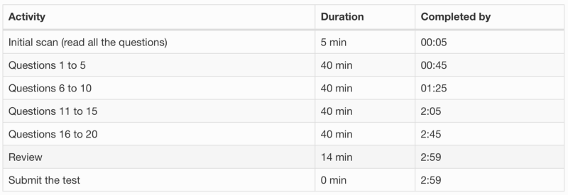

# Written Assessment Blogs Notes

## [Launch School’s 109 Written Assessment: A Non-Native English Speaker’s Perspective](https://medium.com/@raul.dehevia/launch-schools-109-written-assessment-a-non-native-english-speaker-s-perspective-d320b47368ba)

### Preparation

* Make sure you have fully mastered all the topics in the *Study Guide*.
* Practice your answers for:
  * technical vocabulary
  * brevity
  * speed
* Create a few examples for each topic listed on the *Study Guide*
* Have a nice template answer for each topic.

### Time Management During the Exam

* Timers
  * a timer to track the time left
  * an alarm to go off 20 minutes before the end of the exam
  * a stopwatch to control the time spent on each answer

* Answer Questions in a timely manner
  * allocate maximum time of 8 minutes per question
  * finish easier questions in less time

* Time for miscellaneous tasks
  * read through all the questions first
  * leave time to submit the exam

* Use checkpoints

* Go in order but don't get stuck

* Track your answers
  * Complete answer: checkmark (check)
  * Partial answer: E (extend)
  * Question skipped: (empty)

### Exam Day

* Do an initial scan
* Time your answers
* Remain calm

## [Knowing is not enough: You need tactics too — How to be prepared for Launch School written assessments](https://medium.com/launch-school/knowing-is-not-enough-you-need-tactics-too-how-to-be-prepared-for-launch-school-written-3f7b9c9cb08e)

1. Test all the code
2. Read assignments VERY CAREFULLY
3. Read the "Study Guide" for the test and practice answers in advance
4. At the beginning of the assessment, run through all the questions and read all of them
5. Answer the question and when in doubt, aim for more
6. Go in order
7. Keep track of time and review at the end

## [A Beginner’s Guide to Surviving Launch School 101](https://medium.com/launch-school/a-beginners-guide-to-surviving-launch-school-101-c706553252cc)

1. Set yourself up for success
2. Make your study time count
3. Find a friend
4. Maintain momentum with circular learning
5. Embrace the struggle
6. Find dead ends
7. Focus on your weaknesses
8. Don't just take notes
9. Simulate the interview
10. Enjoy the ride

## [Passing Launch School’s First Assessments: RB109](https://medium.com/launch-school/passing-launch-schools-first-assessments-rb109-4b2b047060dc)

* How long did it take you?
* The Written Assessment
  * *What does this output? What does this return? Why?*
  * Explain concepts to students in earlier lessons
